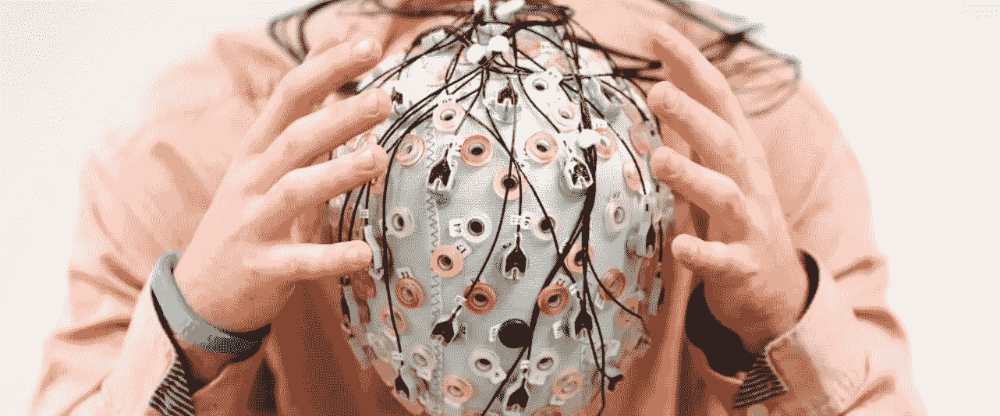
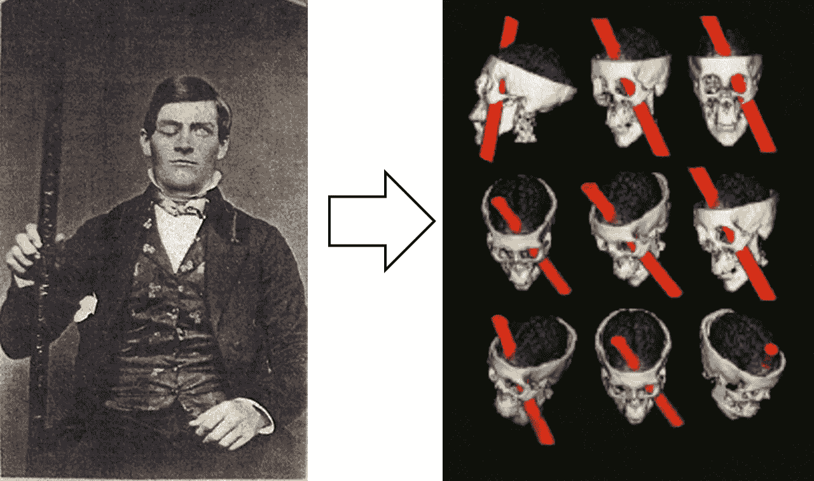
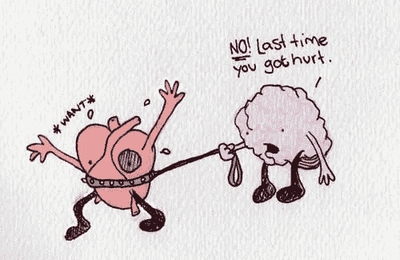

# 为什么机器(AI)不可能取代人类——神经科学的解释

> 原文：<https://medium.datadriveninvestor.com/why-is-it-impossible-for-a-machine-ai-to-replace-humans-neuroscientific-explanation-591cca505fd4?source=collection_archive---------29----------------------->

***或者至少不在一个中期时间段内***

你肯定面对过、读过或看过一部有这个主题的电影；机器超越人类，自主思考和创造智能。毫无疑问，主题很吸引人，但风险是真实的吗？

事实上，2013 年 Benedikt Frey 和 Michael Osborne 在牛津做了一项这方面最全面的研究，根据 T4 的研究，47%的美国工作有被机器取代的危险。虽然这项研究是几年前完成的，但研究结论仍然适用。

类似的事情发生在 17 世纪末，蒸汽机的发明和人类劳动的彻底转变；以前是制造和手工制作。

# **现在，想象一下这种影响提高 3000 倍的变化！**

这是麦肯锡全球研究所关于人工智能(AI)的观点，被认为是第四次工业革命:“人工智能对社会变革的贡献将比工业革命大 3000 倍。”

那就是说，我们会被机器取代吗？！

> 有理由相信不是——或者至少还不是——而且它来自神经科学！

我们习惯于听到，为了正确思考并做出最佳决定，我们需要对任何类型的感觉和情绪保持冷静。**对吧？不对！**

安东尼奥·达马西奥(Antonio Damásio)最近在神经科学领域做出了一个最令人难以置信的发现，并在书中有所体现:*笛卡尔错误*。对于那些不记得笛卡尔那句名言的人来说:*“我思故我在”*。

他的研究表明，情感在决策中起着不可或缺的作用，事实上，缺乏情感和感觉会破坏理性。

为了说明这个案例，这本书介绍了 1848 年菲尼亚斯·盖奇的有趣案例。盖奇在佛蒙特州从事铁路建设，为了平整土地，工人们正在炸掉挡路的岩石。盖奇被认为是“最有效率和能力的人”，他负责协调爆炸，包括:在岩石上挖一个洞，用火药填充一半，添加导火索并用沙子覆盖，沙子上有一根铁棒和一个锤子，最后点燃导火索。

一时分心，盖奇忘了放沙子，直接把铁棒敲进火药，产生了爆炸的火花。铁棒像子弹一样飞过头骨，打在额叶上，从头顶伸出来。

Phineas Gage Injury

令人惊讶的是，即使在当时药物不稳定的情况下，菲尼亚斯·盖奇也从不可避免的感染中幸存了下来。更令人惊讶的是，没有明显的后遗症:语言、感知和运动功能正常；他只是左眼失明了。

然而，他的个性发生了非同寻常的变化。

如果说以前他被认为是一个成功的、聪明的、精力充沛的人，那么现在盖奇已经失去了他的道德感，变得不敬、不耐烦，开始使用淫秽的词语，不能计划未来，不能做出正确的选择，也不能履行义务；复工后不久被辞退。

问题不是身体上的，而是性格上的。直到他 1861 年去世。

# 为什么这个故事值得被讲述？

菲尼亚斯·盖奇受伤发生在额叶，这是大脑中产生情绪的区域。尽管患有这种类型损伤的人不会影响身体和运动部分，但达马西奥意识到患者**无法做出简单的决定**，例如在咖啡或茶、鱼或肉、蓝色或黑色钢笔之间做出选择。

在做决定时，我们分析利弊，并且**如果没有理性的理由来决定最佳选项，这些人可能永远不会做出决定。**

情绪对决策有什么影响？有没有可能只有理性的行为而没有情绪的影响？

# 答案是否定的。这就是人工智能失败的地方。

根据达马西奥的说法，我们的大脑对两种类型的记录进行操作。

“据记载，我们处理感知、运动、记忆、推理、口头语言和数学语言。这种记录需要准确，并且可以很容易地用计算术语来描述。”这个世界被 AI 和机器人很好的复制了。

但是还有第二条记录，“它属于描述我们生命体生活状态的情感和感觉，它本身并不容易解释。”当前的人工智能和机器人系统没有考虑这第二个记录。

> ***如果决策不符合逻辑，我们可以对其进行编程吗？***

**估计制造情感机器人的可行性取决于我们理解是什么让人们产生情感的能力，**这还是非常萌芽的东西。

尽管已经有可能研究神经元的功能，但对大脑功能的全面理解仍然不存在，这项任务还远未完成。

据《心灵的秘密生活:你的大脑如何思考、感受和决定》一书的作者、物理学家和神经科学家马里亚诺·西格曼(Mariano Sigman)说，今天神经科学的知识水平类似于工业革命时期物理学家对热的了解，据西格曼说，他们“对热是什么一无所知”。更糟糕的是，他们被困在神话和错误的概念之间”。

产生感觉和情绪的化学反应的功能仍然是一个**黑箱，非常黑暗！**

我们只是刚刚开始理解智力和人类意识的基础，足以说:

> 人工智能不会取代人类的工作，至少在中期内不会，直到我们无法理解和编码情感。

相反，作为一种伙伴关系，它可以与人们一起工作，在他们的任务中变得**更富有成效。**

一些工作会消失，新的工作会出现。机器人在机械性和重复性工作方面很棒，只要我们能用逻辑的方式教它们，；但是人类有不可思议的创造性解决复杂问题的能力。

**智慧不仅包括信息和速度，还包括同情心和洞察力。**

> 人工智能已经提升了我们的能力；聪明的公司投资这项技术来提高他们的服务质量和客户体验。

只要我们不能理解人类的情感和感觉是如何工作的，我们就不能用代码进行复制，因此，我们不需要害怕被机器控制。