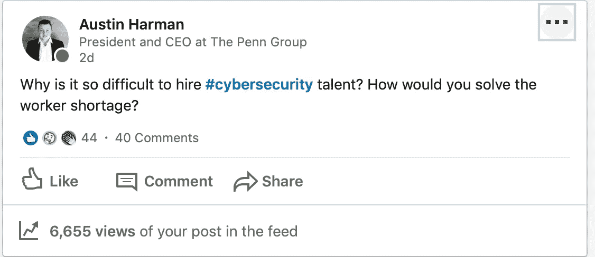

# 为什么雇佣优秀的安全人才如此困难？

> 原文：<https://medium.datadriveninvestor.com/why-is-it-so-hard-to-hire-great-security-talent-654e62e2fab6?source=collection_archive---------3----------------------->

几周前，我在俄亥俄州哥伦布市参加了一个当地的网络安全会议。房间里挤满了希望了解更多网络安全和与专业人士交流的行业专业人士。我很幸运地从一条随机的 LinkedIn 消息中收到了一张会议门票。作为[佩恩集团](http://www.thepenn.group)的总裁&兼首席执行官，我参加了这次活动，并会见了来自哥伦布市一些组织的一些安全专业人士。坐在我桌旁的一位先生靠过来问了我一个类似陈述/问题的问题。他说，“为什么雇佣伟大的网络安全人才如此困难？”这个问题立即引发了在场安全专家的讨论。这是整个会议中我唯一记得的事情。我很困惑，因为几乎每天都有人问我如何进入安全行业。[我在 LinkedIn](https://www.linkedin.com/posts/austin-harman-7040199a_cybersecurity-activity-6586026311754530817-sWBH) 上提出了这个问题，征求一些其他行业领袖的意见。反应令人惊讶。

首先，看看一些统计数据。据最大的网络安全专业人员认证机构之一(ISC)称， [63%的受访者表示](https://www.isc2.org/Research/Workforce-Study#)他们的组织缺少专门的网络安全人员。59%的人表示，由于网络安全人员短缺，他们的组织面临极度或中度风险。根据一些估计，合格安全专业人员的需求和实际人数之间的差距接近 300 万。行政命令满天飞，还有无数旨在缩小差距的立法。问题是，它为什么没有被关闭？

# 网络安全的人是做什么的？

作为一名安全专业人员，我最常被问到的一个问题是:您是做什么的？但实际上，[你*到底*做什么](https://medium.com/datadriveninvestor/why-does-cybersecurity-matter-83ecc9968535)？网络安全是一个极其复杂的话题，涵盖了广泛的专业领域。为了成为(ISC) CISSP 或注册信息系统安全专家，这就像是没有额外大学的会计师的注册会计师，你必须是 8 个领域的专家。在每个安全领域或支柱中，都有一个责任区域，在某些情况下，需要数百名专家来保证一个组织的安全。对于较大的企业，安全团队的人数可以超过 1000 人。光是工资就有数亿美元。

 [## 一个企业在肚子上移动:如何照顾直觉|数据驱动的投资者

### 事实证明，直觉不仅仅是一种感觉。科学很清楚:你的直觉比你知道的更多…

www.datadriveninvestor.com](https://www.datadriveninvestor.com/2018/11/09/a-business-moves-on-its-stomach-how-to-make-allowances-for-gut-feelings/) 

网络安全团队最终就像大楼里的自动喷水灭火系统。你花了很多钱来安装一个，然后你必须支付持续的维护费用，如果发生火灾，你还要支付由火灾/水损害造成的损失。网络安全的不幸现实是，就像建筑物着火一样，没有办法阻止每一个可能导致火灾的场景。你必须做最坏的打算，抱最好的希望。没有一个信息系统是 100%安全的。对于不熟悉风险的高管来说，为看似没有好处的东西买单是一件非常艰难的事情。毕竟，你为什么要花钱去阻止一些无论如何都会发生的事情。人们可以进一步假设，雇佣人手来防止这些“理论上的”风险的预算会越来越小。这种思维过程比你想象的更常见。在我的职业生涯中，由于缺乏对团队宗旨的理解，高管们面临着削减网络安全预算的威胁，我一直在列席会议。这种思想的一个有趣的副作用是，在预算紧张的情况下，公司被迫雇用多面手而不是专家。网络安全专业人士身兼数职并不罕见。在某些情况下，即使拥有 1000 名员工的公司也有 3-5 人的安全团队。此外，还存在聘用“合格”网络安全人才的问题。如果您只有 3-5 个人来保护您的组织，您需要具有广泛经验的高度专业化的人员。

# 这不是短缺，这是一种期望平衡

大学刚毕业，我在音速公司找到了一份工作。在俄克拉荷马州的俄克拉荷马城，这是我在一家大公司的网络安全团队中的第一份工作。2 年后，我开始在别处找工作。在接下来的 6 个月里，我申请了不少于 12 份工作，并在美国各地进行了面试。从大型银行到大型零售到大型能源再到科技，我参加了一次又一次的面试。在许多面试中，我在个性和情境意识问题上基本上是成功的。我在处理 8 个安全领域的有针对性的技术问题时不太成功。尽管我的简历上写着我有两年的工作经验，但不知何故，我被期望了解网络安全的一切。很自然，我开始对这个过程感到沮丧。我的面试官没有在寻找“合适的候选人”。他们在寻找一个拥有无可挑剔的技术知识、价格尽可能低的人。诚然，这就是商业，价值最大化。他们对我也很失望，因为我不知道他们所有问题的答案。最终，我对没有结果的面试感到非常沮丧，于是我决定努力提高自己。在 6 个月的时间里获得了几个证书后，我接受了美国政府的一个职位，使*的薪水是我之前薪水的两倍。*

> ***亲提示:提升自己是提升事业的最佳途径之一。***

我的面试经历和安保行业的大多数人没什么不同。公司必须有非常合格的候选人来填补他们团队中最初级的职位，因为他们没有预算。或者，他们可能没有耐心等待经验不足的员工出局。我见过安全分析师职位，这在大多数组织中基本上是一个入门级的角色，需要长达 8 年的经验！如果你专注于寻找合适的人，有很多网络安全人才。

# 我们是如何解决这个问题的？

这些年来，我学到的最有价值的一课是，你买不到伟大的人。它们必须被开发。如果你想让人们接受你的文化、系统和使命，他们必须接受你的文化、系统和使命。在宾大集团，我们的核心价值观之一是发展。当我创办公司时，我希望公司以我们利用专有培训系统培养优秀人才的能力而闻名。我们将教育自己的人民，而不是依靠传统的教育模式。我们这样做有几个原因，主要原因是:有太多未被充分利用的人从来没有获得成功的机会。对我们的员工投入了这么多，你可能很快会问:如果你培养的员工离开了，会发生什么？我的回应:*如果他们不这样做，会发生什么？*

我们的使命是保护诚实的组织免受那些试图伤害他们的人的伤害。安全是每个人的责任，我们将继续推进我们的使命，不管我们的人才保留。除了佩恩集团，我相信这个行业还有巨大的机会。我们可以共同努力，通过给真正的人提供机会来缩小差距。我们可以教育和培养优秀的人才，保卫我们的国家。现在是开始安保职业生涯的最佳时机。如果你想了解更多关于我成为网络安全专家和首席执行官的旅程，请随时给我发消息。

*奥斯哈曼是* [*宾夕法尼亚集团*](https://thepenn.group/about/) *的总裁& CEO。他目前拥有梦寐以求的 CISSP 认证，以及分别来自 ISC2 和 CompTIA 的 CCSP、CAP 和 Security+认证。他住在俄亥俄州的哥伦布市。*