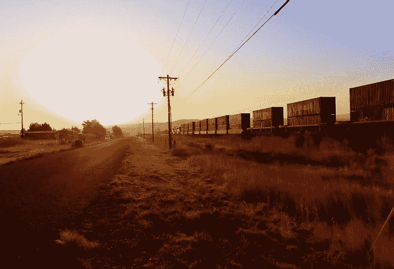
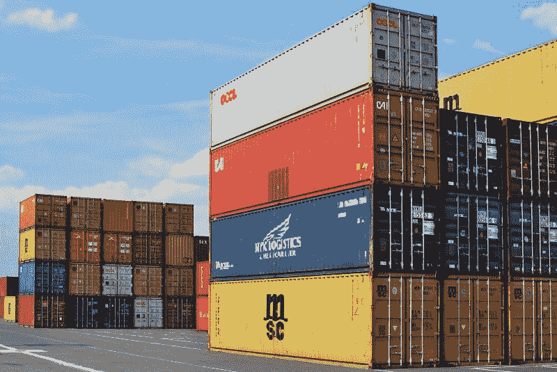
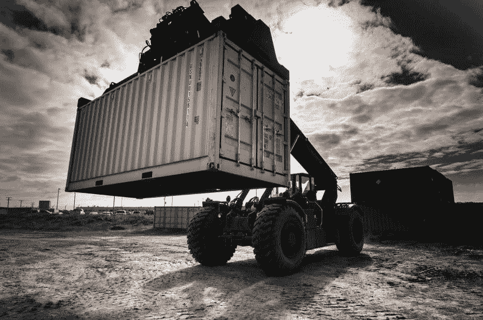
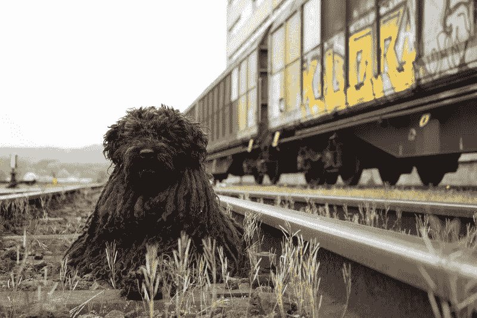
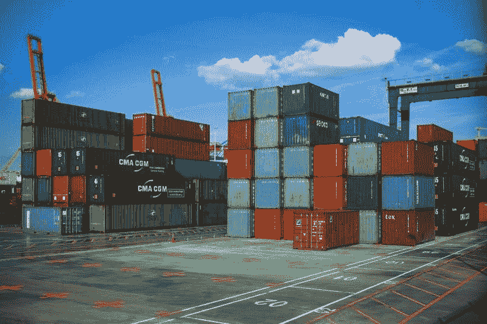
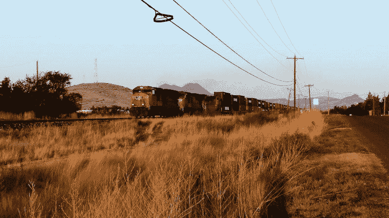

# 为什么堪萨斯城南区做得这么好？—市场疯人院

> 原文：<https://medium.datadriveninvestor.com/why-is-kansas-city-southern-doing-so-well-market-mad-house-40f8ad2f847e?source=collection_archive---------12----------------------->

堪萨斯城南方铁路公司(纽约证券交易所代码:KSU) 出奇的成功。事实上，铁路声称在 2019 年第三季度创造了创纪录的收入。

具体来说，Stockrow 报告称，堪萨斯城南部在 2019 年第三季度实现了 7.47 亿美元的收入。这些收入高于 2019 年第二季度的 7.14 亿美元和 2018 年第三季度的 6.99 亿美元。

令人印象深刻的是，Stockrow 估计堪萨斯城南部的收入在 2019 年第三季度增长了 6.97%。相比之下，KSU 的一份新闻稿将基于货运量的收入增长率定为 7%。此外，堪萨斯城南方航空公司根据货运量估计其第三季度收入为 7.477 亿美元。

 [## 算法交易的机器学习|数据驱动的投资者

### 当你的一个朋友在脸书上传你的新海滩照，平台建议给你的脸加上标签，这是…

www.datadriveninvestor.com](https://www.datadriveninvestor.com/2019/01/30/machine-learning-for-stock-market-investing/) 

# 美墨贸易正在复苏吗？

我认为堪萨斯城南方航空公司的收入增长表明，美墨贸易正在从唐纳德·j·特朗普总统(纽约州共和党)那里复苏。为了解释这一点，堪萨斯城的主线贯穿墨西哥中部和美国中西部。

特朗普对墨西哥和墨西哥人的敌意是出了名的。市场先生；然而，美国正在了解特朗普影响贸易的能力很小，特朗普可能在 2021 年 1 月或更早离任。

因此，投资者最好阅读财务报告，而不是政治新闻。事件再次证明了沃伦·巴菲特对资本主义和美国的[信念。](https://finance.yahoo.com/news/warren-buffett-american-economy-capitalism-berkshire-hathaway-shareholder-meeting-2019-201849412.html)

# 美中贸易战真的存在吗？

此外，堪萨斯城南方的成功表明，历史可能会让押注美中贸易战的投机者失望。值得注意的是，中国人自己也在忽视特朗普。

首先，路透社[报道](https://www.reuters.com/article/us-usa-trade-china-soybeans/after-trade-talks-in-us-china-ramps-up-brazilian-soy-purchases-idUSKBN1WX1AG)中国买家正在增加购买巴西大豆。解释一下，大豆是中国最大的农产品进口。具体来说，中国贸易商在 2019 年 10 月 14 日的一周内签署了价值 5000 万美元的巴西大豆合同。与此同时，美国农业部承认，那一周中国没有购买大量大豆。

第二，中国商务部发言人高峰告诉记者，在美国转移所有关税之前，中国政府不会考虑贸易协议。美国消费者新闻与商业频道[报道](https://www.cnbc.com/2019/10/17/china-says-us-must-cancel-new-tariffs-for-ultimate-trade-deal.html)高马德 2019 年 10 月 27 日周四声明。

我怀疑中国人会忽视特朗普，直到 2020 年 11 月 2 日美国总统大选之后。解释一下，签署一项新总统可以在 2021 年 1 月撕毁的贸易协定是愚蠢的。

贸易战可能会影响堪萨斯城南部，因为它的一条铁路线通往太平洋海岸港口城市拉扎罗卡德尼亚斯。因此，堪萨斯城南方航空公司可以将中国商品运送到美国城市。美中贸易的缺乏使堪萨斯城南部的未来更加光明。

# 堪萨斯城南方队赚钱了吗？

T2 堪萨斯城南方铁路公司(纽约证券交易所代码:KSU)T3 从它的铁路上赚了些钱。

特别是，KSU 在 2019 年 9 月 30 日报告的毛利为 5.15 亿美元。该毛利高于 2019 年 6 月 30 日的 4.75 亿美元和 2018 年 9 月 30 日的 4.57 亿美元。

此外，堪萨斯城南方报称，2019 年第三季度的营业收入为 282 美元。这一数字高于 2019 年第二季度的 2.08 亿美元和 2019 年第三季度的 2.65 亿美元。

同样，净收入为 1.802 亿美元，高于 2018 年第二季度的 1.287 亿美元；2018 年第三季度为 1.736 亿美元。因此，堪萨斯城南方航空公司从它的铁路上赚了更多的钱。

# 堪萨斯城南部的收入是多少？

堪萨斯城南部从它的生意中获得了更多的现金。然而，我认为 KSU 的安全边际很低，因为它的现金流很低。

例如，堪萨斯城南区在 2019 年 9 月 30 日报告了 3.168 亿美元的运营现金流和 1.674 亿美元的自由现金流。这些数字高于 2019 年第二季度的 2.685 亿美元和 1.075 亿美元。

不幸的是，2019 年第三季度的资本支出为 1.494 亿美元，投资现金流为负 1.662 亿美元，融资现金流为负 1.363 亿美元。

# 为什么堪萨斯城南部会出售自己

因此，我估计 KSU 上季度的负现金流和资本支出为-4.519 亿美元。最后，KSU 在 2019 年 9 月 30 日只有 6160 万美元的现金和等价物。这一数字低于 2019 年 9 月的 1.071 亿美元。

因此，堪萨斯城南方没有太多现金。因此，我看不出这条铁路作为一个独立的企业如何生存。我预测经济状况将迫使 KSU 出售给更大的公司，如**、亚马逊(纳斯达克代码:AMZN)** 、**伯克希尔哈撒韦(纽约证券交易所代码:BRK。b)、**或**联合太平洋(NYSE: UNP)** 在某个时候。

值得注意的是，伯克希尔哈撒韦在上一次经济衰退期间收购了一家规模大得多的铁路公司伯灵顿北圣达菲铁路公司。有趣的是，包括沃伦·巴菲特和美国参议员伊丽莎白·沃伦(马萨诸塞州民主党人)在内的一些观察家认为经济崩溃是不可避免的。

很能说明问题的是，**伯克希尔哈撒韦公司(纽约证券交易所代码:BRK。A)** 在 2019 年 6 月拥有 1220 亿美元现金，*市场内幕* [报道](https://markets.businessinsider.com/news/stocks/warren-buffett-berkshire-hathaway-record-122-billion-cash-warns-crash-2019-8-1028476169)。一些观察人士认为，这些现金表明巴菲特认为股市崩盘即将到来。巴菲特正在积累现金，这样他就可以在崩盘后以低价收购像 KSU 这样的公司。

# 亚马逊能买下一条铁路吗？

与此同时，亚马逊以品牌货运集装箱进入铁路货运行业，*铁路轨道&结构* [揭示](https://www.rtands.com/rail-news/20478/)。

解释一下，亚马逊将使用集装箱将商品从中国运送到美国的履行中心。我认为亚马逊可以买下一条铁路，因为万物商店已经拥有了货运飞机、卡车运输服务、[亚马逊货运](https://www.cnbc.com/2019/04/30/amazon-freight-uber-for-trucking-service-running-since-last-year.html)和不断增长的[送货服务](https://www.theverge.com/2019/9/19/20873947/amazon-electric-delivery-van-rivian-jeff-bezos-order)。

具体来说，杰夫·贝索斯的商业模式是控制分销和运输过程的每一个环节。在这个总体规划中，控制铁路货运是一个合乎逻辑的步骤。和伯克希尔·哈撒韦一样，亚马逊也在囤积现金。截至 2019 年 6 月 30 日，Everything Store 拥有 414.63 亿美元的现金和短期投资。

# 堪萨斯城南区是价值投资吗？

我认为市场先生在 2019 年 10 月 23 日将 **Kansas City Southern(纽约证券交易所代码:KSU)** 定价过高，为 145.85 美元。在 KSU 的财务数据中，我看不出有什么可以证明这个价格是合理的。

甚至连 36₵的季度股息都不足以支撑 KSU 的股价。澄清一下，我认为 KSU 的股息是不可持续的，因为该公司产生的现金量很少。

我也不认为 Dividend.com[在 10 月 23 日给](https://www.dividend.com/dividend-stocks/services/railroads/ksu-kansas-city-southern/)KSU 的 0.99%的股息收益率、1.44 美元的年化派息和 20.95%的派息率证明了股价的合理性。我建议投资者现在远离 KSU。

我认为在铁路方面有更好的投资，包括联合太平洋和伯克希尔哈撒韦。那些寻求做空股票的人需要关注 KSU，因为我认为它可能会因为现金流不足而崩溃。

*原载于 2019 年 10 月 23 日*[*【https://marketmadhouse.com】*](https://marketmadhouse.com/why-is-kansas-city-southern-doing-so-well/)*。*