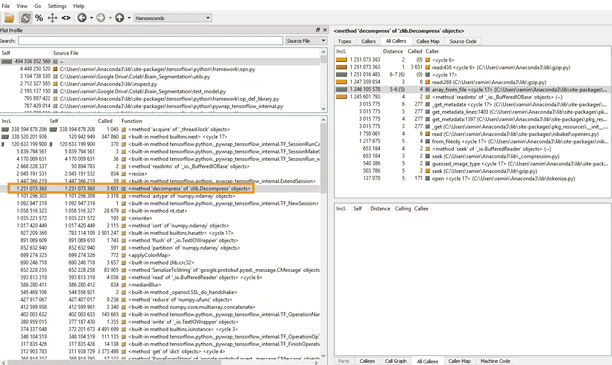
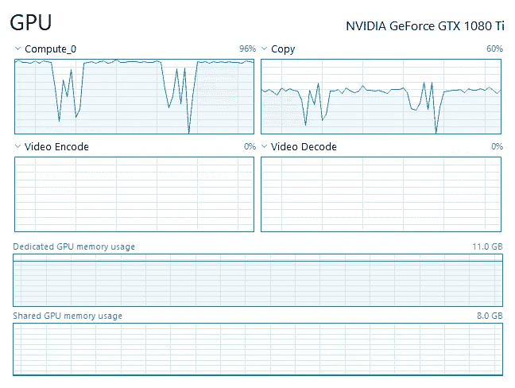

# 为什么我的训练需要这么长时间？

> 原文：<https://medium.datadriveninvestor.com/why-is-my-training-takes-so-long-5adf8c6431bb?source=collection_archive---------0----------------------->

*TL；DR:使用任务管理器找出您的 GPU 没有得到充分利用，如果 CPU 是瓶颈，使用* `*cprofile*` *分析您的数据生成代码并找到瓶颈功能。*

我正致力于训练一个通用网络，用于标记不同器官(大脑、心脏、气管、肝脏等)的医学图像。网络架构是相同的，但是权重是器官相关的，并且是通过使用该器官的数据训练网络而获得的。

其中一些培训花费的时间太长。每个时期需要大约一个小时才能完成，这使得尝试不同的方法(例如，不同的网络架构和超参数)变得困难。我想知道瓶颈是什么，所以我启动了 Windows 10 任务管理器(是的，我使用 Windows，因为这也是我的游戏机)，结果发现瓶颈是 CPU，这导致我相对昂贵的 GPU (1080 Ti)未得到充分利用。因此，下一个合乎逻辑的步骤是找出程序的哪一部分是 CPU 密集型的。我写这篇文章是为了分享我用来回答这个问题的工具。

工具是`cprofile`。您可以从 python 程序内部或直接从命令行调用它。在命令行中，它是这样调用的:

`$ python -m Cprofile -o profile.cprof your_program.py`

当程序终止时，文件`profile.cprof`中包含一个日志，可以被另一个名字很奇怪的精彩程序读取:`pyprof2calltree`(这里是[链接](https://pypi.org/project/pyprof2calltree/))。确保将时期数设置为 1，以避免等待生成日志的时间过长。如果一个历元对于这个实验来说需要太长的时间，那么裁剪你的训练数据集，使一个历元只需要几分钟。因为我们对这个实验的训练结果不感兴趣，所以这样做是可以的。

接下来，我们从命令行输入由`cprofile`到`pyprof2calltree`创建的概要文件:

`$ pyprof2calltree -k -i profile.cprof`

该命令会弹出一个类似于下图的窗口，其中显示了大量关于被调用的函数以及每个函数所用时间的信息。

仔细检查这个报告，看看哪个函数调用消耗了太多时间，看看你是否能做些什么。在我的例子中，结果是在我的数据生成器中，我正在读取每一批从磁盘压缩的训练数据。这是非常 CPU 密集的，并饿死了 GPU(我应该知道这一点，当我写生成器)。我通过在磁盘上写一次未压缩的数据，然后使用未压缩的数据进行训练来解决这个问题(当然，我很快用完了磁盘空间，亚马逊第二天就用更大的 SSD 来拯救我)。

做了这个代码改动之后，我的 GPU 利用率提高到了 100%左右，训练速度也提高到了~100%。

加快培训很重要，因为它让我们更快地尝试不同的方法，并真正改变工作流程和最终设计。

在修复了 CPU 瓶颈之后，从磁盘读取变成了瓶颈，这是我学到的另一个教训:优化你的 SSD 真的很重要。我不知道有几种方法可以优化固态硬盘并提高读写速度。

如果您有三星固态硬盘，请使用“Samsun 魔术师”来:

1.  激活 AHCI(需要对 BIOS 配置进行简单的更改)
2.  启用修剪
3.  启用快速模式(它基本上是一个缓存)
4.  启用“过度配置”(留出一部分 SSD 用于内部操作，从而显著加快读/写速度并延长 SSD 的寿命)。

