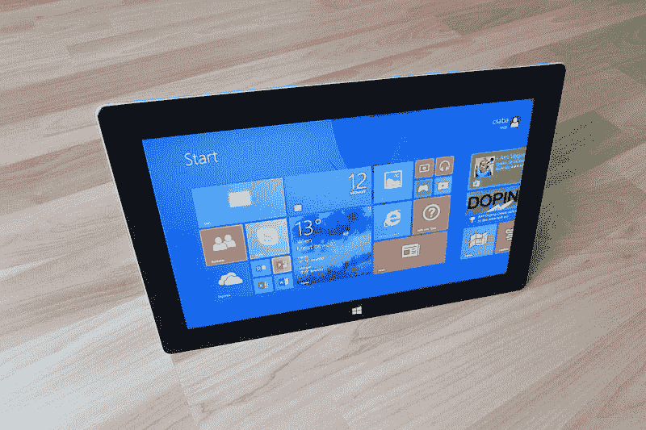
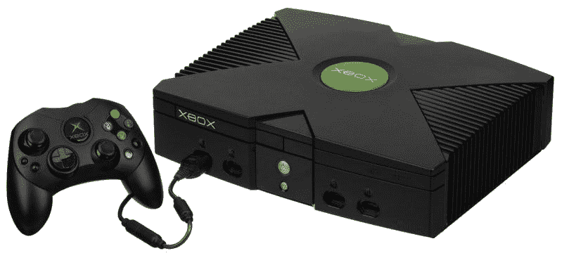

# 为什么网飞是一个 FAANG？—市场疯人院

> 原文：<https://medium.datadriveninvestor.com/why-is-netflix-a-faang-market-mad-house-f877150a1a38?source=collection_archive---------17----------------------->

我问为什么网飞是方的股票，因为其他方的钱要多得多。

澄清 FAANG 成员是:**脸书(NASDAQ: FB)** ，**亚马逊(NASDAQ: AMZN)** ，**苹果(NASDAQ: AAPL)** ，**网飞(NASAQ: NFLX)** ，**谷歌(NASDAQ: GOOGL)** 。人们购买 FAANG 股票是因为他们可能会赚很多钱。

然而有些人比其他人更富有。例如，网飞在 2019 年 9 月 30 日有 44.35 亿美元的现金和短期投资。

# 为什么微软而不是网飞应该在 FAANG 上

然而，苹果有 1005.57 亿美元的现金和短期投资， **Alphabet(纳斯达克股票代码:GOOG)** 或谷歌在同一天有 1211.77 亿美元。与此同时，亚马逊有 434.01 亿美元的现金和短期投资，脸书有 522.69 亿美元的现金和短期投资。

因此，我断定网飞不属于 FAANG。我认为 FAANG 应该由脸书、苹果、亚马逊和谷歌组成。不幸的是，这将拼出 FAAG，这太接近一个流行的侮辱同性恋者的术语。

相反，他们可以添加**微软(纳斯达克:MSFT)** 在 2019 年 9 月 30 日拥有 1366.36 亿美元的现金和短期投资。相反，微软的加入将使首字母缩写 FAAMG 听起来并不可怕。然而，微软比网飞更适合成为 FAANG 的成员。

# 为什么 FAANG 需要微软而不是网飞

此外，市场先生在 2019 年 12 月 19 日将微软的价格合理地定为每股 155.71 美元。与此同时，市场先生当天为网飞支付了 332.22 美元。

此外，微软于 2019 年 11 月 20 日支付了 51₵股息。微软计划在 2019 年 2 月 19 日再次发放 51₵季度股息。最后，微软红利在 2019 年从 46₵增长到 51₵。

 [## 算法交易的机器学习|数据驱动的投资者

### 当你的一个朋友在脸书上传你的新海滩照，平台建议给你的脸加上标签，这是…

www.datadriveninvestor.com](https://www.datadriveninvestor.com/2019/01/30/machine-learning-for-stock-market-investing/) 

与其他三种 FAANG 股票一样；Alphabet、亚马逊和网飞脸书不支付股息。苹果公司于 2019 年 11 月 7 日支付了 77₵的股息。因此，将微软加入 FAANG 可以将“股息”提高到 1.28 美元。

重要的是，将微软加入 FAANG 可能会在 2019 年 12 月 19 日将其成本从 3088.57 美元降至 2192.06 美元，同时增加股息收入。对于 FAANG 成本的一个好的估计见[彭博的纽约证券交易所 FAANG 估计](https://www.bloomberg.com/quote/NYFANG:IND)。抛售一只亏损的股票,“市场先生”定价过高，并增加股息收入，在我看来是明智的。

# 网飞对法昂来说太小了

我不认为网飞属于 FAANG，因为它缺乏 FAANG 的其他特征。

解释一下，Alphabet、亚马逊、脸书和苹果是市场支配者。例如，Statista [估计](https://www.statista.com/statistics/216573/worldwide-market-share-of-search-engines/)在 2019 年 10 月，他们用谷歌进行了全球 87.96%的搜索。此外，Statista 估计，Alphabet 旗下的 YouTube 在 2019 年 10 月拥有 20 亿用户。

与此同时，据 eMarketer [估计](https://techcrunch.com/2018/07/13/amazons-share-of-the-us-e-commerce-market-is-now-49-or-5-of-all-retail-spend/)，2018 年亚马逊拥有美国 49.1%的在线零售额。此外，据 Gartner [估计](https://techcrunch.com/2018/07/13/amazons-share-of-the-us-e-commerce-market-is-now-49-or-5-of-all-retail-spend/)，亚马逊网络服务(AWS)在 2018 年占有云服务市场的 47.8%。

令人印象深刻的是，脸书在 2019 年 10 月拥有 24.14 亿活跃用户，Statista [估计](https://www.statista.com/statistics/272014/global-social-networks-ranked-by-number-of-users/)。此外，另一个脸书产品；Statista 估计，WhatsApp 在 2019 年 10 月拥有 16 亿活跃用户。

此外，脸书信使在 2019 年 10 月拥有 11 亿活跃用户。又一个脸书产品；Instagram 在 2019 年 10 月拥有 10 亿活跃用户。

# 网飞有太多的竞争

相比之下，Statista [估计【2019 年第三季度，网飞在全球只有 1.58 亿用户。因此，与 Alphabet 或脸书相比，网飞只是一个小运营商。](https://www.statista.com/statistics/250934/quarterly-number-of-netflix-streaming-subscribers-worldwide/)

与此同时，网飞面临着来自 YouTube 和娱乐公司的巨大竞争。**迪士尼(NYSE:DIS)**；特别是，CNET [报道](https://www.cnet.com/news/disney-plus-more-than-10-million-people-signed-up/)称，其迪士尼+流媒体服务在 2019 年 11 月运营的第一周就有超过 1000 万用户。加上另一家迪士尼拥有的流媒体服务，Hulu 在美国拥有 2800 万用户。

迪士尼威胁网飞，因为它拥有电影和电视工作室。目前，迪士尼拥有五个电影工作室；迪士尼本身、漫威、21 世纪福克斯、卢卡斯影业(星球大战)和皮克斯。可以预见的是，迪士尼将从网飞撤出漫威和其他视频内容。因此，网飞可能很快就会缺少世界上最受欢迎的电影；比如《复仇者联盟》《星球大战》。

在我心目中，迪士尼；该公司于 2019 年 12 月 13 日支付了 88₵股息，是比网飞更好的 FAANG 成员候选人。值得注意的是，迪士尼股票在 2019 年 12 月 19 日的交易价格为每股 146.15 美元。

# 来自 Spotify 的威胁

除此之外，网飞的迪士尼还必须与印度的 Hotstar 和美国及其他地方的 Amazon Prime 等地区性流媒体服务展开竞争。另一个威胁是 YouTube，它在视频内容的一些领域占据主导地位；例如视频播客和喜剧。

最后，Spotify 对网飞来说是一个威胁，因为它可以将其在音频领域的主导地位扩展到视频领域。Spotify 有着比网飞更加用户友好的名声。

然而，Statista [估计](https://www.statista.com/statistics/244995/number-of-paying-spotify-subscribers/) Spotify 在 2019 年第三季度只有 1.13 亿付费用户。然而，这个数字从 2019 年第二季度的 1.08 亿上升到了 2019 年第二季度的 1.08 亿。注意，我认为 Spotify 和网飞一样有资格成为 FAANG 成员。Spotify 没有支付股息，但在 2019 年 12 月 19 日的交易价格为每股 149.68 美元。

# 网飞赔钱了吗？

目前，网飞赚了一些钱。例如，网飞在 2019 年 9 月 30 日公布了 21.46 亿美元的季度利润。

然而，Alphabet 公布的毛利为 229.31 亿美元，亚马逊在同一天公布的毛利为 286.79 亿美元。与此同时，苹果公布了 243.13 亿美元的毛利；脸书 9 月份公布了 144.97 亿澳元的毛利。

此外，网飞公布的营业收入为 9.8024 亿美元，净收入为 6.6524 亿美元，相比之下，苹果的营业收入和净收入分别为 156.25 亿美元和 136.86 亿美元。

网飞又一次和 FAANG 的其他成员不在一个档次。所以我不得不问为什么网飞在 FAANG 上？我猜 FAANG 这个缩写听起来很酷，而 FAAMG 这个缩写听起来很蠢。

然而，有一家现金充裕、支付股息的科技公司，他们可以加入 FAANG 并保留 n。那家公司是**英伟达(纳斯达克代码:NVDA)** 。英伟达在 2019 年 9 月 30 日报告的毛利为 19.16 亿美元，但它在 2019 年 11 月 27 日支付了 16₵的季度股息。

# 网飞烧钱

最后，网飞仍在大量烧钱。例如，2019 年 9 月 30 日，网飞报告的期末现金流为-5.6848 亿美元，运营现金流为-5.0179 亿美元。

相比之下，苹果当天公布的运营现金流为 199.1 亿美元，期末现金流为-19.27 亿美元。因此，苹果的业务产生现金，而网飞的业务烧钱。

我断定网飞不属于法昂。此外，我建议投资者远离网飞，因为市场先生高估了它。此外，网飞不支付股息，而且亏损。然而，FAANG 上还有其他股票；包括苹果和 Alphabet，投资者要想赚钱就需要考察。

*原载于 2019 年 12 月 19 日*[*【https://marketmadhouse.com】*](https://marketmadhouse.com/why-is-netflix-a-faang/)*。*