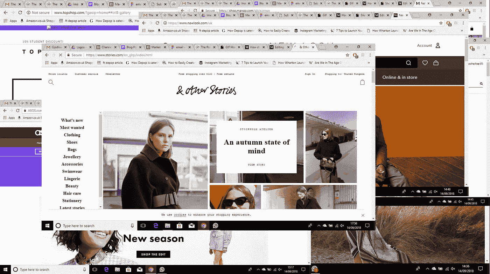

# 网购为什么这么讨厌？

> 原文：<https://medium.datadriveninvestor.com/why-is-online-shopping-so-annoying-eaef8c2ff9d6?source=collection_archive---------8----------------------->

代表购物者而不是零售商工作的人工智能能改善在线购物吗？伦敦初创企业 Moonsift 似乎是这么认为的。

Tab overload!

我最近开始为伦敦一家初创公司工作，该公司的愿景是重塑整个网上购物体验。他们问我是否能帮助他们找出网上购物的问题以及我们所有人*真正想要的东西。上周，我和一些人谈了谈，这些是你说你最希望看到发生的 5 件事:*

**1。一切尽在一处**

从一个标签到另一个标签，而不是从一个商店到另一个商店，使得比较产品的过程变得容易得多，然而，在 5 个不同的在线商店的 20 个标签中浏览也不是那么有趣。我们不能把所有东西都放在一个地方吗？为什么我们不能在一个地方比较 Zara、Asos、Mango、Topshop 和其他故事的夹克候选名单？

**2。质量超过数量**

也许我们喜欢网上购物的最大原因是我们手边有很多选择。虽然网上商店不受物理空间的限制，但是有太多的选择。如果你想要一双蓝色的运动鞋，你不会想看到 1000 张鞋子的图片，尤其是通常 90%的图片都不感兴趣。即使添加了“蓝色”和“运动鞋”这样的过滤器，剩下的大多数选项对你来说都是不相关的…这只是一个在线商店，其他四个呢？

**3。真正有用的个性化**

你多久被推荐一次你真正喜欢的东西？尽管品牌和广告商越来越擅长猜测你喜欢的东西，但他们只会向你展示他们想向你展示的东西，而不是最适合你的东西。网上购物的最大好处之一就是选择，这意味着你不再只从一个网站购物，而是从很多网站。如果能有不偏不倚的推荐岂不是很棒？从我们参观的所有品牌中为我们展示最适合我们个人品味的时尚。

You’re recommending me those? Really!?

**4。更好的发现**

当你知道自己想要什么时，网上购物会容易得多，但你往往不知道。说到时尚，没有什么比知道你是你的朋友中第一个发现“下一件大事”更好的了。网上商店每天都在增加新的商品，但是由于有成千上万的品牌在争夺你的注意力，在朋友抢购之前发现一个新的品牌或商品是一项全职工作！我们希望发现新的品牌和设计师，他们的服装是我们喜爱的，但可能永远不会发现。

**5。更好的便利性**

网上购物可以让你随时随地找到任何东西。无论是一件衣服还是一台电视，在工作中还是在半夜，在床上还是在公交车上——只要你能接入互联网，你就可以去。但是你仍然是那个需要做很多工作的人。虽然你可能不介意每隔一段时间浏览一次，但如果你有所有这些数据，网上商店应该能帮你一点忙吧？

虽然有时在网上浏览很有趣，但我们都同意，当你梦想中的鞋子似乎无法在网上实现时，会感觉很乏味！称之为要求很高，但我们许多人都提高了对网购的期望。

我前面提到的初创公司叫做 [**Moonsift**](http://www.moonsift.com) 。Moonsift 希望通过彻底改变网上购物来满足(甚至超越)我们的崇高期望。

[Moonsift](http://www.moonsift.com) 正在创造一种代表美国购物者的人工智能(万岁！)——而不是零售商和广告商——在我们浏览时了解我们的风格。然后，它扫描互联网，发现更多你会喜欢的东西。

这是一个伟大的想法，我希望我们能够实现我们已经开始做的事情！我们非常渴望人们尝试我们开发这项技术的第一次尝试，并告诉我们如何改进它。如果你想了解一下，现在就可以报名参加我们在 www.moonsift.com[举行的私人发布会，它将在几周后发布。](http://www.moonsift.com)