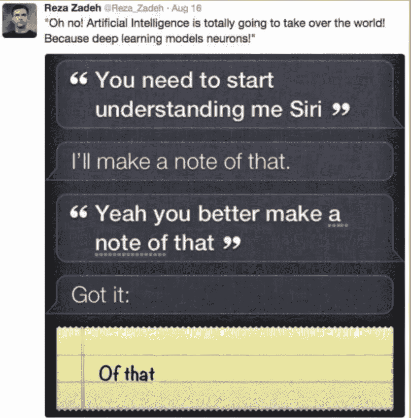
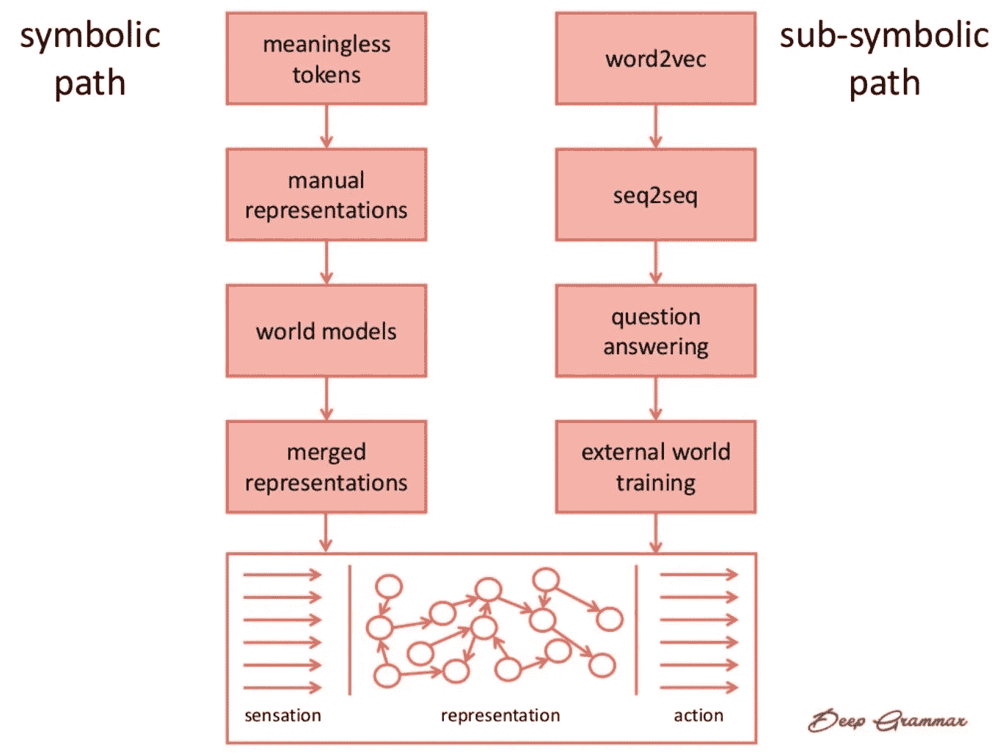
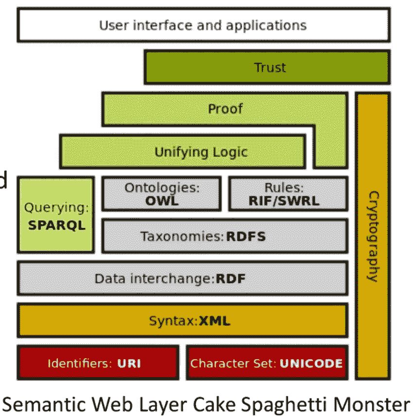
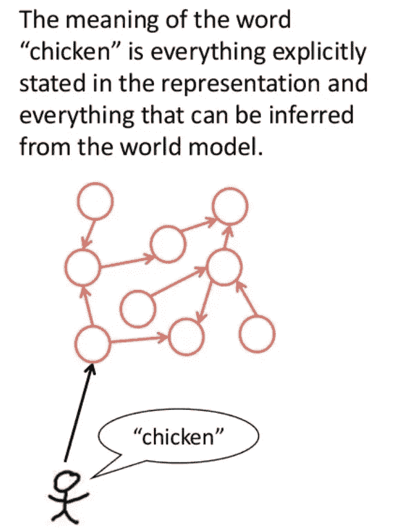
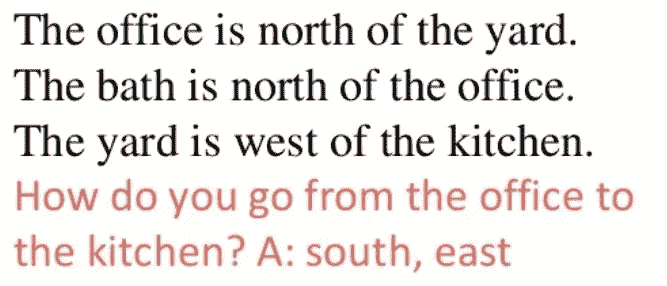
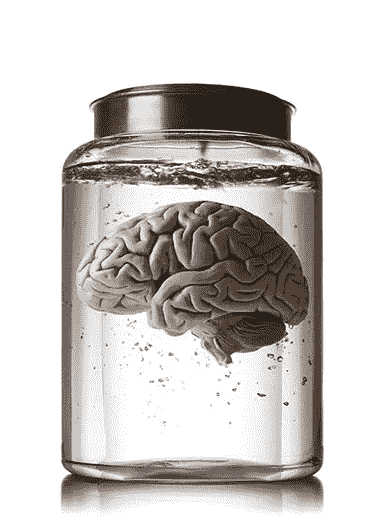
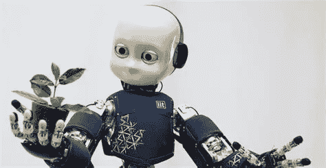
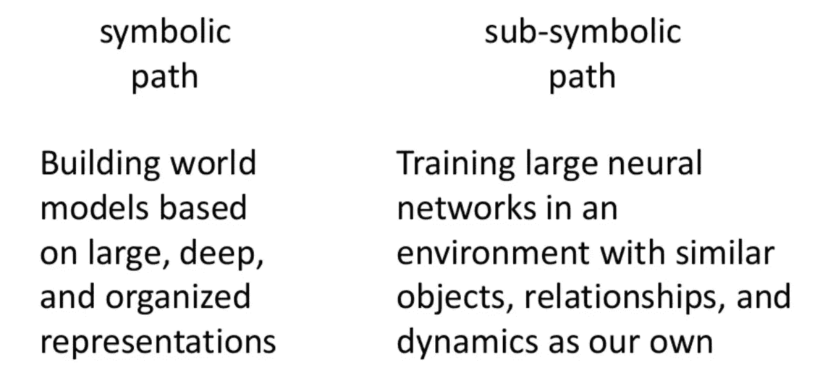

# 为什么 Siri 还是这么没头绪？

> 原文：<https://medium.datadriveninvestor.com/why-is-siri-still-so-clueless-feb28df58190?source=collection_archive---------17----------------------->

人工智能正以迅猛的速度发展。二十多年前，IBM 的深蓝[在国际象棋比赛中击败了加里·卡斯帕罗夫](https://youtu.be/-my1ZvHfA74)。七年前，IBM 的沃森[在《危险边缘》节目中击败了](https://www.youtube.com/watch?v=P18EdAKuC1U)肯·詹宁斯。去年，DeepMind 的 AlphaGo [击败了围棋世界冠军](https://www.youtube.com/watch?v=UHU8lCctC-Q)柯洁。就在两天前，DeepMind 的 AlphaStar [向文明的最顶端迈进，击败了两位最优秀的人类星际争霸 2 玩家](https://techcrunch.com/2019/01/24/starcraft-ii-playing-ai-alphastar-takes-out-pros-undefeated/amp/)。

An inside-the-mind peek at AlphaStar’s defeat of one of the best human players of StarCraft II. Are [Ninja](https://fortnitetracker.com/profile/pc/Ninja)’s days numbered?

尽管取得了这些进步，但你每天与 Siri、Alexa 或 Cortana 互动的尝试往往会导致沮丧。有这样一个经典:

几个 iOS 版本之后，您仍然会得到如下结果:

You: “When is black Friday?” Siri: “It will happen Thursday.”

如果你对可能只是你和你表达问题的方式存有任何怀疑，那么整个[子编辑](https://www.reddit.com/r/SiriFail/)的存在应该会澄清一个事实，即人工智能可能能够在国际象棋上击败你，但它还不能将其映射到你女儿的芭蕾舞独奏会上。

[deep grammar](http://www.jonathanmugan.com/)的 Jonathan Mugan 今天在德克萨斯州[数据日](http://datadaytexas.com/)发表演讲，讲述了试图将[自然语言处理](https://www.wikiwand.com/en/Natural_language_processing)推向更广义的人工智能的历史和现状，这种人工智能可以回答一个四岁儿童可以回答的问题，比如:“为什么你可以用绳子拉一辆马车，但不能推它？”

Jonathan Mugan

我喜欢乔纳森的演讲，因为它对我的一些研究生作品进行了历史性的阐释，也因为它提出了一些问题，即我们所说的让人工智能“理解语言”的目标是什么。这里是他的演讲的中等大小的总结，加上他在问答中对该领域历史的敏锐观察。(任何错误都是我的，欢迎指正。)

他指出，从历史上看，NLP 对理解的追求沿着两条道路前进:象征性的和次象征性的。

**符号路径**将单词转换成符号，并试图映射这些符号之间的关系。在最早的阶段，这种方法把一本书的所有单词分割成**记号**，然后把它们扔进[袋子](https://machinelearningmastery.com/gentle-introduction-bag-words-model/)(就像[沙拉](https://www.wikiwand.com/en/Word_salad#/In_computing))，把它们摇成向量，根据它们的[频率](http://www.tfidf.com/)进行计算，如果觉得有创意，就从代表[情感](https://towardsdatascience.com/sentiment-analysis-concept-analysis-and-applications-6c94d6f58c17)的外部意义列表中给它们调味。

接下来是尝试**手动表达**，这让我觉得左脑像斯波克一样渴望完全按照自己的方式了解右脑。词语的意义和关系应该能够被归结为一个全面的分类体系，包括部分和整体、父母和孩子。这是本体论的多产时代，带来了雄心勃勃的语义网、框架网、概念网和图像模式，语义网、语义网、语义网、语义网、语义网、语义网、语义网、语义网、语义网、语义网、语义网、语义网、语义网、概念网、概念网、概念网、概念网、概念网、概念网、概念网、概念网、概念网、概念网、概念网、概念网、概念网、概念网、概念网、概念网、概念网、概念网、概念网、概念网、概念网、概念网、概念网、概念网、概念网、概念网、概念网、概念网、概念网、概念网、概念网、概念网、概念网、概念网、概念网、概念网、概念网、概念网、

Semantic Web Layer Cake Spaghetti Monster. This’ll make sense out of language!

向简单迈进了一步，**世界模型**方法理解人们从一个假定的世界基本模型的基础上进行交流，并且只在需要时冒泡状态的相关变化。所以焦点转向创建那些模型和它们变化的维度:概率的、关系的、并发的、时间的。

在对世界模型进行了测试之后，这个领域又用**合并表示法**对它们进行了增强。一个单独的词可以表示像覆盖这样的想法的厚厚的表示(“屋顶覆盖房子”)，但随后用来自世界的推论来补充，以回答像“为什么只在外面下雨？”利用关于降雨和“外部”功能边界的世界模型)。

A representation like “chicken” can be supplemented with meaning inferred from the broader world model about what birds are like, how farms operate, or how to compliment waffles.

NLP 的第二条前进道路是次符号化的道路，它放弃了将语言意义翻译成离散的、可操作的符号的乌托邦式的愿景。取而代之的是，它采用了一种更加务实的方法，通过 ML 技术(最著名的是神经网络)来处理单词，因为它们在实际语言中发挥作用。 **word2vec** 的工作原理是假设单词是基于经验的，并为单词创建两个随机、密集的向量，直到它们被充分区分并产生连贯的内部结构。这些向量导致了像“首都”这样的概念的发现，其中意大利和罗马的向量可以应用于产生像法国和巴黎这样的输出。

**seq2sec** 超越了单个单词，将它们的序列编码成向量，然后可以解码成其他序列，就像在句子中一样。在[机器翻译](https://translate.google.com/#view=home&op=translate&sl=auto&tl=en&text=Hvorfor%20faller%20regnet%20i%20Spania%20hovedsakelig%20p%C3%A5%20sletten%3F)中大量使用。**问题回答**使用递归神经网络来回答特定的问题，以便它可以学习哪些事实值得注意来回答其他问题。通过回答早期关于空间位置的问题，这种方法可以产生如下结果:

The office is north of the yard. The bath is north of the office. The yard is west of the ktichen. How do you go from the office to the ktichen? A: south, east.

最后，次符号方法通过认识到我们不是脱离肉体的大脑，而是在我们身体的物理框架和我们给定的环境中存在和学习[来发现意义。](https://www.wikiwand.com/en/Embodied_cognition)

Sorry, Descartes. But no dice.

因此，为了学习关于触摸、握持或抓取物体的语言意义，我们需要捕捉触摸、握持或抓取所体验到的感觉。这里的低挂果实是从计算机容易承担的与外部世界的交互中创建的 DNNs，如玩基于文本的冒险游戏或从计算机游戏的界面中摄取输入(这是本周 AlphaStar 在《星际争霸 2》中获胜的[关键方法之一)。可能的收益将首先来自摄入的相同种类的数据。例如，乔纳森谈到了利用视频游戏数据创建一个“侠盗猎车手世界(希望暴力更少)”的努力。](https://deepmind.com/blog/alphastar-mastering-real-time-strategy-game-starcraft-ii/)

物理现实对摄取提出了更复杂的挑战。为了解决这个问题，欧盟开发了一个名为 [iCub](http://www.icub.org/) 的开源项目，该项目构建了一个人形机器人，并从其与物理现实的交互中捕获数据。

iCub meet “plant.” Plant, meet iCub.

在我看来，外部世界的训练方法就像是孕育了虚拟现实发展的可能性(或许是必要的)。

总之，乔纳森重申，符号和子符号类别的方法旨在帮助人工智能从语言到理解的旅程。

这给我提出了一个关于[认识论](https://plato.stanford.edu/entries/epistemology/)的困扰性问题:当我们谈论语言上的“理解”时，我们到底想要达到什么几个世纪以来，神学家和哲学家一直在思考这个问题。在演讲的某一点上，乔纳森提出，该领域目前的最终目标是从语言中获得意义，这种语言丰富地植根于从感觉和行动中获得的人类经验，这在我听来像是一个漂亮的经验主义者的定义。

当我问他关于从语言中获得“理解”的不同定义如何影响寻求实现它的方法时，乔纳森给出了一个非常务实、现实的答案:任何有意义的东西，在任何给定的时刻都是最具商业可行性的。

这符合科学史的大部分内容，科学不会在线性抽象真空中“进步”,而是经常以由个性和资助机会引导的各种方法的相互作用为特征。我想到了《麻省理工技术评论》最近的一篇文章如何证实了这个事实。为了预测人工智能的未来发展，该研究考察了近期学术研究“人工智能”的历史，并没有发现从一个步骤到下一个步骤的重大必然进展。相反，一个特定的范式似乎统治了大约十年，然后被取代。

我想知道像乔纳森这样的市场和创意创造者在 2020 年及以后会采取什么样的方式。也许他们会发现一些 Siri 最终会注意到的东西。