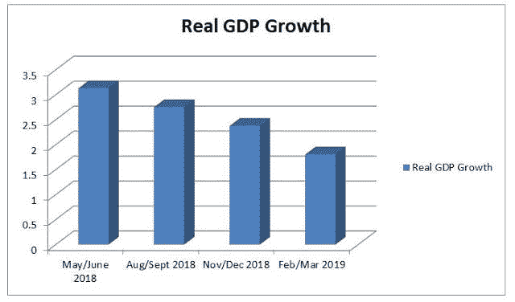
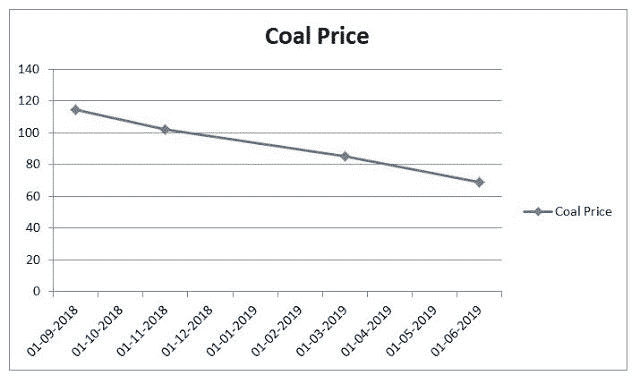
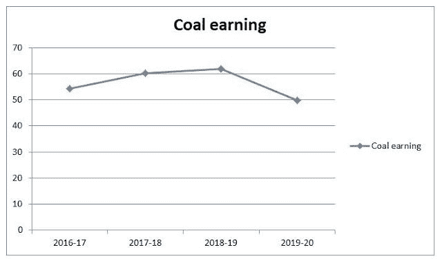

# 为什么澳大利亚经济在放缓

> 原文：<https://medium.datadriveninvestor.com/why-is-the-australian-economy-slowing-down-8775f6903dd6?source=collection_archive---------12----------------------->

为什么澳大利亚经济在放缓

澳大利亚经济拥有历年来没有衰退的经济之冠。澳大利亚正在考虑没有洼地的土地。在过去的 27 年里，澳大利亚经济持续增长。澳大利亚的经济甚至已经成功地从 2008 年的衰退中走出来。许多强大的发达和不发达经济体都受到了影响，但澳大利亚经济在不利的形势下坚守住了阵地，这是许多经济体的梦想。澳元在过去几年也表现稳定。

当你看澳大利亚经济时，它没有像美国那样的大型经济体，也没有像中国那样的出口导向型经济体。这有助于实现可持续增长。当你看澳大利亚经济时，它没有任何特定的部门或因素对这种增长负责，但我们不得不为此感谢澳大利亚经济学家和立法者，但所有这些增长实际上在 2018 年下半年开始放缓。澳大利亚经济几乎零增长，2019 年前三个月仅增长 0.4%。对于澳大利亚经济来说，这是一个令人担忧的迹象。那么澳大利亚经济为什么会面临这样的问题呢？让我们在这个博客中找到答案。

 [## 为什么包容性财富指数比 GDP 更能衡量社会进步？|数据驱动…

### 你不需要成为一个经济奇才或金融大师就能知道 GDP 的定义。即使你从未拿过 ECON 奖…

www.datadriveninvestor.com](https://www.datadriveninvestor.com/2019/03/08/why-inclusive-wealth-index-is-a-better-measure-of-societal-progress-than-gdp/) 

澳大利亚经济在 2018 年的 GDP 增长是有意识地下降，但主要争论在多少？它分为两种不同的利率。有消息称是 1%附近，另一方面，有消息称是 3%左右，澳大利亚政府官方声明指出，增长率约为 2.9%。所以这有点令人困惑，但是，不可避免的是，图表是向下的。

在这里，我将讨论影响增长的几点。

# 1.煤炭收入的下降-

澳大利亚煤炭行业对其经济至关重要，是经济的支柱之一。澳大利亚是世界第四大煤炭生产国。煤炭是澳大利亚第二大出口商品。2016-2017 年，煤炭行业生产了 4.4 亿吨煤炭，其中澳大利亚出口了 2.02 亿吨动力煤和 1.77 亿吨冶金煤。从 1999 年到 2000 年，这个行业增长了 550%。澳大利亚煤炭的主要进口国是亚洲国家。不断增长的亚洲市场需要更多的煤炭，这导致更多的需求，从而给澳大利亚带来更多的利润。这个行业已经产生了大约 50 亿美元的版税。

因此，从技术上讲，煤炭出口业务对澳大利亚来说是有利可图的，但煤炭价格开始下跌，导致利润缩水。随着动力煤价格下跌 25%，冶金煤价格下跌 23%，澳大利亚煤炭出口价值预计将在未来 18 个月大幅下降。这两种产品现货价格的下降将导致它们的总出口价值从 2018-19 年的 608 亿美元下降到 2019-20 年的 499 亿美元，降幅为 18%。

正如你们所看到的，煤炭价格的下降损害了煤炭收入，这对经济不利，因为这是澳大利亚第二大出口量。

如今，世界在变；使用绿色和清洁能源的重要性正在上升。许多公司和国家正在采取措施，人们的观点也在改变，这必将对煤炭行业产生影响。不会马上发生，但在未来几年里，它的影响将不可避免地显现出来。

# 2.消费者支出-

根据西太平洋银行-墨尔本研究所的月度调查，尽管就业岗位增加-失业率下降，一些专家预测到年底将降至约 5%，但消费者信心在 2017 年 8 月触底，为 95.5。这一结果受到家庭财务压力以及对住房可负担性恶化和能源价格上涨的担忧的拖累。低于 100 意味着悲观的消费者多于乐观的消费者。同样的信心指数在 12 月意外反弹至 103.3。豪华车销量下降，截至 2017 年 8 月底的 12 个月中下降了 1.8%，为 15 个月来的新低。这是五年来最显著的年度下降。根据追踪 17 个品牌销售的 CommSec 豪华汽车指数，包括奥迪、宝马、法拉利、雷克萨斯、奔驰和劳斯莱斯。家庭支出疲软，比去年进一步放缓，全年仅增长 1.8%，家庭削减了可自由支配的支出，特别是在新的家庭用品、娱乐和接待方面。总体而言，家庭支出对经济增长的贡献仅为 0.1 个百分点。

# 3.房价下跌-

我在我的博客[澳大利亚房产泡沫中谈到了这一点。](https://onkarjadhavv.blogspot.com/2018/07/australian-house-bubble.html)悉尼的房价已经从过去两年的峰值下跌了近 15%。

# 4.高额的家庭债务和停滞的工资-

为了理解家庭的影响，让我们首先理解家庭债务的含义，家庭债务被定义为家庭中所有成年人欠金融机构的钱的数量。这包括消费者债务和抵押贷款。澳大利亚家庭债务接近全球最高水平。澳大利亚家庭正面临着总计 7000 亿美元的财富缩水，因为他们需要收回房地产繁荣时期积累的大量债务。澳大利亚的困境因为需要在房价下跌期间削减债务而变得更加糟糕，而此时家庭储蓄率仅为可支配收入的 1%。根据经合组织 2015 年发布的数据，澳大利亚家庭已经超过 3 岁，事实上，家庭债务与收入的比率在 1995 年至 2015 年间翻了一倍多，从 104%上升到 212%。这意味着，如果一个普通人的净收入为 80，000 美元，他们每年的支出为 169，600 美元。值是近似值，所以数字可能会有轻微的偏差，因为这位澳大利亚工人的加薪幅度最小。这背后的原因主要是公司没有增加工资来提高利润。这个国家的工资率低于通货膨胀率。你们中的许多人会问，这在发展中地区很常见，为什么这是经济放缓的一个因素？主要问题是澳大利亚是发达国家，由于生活水平很高，日常商品价格很高，因此人们需要很高的工资来支付。在澳大利亚，工资的增长低于通货膨胀的增长，这就产生了问题。为了了解这种情况的严重性，澳大利亚政府在 2019 年 4 月 9 日就此主题撰写了一篇文章；我会在第一条评论中给出链接。

还有许多其他因素，但我只提到了几个。

# 结论-

澳大利亚经济享受了近 27 年的长期运行而没有衰退；我认为这是由两个因素造成的，首先是立法者和政府的决定，其次是运气。是的，我告诉 luck 这是因为澳大利亚无法以发达国家必须的速度实现经济多元化。我们有许多国家由于过度依赖一个部门而陷入衰退的例子。我不是说澳大利亚经济将很快面临危机，但是如果澳大利亚政府。我没有做出具体的决定，但我相信澳大利亚经济肯定会有所作为。

*最初发表于*[*【https://onkarjadhavv.blogspot.com】*](https://onkarjadhavv.blogspot.com/2019/07/why-is-australian-economy-slowing-down.html)*。*