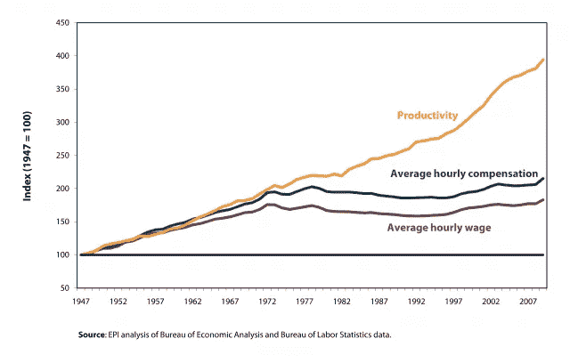
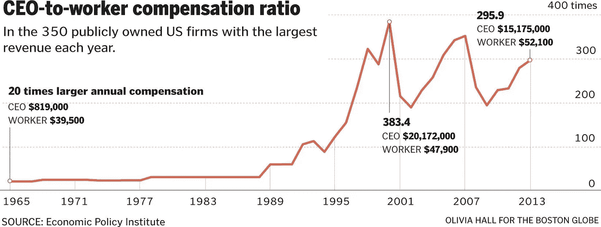
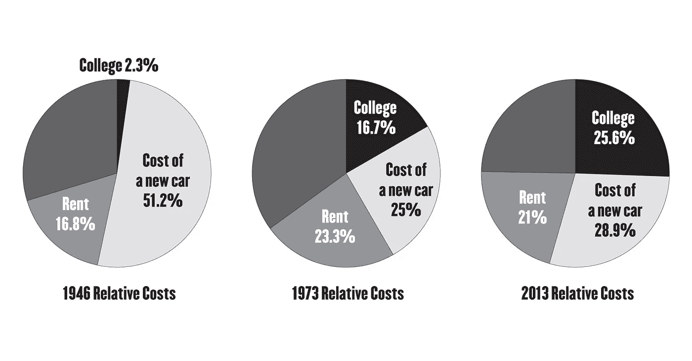
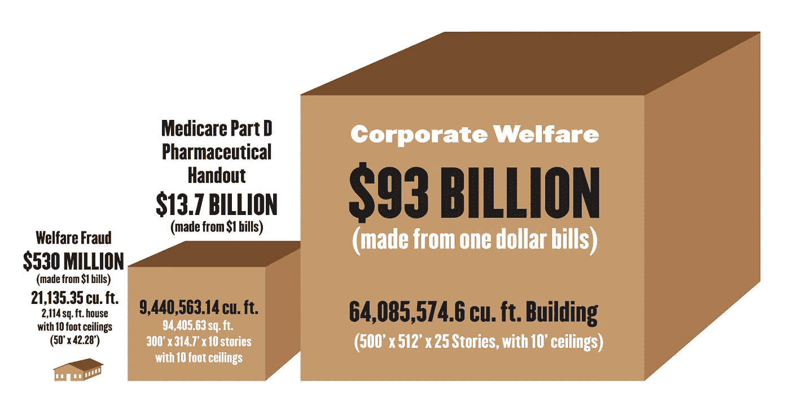

# 为什么经济停滞不前？

> 原文：<https://medium.datadriveninvestor.com/why-is-the-economy-stuck-in-a-rut-b0b88eb67885?source=collection_archive---------10----------------------->

## 是那些该死的社会主义者！

And why aren’t they pulling their own weight?

**美国梦可以总结为:“如果你努力工作，遵守规则，** **这个国家真正向你敞开大门。你可以实现任何目标。”**

州长阿诺德·施瓦辛格说的。克林顿总统和奥巴马总统也说过类似的话。

 [## 保护主义、政治和经济动荡|数据驱动的投资者

### 美国股市昨日出现 400 多点的大幅反转，为未来的事情发出了警告信号。市场…

www.datadriveninvestor.com](https://www.datadriveninvestor.com/2018/06/28/protectionism-politics-economic-turmoil/) 

这当然是每个有钱人的信条，不是吗？但是，尽管自 1973 年以来工人生产率翻了一番，工资却一直停滞不前。

用最简单的话来说，增加的价值应该与增加的薪酬有一些联系，但事实并非如此，正如大卫·戴恩[写的](http://www.nakedcapitalism.com/2013/08/productivity-rose-7-7-post-great-recession-workers-have-seen-none-of-it.html):

> “它显然代表着不平等，因为生产率提高积累的所有财富都会流向某个地方，主要流入食利阶层的手中。”

虽然 1%的富人和公司很高兴工人没有从生产率的提高中受益，但我们听到这些人抱怨高税收不公平地重新分配财富，或者我们正在“猎杀”富人。

或者说，就业机会的创造者将缺乏投资的动力。让我们看看一些经济基本面，看看这些说法是否属实。

## 生意如何兴旺？

在现代商业世界中，有三个成功的必要因素不会出现在公司的费用报表上:

1.  基础设施(高速公路、机场、火车、发电厂、大坝、桥梁、互联网的发展)
2.  政府监管机构保护产权，确保市场公平竞争(无串通、无胁迫、无受补贴外国公司的掠夺性定价等)。)
3.  熟练的劳动力

如果没有这三个因素，唐纳德·特朗普(Donald Trump)之流仍会像其他人一样，用海狸皮换取步枪或食物。

我希望每个人都清楚，我们的税收已经支付了基础设施和保持公平竞争的费用。

但是如何创造一个熟练的劳动力呢？

这里有一个谁承担这些成本以及企业是否支付公平份额的总结。

首先，我们需要提供一些历史背景。

## 超高的税率与糟糕的经济没有关联…

从 1946 年到 1973 年，美国经历了最大的经济扩张，尽管对高收入者征收 71-91%的税率。

但是没人付这些税。

到 1960 年，实际税率为 31%。

为了减轻税务负担，富裕的企业主只是将他们的利润以新工厂、更多员工和研发的形式再投资到他们的企业中。

因此，经济持续增长。

这些政策的一个副作用是，首席执行官的薪酬保持在较低水平，以尽量减少纳税义务。

1973 年，首席执行官与员工的薪酬比例约为 22 比 1；到 2013 年，这一比例为 295.9 比 1。

在此期间，中产阶级迅速扩大，单收入家庭有能力拥有一辆车，买一栋房子，并送他们的孩子上大学。

国家大力资助公立大学，因为我们知道需要受过良好教育的劳动力来推动战后经济。

作为回报，企业提供了丰厚的员工福利和有保障的退休计划，因为它们知道一个健康和有保障的员工会更加忠诚和高效。

## 美国梦似乎正在为许多人服务

看看决定一个人是否买得起美国梦的一些关键价格:

1946 年，家庭收入中位数为 2500 美元，加州大学洛杉矶分校的学费为每年 58 美元，最便宜的新车价格为 1280 美元，房屋价格中位数为 5600 美元，租金中位数为每月 35 美元。

1973 年，家庭收入中值为 8983 美元，加州大学洛杉矶分校的学费为每年 1500 美元，最便宜的新车价格为 2250 美元，房屋价格中值为 32500 美元，租金中值为每月 175 美元。

2013 年，家庭收入中位数为 51，759 美元，加州大学洛杉矶分校的学费为每年 13，251 美元，最便宜的新车价格约为 15，000 美元，房屋价格中位数为 220，000 美元，租金中位数为每月 905 美元。

这是一张图表，显示了我们的优先顺序的转变是如何彻底地影响了现代大学生和他们的家庭。请记住，如果我们考虑企业和社会在拥有一个富有成效、训练有素的工人方面的收益，我们就将成本转移到了个人身上，这是一种令人难以置信的累退“税”，伤害了穷人和中产阶级。此外，应该注意的是，在沿海大城市，租金中位数将大大高于收入中位数，并大大减少可支配收入。

## 那么是什么改变了呢？是那些该死的社会主义者！

纳税人被大企业和富人所欺骗，促成了几项让卡尔·马克思和伯尼·麦道夫都感到温暖的财富分配政策。

## 社会主义骗局#1:将培训熟练劳动力的成本转移到私人身上，作为递减的“隐性税收”。

加州大学洛杉矶分校的教育是如何在 27 年后从平均家庭收入的 2.3%上升到 16.7%(目前上升到 25.6%)的？

几个研究生写了一份公立高等教育缓慢消亡的详细历史，给出了答案:

> 加州学生运动有一句口号是，“每一次学费上涨的背后，都有一队防暴警察。”没有人比 20 世纪 60 年代的罗纳德·里根更能体现这种联系……当里根就职时，他立即着手做他所承诺的事情。他削减了国家对高等教育的资助，为转向基于学费的资助模式奠定了基础…

从 1981 年到 1986 年，里根总统将最高税率从 70%降至 28%，同时增加国防开支，产生了巨额预算赤字。

回应是削减各种服务的资金，比如高等教育。

他能够在全国范围内制定政策，而我们仍在为此付出代价。

通过将成本转移到私人身上，里根实现了双重打击，对穷人和中产阶级家庭创造了另一种递减的隐性“税”，这些家庭要么不再负担得起大学费用，要么背负巨额债务上大学。

注意:像许多骗局一样，结果是向上的社会流动受到限制，收入不平等加剧，因为那些最负担不起这些增加的成本的群体的钱流向了控制财权的强大群体。这里有几个例子:

*   银行以 0%的利率向美联储借款，并收取比政府担保的学生贷款优惠利率高得离谱的溢价
*   营利性大学从联邦拨款中赚取数十亿美元，同时提供低于标准的教育和虚假的就业申请
*   教科书出版公司每隔几年就会推出新的教育项目，这些项目并不能带来真正的教育效益，但却要花费学校系统数十万美元来重新培训教师和购买昂贵的指南、练习册和教科书
*   通过让年轻人背负巨额债务，他们更害怕辞掉低薪工作，这给了企业雇主更多的谈判筹码

## 社会主义骗局#2:将员工的医疗保健费用转移到公众身上

有很多原因可以说明沃尔玛是这个星球上最赚钱的公司之一。

那么，为什么他们需要美国政府为医疗保健、食品券和住房补贴买单呢？

2014 年，沃尔玛的低薪工人花费了美国纳税人大约 62 亿美元的公共援助。

但是沃尔玛不是唯一的罪魁祸首。接受扶贫项目帮助的人中，近四分之三是以工人为户主的家庭成员。根据加州大学伯克利分校劳动中心的一项[研究](http://laborcenter.berkeley.edu/the-high-public-cost-of-low-wages/):

> 低工资每年花费美国纳税人 1528 亿美元用于对工薪家庭的公共支持

## 社会主义骗局 3:将退休劳动力的成本转移到公众身上

几十年来，美国工业对他们的工人做出了一个承诺:“有责任心，有生产力，忠诚，我们会在你退休后照顾你。”但是这个梦想被背叛了:

> “……自 1985 年以来，企业已经取消了 84，350 个养老金计划——每个计划都承诺为数十、数百甚至数千人提供可靠的退休福利。”

自里根时代以来制定的法律允许公司找到各种各样的漏洞来欺骗他们的工人，骗取几年前 T2 承诺并资助的福利。

没有养老金，他们的老年退休人员会去哪里？

你猜对了，纳税人出资的政府援助。

## 奖金社会主义骗局:承担华尔街可疑投资的风险

在结束这篇关于社会主义财富分配的文章时，我不能不提到对华尔街的救助。

每个人都知道 2008 年金融危机的大致细节。

令人难过的是，似乎没有人记得我们在 20 世纪 80 年代、1998 年[以及 2008 年拯救了银行和金融市场。](https://en.wikipedia.org/wiki/Long-Term_Capital_Management)

你可能会认为华尔街应该学会远离高杠杆、道德上有问题的快速致富计划。

但是，如果你的马赢了，你可以保留利润，而你输了，政府会付给你的赌注，为什么会有人停止赌博呢？

最令人惊讶的是，布鲁克斯利·博恩在 1996 年至 1999 年间担任商品期货交易委员会主席时，曾警告过我们衍生品的危险。

不幸的是，她被担任内阁成员的华尔街终身从业者和天真的自由市场主义者阻止了，比如美联储主席艾伦·格林斯潘，他承认他过于相信自由市场的自我修正能力:

> “我们这些指望贷款机构的自身利益来保护股东权益的人，包括我自己在内，正处于一种震惊的不可思议状态。"

## 奖金社会主义骗局#2:创造各种企业补贴，同时用关于“福利欺诈”的危言耸听来转移我们的注意力

> 尽管企业利润创下纪录，海外持有 2.1 万亿美元未征税企业利润，但联邦预算的 5%用于企业福利。

我厌倦了不知情的人因为“福利欺诈”的幽灵而抱怨社会项目。

举个小背景， [**企业福利占 930 亿美元，**](http://thinkbynumbers.org/government-spending/corporate-welfare/corporate-welfare-statistics-vs-social-welfare-statistics/) **，约占联邦预算的 5.0%。**

根据国会的证词，管理和预算办公室确定，所有失业保险福利支付项目中只有 1.9%是由于欺诈或滥用。

换句话说，**“福利欺诈”占 5.3 亿美元，约占联邦预算的 0.028%。**

> 企业福利的金额是福利欺诈的 175 倍。

这是另一种形式的公司手淫，不算税收减免或补贴。

医疗保险 D 部分是在布什政府最黑暗的日子里强加给美国人民的一项立法。

它禁止医疗保险与制药业谈判批量折扣。

是的，那些自由市场的倡导者，共和党，制定了一项法案，阻止大买家购买最好的交易。根据国会预算办公室的数据:

> 简单地授权医疗保险获得与州医疗补助计划相同的处方药批量购买折扣，将在 10 年内为联邦政府节省 1370 亿美元。

这一小块政治腐败的成本是每年 137 亿美元。

这里有一个很好的小信息图表来显示不同类型的系统滥用之间的程度差异。

*(对于玩家的人来说，一元钞票的体积为:6.14 英寸× 2.61 英寸× 0.0043 英寸= 0.06890922 立方英寸。1728 立方英寸= 1 肘英尺。)*

Update: I corrected this graphic to show volume in one dollar bills, not a hundred dollar bills.

还记得早先的估计吗，低工资每年花费美国纳税人 1528 亿美元用于公共支持工薪家庭。

这些也不是企业补贴或税收减免的一部分。与上图相比，这座建筑比五角大楼大一倍半以上。

## 对真正的工作创造者的最后一句话

听听尼克·哈诺尔谈论创造就业的话。

不，我不是在和保罗·格雷厄姆，或者风投集团，或者这个国家的米特·罗姆尼们说话，因为他们不是真正推动经济发展的人。

是你们，纳税人，在帮助提供创业者成功创业所需的一切。

是你，消费者通过你的购买来维持经济的发展。

所以给你们自己一点鼓励。

别再这么傻了。

## 为更好的写作干杯。

脚注:

*这一分析只审查了工人阶级的可自由支配收入，而没有审查造成少数群体、LGBTQ 群体和妇女的压制性社会和法律制度。

如果我们取消企业福利(935 亿美元)，减少估计在我们的医疗保健系统中浪费的 7600-9350 亿美元(T1)，并削减军事开支，使其仅等于(T2)世界上接下来的 144 个国家花费的总和(T4)(T5)(1211 亿美元)，美国将有足够的钱来解决(T6)年收入低于 12.5 万美元(T7)(47 亿美元)的家庭的免费大学学费，给学生

其他参考:

 [## 大卫·戴恩:大衰退后生产率提高了 7.7%；工人都没见过|裸…

### 我以前在其他场合说过，但这确实是解释现代美国的图表:

www.nakedcapitalism.com](https://www.nakedcapitalism.com/2013/08/productivity-rose-7-7-post-great-recession-workers-have-seen-none-of-it.html) 

[https://www . Bloomberg . com/opinion/articles/2013-01-02/20 世纪 50 年代-tax-fantasy-is-a-Republican-nightmare](https://www.bloomberg.com/opinion/articles/2013-01-02/1950s-tax-fantasy-is-a-republican-nightmare)

 [## 从总体规划到无规划:公立高等教育的缓慢死亡

### 当米特罗姆尼敦促美国人“尽可能多地接受他们负担得起的教育”时，或者当大学管理者呼吁…

www.dissentmagazine.org](https://www.dissentmagazine.org/article/from-master-plan-to-no-plan-the-slow-death-of-public-higher-education)  [## 格林斯潘承认监管失误

### “你有权阻止导致次贷危机的不负责任的放贷行为。你是…

www.nytimes.com](https://www.nytimes.com/2008/10/24/business/economy/24panel.html?_r=0)