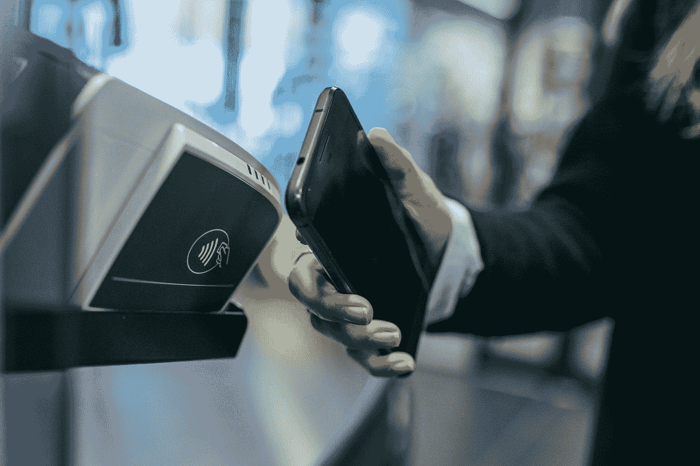

# 为什么美国在非接触式上落后了？

> 原文：<https://medium.datadriveninvestor.com/why-is-the-u-s-lagging-on-contactless-cb417bab0bcf?source=collection_archive---------12----------------------->

每个人都在尽情地“敲打”。除了美国，其他国家的非接触式使用仍保持在个位数。美国发生了什么？

Photo by [Jonas Leupe](https://unsplash.com/@jonasleupe?utm_source=medium&utm_medium=referral) on [Unsplash](https://unsplash.com?utm_source=medium&utm_medium=referral)

每次我展示我的非接触式研究时，我都必须特别提到我的研究是在英国完成的，在英国，非接触式是巨大的(50%的交易已经成为非接触式)。然后我可以给你世界上其他主要使用非接触式消费的地区的数据:荷兰(50%)、加拿大(60%)和澳大利亚(90%)是很好的例子，尤其是后者。在我给人们这些数字后，我必须证明我的数据不是来自美国。我的研究不可能在美国数据上完成。**它不存在。**

 [## 分散金融的出现|数据驱动的投资者

### 当前的全球金融体系为拥有资源、知识和财富的人创造了巨大的财富

www.datadriveninvestor.com](https://www.datadriveninvestor.com/2019/03/14/the-emergence-of-decentralized-finance/) 

即使是现在，非接触式交易也只占总数的一小部分:我们甚至还没有达到 10%！

鉴于美国曾经是金融科技的领导者，为什么非接触式要花这么长时间才能突破？如果你深入一些小的研究，似乎只有两个原因:技术和市场结构。所以我们来讨论一下。

**科技**
接触到 fintech，很多事情都会出错。在这种情况下，他们都这样做了。非接触式支付需要两样东西:芯片和能读取芯片的终端。美国有这样的地方吗？不…

美国似乎认为保留旧技术是个好主意。不是的。尽管大多数国家很久以前就把磁条留在了身后，但出于方便和安全的原因，美国一直保留着它。一旦卡里有了更新的芯片，确实会多花一点钱(但是谁会去计算呢？！)，唯一真正需要改变的是读卡器。当然，终端需要能够读取芯片，而不是磁条。但接下来的问题是:卡和终端哪个更重要？

**市场结构** 嗯，这取决于市场的规模及其结构。在美国，这将会让你非常头疼，因为对于支付提供商来说，这是一个非常破碎的市场。

我应该提到的是，为了这一部分，我不得不仔细阅读了罗伯特·阿姆斯特朗在《金融时报》上的一篇文章，以理解为什么以自由和不断推出新举措而闻名的市场，花了这么长时间才实现这一点。显然，他和他的消息来源实际上使用了这种感知的复杂性(因为它很大，里面有许多不同的人和企业)作为借口。显然有“数千家银行、数千万商家和分散的行业提供支付技术。”因为你知道，美国是唯一有这个问题的国家。我之所以如此仔细地阅读这篇文章，是因为我对美国市场的创新以及谁提供什么相对了解甚少。我认为自由企业将成为我们现在在美国金融科技市场看到的变化的主要驱动力。但事实完全不是这样。

**是什么推动了变革？**
那么突然变美国的歌是怎么回事？因为非接触式卡的推出是相对突然宣布的。嗯，他们有点小丑闻。我说的轻微，是指巨大。

他们最大的商店之一 Target，实际上是特易购的兴奋剂，出现了数据泄露。许多信用卡号码被盗和伪造。我告诉过你那些磁条被留下是有原因的…

此外，很可能在这个丑闻之后(因为有两年的差距)，责任规则有所改变。不再是银行要为磁条上的欺诈行为负责。不，球突然在商人的球场上。谈论更新旧技术的激励。在这里是读卡机。突然转向更安全的芯片不再是一个问题。

原来如此。美国正在改变论调，因为有人看到了欺诈的大好机会，并抓住了这个机会。然后一些。但是现在呢？

下一步是什么？
好的，如果你是美国公民，或者最近刚去过美国，这并不意味着非接触式已经最终取代了美国。尽管 2013 年和 2015 年分别发生了丑闻和法律变化，但 2019 年并没有被“挖掘”。事实上，我们(我指的是美国人和研究人员)将不得不等待更长时间。摩根大通是迄今为止唯一一家宣布推出非接触式卡的公司，他们计划在 2019 年底推出。他们可能有先发优势，但似乎有点奇怪的是，他们似乎是唯一的推动者？

现在卡当然不是唯一的非接触式支付方式。数字钱包正变得越来越受欢迎，苹果和谷歌可能会从非接触式使用和接受度的普遍增加中获利。按照这种速度，非接触式卡可能会被完全跳过。直奔电话我们走！

然而，即使推出(至少有一个推出)在路上，非接触式可能仍然不会兴风作浪。鉴于过去十年发生的违规事件，消费者对金融科技越来越警惕。年轻一代似乎更容易接受，但那些已经形成牢固理财习惯的人往往会坚持下去。而那些习惯不包括非接触式。因此，即使市场最终合作了，技术也到位了，人们可能还是会说:“不，谢谢。”记住所有这些，我认为这种转变将继续是一个非常缓慢的过程。

从更个人的角度来说…
我已经受够了美国人的拖后腿(然后指责市场结构)。较大的国家已经成功实施了这种金融科技，所以美国应该也能做到。他们需要这么做。

为什么？所以，我的研究可以不再是一个“欧洲”现象(它不是，加拿大和澳大利亚有人吗？！)并最终可以走向全球。因为如果它与美国无关，显然它也与世界无关。非常感谢。