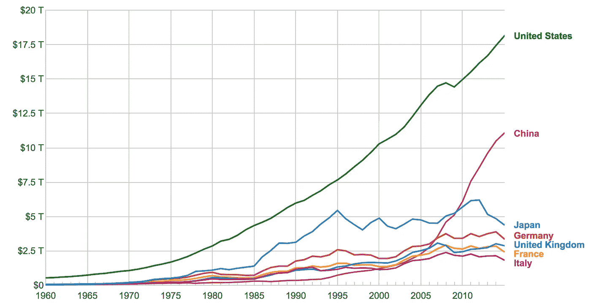
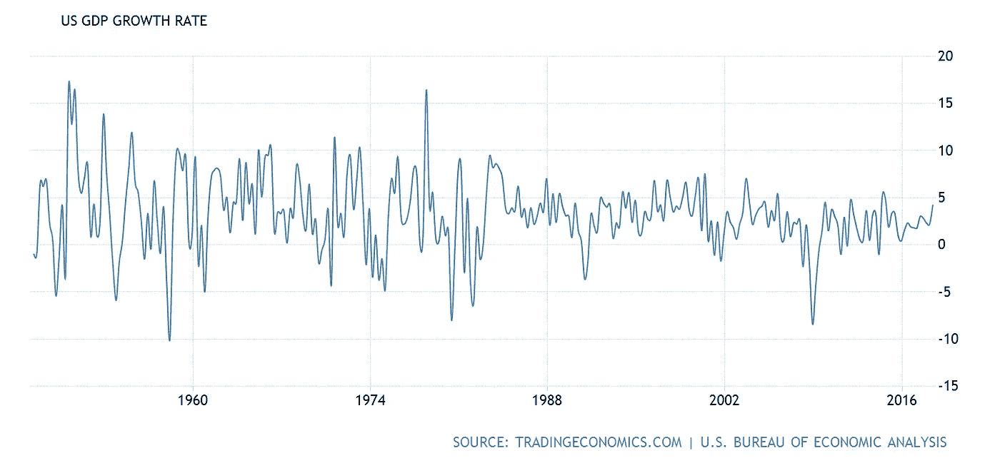
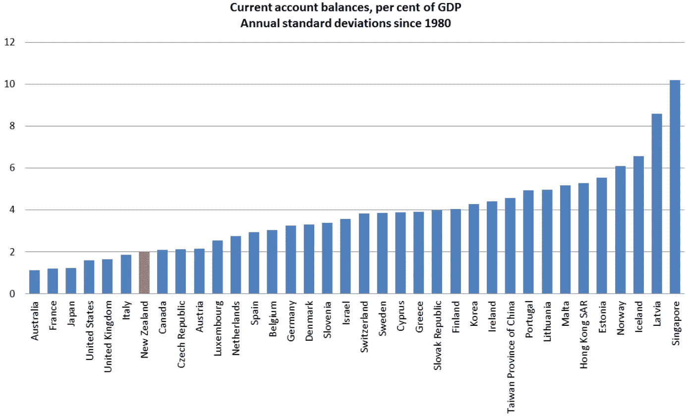
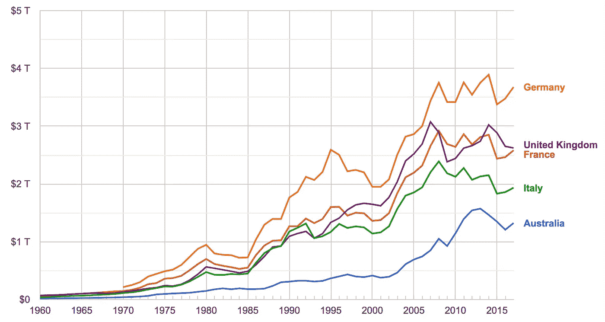
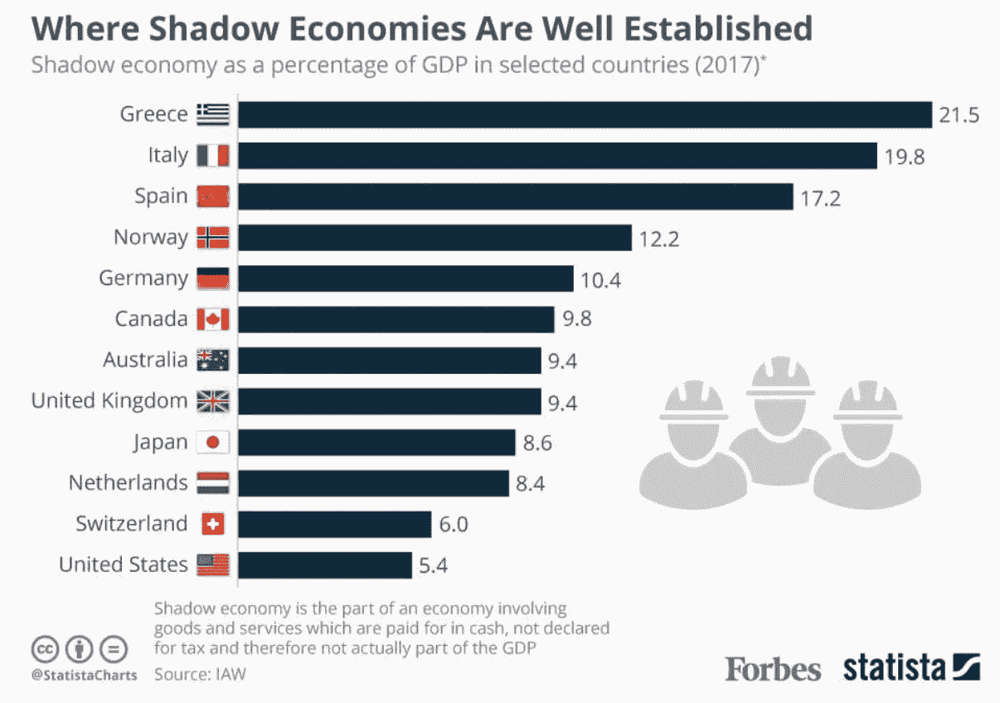
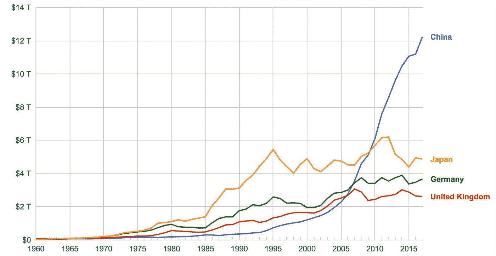
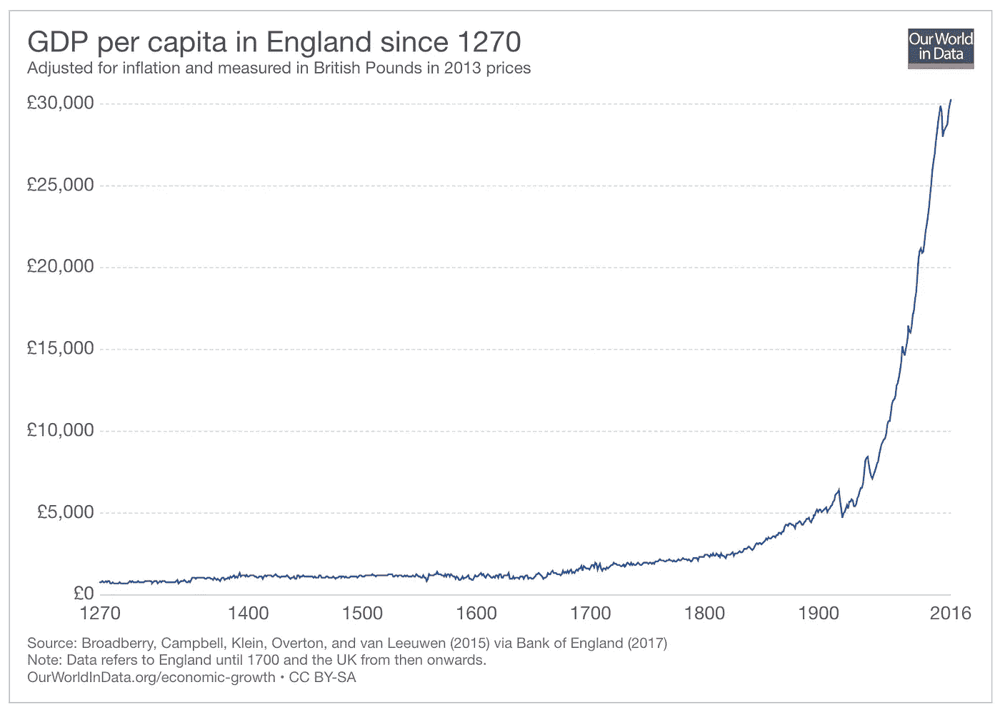
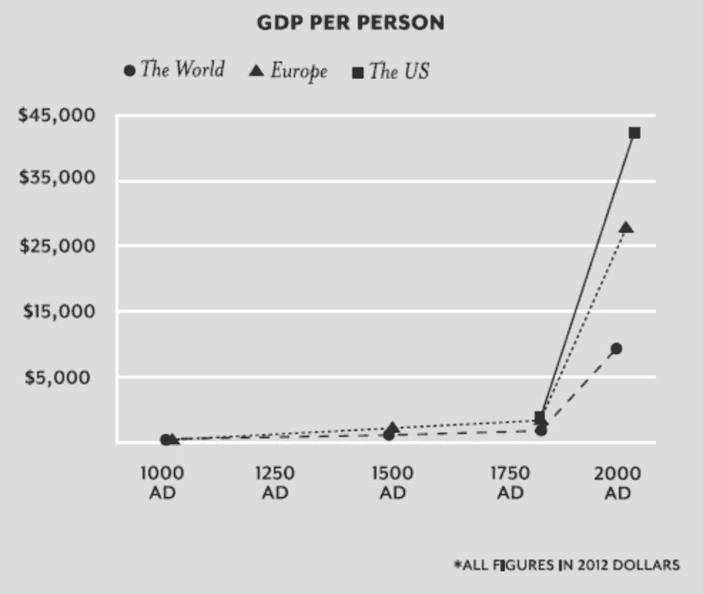

# 为什么美国 GDP 增长如此不可思议地稳定？

> 原文：<https://medium.datadriveninvestor.com/why-is-us-gdp-growth-so-weirdly-constant-c73024d56103?source=collection_archive---------6----------------------->

帕特里克·科利森 [**提出了一系列非常引人注目的问题**](https://patrickcollison.com/questions) ，其中一个就是本文的标题:**为什么美国 GDP 增长如此不可思议地稳定？**

我决定这是值得我晚上漫步。我喜欢回答有挑战性的问题。我喜欢挑战:)

# 1.首先，真的“顺利”吗？

这张图表向你展示了过去 55 年左右世界上一些最富裕国家的 GDP。

GDP by country

事实上，与其他国家相比，美国的 GDP 似乎特别平稳。当你去掉美国和中国，仔细看看一些欧洲国家时，也会有同样的印象:

GDP by country, wealthiest EU nations

在这里你可以清楚地看到 20 世纪 80 年代初的经济衰退，它影响了欧洲几年，与美国相比(即使罗纳德·里根花了一年时间才最终承认经济处于“轻微衰退”。).

但是一个显示绝对数字的图表可能还是有一点欺骗性。那纯增长呢？

US GDP quarterly growth

所以，是的，我们不得不承认，美国的 GDP 增长确实是平稳的。为什么？

# 2.有多独特？

这种平稳的增长不是独一无二的，但肯定是相当罕见的。 [**这显示了**](https://croakingcassandra.com/2015/06/03/515/) 某一组国家中最稳定的经常账户(余额)。美国排名第四，但澳大利亚是冠军:

Current account balances, by country, since 1980

这是否意味着澳大利亚的 GDP 更加平稳？不完全是，尽管它足够接近。以下是与类似经济体的比较:

“影子经济”可能是问题所在吗？对澳大利亚来说肯定不是，澳大利亚的失业率约为 9.4%，远低于希腊、意大利和西班牙经历的危险水平……嗯，已经经历了很长、很长一段时间。(这里要注意的是，美国处于非常低的 5.4%。会不会是一个因素？)

但这里有另一个非常平稳的 GDP(中国)，相比通常“乱七八糟”的欧洲国家:

到目前为止，美国和中国是唯一一个可以恰当地宣称 GDP 随着时间推移保持平稳的国家。

是不是说你必须是一个 [**经济规模大的大国**](http://hubertpaul.free.fr/Country_Size.pdf) 才能从本质上降低 GDP 波动？让我们看看这是否适用于历史上最大的帝国之一，从中世纪到至少第二次世界大战:

# 3.那么，怎么回事？

那么，仅仅是大国拥有平稳的 GDP 吗？嗯……我很清楚，没有像那样简单的答案。有几个因素影响着一个国家的发展。一篇精彩的 [**论文**](https://web.stanford.edu/~chadj/facts.pdf) 列举了几个，并提供了引人注目的段落(粗体是我的):

尽管大萧条异常严重——人均 GDP 在短短 4 年内下降了近 20%——但同样值得注意的是，这只是暂时的。到 1939 年，美国经济已经超过了之前的峰值，十年后的宏观经济故事再次成为持续的、近乎无情的经济增长之一。

并且:

成千上万年来，用托马斯·霍布斯令人回味的语言来说，生活是“肮脏、野蛮和短暂的”只是在过去的两个世纪里，这种情况才有所改变，但在这相对短暂的时间里，这种变化是巨大的。

那是什么？

生育？人口？平均工作时间？生产力？战争？贸易？经济政策？政治稳定？“更平稳”和更稳定的经济部门？美联储(以及中国的对等机构)？电子游戏？

在我看来，似乎还没有人找到一个定量模型来正确解释 GDP 为什么会变化，以及是什么让某些国家的增长比其他国家更平稳。或者，如果模型可以适用于任何历史时期，不管某些技术进步。

我还认为，平稳的 GDP 增长实际上可能意味着经济不平等的加剧——从经验上看，这对我们和中国来说肯定是正确的，对澳大利亚来说也是如此，只是程度稍轻一些。但这仍然是一个简单的观点。

# 结论

我没办法回答你，帕特里克！

但至少我可以用一个同样有趣的问题和一个相应的图表来结束这篇文章。

# 为什么全球 GDP 增长如此不公平？

奖金问题: [**富人是否攫取了经济增长的全部收益？**](https://medium.com/@russroberts/do-the-rich-capture-all-the-gains-from-economic-growth-c96d93101f9c)