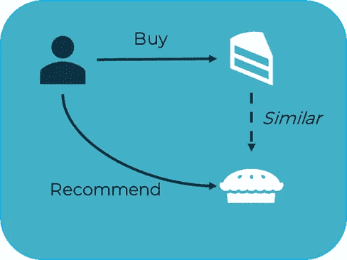
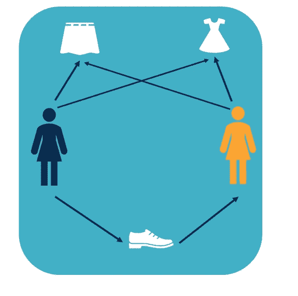

# 为什么你的人工智能不工作？

> 原文：<https://medium.datadriveninvestor.com/why-isnt-your-ai-working-e293d426f572?source=collection_archive---------18----------------------->

这听起来像你吗？你的个性化软件承诺它的人工智能将提供星星，但你对它的性能印象不深。

为什么会这样？

AI 和大数据齐头并进。电子商务领域最明显的例子可能是网飞和亚马逊，这两家公司都拥有庞大的在线业务，主导着各自的商业领域。他们每个月都有数百万的客户和互动，这就是标准形式的人工智能的优势所在——这些公司拥有大量数据，让人工智能快速有效地学习，得出有利可图的结论。

然而，中小型企业**也可以**利用人工智能取得巨大成效。像 www.canaries.co.uk 的[诺维奇城足球俱乐部](https://www.pureclarity.com/case-studies/norwich-city-football-club/?utm_source=medium&utm_medium=blog&utm_campaign=ainotgoodNCFC)商店或者 www.poppyshop.org.uk 的[皇家英国军团](https://www.pureclarity.com/case-studies/the-royal-british-legion/?utm_source=medium&utm_medium=blog&utm_campaign=ainotgoodRBL)这样的公司已经通过相关的推荐享受到了收入的增长，尽管他们每月接待的游客数量不如一些大商店。当他们没有相同的交互和客户-产品交互数据的日志可以利用时，他们是如何做到的呢？

进入**基于内容的过滤**。基于内容的过滤是一种推荐系统，算法通过它根据相似的属性推荐其他产品。

These similar products will most likely make a great recommendation

即使不存在交互，其功能也允许进行相关的个性化推荐。这对于冷启动来说是非常好的，对于那些没有数百万次交互但仍然想给用户相关结果的公司来说。

如果你是一家中小型企业，并且你注意到你的人工智能表现不如你预期的好，你能做什么？大多数电子商务个性化提供商提供什么？

如果你对你的人工智能不满意，很可能你的电子商务个性化提供商正在依赖一种叫做**协同过滤**的技术。这是推荐系统所使用的，它根据其他人喜欢的东西来自动预测一个人喜欢什么。

如果斯蒂芬妮买了一件连衣裙、一条裙子和一双鞋子，对连衣裙和裙子感兴趣的伊丽莎白可能也会对鞋子感兴趣，并会被推荐给她。

例如，网飞很擅长根据像你这样的人推荐你喜欢的电视节目，甚至定制节目和电影作品来吸引观众。亚马逊在这方面[做得非常好](https://medium.com/@elenaeruiz95/be-like-amazon-3bfca07ca16c)，利用这些数据为客户进行相关的交叉销售、追加销售和再次购买，在客户满意度和年收入方面取得了巨大的成效。

‘Next episode beginning in 3….2….1….’

但他们是局外人。大多数公司没有这样的数据库可以利用。当中小型企业使用典型的协作过滤人工智能进行预测时，会发生什么？

> 1.缺乏相关性

如果一个产品完全没有数据存储，大多数推荐策略默认为畅销书或趋势产品推荐。不太受欢迎的产品将有少得多的智能推荐。参观者将看到和其他人一样的产品，不管他们的行为、偏好或细分。这与今天营销人员所知道的关于个性化的一切背道而驰——虽然得到一种适合大多数人的方法可能是好的，但使用许多不同的方法来迎合每个人要好得多。也就是说，尽可能接近“一对一营销”的圣杯。

Show the right person the right thing at the right time, and they’ll convert

> 2.流行偏见

那些不是非常受欢迎的项目，并且只有很少的数据存储在它们上面，在任何人工智能推荐器中都会表现不佳，很少有交互供人工智能学习。这反过来将意味着它不会显示在人工智能推荐器中，这意味着它不会获得任何额外的交互，因此人工智能无法学习，如此循环往复。这种循环会导致目录中的绝大多数产品被忽略，尤其是在以后添加新的产品时。

An endless loop of negative feedback

> 3.新用户未个性化

如果一个从来没有去过你网站的访问者来到你的网站，如果这个访问者没有针对他们的行为数据，那么人工智能可以向他们展示什么？如果人工智能依赖于协同过滤，它将再次默认一个通用推荐器。这可能会导致这位访客对推荐的质量不满意，不会再回来，这意味着人工智能可能永远不会学到第一次访客的最佳技术。

First-time visitors are a crucial segment for businesses

大部分在线企业没有这样的访问量和顾客数量。因此，目前使用人工智能系统向客户展示推荐的大部分在线企业可能有一个弱点。

有什么解决办法？[一个更聪明的人工智能。](https://www.pureclarity.com/how-pureclarity-works/)

允许协同过滤和基于内容的过滤相结合的人工智能系统远远优于单独的协同过滤。互动很少的企业将能够保持相关性，即使它们的互动量不如大型企业。随着公司用户的增长，无缝过渡到协作过滤拓宽了潜在推荐的范围，同时仍然为新产品或新用户提供相关推荐。

在 PureClarity，我们热衷于为各种规模的企业提供尽可能最好的人工智能，无论规模大小。在我们的核心，我们是一个个性化的平台，拥有令人惊叹的人工智能，为所有游客和产品提供相关的，有用的建议。

去试试 PureClarity 吧。联系我们进行演示，或者通过我们的 14 天免费试用版免费试用。没有义务——只是个性化。