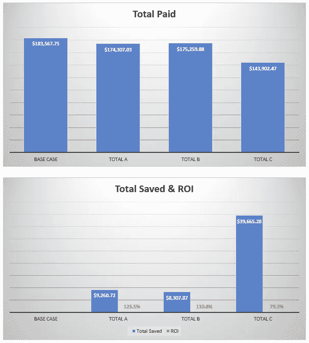

# 为什么为你的学生贷款贡献更多并不总是值得的

> 原文：<https://medium.datadriveninvestor.com/why-it-doesnt-always-pay-to-contribute-more-towards-your-student-loan-57e9b3550581?source=collection_archive---------7----------------------->

这篇文章可能看起来超出了我通常的主题范围，但实际上，它是完全相关的。经济安全是幸福的重要组成部分，它能直接影响我们与他人联系和分享微笑的能力。在之前的帖子中，我鼓励你在日常生活中体验联系和友善。在这篇文章中，我将努力让你掌握金融知识，这样你就可以自信地评估你的学生贷款档案。

***编辑注:*** *本内容不由任何金融机构提供或委托。本文中表达的任何观点、分析、评论或建议仅属于作者个人，不代表财务建议。*

 [## 更好地制定预算，打造更大的数据驱动型投资者

### 即使是专家也承认它们并不完美。从 1 到 10 的范围内，安东尼·科普曼和德尔…

www.datadriveninvestor.com](https://www.datadriveninvestor.com/2018/11/08/budget-better-to-build-bigger/) 

我厌倦了所有那些谈论千禧一代有多穷以及学生债务有多沉重的文章。我从来不喜欢幸灾乐祸，所以阅读别人的情况有多糟糕并不会让我对自己的学生贷款情况感觉更好。一方面，我确实看到了让人们关注这一问题的价值，这样当选官员就可以尝试做些什么，年轻人就可以更明智地评估他们的决定，但还有另一个紧迫但未得到充分解决的问题。**目前的债务持有人缺乏实用知识，无法理解摆在我们面前的财务权衡和巨额债务。**

> 因此，在一个多部分的系列文章中，我将旨在分享我作为一个金融专业的学生和毕业时负债近 20 万美元的学生，以及作为一个好奇和坚持不懈的千禧一代所获得的知识。

2017 年，[**65%的大学大四学生**](https://www.nerdwallet.com/blog/loans/student-loans/student-loan-debt/) 带着助学贷款毕业。2019 年，预计有[**180 万学生**](https://nces.ed.gov/programs/digest/d17/tables/dt17_318.10.asp) 获得学士学位，这意味着我们可以估计未来几个月有多少助学贷款将进入还款。这些贷款将使超过 4400 万美国借款人的总欠款增加到超过 1.5 万亿美元。所有这些借款人是如何管理他们的债务的？一些方法包括，但不限于，询问 reddit 会员，即“一劳永逸”的方法，尽快付清，或者在奖金季节做大量的额外贡献。

> 像“尽快还清债务”这种笼统的说法可能被认为比其他方法更好，但作为一名学生贷款借款人，我观察到它并不总是最佳的。

尽管支付高于最低还款额确实会让贷款原则更快失效，但许多思想领袖在建议借款人“支付高于最低还款额”时，用了过于宽泛的画笔。财务收益将取决于在贷款期限内何时支付额外的付款，在贷款期限的早期支付额外的付款将比在贷款期限的后期支付相同的金额产生更大的影响。**借款人可以分三步考虑:**

> 1.确定你可以用多少可支配收入来申请学生贷款。
> 
> 2.估计一下额外的支付将为你节省多少利息，这可以被视为投资回报(我在 Google Sheets 中创建了一个贷款场景分析器，可以根据请求分享一个链接)。
> 
> 3.评估如果你没有学生贷款，你是否会将你的可支配收入用于其他投资。如果在相同的时间框架内，其他投资有可能提供比将其用于贷款节省的利息更高的投资回报率，那么它可能值得考虑。

为了说明这三个步骤，我将提供一个借款人的例子。 ***免责声明*** *:这些情景仅用于说明目的，不代表财务建议。*

# **借款人示例—奥利弗的学生贷款还款计划**

奥利弗于 2018 年 5 月大学毕业，背负 12 万美元私人(非联邦)学生债务。他的利率是 6.10%，贷款期限是 15 年，这意味着他的月供是 1020 美元。尽管私人贷款提供商在贷款进入还款之前提供了六个月的宽限期，但奥利弗知道他的私人债务每天都会产生利息，所以他急于立即开始还款。除了最低还款额，他还想了解额外还款额的影响。*(为简单起见，我们将只评估贷款期限前三年内额外付款的影响。)*

## **场景 1:** Oliver 每月有大约 600 美元的可支配收入，他想用其中的一部分来申请学生贷款。他决定看看每月增加 300 美元会有什么影响。

**投入**:从 2018 年 7 月开始，每月比最低还款额多支付 300 美元，持续两年

**产出**:总计 7，500 美元的额外付款将产生约 9，200 美元的利息节省，并将贷款期限缩短 17 个月

**投资回报**:节省 9，200 美元的利息相当于大约 **123%的投资回报率**

## 场景 2: 大学毕业一年后，奥利弗终于决定全力以赴，开始支付高于最低还款额的款项。他想在 2018 年毕业时开始这样做，但没有坚持到底。他很快注意到同样数量的钱产生了更小的影响。他没有去想为什么会发生变化，而是很快记起学生贷款遵循一个分期偿还的时间表，这意味着借款人在贷款的早期支付更多的利息。这意味着额外付款的利息节省影响在贷款的后期会减少。

**投入:**从 2019 年 7 月开始，每月比最低支付额多支付 300 美元，持续两年

**产出:**总计 7，500 美元的额外付款将产生约 8，300 美元的利息节省，并将贷款期限缩短 16 个月

**投资回报:**8，300 美元的利息节省相当于大约 110%的投资回报率(相比之下，如果他一年前开始同样的支付，投资回报率为 123%)

## **情景 3:** 由于奥利弗在情景 2 中意识到，两年内每月多付 300 美元并不能像情景 1 那样节省利息，他开始考虑是否应该保留每月多付的 300 美元，并将接下来的两笔奖金用于学生贷款。他的奖金应该在 25，000 美元左右，所以他希望这会对他的贷款产生积极影响。

(虽然确实会对绝对贷款价值产生影响，但他会意识到投资回报不会像他希望的那样理想。)

**投入**:2019 年 7 月从他的奖金中额外支付 25000 美元，2020 年 7 月再支付 25000 美元

**产出**:总计 50，000 美元的额外付款将产生约 40，000 美元的利息节省，并将贷款期限缩短 88 个月

**投资回报:**节省 40，000 美元的利息相当于大约 80%的投资回报率

****

**Graphical representation of Scenarios 1, 2 and 3 as A, B and C, respectively**

## ****场景 4:** Oliver 对利息节省不满意，因为利息节省导致投资回报率仅为 80%。不确定该做什么，他决定尝试结合他的方法。他想看看如果他每个月多贡献 300 美元，并且也贡献他的两笔奖金 25000 美元，会发生什么。**

****投入**:每月比最低支付额多支付 300 美元，从 2019 年 7 月开始，持续两年；还要在 2019 年 7 月和 2020 年 7 月额外支付 25000 美元**

****产出**:总计 57，500 美元的额外付款将产生约 42，400 美元的利息节省，并将贷款期限缩短 98 个月**

****投资回报:**节省的 42，400 美元利息相当于大约 74%的投资回报率**

## ******场景 5:** 奥利佛没想到他的投资回报率会在场景 4 中下降。但每次他感到惊讶时，他也会提醒自己，这只是摊销工作方式的一部分。作为最后的努力，他决定评估第二笔奖金对他偿还贷款的影响。****

******输入**:每月比最低还款额多付 300 美元，2019 年 7 月开始，持续两年；2019 年 7 月只需额外支付 25000 美元****

******产出**:32，500 美元的总超额付款将产生约 31，000 美元的利息节省，并将贷款期限缩短 63 个月****

******投资回报:**31，000 美元的利息节省相当于大约 95%的投资回报率****

******在场景 5 中，Oliver 了解到，如果他在 2020 年 7 月的 25，000 美元奖金可以用于另一项投资，该投资可能在五年内产生超过 11，000 美元的回报，那么这将超过将奖金直接用于贷款所节省的利息。因此，如果有机会，他可能会考虑将这 25，000 美元投资于其他地方，为期五年，如果回报超过 11，000 美元，那么他可以将更高的收入用于偿还学生债务。这取决于他的风险偏好，因为在其他情况下，更高回报的潜力可能更有风险，而节省的利息是肯定的。因此，这种决定必须根据个人情况进行评估。******

# ********将节省的利息视为投资回报********

******重要的是要记住，用于我们学生贷款债务的额外一美元不能用于其他投资，反之亦然。**如果我们将利息储蓄视为投资回报，那么我们就能够在投资选择的整体背景下看待我们的债务。这将使我们能够战略性地解决我们的学生贷款债务，而不是像戴红字一样恐惧。********

****本文中展示的五个场景传达了三个要点:****

> ****1.你的额外付款将在你贷款的早期产生更大的影响****
> 
> ****2.每年发生的大额支付的利息节省(ROI)可能不如小额且更一致的支付有利****
> 
> ****3.借款人应该评估相对于他们节省的利息，其他投资可能提供的投资回报，并确定其他投资的潜在收益是否超过节省的利息的投资回报****

****如果你是一名学生贷款借款人，并且想自己试用场景分析器，请在下面评论或者发邮件给 goingforsmiles@gmail.com[以便我可以为你提供一个谷歌工作表的私人链接。](mailto:goingforsmiles@gmail.com)****

**** [## 随机的善举并不像我们想象的那样随机

### 这种错觉转移了大多数看不见的人的同情心

medium.com](https://medium.com/@goingforsmiles/random-acts-of-kindness-arent-as-random-as-we-think-a93181f22236)  [## 微笑通勤者的故事

### 微笑故事# 17-23

medium.com](https://medium.com/@goingforsmiles/stories-of-smiling-commuters-b7f375caf8e8)  [## 分享微笑如何让我变得更有弹性、更自信、更快乐

### 你上次被拒是什么时候？

medium.com](https://medium.com/@goingforsmiles/how-sharing-smiles-made-me-resilient-more-confident-and-happier-8bcb92cf9671)****