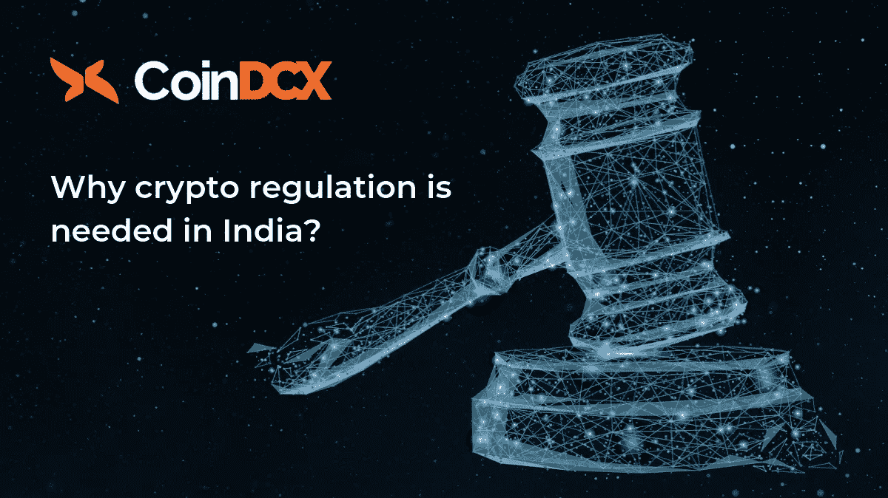

# 印度需要密码法规吗？

> 原文：<https://medium.datadriveninvestor.com/why-it-is-important-to-have-regulations-on-cryptocurrencies-in-india-15df82ce99fd?source=collection_archive---------17----------------------->

Crypto regulations in India

*声明:内容来源于* [*CoinDCX*](https://coindcx.com/trade/home?utm_source=indregulationsaltcoin&utm_medium=indregulationsaltcoin&utm_campaign=indregulationsaltcoin) *。CoinDCX 不提升/降级任何公司/ICO。本信息或其他媒体中的观点、陈述、估计和预测仅属于作者个人。*

撇开熊市和牛市不谈，不可否认的是，加密泡沫已经大到不容忽视。加密市场目前价值超过 5 万亿美元，相当于全球流通的 5 万亿美元的 10%。

加密货币的空前繁荣使其成为初创公司融资的可行方式。除了将自己确立为一种有效的筹款工具，加密货币还催生了各种各样的骗局，因为几乎没有或根本没有监管。

加密货币缺乏任何明确的法律框架只会造成混乱，这就是为什么必须制定某些法规，让代币创造者对当局负责。

# 区块链春天

根据总部位于伦敦的区块链咨询公司 [Dappros](https://www.dappros.com/) 发布的一份报告，截至 2018 年 10 月，印度以超过 19，627 名区块链开发者取代了我们，而美国则有近 44，979 名开发者。

> 这实质上意味着，在吸引基于区块链技术的应用时，印度可以轻松地获得超过其他国家的优势。

尽管区块链之春可以归因于加密货币的增长，但该技术有能力改造许多领域，如虚拟现实、房地产、数据库管理等。

像印度这样的新兴经济体可以从区块链技术在各种垂直领域的应用中获益匪浅，如医疗保健、农业、虚拟现实、房地产、数据库管理等。

# 印度接受加密货币

尽管印度政府对区块链技术持认可态度，但监管机构一直在考虑如何处理与加密货币相关的潜在反洗钱/CFT 和消费者保护问题。

印度对加密货币和数字资产等区块链*、*的某些元素的谨慎态度不仅阻碍了该国的加密之春，还将全球风投和机构投资者赶出了该国，从而限制了印度加密货币的监管风险敞口。

这种谨慎的做法使得印度的密码相关机构难以运作。由于印度加密法规的不确定性，全球对区块链生态系统的投资一直很低。

> 虽然印度加密货币的合法化可能会改变全球加密行业的游戏规则(采用方面)，但印度监管机构最近对加密货币持强硬态度。

尽管围绕加密货币存在不确定性，但印度政府已经成立了一个委员会，研究合法化的前景和后果。

## 总结一下…

尽管印度政府尚未就加密货币合法化发表官方声明或宣言，但权威机构已经明确表示，政府正在制定立法，可能会为“普通人”提供更好的加密货币保护。

> [访问 CoinDCX](https://coindcx.com/trade/home?utm_source=indregulationsaltcoin&utm_medium=indregulationsaltcoin&utm_campaign=indregulationsaltcoin)