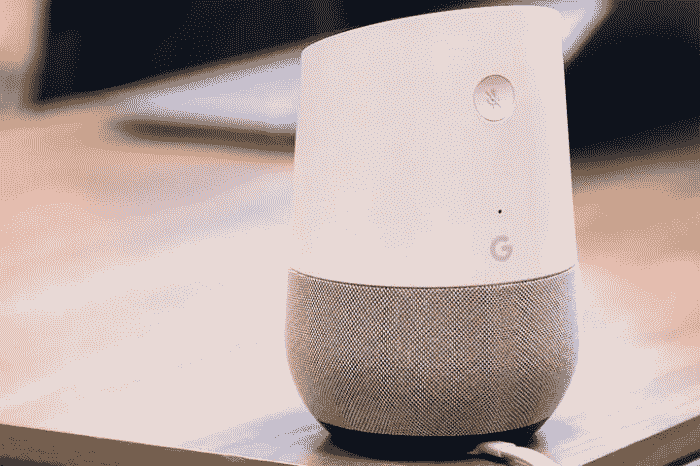
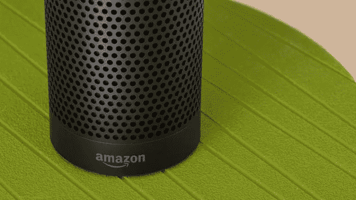

# 为什么谷歌或亚马逊知道你什么时候睡觉可能是个好主意

> 原文：<https://medium.datadriveninvestor.com/why-it-may-be-a-good-idea-google-or-amazon-knows-when-you-go-to-bed-2f81228555f9?source=collection_archive---------20----------------------->

别担心:他们没有在监视你(我们认为他们没有)。

如今，数据隐私是科技领域的一个大词，尤其是在调查从索尼到脸书的各种丑闻时。如今，人们像保护自己的身份一样保护自己的数据。他们的数据*就是*他们的身份。从 Google Home 到 Amazon Alexa 等各地的平台都在试图向大众保证，虽然那些渗透到市场的智能扬声器实际上并没有渗透到你的数字灵魂，并在铁幕后面统治你的存在。

# 但是我们怎么能确定 Google Home 或亚马逊 Alexa 没有统治我们的网络空间(和现实世界)呢？

不言而喻，整个 [*物联网*](https://vigyaa.com/@pierre/beware-as-the-city-you-live-in-might-get-smarter-than-you-c7d8fe7b/) 的心态让人们有点动摇，认为我们将生活在一个机器将接管的时代。小心:微波炉会知道你的一举一动。这是谷歌在智能音箱与智能家居连接方面的努力:*这些公司现在正在收集所有关于你何时开灯或关灯以及锁门或开门的数据*。

所以现在你看到了轻微的担忧。智能音箱如此方便的原因是，通过这种技术，谷歌和 Alexa 等平台不断要求罗技和 Hunter Fan Co .等小工具制造商提供持续的信息流，以更好地服务于房主的日常生活。

换句话说，都是关于自动化和[机器学习](https://vigyaa.com/@pierre/not-savvy-with-artificial-intelligence-ai-you-might-as-well-be-00331c57/)。给你的家足够的时间，它可能会精确地指出你什么时候睡觉，什么时候下班或放学回家，什么时候吃饭，甚至什么时候做爱。真的很令人惊讶。对某些人来说，这可能有点令人不安。

本质上，这些智能扬声器可以连接到你的整个家庭，从头到尾都知道你的确切行为模式，但问题仍然存在:*这是否严重侵犯了数据隐私？*

# 事实是，许多设备制造商在叫嚣犯规，说对用户的控制不够

目前，还没有公开的指导方针。没有限制。你关掉电视，一些公司会记录下你做了什么，并储存成你睡觉时的信息。句号。然而，尽管设备公司对此表示惊讶，但用户往往并不在乎，甚至可能根本不在乎。

事实上，亚马逊和谷歌都只是说，数据收集只是让人们更容易管理他们所有的家用电子产品，甚至不用动一根手指，事实是他们确实有道理。自动状态更新只是减少了语音命令和其他步骤的时间，完全自动化了任何主人的房子。

这无疑使智能扬声器成为有史以来发展最快的技术类别之一，仅次于无人机技术。由于这篇文章目前是由一个*智能*文字处理器(不是)“自动”撰写的，亚马逊的发言人在附近和远处反复声明没有出于广告目的出售用户数据和信息，但我们以前听说过这个故事。问题是我们应该诚实地相信它。更好的是，我们家庭生活的日常数据被用于广告目的，这一定是一件坏事吗？

# 很难说…鉴于确实没有任何迹象表明谷歌或亚马逊在使用我们的数据

不过，他们将来可能会这么做。有可能。我们有理由担心。好消息是，亚马逊和谷歌显然已经采取了重要措施，向消费者保证他们不会在床上或淋浴时偷窥他们，用户可以随意删除智能家居数据。但是，没有任何选项可以停止特定设备上的数据收集。事实上，阻止这些智能音箱“入侵”我们家的唯一方法就是简单地拔掉它们。

我们确实生活在一个偏执的时代，这是有充分理由的:身份盗窃、电脑黑客等等。因此，像谷歌和亚马逊这样的公司一直处于显微镜下。问自己一个显而易见的问题:你在乎谷歌或亚马逊知道你何时打开浴室灯吗？现实一点，如果没什么大不了的，那当然:弄个智能音箱；如果它让你反胃，就远离整个物联网现象，按照你想要的方式生活。这没什么不好！

对当前的技术创新有什么想法？ [**注册一个免费的 VIGYAA 账户，开始写你的想法吧！**](https://vigyaa.com/accounts/login/)

*最初发表于*[*vigyaa.com*](https://vigyaa.com/@pierre/why-it-may-be-a-good-idea-google-or-amazon-knows-when-you-go-to-b-f909d8d8/)*。*