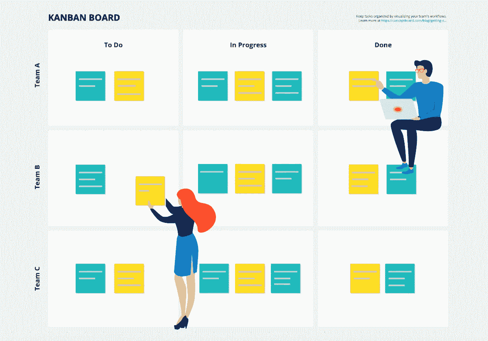
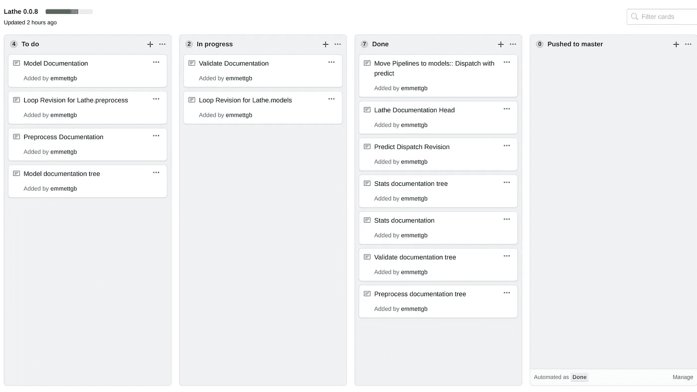

# 为什么看板是我的最爱

> 原文：<https://medium.datadriveninvestor.com/why-kanban-boards-are-my-favorite-53f6a77f5352?source=collection_archive---------8----------------------->

M 任何有抱负的程序员都把大量精力放在编程和执行上，但往往是一个完全独立的话题，*流，谈到了。这是非常不幸的，因为流实际上是现代编程的一个非常重要的支柱。大多数现代编程都是在非常大的规模上完成的，而且通常是专有规模。在讨论组织的可伸缩性时经常看到的一个问题是，管理不同的团队、不同的人、不同的想法和不同的背景真的很难。*

* [## 创建折衷书架的程序员指南|数据驱动的投资者

### 每个开发者都应该有一个书架。他的内阁中可能的文本集合是无数的，但不是每一个集合…

www.datadriveninvestor.com](https://www.datadriveninvestor.com/2019/03/25/a-programmers-guide-to-creating-an-eclectic-bookshelf/) 

版本控制、git 流和 canvasing 实际上是日常软件开发的重要部分。

构建云平台需要多个开发人员一点一点地工作，这可能是难以置信的无组织性。正因为如此，想法和方法已经被开发出来，专门用于在团队中完成目标。许多基于代码的管理服务(如 Github)提供了一些基于云的生产管理解决方案。

心流对你来说是个人的东西，并按照你想要的方式进行优化。然而，权力越大，责任越大；我发现，仅仅通过制造我自己的流程，我就能看到我个人项目的改进。你的流量会不断发展，是做程序员的乐趣之一。* 

# *看板法*

*那么…看板到底是什么，它对我的工作流程有什么帮助？看板实际上是一个相当宽泛的项目板术语，但是看板板的概念是一块有三列的板——*

> *去做*
> 
> *在发展中*
> 
> *完成的*

*—但是这个简单的定义可以用相同的基本原理扩展成一个板，但是多了很多列。看板由“卡片”管理，这些“卡片”被赋予文本并在三列之间移动。我个人使用看板来做简单的家务、购物清单和我的个人教育目标，但是看板在软件中真正展示了它们的魔力。当看板在整个团队中使用云服务(如 Trello)同步时，看板的效率也得到了很好的展示。*

## *版本控制*

*看板——特别是通过 Github，实际上提供了一种简单的版本控制方法。Done 列可以保存大量的变更日志和 canvasing 信息，使得编写变更日志和让用户保持最新状态变得非常容易。Github 有一个非常简洁的功能，在项目部分下有看板，你可以通过简单的点击来打开和关闭不同的看板项目板，允许你在项目的所有迭代中以板卡的形式存储变更日志。*

## *彻底检查*

*释放画布也很重要！知道需要做什么，以及什么时候一个版本可以发布是很棒的，并且可以让背后的工作感觉很棒。在一个大项目中，很容易迷失下一步该做什么。有时候有一些你知道你需要做的大事，但是不一定有时间去做。看着要做的事情的清单，知道你离开时正在做什么对项目管理来说是非常好的。*

## *小组管理*

*当与团队、工程经理、部门领导、技术领导和开发人员一起工作时，沟通是决定团队成败的关键因素。看板可以在影响团队开发速度方面发挥重要作用。仅仅通过查看一个页面就知道每个人在做什么是有效和容易的，并且使得选择你的下一个任务变得更加容易。*

## *满意*

*更好的编程意味着更好的心态。知道需要做什么，做了什么，谁做了什么是最棒的，但是获得大卡片的满足感，以及在卡片之后推动大发布使开发明显更令人满意。知道何时开始和停止一个版本更令人满意，推出一个新版本也是如此。*

*以我的经验来看，看板增加了更多的刺激，并且仍然允许你的项目有很大的灵活性。*

## *灵活性*

*看板实际上因其不可思议的灵活性而被很好地记录了下来。这当然是因为它们本质上很简单:三列卡片在其中移动。然而，这个简单的模板允许在其上构建很多东西。您可以根据需要自由更改列名、删除列、添加列、重命名列和编辑卡片。*

**

*灵活性对于任何涉及软件工程的组织来说都是一个很大的优势——或者任何与此相关的工程。有时候事情没有按计划进行，我们必须想出新的方法来做一些事情。*

# *开源代码库*

*虽然我确实喜欢 Trello 和其他各种提供带卡片看板的服务，但 Github 绝对是我的最爱。这是因为我用 Github 太多了，是的，但也是因为它与提交、拉请求、发布和合并的无缝集成。例如，对于车床，我使用一个四列看板。*

*在左边，我们有通常的—*

> *去做*
> 
> *在发展中*
> 
> *完成的*

*——但在右边的一个小例子中，我们可以很好地了解可工作看板中的定制。To Dos、in progress 和 done 列都被同步到 git 存储库的#Unstable 分支。当然，这很棒，因为董事会在没有任何管理的情况下自行运作。*

*“推给师傅”专栏呢？我很高兴你问了这个问题，任何时候一个拉请求从不稳定合并到主请求，所有完成的卡都会被移动到这个列，然后填充左上方的绿色栏。当绿色栏完全填满时，这意味着可以关闭电路板，这在 Github 中很容易做到，并且确实很好地记录了这方面提供的更新。*

# *不足之处*

*当然，任何方法都会有逻辑缺陷，这些缺陷不会使系统变得无用，但可能会使系统失去平衡。由于看板的简单性，它没有太多的缺陷，但是它的一个问题是，当事情变得稍微复杂一点的时候，它会让你感觉很困难，尤其是在 Github 上。扩展描述很难管理，尤其是在 Github 上(在 Trello 上容易得多)，尽管看板在快速“更改 ____”、“添加 ____”方面做得很好，但通常冗长的问题描述不能进入板卡。这可能是一个问题，因为团队成员使用公告板可能无法正确识别消息。*

*很难将一个非常技术性的问题描述到一张卡片中..虽然你可以把一个完整的文档概述写在卡片上，但是我认为大的段落卡片实际上会妨碍电路板的性能。*

# *结论*

*当然，我熟悉看板已经有一段时间了，但是直到最近我才真正用它们来记录我自己的事情。看板非常棒，因为它们可以把你发布画布的所有信息放在一个地方。所有发布画布文档存放的地方也恰好是您跟踪发布进度的地方。显然，这是很方便的，事情井井有条可以节省很多时间。虽然我最近开始比平时更多地使用看板，但我真的觉得它对我的工作流程产生了积极的影响。*