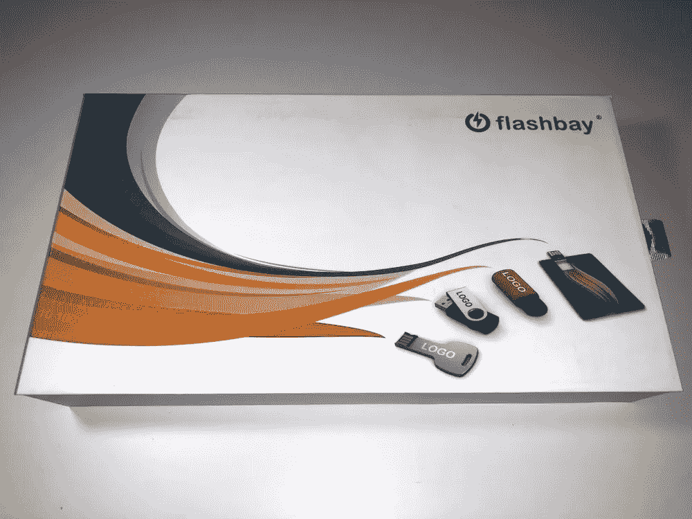
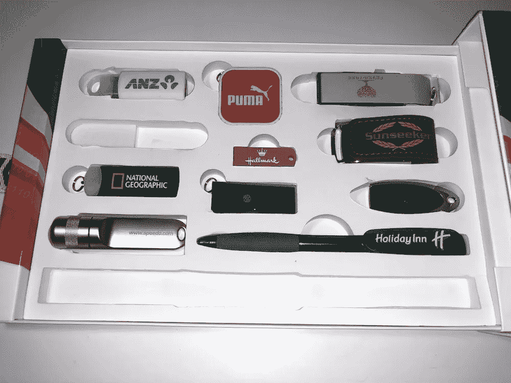
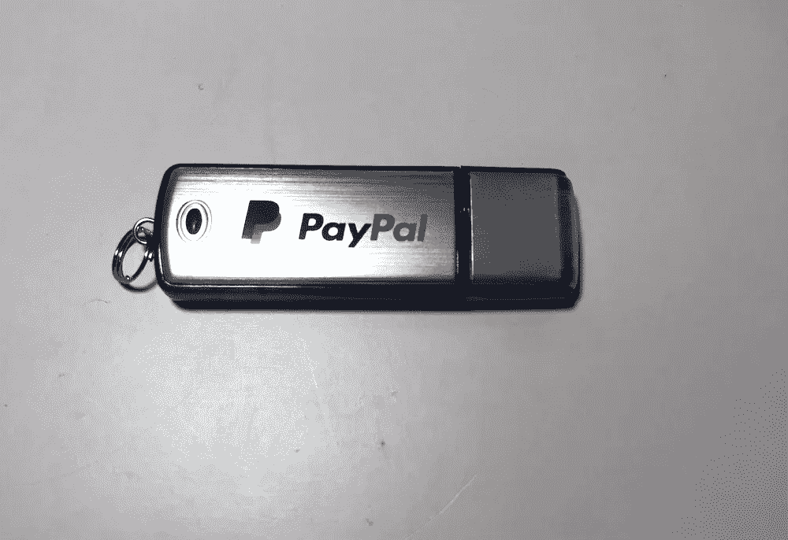
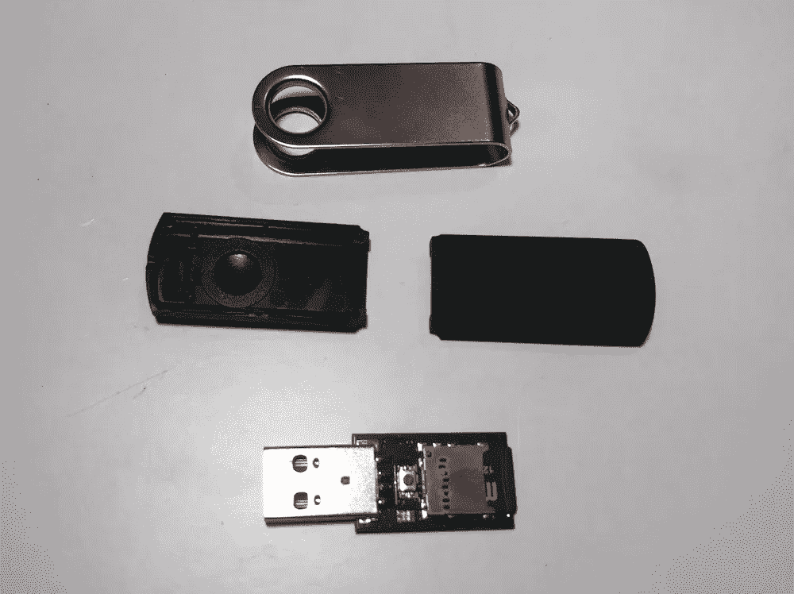
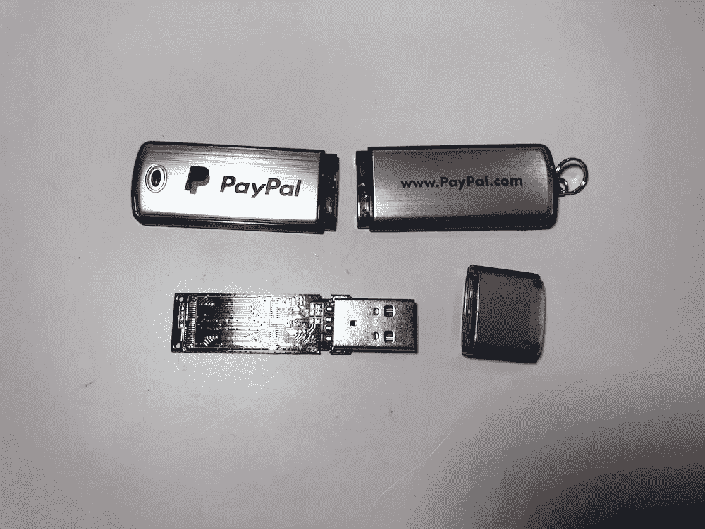
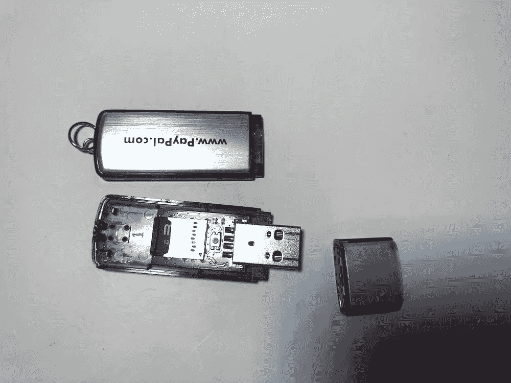

# 为什么大型组织和品牌 USB 驱动器不等于快乐的掌声。

> 原文：<https://medium.datadriveninvestor.com/why-large-organisations-and-branded-usb-drives-dont-equal-happy-claps-1da547bbd781?source=collection_archive---------12----------------------->

在我将重点转移到物联网、人工智能和人工智能之前，我的最后一个激情是网络安全。

我就这个主题进行了多次演讲，还参加了一些企业培训。我参加企业培训的原因是，尽管一些组织尽了最大努力，在防火墙和软件上花费了数万英镑。系统中最大的缺口是用户。

如果我冒犯了任何人，我提前道歉，但是说实话。我做过的一些清理工作，然后发现，顺便说一下，这是一个真实的故事。一位律师打开了一封用意大利语写的电子邮件，他看不懂，也没想到。打开附件，他的电脑开始表现异常；他没有打电话给任何人；他连电脑都没关。他刚刚起床，离开了一天，让它运行了一整夜。不聪明。

前几天晚上收拾东西的时候，我发现了这个。这是一个 USB 闪存驱动器的样品盒。我保留它是因为我现在要给你们展示的是我在一次演讲中想要展示的东西。

Flashdrive sample box

在里面，一个可爱的品牌 USB 驱动器的选择。

我决定选择这个作为我的受害者驱动器。

今天，大多数组织都有防止使用闪存驱动器的软件，原因有很多，其中之一是病毒和恶意软件。

下图是一个看起来像 u 盘但不是的东西。这个装置是一台微型计算机，它把自己伪装成一个键盘。因此，当它插上电源时，计算机会将其视为键盘，并让它像键盘一样工作。

它可以被编码成你喜欢的任何东西。例如，我在自己的脚本中使用的最后一个脚本是提取包含登录用户凭证的隐藏 windows 文件。

 [## 网络安全非营利组织帮助中小企业打击网络犯罪-数据驱动的投资者

### 一个名为全球网络联盟(GCA)的非营利组织发誓要改善…

www.datadriveninvestor.com](https://www.datadriveninvestor.com/2019/02/22/cybersecurity-non-profit-to-help-smes-fight-against-cybercrime/) 

不酷？

这是它做的最温和的事情之一。它可以做得更多。

A USB flash drive? No, a mini computer disguised as one.

所以我们有捐赠硬盘和“非闪存盘”。

用螺丝刀轻轻一拧。

一些花招。

把它们放回原处。

就像原版一样，但是危险十倍。现在，我不想和这只狼有任何瓜葛。

但是，如果您在停车场、接待处或电梯大厅的地板上发现了您公司的 USB 驱动器。你会把它捡起来，连接到你的电脑上，看看它的主人是谁，或者上面有什么？

统计表明至少有 50%的人会。

虽然我知道拥有一个 u 盘是一个很好的营销工具。这也可能对公司安全非常不利。

以防万一，我知道你们有些人可能在想。但是，那个设备是一个特殊的工具，很难得到。也不尽然，它的价格是 45 美元，几天之内就可以运送到世界上的任何地方。

总之，玩得开心，注意安全，不要把任何国外的 u 盘插到你的电脑里。；)