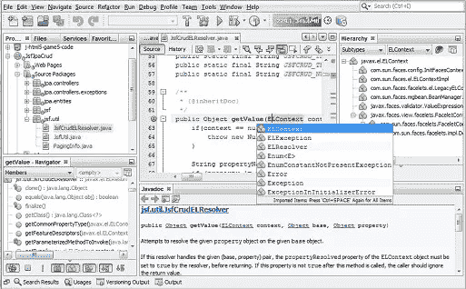
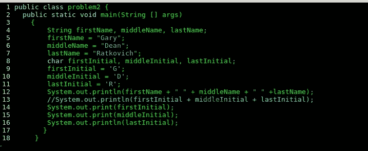
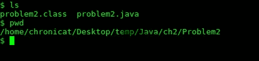
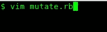
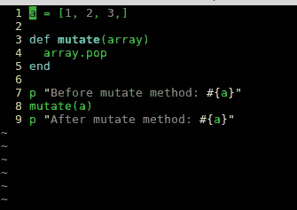
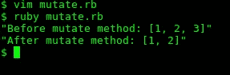

# 为什么 Linux 是软件开发初学者的可靠选择

> 原文：<https://medium.datadriveninvestor.com/why-linux-is-a-solid-choice-for-beginners-in-software-development-15553fb79b57?source=collection_archive---------17----------------------->

想象你是大学或者社区学院的新生。你的第一门课程是 Java 编程入门。你的教学大纲列出了一本 1000 页的 Java 教科书。它建议您在 Windows 或 Mac OS X 计算机上下载并安装一个 IDE(集成开发环境),如 NetBeans。一旦安装了开发环境，您会感觉很好，直到它看起来像这样:

Where are my .java and .class files located? How can I easily move around files and directories? How do I compile and run a java program? Where are these files and directories located? What is with this monochrome color scheme? It makes me sad and confused.

哎呀，它变得非常复杂。我们甚至还没有开发出在同一个目录中有几种不同文件类型的应用程序。我们还处在“你好，世界”的阶段。对了，那个截图是甲骨文网站上的，所以不是故意让他们难看。

让我们将其与 Linux 中的情况进行比较。

This makes a lot more sense. It’s easier on the eyes too.

So that is where my files are located. It takes just a few simple commands to find them.

我第一次使用 vim 编辑器时，我无法想象为什么有人会想使用它。现在我无法想象用别的。我从 NetBeans 到 Notepad++，到 atom，到 vim。我猜下一步是 emacs？不要着急，我想在继续前进之前先用 vim 打下一个坚实的基础。我不想意外引发天启。在学校他们没有告诉你的一件事是，在 Linux 中使用文本编辑器打开、编辑和运行一个简单的程序比使用 IDE 要快得多，也容易得多。

这里有一个例子。假设我们有一个用 Ruby 编写的名为 mutate 的程序。文件名是 mutate.rb。如果我们想使用 vim 编辑器打开该文件，我们只需在 CLI(命令行界面)中键入:vim mutate.rb。要运行它，我们键入:ruby mutate.rb。就是这么简单快捷。

命令行界面看起来是这样的:

This is how we open up the mutate.rb file using vim editor

This is what mutate.rb file looks like in vim editor. It has some pretty colors and tab settings which you can customize.

This is what the program looks like after it is run using the command ruby mutate.rb to execute it.

所有这些都不需要点击鼠标，也不需要浏览弹出窗口和菜单。尝试用 IDE 来做这件事，可能会花更长的时间。您还必须配置 IDE 来运行各种语言。这可能意味着有多种语言的多个 IDE。使用像 vim 这样的文本编辑器，您可以编写和运行任何语言，只要针对该特定语言的所有包和依赖项都安装在 Linux 中。所有这些都不难，也不需要那么长时间。你可以快速地从 Ruby、Python、Java、C++或者任何你喜欢的语言中转移出来。

我承认 Linux 一开始看起来很混乱。它看起来像是为天才们制造的。需要学习一些术语和概念，如 root、用户、守护进程、脚本和 path 环境变量。您将不得不学习命令，如:cd..，ls，pwd，mkdir，sudo apt 安装，git，clear，chmod，man。这样的例子不胜枚举。这可能一开始都是陌生的。但是随着实践，它变得容易理解并成为第二天性。您可以对目录和文件系统有一个直观的了解。您知道您的程序的确切位置，并且可以快速轻松地找到它们。您可以像外科医生一样精确地在整个操作系统中移动文件和目录。它也是一种关于计算的哲学和思维方式。有一个帮助创造了今天的 GNU/Linux 的远见卓识者的血统，包括 Ken Thompson、Dennis Ritchie、理查德·斯托尔曼和 Linus Torvalds，我认为我们在这里得到了很好的照顾。

我建议给 Linux 一个机会。花点时间把它安装到电脑上，然后用你喜欢的文本编辑器，比如 atom 或者 vim。我想你会惊喜地发现，与使用 IDE 时相比，你的工作效率提高了很多，挫败感也减少了很多。

感谢您花时间阅读本文。今年我有一些关于未来主题的大计划要写。我计划从头开始构建一台计算机，并使用 Unity 和 Unreal Engine 在 Linux 上进行视频游戏开发，以及做其他有趣的事情。

## 来自 DDI 的相关故事:

 [## 数据科学和软件工程哪个更有前途？

### 大约一个月前，当我坐在咖啡馆里为一个客户开发网站时，我发现了这个女人…

medium.com](https://medium.com/datadriveninvestor/which-is-more-promising-data-science-or-software-engineering-7e425e9ec4f4)  [## 用 7 个步骤解释深度学习

### 和猫一起

medium.com](https://medium.com/datadriveninvestor/deep-learning-explained-in-7-steps-9ae09471721a)