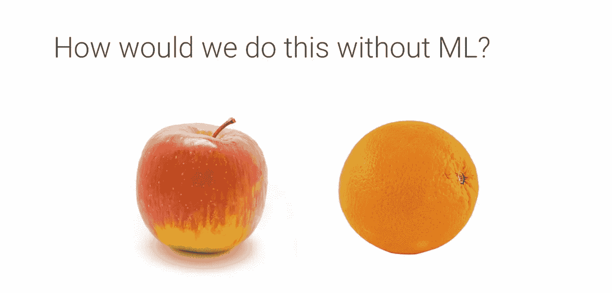
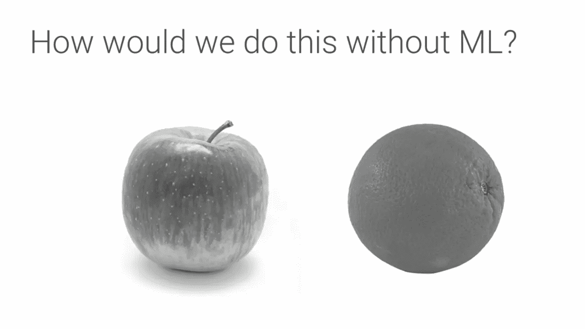
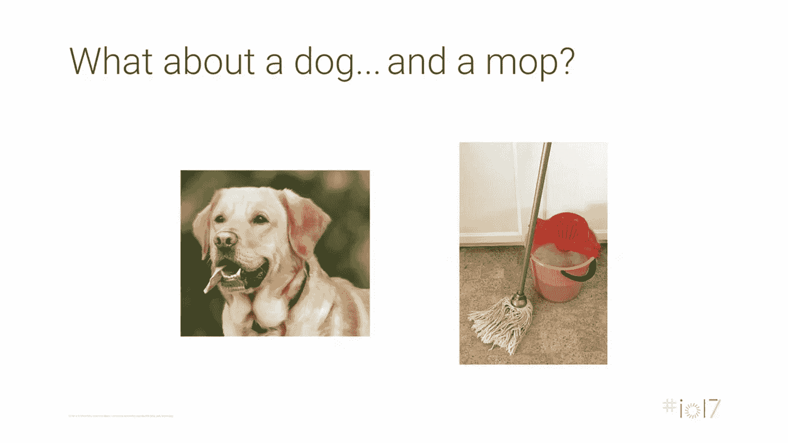
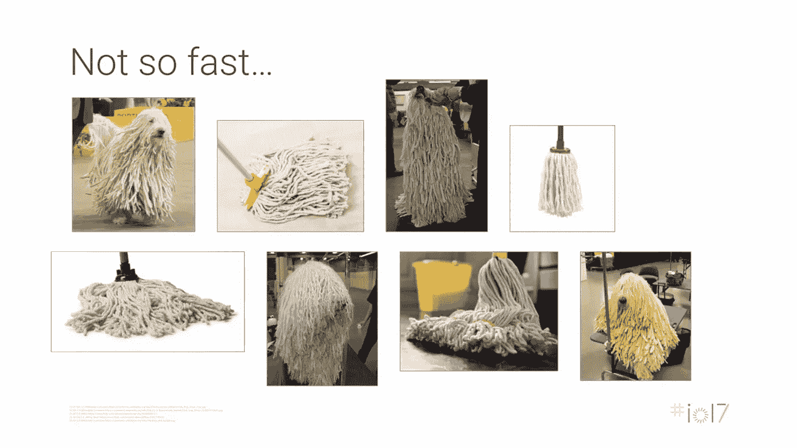
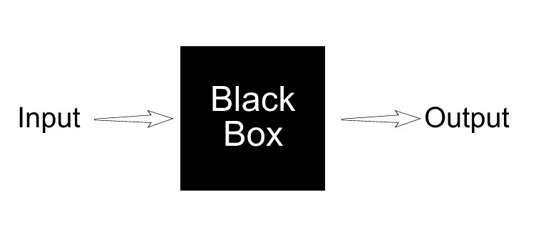
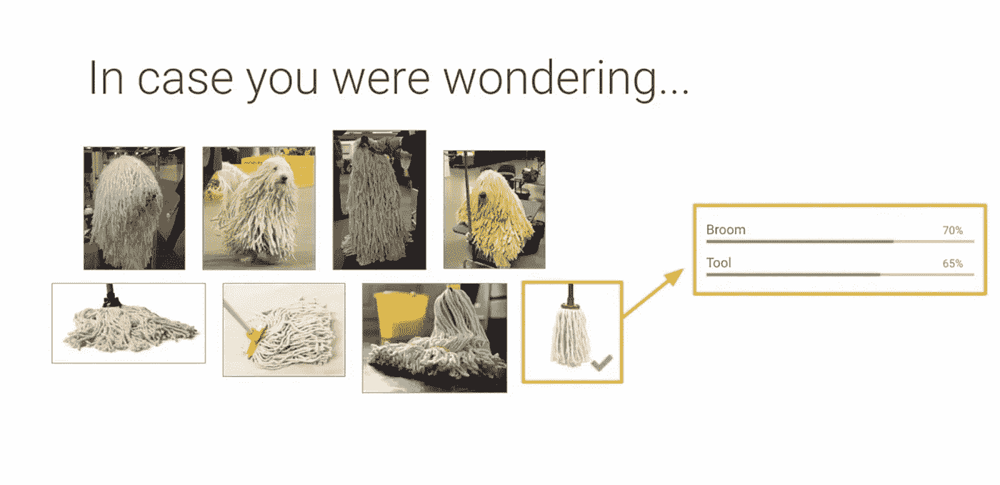

# 为什么机器学习是为了实现人工智能？“对机器学习的需求”

> 原文：<https://medium.datadriveninvestor.com/why-machine-learning-for-achieving-artificial-intelligence-the-need-for-machine-learning-c69667b4a51f?source=collection_archive---------1----------------------->

尽管人工智能可以通过多种方式实现，但为什么机器学习比其他方法更有优势？(初学者必读)为什么叫机器学习？

> 我不相信盲目地学习东西，所以我们将从为什么每个人都在人工智能中使用机器学习来更好地理解开始。
> 
> 现在让我们假设我们可以对识别水果中的所有属性进行编码，其中每个函数都包含传统编程中列出的属性。

继续，把财产列出来。下面列出了一些常见的属性:

1.  ***颜色***:***红色***——***橙色*** ”
2.  ***形状***:***不完全圆***——***圆*** ”
3.  ***梗存在***——***梗不存在*** ”

更多的财产，对吗？？(**如果你有更多的财产，现在就在脑海中或纸上列出来**)

现在考虑如果下图，如果图像是黑白的呢？？？(第一个列出的房产现在已经没用了)

现在让我们只考虑苹果。

apple 100% sure

容易识别对吗？？？**苹果 100%**

不要太快…

Failed in identification

> 那么你列出的所有房产现在都有效了吗？？？

所以不可能，或者换句话说，不可能在所有可能的维度上列出所有需要识别的属性。

有些人可能会提出这样的问题，这些太相似了，无法分类，给我们一个简单得多的分类任务…

好吧，看看这个…

# 很容易分类，对吗？？？

dog vs mop

easy right?

dog vs mop

现在我们都同意需要比传统的函数属性列表更好的方法，所以现在需要一种不同的编码方法，我们有了机器学习来拯救我们。

ML to rescue

> 既然我们都同意需要机器学习，现在让我们从机器学习开始。

# 在我看来 ML 是什么？？

ML in a nutshell

虽然它是一个模糊的 版本，但黑盒可以被认为是我们的大脑，我们需要在那里输入桔子、苹果、猫、狗、拖把等的图像。也告诉输出这些图像，并训练它。

就像一个孩子如何通过看图片来学习一样，我们教孩子一个物体是什么，而不是马上告诉他们属性。当给出训练输入中不存在的完全不同的图像时，它仍然应该相应地识别它。

在狗对拖把的情况下，识别考虑给它各 10，000 个图像，并分别显示为狗和拖把。现在，在它被训练之后，如果给定一个在 10，000 个训练图像中完全不存在的新图像，它仍然必须正确地识别它。

这里显示了每个图像(输入)的答案(输出),但是当给出一个新图像时，它仍然必须正确地将它识别为一个人。孩子们在看过很多次狗的图片后，当他们看到一只新品种的狗时，仍然会把它认作是一只狗，这就是这里的全部概念。

如上所述，识别每个图像的属性由算法本身完成，而不是手动编程。 ***机器正在自我学习*** “这里我们只是为训练提供数据。

> **对机器学习这么感兴趣了吗？？明白为什么叫机器学习了吗？？**

check the multi-labels broom and tool

failed in two cases

我们在这里可以看到，这个模型在 8 个案例中有两个失败了，但是让我们放松一下，我们甚至很难确定它们，所以它在识别方面做得很好，你不觉得吗？

鸣谢:谷歌人工智能主题演讲。

> 接下来，我将在 5 分钟内展示 ***机器学习实现示例*** 接下来，请确保关注我的****，**[**LinkedIn**](http://www.linkedin.com/in/chethankumargn)**，**[**Twitter**](https://twitter.com/chethan1gn)**，**[**insta gram**](https://www.instagram.com/data_science_by_chethan/)**以获取更多更新。****

****在这里加入我们的 [**WhatsApp**](https://chat.whatsapp.com/LLwBIyYYcABEV31ZFI7QR3) 社区。****