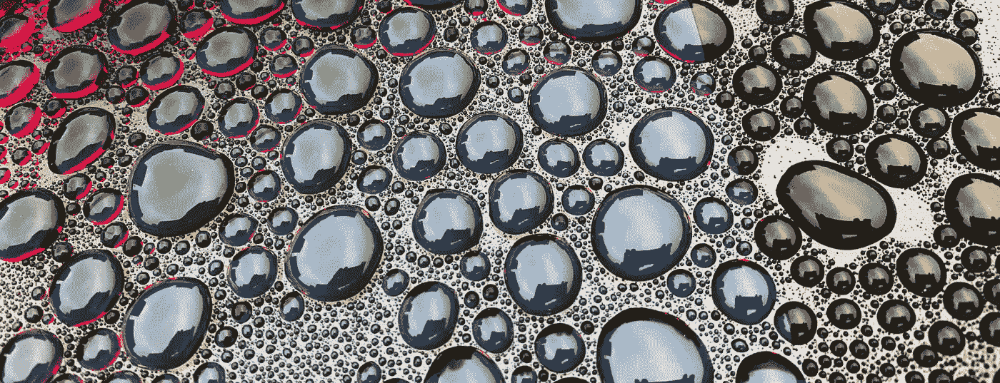
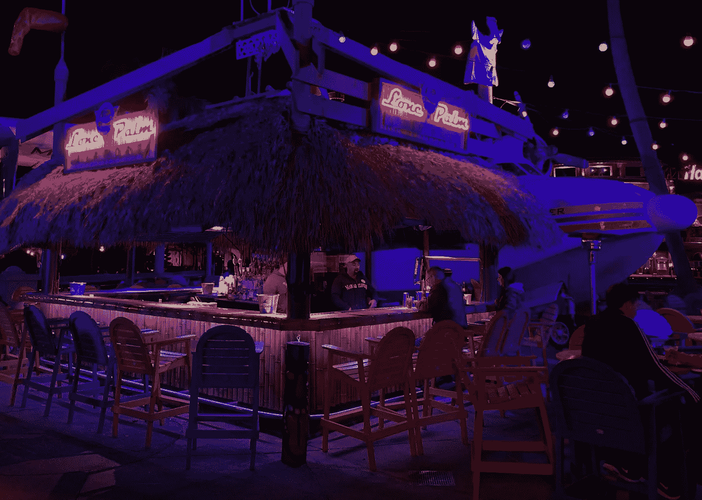
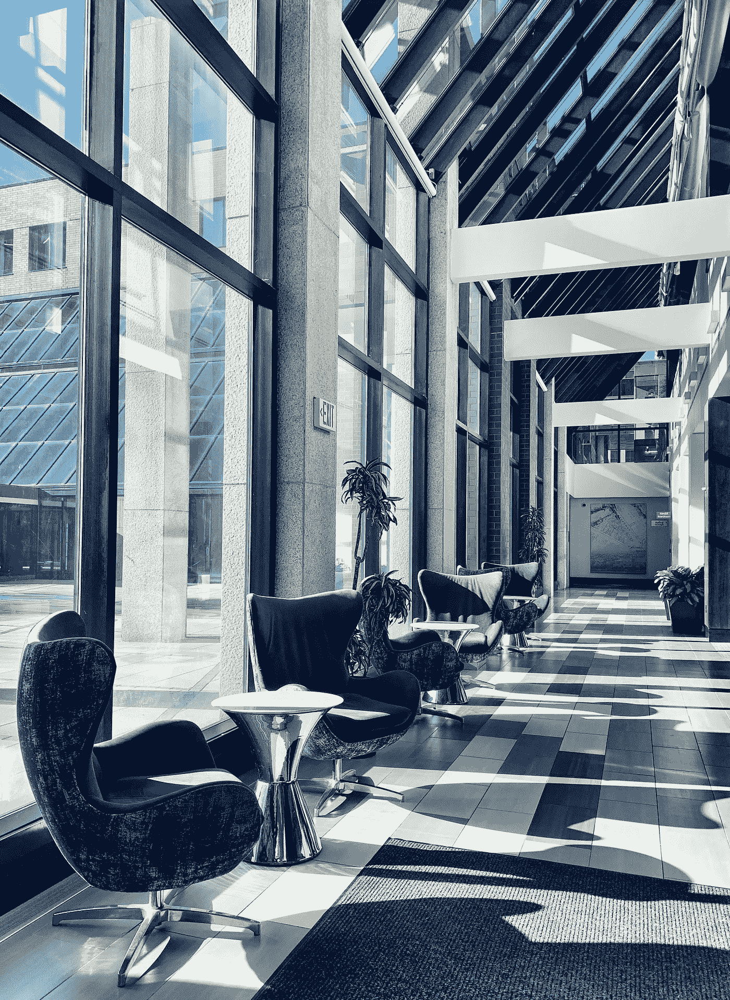

# 为什么机器学习对摄影的未来如此重要

> 原文：<https://medium.datadriveninvestor.com/why-machine-learning-is-so-important-for-the-future-of-photography-135437e66a8d?source=collection_archive---------1----------------------->

这是一次尝试，旨在澄清事实，减少炒作，并对机器学习为何对摄影的未来如此重要这一主题带来一些基本的理解。

我毫不怀疑围绕机器学习的炒作源于一些令人惊叹的成就，其中许多我几乎每天都在使用，但当谈到这项技术如何影响摄影世界时，我们需要更深入地挖掘。这个故事确实始于机器学习领域的最新创新，更具体地说，是支持计算机视觉的机器学习算法。是的，你可以进一步追溯，深入研究上一个机器学习/人工智能“冬天”期间所做的一些工作，但这比我们需要深入一点，以说明为什么摄影的未来取决于这些技术。[《CNET 邮报》的这篇文章](https://www.cnet.com/news/digital-photography-gets-radical-changes-smartphone-mirrorless-tech/)接近于阐明这项技术的未来影响，但缺乏一些现实世界的例子。它的正确之处在于，机器学习和最新图像处理技术最近在智能手机中的结合让我们得以一瞥摄影的未来。

> “机器学习”——赋予“计算机无需明确编程就能学习的能力。”——阿瑟·塞缪尔

最基本形式的机器学习是计算机，或者更具体地说，是一种算法，从提供的数据中学习的能力。这样想吧；你可以通过给孩子看照片来教他们东西是什么样子的，如果你给他们看更多类似物体的照片，他们就可以学习识别一整类物体。机器学习算法的工作方式基本相同(有一些重要的限制，我们将很快讨论)，即向算法显示大量的示例数据，然后它可以“学习”对这些数据进行分类。如果你做得对，经过训练的算法甚至可以对未经训练的数据进行分类，这就是通常所说的“泛化”。因此，这是关于如何构建机器学习世界所谓的“分类器”的超级简单的非数学解释，但要明白这只是这项技术如何运作的皮毛。为了更好地理解细节，为了让你掌握足够多的矩阵乘法和导数，请查看吴恩达在 Coursera 上的[非常受欢迎的系列课程](https://www.coursera.org/specializations/deep-learning)。我已经学习了几门这样的课程，如果你真的想了解机器学习领域正在发生的事情，它们值得你花时间去学习。正如你所料，机器学习确实有其局限性。具体来说，有一个明显的问题是需要足够的数据来训练算法，还有一个不太明显的问题是确保你得到的结果是一致的，特别是在应用于摄影时。

# 进入计算摄影

随着苹果和谷歌推出他们的最新设备，“计算摄影”一词最近受到了很多媒体的关注，但值得注意的是，计算摄影绝不是智能手机的专属。也不是最近才发明的。事实上，基本的计算摄影始于几年前第一台内置图像增强功能的数码相机。事实上，今天销售的几乎每台数码相机都采用了某种基本形式的“计算”图像处理，因为它们必须从数码图像传感器获取数据，并将其呈现为可以使用的格式(如 JPEG，甚至一些原始格式)。一些相机很少处理图像数据，而其他相机，如富士和索尼无反光镜相机，可以模仿旧电影类型和其他令人印象深刻的效果进行惊人的图像增强，所有这些都是直接在相机中进行的。那么，为什么要大肆宣传呢？如果所有的数码相机都内置了一些基本的计算摄影，那么为什么我们现在会听到这么多呢？好吧，真相大多与机器学习和经典图像处理的结合有关。具体来说，在最新一代智能手机中，机器学习与传统图像处理直接结合的新技术的实施让每个人都超级兴奋，这是有充分理由的。

# 机器学习+图像处理=？

那么当机器学习和相机内图像处理结合起来时，我们会得到什么样的结果呢？这么说吧，这就是奇迹发生的地方。为什么？让我们跳回到我们之前的分类器讨论，机器学习算法能够将照片分类到各种类别。想象一下，我们现在可以使用相同的算法将照片分类成不同的场景，例如:风景、肖像、夜晚、白天等。这种算法会非常准确地执行这种分类*，给相机准确地提供它所需要的正确设置所有的颜色信息、白平衡、曝光和锐化，所有这些都是在拍照时自动进行的。但是等等，如果你能超越仅仅识别场景呢？为什么停在那里？考虑这种可能性；如果我们用同样的算法训练各种场景*看起来应该是什么样子，精确到像素级别，会怎么样？考虑一个典型的不同照明的夜间场景，如下图所示。**

**

*Slightly cropped, but otherwise un-edited image captured from an iPhone XS Max.*

*你有一些非常亮的灯光(霓虹灯)和一些非常暗的场景元素，比如酒吧下面的灯光。由于传感器动态范围的限制(在单张照片中捕捉非常亮和非常暗的区域的能力)，这是大多数相机的经典问题。然而，下面的示例照片没有出现这些常见的问题，所有的照明都是按照人眼看到的样子拍摄的。魔法？不，只是结合了每像素机器学习算法和直接在相机硬件中完成的多个图像捕捉。机器学习模型被训练为知道图像中每个像素的正确发光值*应该是什么*,该模型从拍摄的图像集中选择最接近的匹配，然后将其组合以形成最终图像。不需要魔法，但是结果看起来很神奇。*

# *机器学习+图像处理=能力增强！*

*因此，我们已经确定，通过使用机器学习和高级图像处理，我们可以捕捉场景的照明，以更接近地保留照片拍摄时的样子。这太棒了，但这还不是全部。上面的照片隐藏了另一个秘密，一个不明显的秘密，但几乎和获得正确的照明一样神奇。上面的照片是在 iPhone XS Max 上拍摄的，它有一个微小的传感器，然而图像几乎不包含任何*噪声，尽管图像显示出清晰的运动迹象(人)。这怎么可能呢？光线差，运动，但我们没有看到智能手机照片中常见的典型颗粒状噪声？为什么？正如你可能已经怀疑的那样，答案是机器学习和图像捕捉过程的结合。通过将几幅图像组合在一起，图像处理系统可以消除照片中不运动区域的大量噪声。对于检测到运动的那些区域(通过检查捕获的每帧之间的像素数据)，使用机器学习算法来去除噪声。**

> *想想这项技术在使用更大的图像传感器时会有怎样的表现！*

*让我们回顾一下我们的分析。我们看到了机器学习与多帧图像捕捉的结合如何让我们使用智能手机中包含的 1/2.5 英寸大小的图像传感器拍摄高动态范围和运动的弱光照片，该智能手机具有近乎完美的照明，几乎没有噪声，同时仍然保留了大量细节。花一点时间让自己理解。然后思考这项技术在与大得多的图像传感器一起使用时会有怎样的表现，大概是在前面提到的专用相机中。主要相机公司可能还需要几年时间才能真正开始实施这种技术。为了支持今天的机器学习算法，他们需要增强相机的计算能力，*但想象一下可能性吧。**

**

*Another example iPhone XS Max photo showing how much dynamic range has been captured in the shadows. Edited in Snapseed to make it easier to see the shadow detail.*

## *来自 DDI 的相关故事:*

* [## 数据科学和软件工程哪个更有前途？

### 大约一个月前，当我坐在咖啡馆里为一个客户开发网站时，我发现了这个女人…

medium.com](https://medium.com/datadriveninvestor/which-is-more-promising-data-science-or-software-engineering-7e425e9ec4f4)  [## 用 7 个步骤解释深度学习

### 和猫一起

medium.com](https://medium.com/datadriveninvestor/deep-learning-explained-in-7-steps-9ae09471721a)*