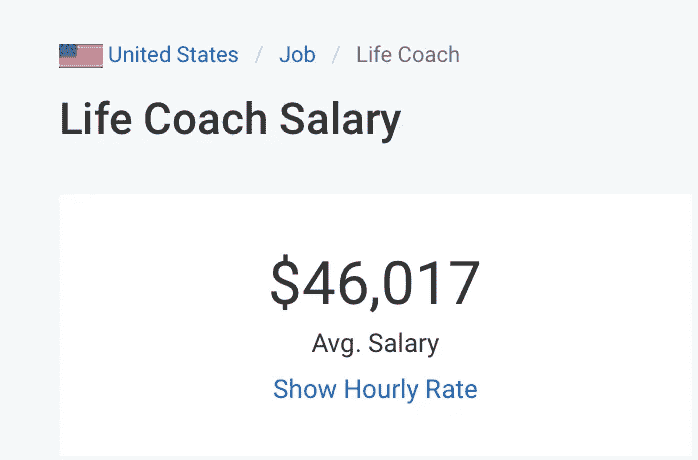
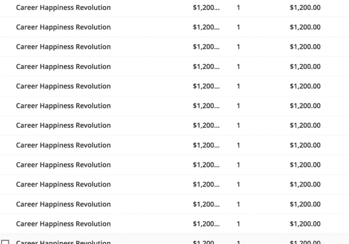
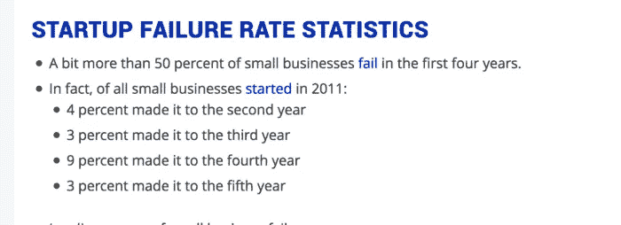

# 为什么许多奇妙的新生活教练失败了

> 原文：<https://medium.datadriveninvestor.com/why-many-fantastic-new-life-coaches-fail-34463f9edb58?source=collection_archive---------7----------------------->

(不是你想的原因)

***注意:我将要分享的内容可能会让你感到有点不舒服，但它肯定会让你获得第一个付费教练客户的时间更长。但是，我保证这会让你更快地找到一群满意的付费客户。***

先说教练为什么会失败。

这听起来耳熟吗？

*“我没钱了，我得回去工作了……”*

*“我想这么做，但是如果我找不到任何付费客户怎么办……”*

“我发了一大堆电子邮件，却一无所获……所以我不得不暂时搁置我的教练事业。我累死了。”

阅读上面的陈述有点像胃部的疼痛。

但不是“我刚坐上过山车，今天过得很开心！”算是吧。

更像是“哦，我的天哪，我正以胎儿的姿势趴在我的沙发上，脸朝前地吃着与抑郁症有关的冰淇淋”。

你有这么多关于教练的梦想和目标，你很兴奋。

但是…

**如果没有发生或者你无法让它工作怎么办？**

你可能知道至少有一个人自称是生活教练，然后得到了蟋蟀作为回应。

教练每天都辞职。

这足以让你觉得几乎没有人能全职做到这一点。

但是你错了。我们来看数据！好事实。

# 事实:为什么你可以全职做生活教练这件事(这很重要)

生活教练是一个价值十亿美元的产业- *就在美国*。这是一张有用的图表，由 IBIS world 网站的热心人编辑，用来观察美国的教练状况。一语双关！:)

注意到什么了吗？

*呈上升趋势*。

在过去的五年里，每年 3.6%的增长率，一个大约 10 亿美元的市场？那可是一大笔钱。

这意味着有足够的空间容纳更多的教练。

像你这样的教练。

# 但是付房租呢？做全职教练真的能赚到足够的钱过日子吗？

这是另一个关于生活教练收入的有用数据，来自 Payscale。

好吧，46017 美元。那还不错。

但是让我们来看看更多的事实，因为事实很有趣！

我也在不同的领域调查过真正的教练的真实收入数字，因为我相信检查我的数据。我使用了我的社区，那里有来自世界各地的 10，000 名教练，以下是我收集到的信息。

**高管蔻驰收入:**每位客户 1.2 万至 2.5 万美元。

蔻驰人寿收入::每小时 100-400 美元，通常换算成每位客户 1000-4000 美元。

*(当我辞去私人教练这一专门帮助人们找到激情的生活教练时，我为美国、英国、加拿大和欧盟的客户服务，每个私人客户能赚 6500 美元。我分享这个作为一个旁白，让你知道我在尽可能地保守，因为我是#真理:)的忠实信徒。*

如果一名高管教练为一名客户赚取 12，000 至 25，000 美元，那么保守地说，你可以为每名客户赚取 15，000 美元。

# 用真人的话来说，如果你每年有 8 个客户，作为一名高管教练，你可以赚 12 万美元。

**每月不到一个客户。**

*注意:我喜欢以月为单位来考虑事情，因为一项业务是建立在经常性收入的基础上的——月、季度、年。要有一个真正的企业，你需要有一个稳定的收入，你可以预测。*

对于生活教练来说，让我们再保守一点，假设你每个私人客户赚 1500 美元。

如果你一个月有三个客户，保守估计，你每个月能赚 4500 美元，每年能赚 54000 美元。在很大程度上，这与工资标准一致。耶数据！

根据美国人口普查局的数据，美国的平均收入实际上是每年 57，000 美元。

所以，如果你每年挣 54，000 美元，你干得不错！

记住，这是保守的。如果你每个月有三个 4000 美元的客户呢？

现在你每年挣 144，000 美元。

鉴于生活指导是一个更简化的销售过程(你不必通过一家大公司说服大量人力资源*和*合同人员)，而且个人购买更便宜，获得客户更容易一些。

我们甚至还没有开始小组辅导或 DIY 在线项目，这些项目可能有巨大的收入潜力。

仅仅从我的职业教练小组项目中的一个项目，我就赚了成百上千美元。以下是我一天的一些销售快照:

所以，深呼吸，恢复元气。我们知道你可以靠这个谋生(耶！).我们知道你有当教练的空间。

# 那么，说真的，为什么大多数教练都失败了？

有很多关于有多少企业失败的统计数据，但让我们仔细看看新的企业数据——这里有一个只针对初创企业的数据，它跟踪了 2011 年至 2016 年的企业:

这些统计数据适用于所有行业。事实上，最近盖洛普告诉我们，至少有 50%的新企业在最初几年失败，但在某些情况下，这个数字可能高达 80%。

我自己大概 7 年前毕业于一个 30+的生活教练班。据我所知，只有两个人仍然以教练的身份挣着可观的收入。

其余的呢？

嗯…回到他们之前做的事情。很少有人能做到全职，大多数人几年前就放弃了教练工作。

问题？

# 这是令人不舒服但非常有用的一点:

他们做了显而易见的事情。

他们专注于立即获得付费客户。

我知道！你在明智地点头。

不，我开玩笑的。你可能会说:“嗯，这正是他们应该做的。他们需要客户做生意，养活自己。”

但是如果这是他们应该做的，为什么他们没有更成功呢？

这就是为什么看似合理的想法实际上是错误的…

[→继续](https://coachpony.com/why-coaches-fail-part-2)

**吃巧克力时要记住的要点:**

1.  教练仍然是一个成长中的行业
2.  所以有空间给新教练，比如你自己(耶！你看起来很棒)
3.  此外，通过创造稳定的客户流，还有机会获得相当合理的收入
4.  但是，专注于立即获得付费客户是新教练失败并放弃辅导的一个重要原因(稍后会有更多)