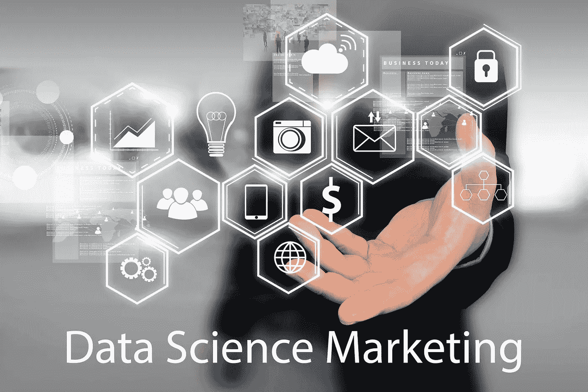
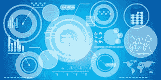
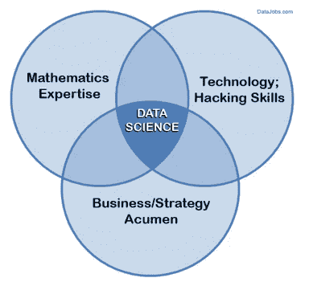
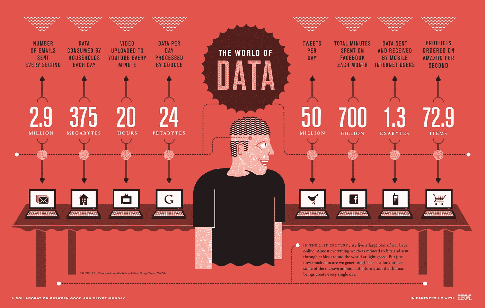

# 为什么营销人员应该像数据科学家一样思考(以及如何去做)

> 原文：<https://medium.datadriveninvestor.com/why-marketers-should-think-as-data-scientists-and-how-to-do-it-5d85ee63d4fb?source=collection_archive---------4----------------------->

你的公司现在可能不会雇佣数据科学家。你可能不会介意。但是，请考虑一下，如果你没有和数据科学家一起工作，或者至少没有像数据科学家一样思考，那么你就缺少了一些东西:说“我知道”而不仅仅是“我认为”的能力。

内容营销顾问卡特里娜尼尔(Katrina Neal)表示，当你与高管交谈时，这种区别很重要。“如果你走进下一代数据驱动型组织的一个会议，宣布‘我认为这场运动将会成功’，你可能会在同事面前受到羞辱，并被要求离开房间。另一方面，如果你带着你所知道的走进去，人们会倾听。他们甚至可能批准你的预算。

# 为什么数据科学在内容营销中很重要？

我喜欢数据科学的这种直白的定义:以一种有助于“让公司做出更明智的商业决策”的方式使用数据“浮现隐藏的洞察力”的实践。

更明智的商业决策来自更好的预测。作为一名营销人员，当你像数据科学家一样思考时，你会做出让股东更高兴的预测，你会让客户更高兴，你会增加对你职业的尊重。您的内容团队做出更好的决策，您为您提出的内容计划建立支持，您的公司从其内容中获得更多价值。

社交媒体在当今世界的广告和营销中发挥着巨大的作用。每条推文、脸书邮报和 Instagram 图片，无论是来自你的公司还是来自你的客户，都包含了一座数据金矿。使用[情绪分析](https://www.datascience.com/blog/game-of-thrones-data-driven-recap-of-season-6)，您可以发现您的客户对最近的活动、公告等的感受，而无需花费时间通读每篇帖子。通过发现分析，你可以更好地了解社交媒体世界中谁在谈论你的业务，哪些高知名度的用户在谈论你的竞争对手。

仅在今年，美国预计将吸收 [19 万名数据科学家](https://content.pivotal.io/blog/mckinsey-report-highlights-the-impending-data-scientist-shortage)的缺口——这还不包括利用信息大数据供应所需的 150 万名分析师和领导者。

在营销界，这是一个特别可怕的前景，数据科学提供了信号，让营销人员知道他们的决定已经得到了回报。“最终，分析不会告诉你下一个伟大的创意，”德雷克塞尔大学市场营销学助理教授 Elea Feit 说。“它会告诉你*什么时候*下一个大创意正在*运作*。”

你不知道的会伤害你

拥有丰富的知识是一个巨大的优势——直到你的知识超越了其他人的理解。如果人们不知道如何应用重要的信息，这些数据就毫无用处。

这就是数据科学对营销等式如此重要的原因。超级数据科学(SuperDataScience)的创始人兼首席执行官基里尔·叶列缅科说:“最强大的数据科学家是那些在见解和人之间充当桥梁的人。“分析背后有一门科学；然而，交流见解是一门艺术。”

跨越这条线非常重要，因为数据科学洞察与营销结果息息相关。营销部门被期望量化他们的结果，作为保持他们的预算和战略不变的理由。营销人员在他们的活动中处理数字信息，并收集这些信息来改进他们的策略，这增加了对数据科学的需求。

# 总之，什么是数据科学家？

数据科学家是指精通数学、技术和商业的人，如下图所示:

# 数据科学家如何帮助你？

数据科学家(或数据科学思维模式)可以帮助您规划内容、优化您创建的内容，并通过使用多种技术和统计模型构建预测模型来衡量您的结果。

# 例如，LinkedIn 对赞助内容(feed 中的原生广告)进行了 A/B 测试，以确定“指南”和“电子书”哪个词表现更好。使用“指南”的帖子有 95%的点击率。在类似的测试中，“注册”比“加入”高出 165%。

# 测试和学习，这就是你要做的。

# 直到下一次，

# 曼亚

# **可以在** [**Linkedin**](http://www.linkedin.com/in/manjabogicevic/) **或者** [**Instagram**](http://www.instagram.com/manjabogicevic/) 上关注我