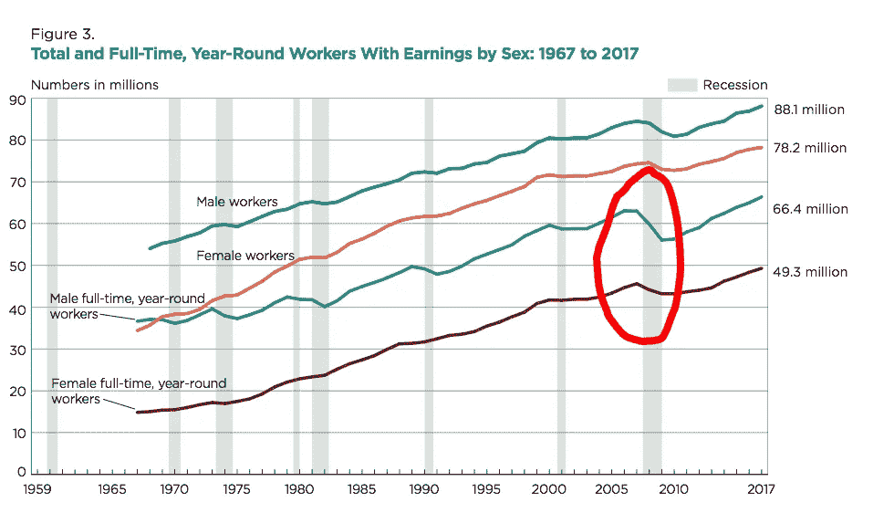
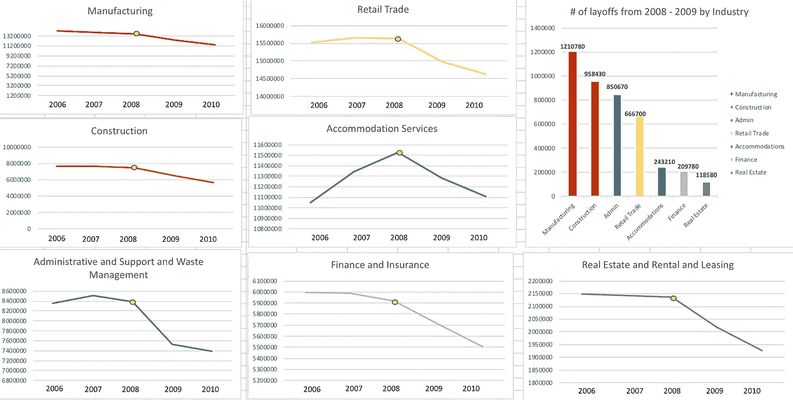
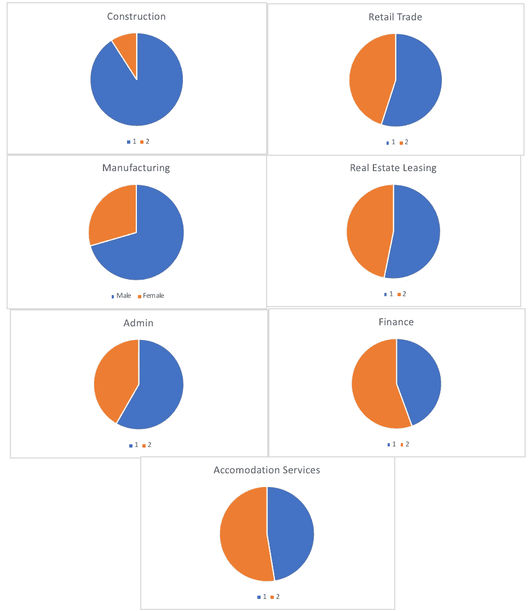
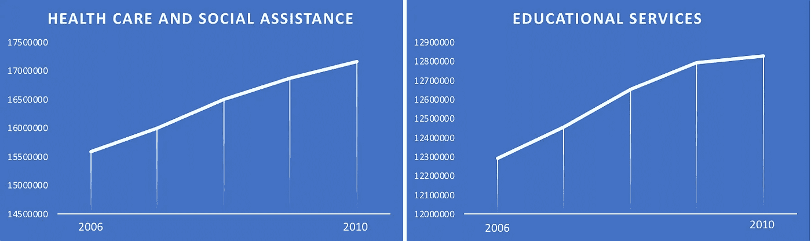

# 为什么 2008 年男性失业人数比女性多——一个深度数据挖掘。

> 原文：<https://medium.datadriveninvestor.com/why-men-lost-more-jobs-than-women-in-2008-a-deep-data-dive-2524df6aa064?source=collection_archive---------4----------------------->

美国与就业率有着复杂的关系。有时我们很兴奋，有时我们对来电按下忽略键——这是一件非常激情的事情。2008 年，美国付出了艰辛的努力，但它赢了。截至 2008 年底和 2009 年初，美国失业总人数达到 260 万，这是自 1945 年二战结束以来的最高年度降幅。

200 万人某天醒来，朝九晚五无处可去。他们没有薪水，也没有好的解释。他们被劳动力绑架了。2008 年对每个人来说都很糟糕。但是——对女人来说没那么可怕吗？

看看下面这张来自美国人口普查局的图表:

Source: U.S. Census Bureau, Current Population Survey, 1968 to 2018

该图描述了劳动力市场上每年全职男性员工的数量(蓝线)和女性员工的数量(紫线)。我已经在图表上圈出了一个特定的点。这是 2008 年，你可以看到劳动力市场中男性的数量急剧下降，但是女性的就业人数下降的并不多。我的问题是:**为什么？**

# 理论

此时我必须回答的问题是:在 2008 年至 2009 年间，什么会导致解雇的大部分是男性而不是那么多女性？

为了回答这个问题，我不得不求助于数据，确定在那段时间里发生了什么。在做了一些研究后，我发现某些行业存在大规模裁员，所以我提出了一个理论:

我的理论是:2008 年失业的男性多于女性，因为经济衰退对男性主导的行业的打击比对主要雇佣女性的行业的打击更大。

**证明**

现在我需要证明我的假设是正确的还是不正确的。这里的步骤是双重的。首先，我需要收集金融危机之前、期间和之后美国总就业率的数据。这将告诉我哪些行业因经济崩溃而裁员最多。接下来，我需要收集这些行业雇员的性别数据。如果我是正确的，失业率最高的行业将主要雇用男性，这就是为什么在 2008-2009 年男性失业率如此之高，为什么女性没有受到如此严重的影响。

# **调查结果**

看看下面的图表。每张地图都显示了美国人口普查局 2006 年至 2010 年按行业划分的总就业数据。

Total Employment By Industry By Year

右上角的条形图显示了 2008 年至 2009 年各行业解雇的员工总数。例如，制造业一年就有 1210780 名员工被解雇。*一年之内！这太疯狂了。*另一个例子——同样是在短短一年内，958，430 名雇员从建筑行业下岗。值得注意的是，这些行业都可以在某种程度上追溯到投资/房地产市场，教育和医疗保健等行业在 2008 年至 2009 年期间实际上有所改善，这并非巧合。

**把它带回家**

因此，我们知道哪些行业受到的冲击最大:制造业、建筑业、垃圾处理业、零售业、住宿服务业、金融保险业、房地产业和租赁业——但是男性和女性之间的差异呢？查看下面的图表:

Male Vs. Female Employment % By Industry

正如你所看到的，在受打击最严重的行业中，大多数是由男性员工主导的。由于经济衰退，这些行业的公司雇主不得不解雇一批员工，他们被迫解雇男性，因为几乎他们的全部劳动力都是男性。另一方面，妇女主要在社会援助和教育等行业就业。

Total Employment By Industry By Year

如果你看一下上面的图表，你会发现这些行业实际上在 2008 年金融危机期间蓬勃发展，因此在男性被解雇的同时，更多的女性被雇用，这导致了我们在第一张图表中看到的男性和女性就业率的非均匀下降。

# 结论

我不是经济学家，我甚至不太记得 2008 年的金融危机。我对数据很着迷，喜欢用它来解释有趣的异常现象或回答重要的问题。在这里，我真的想知道为什么这么多的男人比女人更容易失业。可能是任何事情:也许女性太擅长她们的工作而不能被解雇，也许法律禁止雇主解雇女性，或者也许女性不在受影响最大的行业工作。数字永远会告诉我们真相——这就是为什么我喜欢用数据来讲故事。