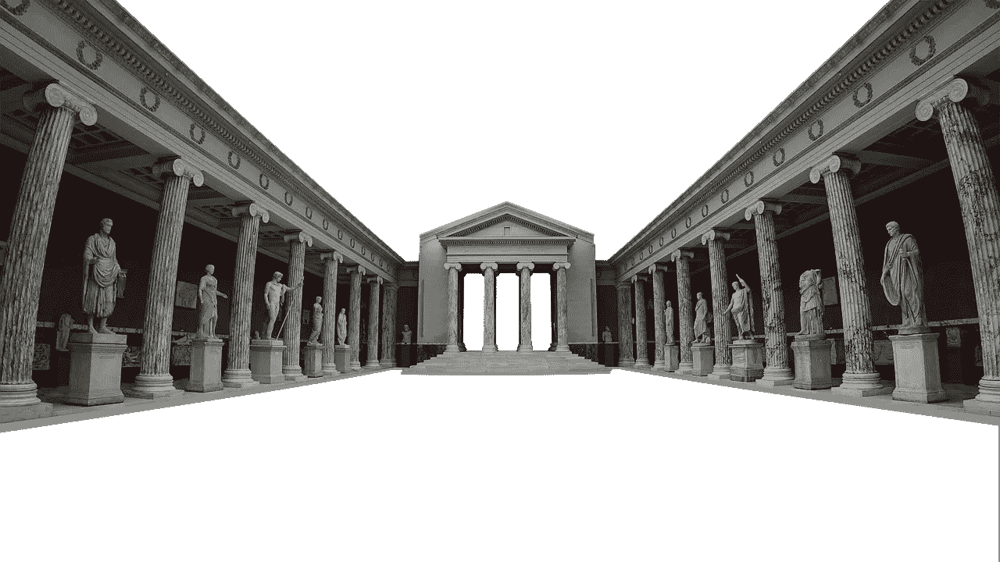

# 为什么导师是你成功的秘诀

> 原文：<https://medium.datadriveninvestor.com/why-mentors-are-the-secret-to-your-success-ab7390da65c2?source=collection_archive---------7----------------------->

我们学习的方法正成为一个更重要的课题。心理学和神经科学的新见解为创新学习和提高学习效率打开了许多大门。科技让每个拥有智能设备的人都能以最低的成本获得世界一流的教育。

今天，似乎阻碍人们变得更加见多识广和更加聪明的唯一因素是缺乏个人动力，没有浏览大量可用信息的策略。

激发你的学习动机和制定学习策略的一个很好的策略是找一个导师；某一领域的领域专家，他已经取得了你想要的成就。导师“削减脂肪”——这意味着他们通过最相关和最重要的概念来指导你，从而不会让你不知所措，但最终会让你更有技能和能力。

表现出色的人会利用导师和教练来获得超越自己的视角，从而提升自己的水平。

# 古代教育简史

The semantics of ancient education

在公元前 3100 年之前，信息是通过口口相传和学徒的方式传下来的。孩子们通过玩耍和积极从事家庭行业(典型的是农业)来学习。人类学家说，狩猎-采集群体的儿童无法区分工作和玩耍，因为所有与世界的互动都是新的和令人兴奋的，刺激了人类对新奇事物的基本需求。随着社会开始扩张。村庄变成了城镇，变成了城市，变成了王国——人们需要能够相互传递信息，以保持国家的稳定和发展。这就是为什么大约公元前 3100 年埃及人和巴比伦人发明的书写是唯一最重要的事情，让人类走上了成为认知动物的轨道——通过知识掌握环境、思维和生活的物种。

书写用了很长时间才变得广泛。这并不奇怪，因为学习写作很难。

## 进入学校系统

人们需要开始将写作技能融入日常生活，因此他们开发了一个系统，要求儿童参加正规教育以获得这些技能。“老师”的荣誉授予了宗教领袖，他们是法庭上的书记或寺庙里的牧师。这意味着教育围绕着社会的宗教教义——理解圣书，能够记忆它们，并在某些情况下再现它们。

文字为数学的发明创造了条件，从而导致了商业、航海和占星术的发明。

古希腊人在古代创新了学习，因为他们将教育从他们以前被束缚的僵化的宗教传统中分离出来。他们的哲学是，每个人都应该寻求知识和技能，以便成为一个好公民，这样他们就可以为他们的国家服务。这意味着在“课堂”之外，保持宗教性和灵性是学生的责任。

例如，斯巴达人被要求精通体育艺术，雅典人被要求精通和平与战争的外交和法律艺术。所有的教育都必须适合国家的目标。

一旦你到了 14 岁，你的教育就结束了。如果你想接受“中等”教育，你必须在一位哲学家的指导下学习。

# 正规教育是政治的，导师是个人的

我们看到，正规义务教育是政治性的。这意味着它最终是为了国家的利益，而不是个人的利益。国家需要不断培养有技能的人力资源来支撑经济，让经济保持活力。

个人的学习目标被限制在他们认为会获得最大快乐的领域。这意味着人们并不是真的想学习更多，他们只是想学习足够让他们现在快乐和保障他们的未来。简而言之，更多的知识不会让你更快乐，或者更有效率，但是正确的知识会让你更快乐。

正式的学习是重要的，但仅仅是因为它提供了基本的知识水平。如果你想在“课堂”之外成长，你必须寻找在特定领域比你更有经验的专家。这是一种久经考验的方法，证明有才华的个人如何成为未来令人惊叹的创新者。

# 导师是缺失的一环

如今缺少的是与导师的接触:那些以实用的方式实践知识，并能综合信息以适应我们生活的专家。

导师是裁缝，他们不会给你飘来飘去的信息，而是给你定制的知识，你可以在你的业务、工作和互动中使用。他们是通过冒险获得成功的专家，获得了宝贵的经验，并将其知识综合到行动、方法和系统中。所以，当别人已经开辟出一条可行的道路时，你为什么要从头开始。

# 我们天生就喜欢分享信息

人们一直以故事、新闻、肢体语言等形式分享信息。

总的来说，我们希望帮助他人学习我们所知道的，因为这增加了他们更有能力的可能性，并最终在需要时支持我们。畅销书作家兼沃顿商学院市场营销教授约翰·伯杰指出，人们分享信息是因为信息的情感价值。

这意味着，如果某件事让你生气、兴奋、大笑或哭泣，你更有可能与他人分享。导师的问题在于，他们已经找到了一种对他们有用的方式，这种方式让他们的生活变得更好——这种信息与积极的情绪效价相关联，这意味着他们希望与你分享这种信息。所以，不要羞于走出去请别人做你的导师——你潜在地满足了他们与你分享信息的生理需求。

# 如何找到优秀的导师

当你出去寻找导师时，有几件事你需要首先考虑:

## **1。你想改善什么具体的事情**

你的导师不应该是“万事通”。他们应该是在你努力提高的关键领域有专业技能的人。

## **2。我能为他们提供什么来回报他们的专业知识**

不要指望导师会冲向你，免费提供他们宝贵的时间。向导师提供价值的形式可以是报酬、服务、帮助或你能提供的任何其他附加值。看看你是否能达成一个双方都友好并对结果满意的安排。

## 3.**寻找代理导师——你现在可以接触到的人**

在你的人际网络中寻找那些正在实现你想要实现的目标的人。他们不一定要在游戏的顶端，但他们需要比你走得更远。如果你以这种方式开始，你可以利用你的代理导师网络——记住要为你的代理导师提供价值。你永远不知道，在接下来的几年里，他们可能会在他们的游戏中处于领先地位。你希望将来有这样的人站在你这边。

女性往往更难找到导师。这是因为高级职位中缺乏女性代表。对我来说，这是一件大事。[卓越女性](https://www.theremarkablewoman.com.au/)的成立是为了将有成长意识和抱负的女性与行业专家配对。在这个地方，你可以不受限制地接触到各自领域的领导者。更重要的是，这是一个改变生活的地方:个人的，职业的和经济的。

# 充分利用导师的策略

一旦你组织了一个导师，是时候组织你的互动和开发一个课程了。想想你的未来会有什么样的结果，并深入到你的导师如何带你实现目标的实际层面。

## **1。预定定期聚会**

每周与你的导师会面应该是你与他们互动最多的时间。

## **每次会议只谈一个问题**

你不想被压倒。你希望记录下重要的观点并采取行动。

## 3.**要求残酷的反馈**

你导师的工作是鼓励你，但不一定是“感觉良好”情绪的来源。你想要可能会伤害你感情的真实反馈，因为它会在你的职业生涯、商业、人际关系和生活中帮助你。

## **4。谈谈心态**

成功人士在他们的“心理卫生”上花了很多时间。这意味着他们知道如何建立精神力量来应对挑战和失败。别忘了问问你的导师他们处理这些情况的心理策略。

## **5。指定导师-学员关系的截止日期**

这听起来可能很奇怪。但是，一个伟大的导师或教练应该想办法走出你的生活。他们不想成为你生活中的支柱，他们应该想给你工具和策略，这样你就可以自己建立支柱。告诉你的导师你想要实现什么，你希望他们帮助你在规定的期限内实现。这告诉你的导师和你自己，你是认真的，你的努力和关注正朝着一个特定的目标前进。

对于正在努力奋斗的人来说，找一个导师是一个值得你投入时间的地方。

# 即将举行的活动

***加入到塑造未来的女性领导者中来。***

[点击此处](http://theremarkablewoman-com-au-4687458.hs-sites.com/glass-breakers-the-remarkable-women-talks-event)查看我们的活动详情。

***加入我们的脸书***

加入我们的[私人脸书集团](https://www.facebook.com/groups/trwprivategroup/)，接触有抱负、有成长意识的女性。