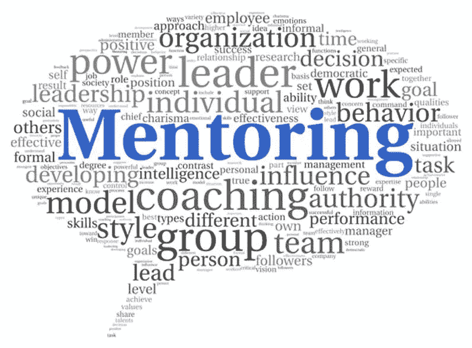
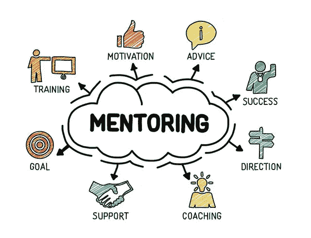
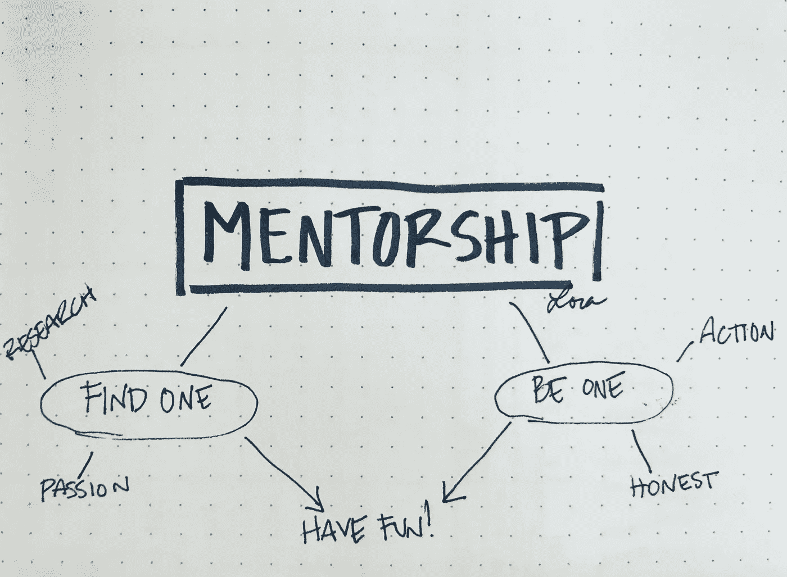

# 为什么导师正是你成功所需要的？

> 原文：<https://medium.datadriveninvestor.com/why-mentorship-is-exactly-what-you-need-for-success-46e8e90fdf4b?source=collection_archive---------2----------------------->

这正是每个创业者在创业之初所需要的吗？

作为一名创业者，我可以毫不犹豫地说，导师是我们鼓励自己走向成功的最重要的阶段之一。

导师是已经在那里的人，也就是你此刻所在的地方。他们已经看到了你所看到的，甚至更多…他们已经想到了你现在正在做的事情。那么，为什么我们需要犯同样的错误并且落后一步呢？为什么我们要寻找一个完美的联合创始人呢？

不幸的是，并不是所有成功的企业家都愿意承认他们曾经得到过更有经验的人的指导。然而，对于那些聪明成功的企业家来说，这已经足够了，他们乐于分享他们的经验，并随时准备为你的成功之路提供建议。

我想说的是，最成功的科技创始人在成功之前都接受过指导。例如，马克·扎克伯格(facebook)是史蒂夫·乔布斯的导师。史蒂夫·乔布斯的导师是迈克·马尔库拉(苹果的早期投资者和高管)。埃里克·施密特指导了谷歌的拉里·佩奇和谢尔盖·布林。

坦白说，作为一个机构创始人，我以前从来没有想过要有一个导师。目前，在我进入一个领域 3 年后，我意识到在这个领域有一个商业导师应该是第一要务。

这就是为什么我决定分享我对拥有一个导师的重要性的看法。

# 1 你得到的是真实的体验，而不是理论。

对于任何领域的任何专家来说，经验是最宝贵的财富，这已经不是什么秘密了，如今，经验是取得商业成功的关键。

不幸的是，仅仅遵循书本上的指导或建议不足以获得成功。大多数的个人经历可能过于亲密，这就是为什么通常不分享的原因。但是，给出真实的案例以及如何应对——这是一个没有经验的创业者职业生涯中的有力武器。

这就是为什么唯一的导师是唯一保证成功的关键。

# 2 增加和导师在一起的机会。

根据最近在商业领域的研究，我们可以证明拥有一个导师是成功的关键因素。

大约 80%的首席执行官表示，他们得到了某种形式的指导。93%的初创公司承认，导师对成功至关重要。

有一个合适的导师可以增加你在生活和商业中成功的机会。有价值的联系、及时的建议、不定期的检查——再加上你将从导师那里获得的精神和道德指导——将会真正帮助你走向成功。

# 3 专业针对性联网。

除了投资者通常信任那些由他们的朋友推荐的创业公司，我们必须记住，我们的导师可能有他的业务关系。而且要确保一个成功的导师有一个庞大的可以让你的职业生涯受益的人际网络。既然他们已经参与了你的业务，在必要的时候让你进入他们的投资者网络和有用的关系网是有意义的。

这是一个没有导师的机会。

# 4 在生意场上保持冷静和自信。

有一个尊敬的导师，他实际上指导你，并与你分享他的预测和期望，这些期望通常与他们多年的经验有关——这正是鼓励你并确保你成功的原因。

自信是企业家精神的孪生兄弟。据《每日电讯报》报道，拥有高度自信比天赋和能力更有助于职业成功。

我会说，有经验的导师应该领导和帮助年轻的创业者挖掘他们的自信，并将每个挑战视为机遇。

# 5 在企业中呆得更久。

如果你想知道失败企业的数量，你可能会建议企业主拥有导师。

根据小企业管理局的研究，30%的新企业可能撑不过头 24 个月，其中 50%撑不过头 5 年。然而，接受辅导的 70%的企业肯定能存活 5 年以上。这意味着拥有一个商业导师能增加你 70%的商业成功机会。

# 6 开发你的情商。

情商或情商是创业成功的关键因素。一个年轻的企业家和一个成熟而成功的导师作为他的顾问，这是一个完美的组合，可以达到很高的情商水平，并使情绪控制过程更容易。

对于任何人来说，将情感和商业混为一谈注定会失败，这不是什么秘密。让你自己或你的同事基于情感做出关键决定——这是商业史上最大的错误，你的导师可能会保护你免受其害！

# 7 鼓励自己成为领导者。

重要的是要承认，你自己的失败保护会阻碍你，影响你的生产力。在这些困难时期有一个导师肯定会帮助你继续为你的商业想法奋斗，并保持高昂的头。当年轻的企业家无法达到目标和期望时，他们经常不得不面对沮丧。抑郁症对企业家生活的影响经常被低估。

然而，对于有导师的企业家来说，这比没有导师的企业家更容易应对抑郁情绪，保持自我激励。接受过指导的商人在失败时挣扎得更少，因为他们有专业的支持，而其他人却不得不独自承受最大的压力。

简而言之，除了分享正确的话语之外，经验丰富的导师也会有一些优秀的想法来帮助你走向成功。

# 参考

1.  [桑格和斯里瓦斯塔瓦，2012 年](http://connection.ebscohost.com/c/articles/72081226/employee-engagement-mentoring-empirical-study-sales-professionals)
2.  Kutlik，c .，& Roberson，L. (2008)多样性计划的有效性:组织可以(和不可以)从多样性招聘、多样性培训和正式指导计划中得到什么
3.  [肯尼特&洛马斯，2015](https://www.researchgate.net/publication/272748839_Making_meaning_through_mentoring_Mentors_finding_fulfilment_at_work_through_self-determination_and_self-reflection)

 [## 经济就是包容人|数据驱动的投资者

### 建模，数据，最重要的是，人 Tayo Oyedeji 博士在他的食谱中混合了所有这些成分，为一个…

www.datadriveninvestor.com](https://www.datadriveninvestor.com/2019/03/06/economy-is-all-about-including-people/)