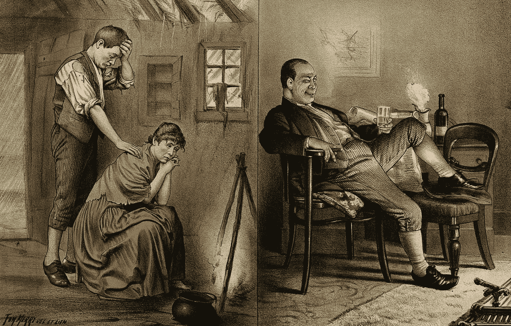
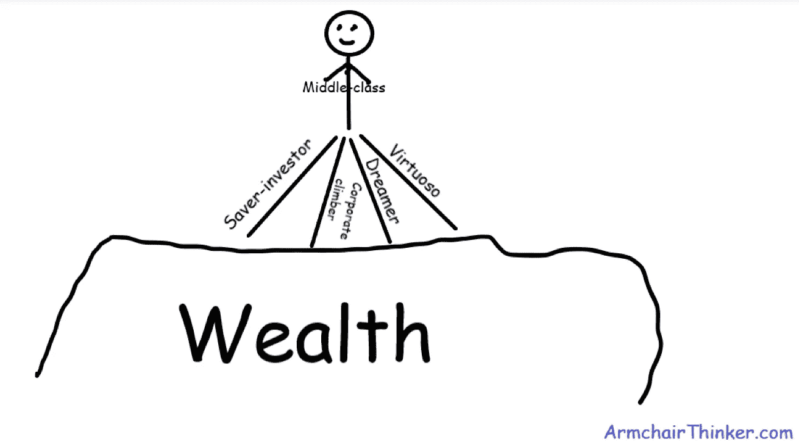

# 为什么中产阶级一辈子都是中产阶级……你能做些什么

> 原文：<https://medium.datadriveninvestor.com/why-middle-class-people-stay-middle-class-all-their-life-and-what-you-can-do-about-it-e7840f27da8a?source=collection_archive---------0----------------------->

Image source: [Wikimedia Commons](https://commons.wikimedia.org/wiki/File:Home_life_of_peasants_compared_to_the_middle_class_Wellcome_V0050345.jpg)

金钱不能解决你所有的问题，但它可以解决大部分问题。

我想你不是百万富翁。我也不是。所以我们在这里——两个中产阶级的人在讨论为什么中产阶级的人永远不会变得富有。

**什么是中产阶级？**

除非他们流落街头，否则几乎每个人都认为自己是中产阶级。

我的父亲曾经告诉我们，我们是一个中产阶级家庭，那时他每月只挣 110 美元₹8,000。十几年后，他的收入增加了 10 倍，但他仍然认为自己是中产阶级。

 [## 外汇投资如何帮助偿还债务|数据驱动的投资者

### 外汇是对外汇市场的投资，不同国家的货币在外汇市场上进行兑换

www.datadriveninvestor.com](https://www.datadriveninvestor.com/2019/02/13/how-forex-investment-helps-to-repay-your-debts/) 

T4 世界银行将贫困描述为每天生活费低于 1.25 美元。这是否意味着任何生活费超过 1.25 美元的人都是中产阶级？不，中产阶级不仅仅是能够把食物放在桌子上。

中产阶级意味着有“足够”的钱来养活家人，买得起自己的房子，建立退休基金，购买汽车，每年休假，部分或全部资助孩子的大学教育。如果你的收入足以做到这一切，你就是中产阶级。

**为什么中产阶级的人会保持中产阶级？**

中产阶级并不是不渴望或梦想变得富有。但是仅仅有梦想是不够的。致富需要一定的习惯、特质和日常活动……最重要的是，这需要很多时间。

为了理解为什么中产阶级的人仍然是中产阶级，我们首先要看看一个低收入或中等收入的人是如何变得富有的。

在为他的畅销书 [*富人习惯*](https://www.amazon.com/Rich-Habits-Success-Wealthy-Individuals/dp/1934938939/)*做研究时，作者汤姆·科利采访了 177 名白手起家的百万富翁和 128 名穷人，以找出那些让一些人暴富的习惯和品质，以及那些让其他人一生都在财务上挣扎的习惯和品质。*

*在他采访的 177 名白手起家的百万富翁中，59%有中产阶级背景，41%来自低收入家庭。*

*科里写道，根据他们积累财富的方式，有四种类型的富人:储蓄投资者、艺术大师、梦想家和企业攀登者。如果你不走这些道路中的一条，你将难以置信地难以创造长期财富。*

**

*Four ways to wealth*

*像律师、医生、艺术家、作家和运动员这样的艺术大师利用他们的天赋、专业知识和努力工作赚了很多钱。但是首先他们要花几年时间学习和磨练他们的技能，并获得更高的学位。艺术大师是他们领域中的佼佼者，这有助于他们获得溢价。*

*梦想家冒着职业生涯、时间和金钱的巨大风险去追求他们的梦想，比如创业。如果成功，他们会以收入、利润或资本增值的形式获得可观的回报。*

*做梦的人为了实现他们的梦想长时间工作，在这个过程中损害了他们的身体健康、精神健康和人际关系。这是一个普通人致富的最艰难的道路。然而，走过这条路并到达另一边的人说这完全值得。*

*此外，还有企业攀登者。就像梦想家一样，他们长年累月地长时间工作。科利说他们早到办公室，晚离开。不像梦想家，他们为大公司工作，而不是为自己工作。他们发展了强大的关系建立和网络技能。他们将全部精力投入到攀登公司的阶梯上，最终获得高级管理职位。在这个过程中，他们会获得股票期权和/或利润分成。*

*如果你不是艺术大师、企业攀登者或梦想家……或者如果你厌恶风险，只有中等收入，你仍然可以通过走储蓄者-投资者的道路超越中产阶级。*

*是的，你可以节省你的财富。事实上，即使是艺术大师、公司攀登者和梦想家也需要学习储蓄和投资的艺术来保护和增加他们的财富。*

***储蓄者-投资者之路很简单，但并不容易***

*储蓄投资是致富最简单的途径，但至少在几十年内需要大量的金融信徒。储蓄型投资者负债很低或为零。他们过着节俭的生活，即使收入不多，也设法将每月工资的至少 20%储蓄和投资。他们很早就开始投资，以充分利用复利。*

*你和其他中产阶级一样，有能力做到这一点。但是我们的习惯和行为阻碍了我们。一旦你有了稳定的收入来源，你就努力向社会证明你很富裕。*

*你想在“变得”富有之前就“看起来”富有。你几乎每天都在几乎每个社交平台上发布浮华的照片……希望这能让你赢得别人的钦佩。*

**先富起来再富也可以。但是你不想等到你真的富有了才开始让*看起来富有。从长远来看，你渴望变得富有的渴望会让你付出高昂的代价。***

*明智地投资你每月薪水的一部分，然后多年积累财富是很无聊的…而且你在未来几年都不能炫耀你的钱。那不是大多数人喜欢的。*

*我们这一代中产阶级擅长赚钱……他们更擅长花钱。但他们中的大多数人对如何储蓄、投资和复利毫无头绪。*

*对他们来说，更重要的是赊账购买最新的智能手机、智能手表、电视、智能音箱和汽车。见鬼，他们买的大部分东西都是贬值的资产。慢慢地，他们发现自己陷入了债务陷阱，最终只能靠薪水过活。*

*然后是一个被称为生活方式蠕变的恶魔，它吞噬了所有的增量收入。随着你收入的增长，你的开销也会增加。*

*中产阶级有这样的习惯，他们提高生活水平的速度与收入增长的速度相同或更快。增加的开支让他们在月底几乎没有钱来储蓄和长期投资。*

*储蓄型投资者对他们的钱很谨慎。他们不会成为保险、银行和金融服务部门销售人员的黑幕的受害者。他们阅读研究，并与专家交谈，以便做出正确的决定。*

*这就是为什么我们大多数人从未超越中产阶级的原因。也许你正处于人生的那个阶段，在那里你无法成为一名艺术大师、企业攀登者或梦想家。*

*但是，开始攒钱致富永远不会太晚。从摆脱债务开始，使你的收入来源多样化，至少在十年内每个月都努力投资。*