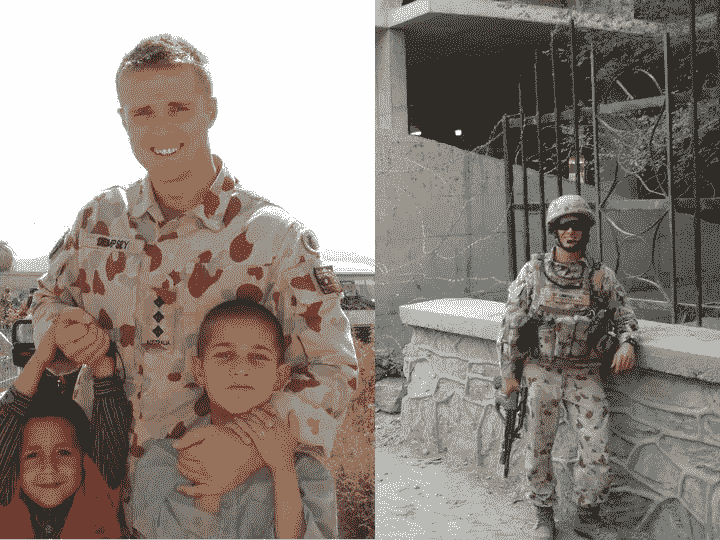

# 为什么退伍军人是优秀的企业家？

> 原文：<https://medium.datadriveninvestor.com/why-military-veterans-make-good-entrepreneurs-c1e0fdc4c279?source=collection_archive---------8----------------------->

如果你是退伍军人，并且正在考虑在商界发展新的职业，那么你需要考虑很多事情。从为你的新企业提供资金到寻找员工，再到决定最佳的启动地点——这三点只是冰山一角。

作为一名退伍军人，人们经常问我的经历以及我从前线到董事会的转变。毫无疑问，我的[澳大利亚企业家经历](https://www.bizlatinhub.com/meet-the-team-craig-dempsey-entrepreneur/)将与下一个退伍军人的经历非常不同，但我相信我们都有很多共同点——许多可转移的技能可以从陆军、海军或军队的职业生涯中获得，并带回工作世界。下面，我收集了一些最大的…

**他们能处理压力**

虽然我不能说[我创办公司的经历](http://www.theglobaldispatch.com/my-experience-of-starting-a-business-in-mexico-45786/)是一帆风顺的，但事实是，我从以前的角色中学到的许多技能让我能够理解我在运营的最初几个月所面临的挑战和困境。当你在军队工作时，你会习惯于混乱，知道如何处理具有挑战性和时间敏感性的情况。比方说，我需要在一个小时内决定新的合作伙伴，或者竞争对手可能会在我之前抢走他们，或者有一天早上我走进办公室，发现 WiFi 已经坏了，水也关了。我的军事背景给了我冷静的头脑和轻松处理困难局面的能力。

当然，你必须处理的情况类型取决于你想进入的领域。举例来说，如果你打算开一家电子商务公司，那么你面临的挑战可能会比你开一家实体店或者在另一个国家开一家更大的公司要少。计算与你的新冒险相关的风险水平，并做好准备——这并不容易，但有了你以前的生活经验，你可以应付。

**他们能解决问题**

除了处理压力，企业家还应该知道如何解决问题并克服它们。作为一名在拉丁美洲经营的企业主，我帮助企业将创新与可持续发展结合起来，我也经常给人们一些建议，告诉他们在商业中要避免的 T2 错误。作为一个天生的问题解决者，我能够放眼全局，运用我的创造性思维技能来寻找问题的解决方案，并投入到新挑战的深渊中，因为我知道我天生好奇的心态和敢做的态度会帮我度过难关。如果你想成为一名成功的企业家，这些技能是必不可少的。

话虽如此，你并不需要擅长所有事情，尽管军方的态度是尽你所能，“凑合着补”，但事实是，你不应该认为你可以比别人做得更好。知道什么时候后退一步，什么时候雇佣第三方来控制营销、会计和人力资源等任务，并相信其他人和他们的能力。作为一名企业家，如果你的精力过于分散，你就不会发挥出最佳水平，结果你的产出也会受到影响。

**他们知道如何建立关系**

这么多退伍军人创业成功的另一个原因是，他们可以建立无人能及的人际关系。无论你是在前线还是在军事办公室工作，你都会知道退伍军人之间有一种特殊的联系，我们可以和任何人交谈。沟通技巧在创业中至关重要，因为你必须保持警惕，准备好与潜在的买家和客户建立新的关系。

能够在团队中很好地工作还有额外的好处；你可以适应你周围的人，与那些个性和工作风格与你不同的员工和商业伙伴一起工作。无论你是要自己创业，还是需要建立一个团队，能够“召集团队”，给每个人带来成功所需的动力和信心，都会让你与众不同。

最后，能够与其他退伍军人和企业家一起工作是另一个好主意。有这么多成功的军事企业家，事实上我已经帮助许多人打入国际市场，他们已经取得了伟大的成就。加入社交网络和校友团体，看看你的退伍军人同事在做什么——也许他们也在做生意，可能有兴趣与你的公司或新公司合作？

**他们很敬业**

最后，重要的是我要提到奉献精神。当你在军队工作时，你的工作不仅仅是一份工作——它成为了你的生活方式。人们进入这个行业并不是因为他们想获得数百万的报酬——他们这样做是因为他们想成为更大更好的事情的一部分，并做出真正的改变。在很多方面，企业家有相同的价值观和态度；最优秀的企业主不会专注于金钱，而是希望建立或创造一些东西，并以其他人无法做到的方式解决问题。

如果你能把你的奉献和热情用于一个新的行业，你将永远不用工作一天。寻找你热爱的机会，做你的研究，你将能够创建一个企业，不仅为你服务，而且在更广阔的世界中有所作为，帮助消费者或其他企业蓬勃发展。

*从老兵到企业家的转变是一项艰巨的工作，但你可以做到。无论你从事什么行业，我都希望你的事业好运。我做到了，你也可以！*