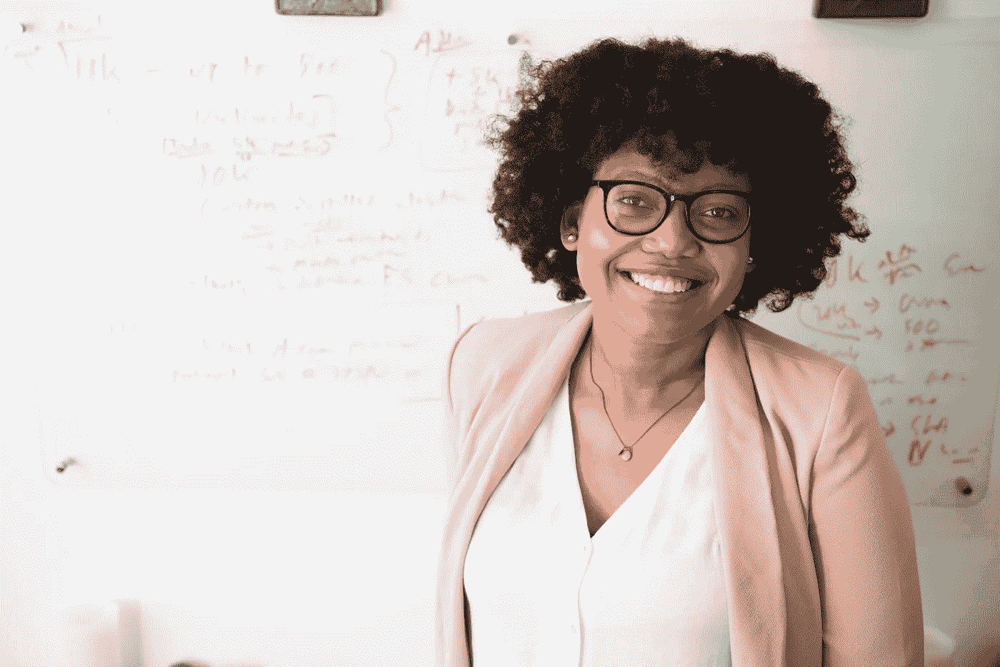

# 为什么千禧一代注定要成为成功的企业家——以及如何利用你自己的潜力

> 原文：<https://medium.datadriveninvestor.com/why-millennials-are-wired-to-succeed-as-entrepreneurs-and-how-to-harness-your-own-potential-e1ac5a0d548e?source=collection_archive---------36----------------------->

千禧一代通常被冠以不好的名声。我们被贴上懒惰、自私、浅薄和有权利的标签。

但我认为，那些接受这种刻板印象的人错过了当前 20 多岁和 30 多岁这一代人前所未有的潜力。在与许多千禧一代的企业家共事后，我发现了许多给我带来巨大希望的特质。

以下是我发现的千禧一代成为成功企业家的三种最突出的方式。

**1。千禧一代讨厌无聊**

…这意味着我们总是乐于学习新事物。开创和经营自己的事业感觉就像从消防水管里喝水一样。我在不断学习——从网站编码到制作视频，从管理团队成员到谈判合同。

如果你是那种将征服一项新技能视为令人兴奋的新挑战的千禧一代，那么创业很可能是你喜欢的类型。事实上，如果你认为你的弱点是改进的机会，而不是确定的状态，你就有了成长的心态。鉴于[千禧一代更有可能参与个人发展](https://blog.fieldagent.net/millennials-boomers-new-years-resolutions-5-key-generational-differences)，我们可以假设我们更有可能有一个成长的心态。

当我们真的相信一切都是可以预测的，并且我们对自己有信心做到这一点时，那么我们的银行存款余额只会受到我们坚持下去的意愿的限制——这是成功企业家的一个关键特质。

**2。千禧一代相信一切皆有可能**

我们的父母告诉我们，我们可以成为任何我们想成为的人，我们是特别的，我们只需要有远大的梦想。

因此，虽然这可能意味着当我们的生活不如我们预期的那样美好时，我们会感到焦虑或沮丧，但我发现我们更有可能抓住一个可以改变我们生活的机会。

这种联系也意味着我们通常有很大的目标。我们不怕把目标定得高，这意味着我们不太可能玩小游戏或“等到我们准备好了再玩”。

有些人会说我们缺乏耐心，但如果建设性地利用，我们实现这一切的愿望现在对一个有抱负的企业家来说是一种强大的驱动力。所以不要让“现实”挫伤你的大梦想。在我们今天生活的科技世界里，几乎任何事情都是有可能的。

**3。千禧一代希望做重要的工作并产生影响**

西蒙·西内克(Simon Sinek)的“找到你的原因”概念在千禧一代中产生了深刻的共鸣。我们知道，如果退休年龄趋势是可以预测的话，我们将在很长一段时间内从事这项“工作”,因此，我们希望感觉自己的时间花得很值也就不足为奇了。

然而，有人告诉我和其他千禧一代，降低我们的期望，努力奋斗，并“停止试图拯救世界”——这让我很生气。我们让世界变得更美好的集体愿望是一股强大的力量。必须驾驭它——决不能压制或贬低它。

这就是为什么我喜欢与千禧一代一起工作，以创造更大的影响——从让严重食物过敏的人生活更轻松，到让无家可归成为一种选择，到建立年轻女性的信心。这些有影响力的个人使命都是需要的，并且可以(也应该)转化为商业价值。

我鼓励任何想感觉自己的工作有目的的人不要否认这种琐碎的欲望。你不仅会成为一个更有成就感的企业家，而且目标明确的企业也会获得更多利润。

因此，如果你是一名千禧一代，有人告诉你注意力持续时间短(也就是说，你讨厌无聊)，你的梦想太大，或者你应该停止试图“拯救世界”，请知道，你有可能成为一名成功的企业家。