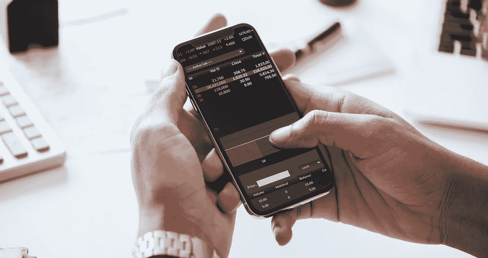
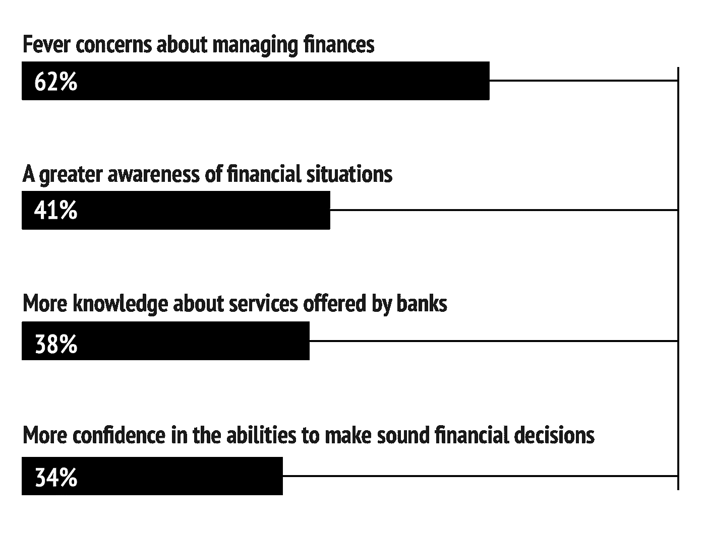
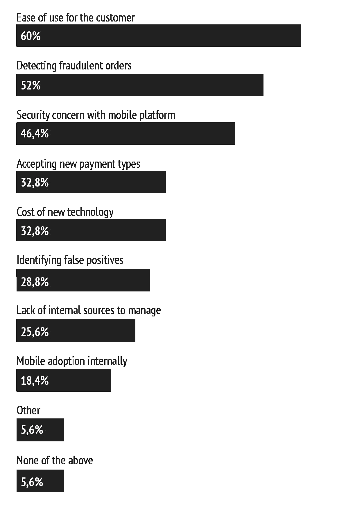
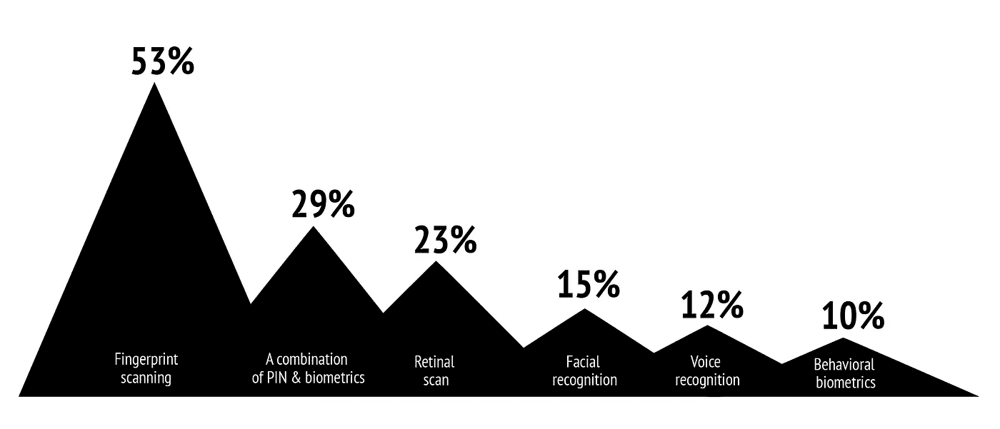
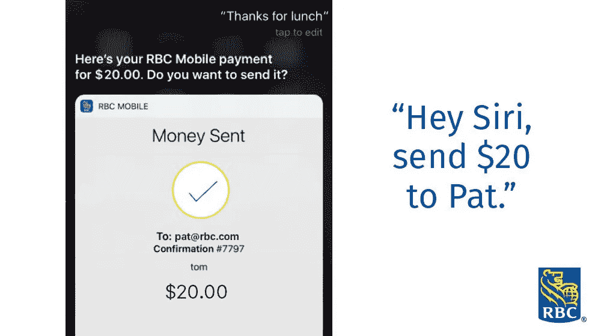

# 为什么移动银行是每个金融企业的制胜战略

> 原文：<https://medium.datadriveninvestor.com/why-mobile-banking-is-the-winning-strategy-for-every-financial-business-c18ca0264027?source=collection_archive---------6----------------------->

智能设备给我们带来的新机遇正在改变我们的生活。它们减少了我们的日常事务，并用我们以前从未有时间做的事情来代替它们。在智能手机的帮助下，移动银行是简化我们所有金融流程的方式，也是银行程序的最大部分。是什么让手机银行应用如此便捷和受欢迎？it 的未来是什么，银行如何通过应用移动应用程序取胜？

一般来说，手机银行允许发送和接收资金，检查账户余额，支付账单，等等，而不用浪费时间在长长的队伍中。有几种类型的移动银行服务，每一种都有它的好处。**通过短信使用手机银行**可以控制您的财务流程，无需安装额外的应用程序。对于这项服务，客户不需要互联网，甚至不需要智能手机——只需要在银行账户中注册一个电话号码。通过短信银行，客户可以查询账户余额、查看迷你账户对账单等..

**USSD 上的移动银行**(非结构化补充服务数据)对于无法访问互联网和没有智能手机的人也很有用。在这种情况下，USSD 电码用于通过电话方式与银行操作员通信和核对账单。当然，现在最流行的是通过 WAP (无线应用协议)的**手机银行。这是我们可以用来利用各种银行服务的移动应用程序:账户访问、账单支付、余额查询、资金转账、ATM 定位器等等。**

手机银行应用的数量正在急剧上升。例如，在英国，2017 年有 2200 万人通过电话管理他们的银行账户。CACI 报告预计，到 2023 年，这个数字将增长到 3500 万。因此，四年后，72%的英国成年人将通过手机应用程序进行银行业务。

**是什么让手机银行如此受欢迎？(** [**美，2018**](https://www.statista.com/statistics/945442/benefits-mobile-banking-usa/) )

众多银行在其发展战略中都将重点放在了面向用户的新移动应用上。能够提供全渠道银行软件的公司越来越受欢迎。例如， **CR2，综合自助银行平台，**提供不同种类的软件:ATM、互联网和手机银行。[他们的移动应用](https://ralabs.org/cases/omnichannel-banking/)，由 Ralabs 创造，是银行与客户沟通的新词。该应用程序适用于任何移动技术，并针对短信和 USSD 进行了优化。它支持从个人对个人支付到开/关银行卡的所有银行服务，尤其重要的是，它有一个可定制的界面。借助多种可变工具，银行可以根据客户群定制应用程序界面。

尽管如此，市场上不时出现许多关于手机银行改进的新创意。银行不断提供更好的移动服务。据研究人员称，银行面临的最大挑战仍然是改善客户体验和安全性，检测欺诈。

**移动商务的挑战(W** [**orldwide，2018 年 3 月**](https://www.statista.com/statistics/814241/m-commerce-challenges-worldwide/) **)**

在 2019 年，我们将在移动银行领域面临许多新的迷人趋势，从人工智能到最新的生物识别认证。所有这些趋势将鼓励大银行和较小的金融企业利用现代技术的优势，改进现有的移动钱包，并创造新的优秀钱包。**哪些想法会比别人更受欢迎？**

**通过 app 从 ATM 机取款**

此功能允许在没有任何卡的情况下从 ATM 机提取现金。客户按下无卡 ATM 受理标志，使用将显示在 ATM 屏幕上的 QR 码，并在应用程序上获得一个唯一的密码。有了它，客户可以授权交易并获得现金。该系统已经由[万事达卡](https://www.mastercard.us/en-us/issuers/products-and-solutions/customer-needs/consumer-solutions/cardless-atm.html)与 Diebold Nixdorf 合作实施。

**生物认证的新方式**

指纹扫描是当今最流行的生物识别形式，在世界各地的设备上都有使用。尽管如此，其他方法也自信地采取了自己的立场。虹膜扫描有 200 个独特的数据点，语音和面部识别，静脉模式认证。他们中的哪一个会更适合手机银行？经验会证明。

我们已经有了很多有趣的例子。总部位于英国的公司推出了扫描手指静脉模式的 Fingopay。美国的 [Keyo](https://keyo.co/) 创业公司也提出了类似的解决方案。它利用用户手掌的静脉作为生物特征。总部位于美国的安全公司 [EyeVerify](http://fortune.com/2016/09/13/alibaba-buys-eye-scan-firm-eyeverify/) 应用了一种识别眼睛血管的技术。

**语音银行**

我们已经看到金融市场上最大的玩家如何试图通过移动应用程序的革命性语音功能来吸引新用户。亚马逊、谷歌、贝宝、美国银行、Capital One、桑坦德银行和其他公司正在将语音银行推向一个新的高度。根据[Business Insider Intelligence](https://www.businessinsider.com/the-voice-payments-report-2017-6)、**的数据，语音支付用户数量将在 2019 年超过 3300 万人**，到 2022 年将接近 7800 万人。

这项技术相对较新，但 Alexa 已经可以还清 Capital One 的信用卡账单，用户可以在 Siri 的帮助下进行 P2P 转账，谷歌助手允许用户在附近的商店购物。例如，[加拿大皇家银行](http://strategyonline.ca/2017/03/09/rbc-launches-tranfers-through-siri/)正在其 iOS 移动应用中使用 Siri 功能。为了确认交易，应用程序要求进行指纹扫描。

**人际交往**

尽管所有金融流程都实现了数字化，但一些银行仍在使用移动应用程序，让员工更接近客户。在 [Umpqua Go-To](https://globenewswire.com/news-release/2018/09/13/1570408/0/en/Umpqua-Bank-Advances-Human-Digital-Strategy-With-Launch-of-Innovative-Go-To-Platform.html) 平台内，Umpqua 银行的客户可以**在几秒钟内联系到他们的个人银行**。该应用程序对所有客户都是免费的，无论账户余额如何，他们都可以根据专业背景、地点等因素选择银行家。

**人工助手**

随着人工智能的发展，用户正在等待与银行进行更高级别的个性化交互。然而，据 BAI Banking Outlook 称，只有 34%的银行使用数据来改善客户体验。同一项研究称，超过半数的 T2 千禧一代将转投银行，寻求更好的数字服务。

许多企业正在向前发展，并实施进化的人工智能设计。来自 Varo Money 的 [Varo](https://kasisto.com/press-releases/kasisto-partners-with-varo-money-to-power-val-a-new-digital-money-coach/) 应用基本上是一个鼓励积极消费和储蓄的数字货币教练。Moven 服务让用户通过个性化的推荐跟踪他们的消费。创新思维让银行比竞争对手领先一步。

**多种功能**

ACI Worldwide 的数字银行业务负责人 Mark Ranta 预测，我们将会看到更多的融合或合作来将应用程序整合在一起。用户不会寻找几个不同的应用来满足他们的需求。他们已经渴望一个方便的应用程序来管理所有必要的财务流程。例如，Ralabs 的 [CR2](https://ralabs.org/cases/omnichannel-banking/) 银行移动应用结合了移动支付和个性化银行产品。客户可以进行个人对个人的支付，开/关卡，在手机之间汇款，接受和赎回贷款，等等。

***

如您所见，最新技术推动了每一项金融业务，并有助于在快速变化的行业中保持相关性。移动银行通过各种方式拉近了金融企业与客户的距离。你有什么好主意吗？Ralabs 将帮助他们实现梦想。查看我们最新的 [**FinTech 项目**](https://ralabs.org/services/fintech/) **。**

> 阅读更多信息:

 [## 2019 年等待 FinTech 的是什么？

### 最流行的预测

medium.com](https://medium.com/predict/what-is-waiting-for-fintech-in-2019-15577743a21)  [## 在金融科技领域开始职业生涯之前，你应该知道什么

### 金融科技的发展速度超过了我们过去的预期。2010 年，金融科技投资的价值为 100 亿美元…

medium.com](https://medium.com/@Ralabs/what-you-should-know-before-starting-a-career-in-fintech-ccae2eb8fd12)  [## 改变数字支付本质的三大趋势

### 在过去的两年中，数字支付者的数量已经超过了 30 亿。没有人会问为什么——为了支付你的账单…

medium.com](https://medium.com/@Ralabs/three-trends-that-are-changing-the-nature-of-digital-payments-2dbf1753873) 

## 来自 DDI 的相关故事:

 [## 为什么数据将改变投资管理——数据驱动的投资者

### 有人称之为“新石油”虽然它与黑金没有什么相似之处，但它的不断商品化…

www.datadriveninvestor.com](https://www.datadriveninvestor.com/2019/01/25/why-data-will-transform-investment-management/)  [## 金融中的机器学习——数据驱动的投资者

### 在我们讲述一些机器学习金融应用之前，我们先来了解一下什么是机器学习。机器…

www.datadriveninvestor.com](https://www.datadriveninvestor.com/2019/02/08/machine-learning-in-finance/)