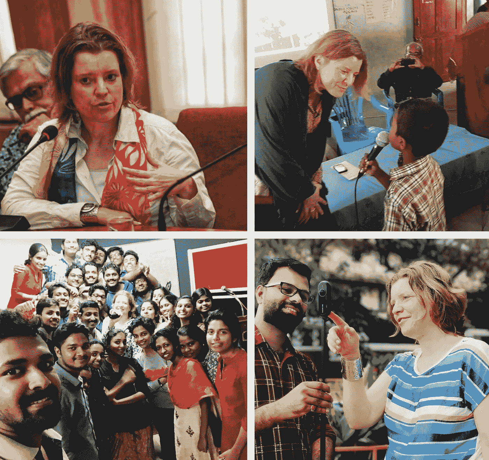

# 为什么移动沉浸式讲故事是通向新闻业现在和未来的大门。

> 原文：<https://medium.datadriveninvestor.com/why-mobile-immersive-storytelling-is-the-gateway-to-the-present-and-future-of-journalism-645f0564a6b7?source=collection_archive---------4----------------------->

# 五章半的学习内容。

# 1-一切开始的地方。

我这一代的记者和媒体从业者将媒体进化快速发展的时间线的全部经验带到了新闻编辑室和教室。随着 26 年来在新闻和传播中高质量讲故事的创新方法和沉浸式技术领域的紧张工作，我的首要任务是帮助所有感兴趣的人更好地了解如何轻松采用、评估和改进当代工具和技能的使用。

数字化时代的方法可以用于所有的新闻编辑室、专业人士、组织、社区和公民用户，旨在积极主动地参与数字化转型，一次一个人的资源和目标。我的 [Now Age 讲故事](https://www.nowagestorytelling.co)合作伙伴和新闻创新者 Devadas Rajaram 和我热衷于传播移动沉浸式讲故事技能，作为通向新闻和讲故事不断发展的未来的大门。目前以及未来几年，移动工具和技能被证明是进入数字通信生态系统的最佳起点。

数字移动方法提供了中间地带，以最引人注目、影响深远、负担得起、可获得、高质量、低成本的方式与您的受众产生共鸣，并与他们的沟通行为相融合。此外，它们将使您能够深入数字空间，掌握数字转型和不断发展的技术的下一阶段。然而，在新闻行业，移动、360 度/虚拟现实和增强现实技术的全部潜力被低估了，沉浸式讲故事仍然被视为一个专属领域或噱头，正如德瓦达斯·拉贾拉姆[指出的](https://insidethestory360.wordpress.com/2018/08/27/360-video-still-a-gimmick-in-india-devadas-rajaram/)(2018 年 8 月)。

在接下来的段落中，读者可以更多地了解当今时代内容制作的两个主要趋势:首先，更好地理解我们为什么以及如何去揭开新闻业和真实故事讲述新兴技术的神秘面纱。其次，接下来是一个简短的旅行，探索移动沉浸式讲故事对于新闻和传播的潜力。显然，它代表了新闻业的一种范式转变，通过实施用户变革、无缝和易于适应的方法，引起了习惯于在昂贵的高端设备和独家业务线中思考的专业人士的怀疑和不情愿。

然而，最近新闻编辑室或媒体公司仅采用数字方式并首先采用移动方式的成功案例，如 De communicator，The Independent，Ebner Verlagsgruppe 等，表明向数字移动解决方案的过渡，包括多样化的产品组合和收入流，将使新闻编辑室和媒体公司获得更大的发言权，使他们的故事与他们的用户保持一致，提高触及率和保留率，并建立强大的品牌，为他们提供获得信任的优势，这是新闻和媒体信任危机时期最重要的货币。

是的，不要担心，毕竟这不是火箭科学。

# 2-为什么移动沉浸式讲故事成为新常态，尽管在新闻行业和教育机构的重要部分被忽视。

在她的畅销书《信号在说话》中，美国未来学家 Amy Webb 认为“令人兴奋的新技术的承诺有时会掩盖实际上正在发生的真正变化”(2016 年，第 44 页)。她引用了彼得·泰尔臭名昭著的口号“我们想要会飞的汽车；相反，我们从他的宣言“未来发生了什么”(2011)中获得了 140 个字符。

韦伯坚持认为，几个世纪以来,[飞行汽车](https://www.pinterest.com/kennethacevedo1/flying-cars/)不断发展的梦想说明了一种创新方法会发生什么，如果它的潜力和后果没有在连接科学、社会和技术类别的节点网络中进行衡量。她用“飞行汽车”来比喻一种难以实现(用于大规模采用)但容易想象的移动概念，这种概念比真正的趋势获得了更广泛的公众关注。部分原因是，真正的趋势往往表面上看起来简单，不那么壮观。然而，它们满足了人类的基本需求，使其持久和可持续，并在简单的表面下变得复杂、强大、现实，并对个人、组织和社会产生深远的影响。

我想起了早期的激光技术。尽管被广泛认为是激光发明者的工程师西奥多·梅曼(Theodore Maiman)将其定义为“为问题寻求解决方案的技术”，正如创新研究员和工程师乌尔里希·哈切克(Ulrich Hutschek)在他的“创新讲述”演讲(2016)中强调的那样，激光技术起初仍然是一种被低估了几十年的方法，后来演变成了各种各样的应用。今天，大多数人在日常生活中都会有意或无意地接触激光技术。可能是在超市收银台，在健康检查的情况下，看着原子手表或使用基于激光的视听播放器，仅举几个例子。同样的情况也发生在智能手机技术上，它作为专业新闻和通信行业的一个设备齐全的媒体机构，其全部潜力仍然被低估。

因此，虽然飞行汽车对于大规模采用来说仍然不切实际，尽管你每隔一天就会读到它们，但在不到 20 年的时间里，包括智能手机、语音助手和无人机在内的移动设备已经彻底改变了全球社会的整个通信和商业系统。当互联网成为人们的第二个家时，智能手机成为他们的第一个第二大脑，现在全球三分之二的人口都可以访问，为即将到来的第三大脑和第四大脑搭建了门户。这些将通过新兴的移动设备实现，如 Magic Leap 的[轻型眼镜](https://www.wired.com/story/magic-leap-lightwear-headset-hardware/)，镜片和工具，为用户提供实时免提 3D 增强现实层和连接到物联网的虚拟现实信息。

然而，可悲的是，迄今为止，移动通信生态系统在新闻和媒体行业以及教育领域的大部分领域都没有充分认识到其巨大的飞跃和范式转变。但不是每个人都这样。艾米·韦伯或凯文·凯利等未来学家很久以前就预见到了手机的影响。像 Devadas Rajaram 这样的先驱从 1998 年开始就与移动技术合作新闻。正如创新工程师 Detlef Mueller 在 2018 年非公开的 FMX 会谈上所说，早在 2007 年，德国运动用品商阿迪达斯就开始在其超过 4 万个鞋模的内部开发和设计流程中整合 3D 建模。一步，将公司提升到最具创新力的全球企业之一的水平。

看看过去 20 年间最先采取行动的人，我们需要解决的问题是，为什么如此多的记者和新闻编辑室对数字变革持顽固的不情愿态度。这有时看起来是如此巨大的自我毁灭，与对气候变化的无知不相上下，威胁着地球上的生命。在这篇文章中，我试图找到一些答案，并研究解决方案，以改变这种情况。

# 2 1/2-让我们拍一张全球快照来解释为什么数字应用应该更快更全面地被记者、说书人和教育工作者所采用。

新闻和媒体行业的传统经济和通信已经被数字化破坏了大约二十年。基本上将市场、信息和通信转变为一个流动的网络，通过使用超本地、交互式、实时数字空间，随时随地连接几乎所有人和所有事物，包括所有数据。

路透社研究所、今日未来研究所和其他机构的研究和[调查](https://clearbridgemobile.com/mary-meekers-2017-internet-trends-mean-mobile-app-development/)显示，年复一年，全球范围内越来越多的流行移动设备被用于各种形式的通信。随着移动设备的出现，数字素养成为当今时代开放社会的超级力量和必备资源。

这里的悲剧点是:在以知识为基础的行业中探索、应用数字移动技能和传播数字素养的失败影响并最终伤害了我们所有人。全世界的社会都面临着数字素养的空白。尽管不断变化的全新数字方法极具挑战性，但抵制这种变化并忽视全球大多数公民使用的数字方法也同样存在问题。在网络战、错误信息和大小数据的商业滥用造成前所未有的广泛影响后，这种空白的程度现在可以从以下方面观察到:信任危机正在动摇处于开放社会知识引擎核心的传统机构，以及新闻、媒体和教育行业。此外，法西斯主义者和民粹主义者刺激了这种真空，他们很早就成功地预见到如何将数字通信系统转变为数字错误信息系统。

可以合理地认为，当前的虚假信息阵线可以利用新闻编辑室内外对数字媒体的高度无知，与缺乏对如何衡量和预测未来方向的理解的管理层和政界领导人携手并进。

新闻创新者 Nonny de la Peñ在她的 SXSW 2018 "[convergence keynote](https://www.sxsw.com/news/2018/nonny-de-la-pena-convergence-keynote-at-sxsw-2018-video/)"中提到，新闻编辑室和组织关于使用沉浸式技术来有目的地讲述故事的知识水平低得令人沮丧。如果我们想把独立新闻和媒体培养成数字网络社会的有效制衡过滤器和信息引擎，我们都可以在建设独立新闻和媒体的可持续未来方面做得更好。如果我们现在不明白这一点，不去适应不断变化的数字通信系统，我们失去的不仅仅是一成不变的套路。

尽管如此，与数十亿只使用手机上网的独立用户相比，以及新闻和媒体行业对手机和沉浸式技术的缓慢适应相比，这种不平衡是惊人的。也许部分问题是由“手机”、“手表”和“眼镜”的误导性名称以及越来越小的尺寸引发的，这使得移动设备容易因其简单的表面而被低估。有趣的是，完全有可能完全忽略移动设备令人印象深刻的高科技功能，而优先考虑化妆品和时尚判断。但是，最终，低估移动相关方法和技术平台、软件和应用程序的全部潜力是不可原谅的。

以 Twitter 实时博客、Snapchat 增强现实故事和 Twitch 实时对话为例。Twitter 在此期间扩展到 280 个字符，首先在突发新闻和灾难情况下展示了其强大的潜力，如 2009 年飞机在哈德逊河紧急降落，2010 年海地地震或 2015 年巴黎袭击，这是对社会公益和负责任的实时信息发布最重要的例子。相反，目前被世界各地的威权领导人变成了激进的政策工具，效仿 ISIS 或特朗普总统，特朗普是一名犯罪嫌疑人和白人至上主义者，具有讽刺意味的是，特朗普 2016 年的竞选活动得到了推特怀疑论者彼得·泰尔的大力支持。

然而，技术可以被滥用于邪恶的事实与人类工具的历史一样古老，不能先验地用来反对它，就像你不能责怪刀杀人一样。相反，我们应该确保我们比民粹主义者和网络战士更好、更有效地理解和使用技术，并了解如何采取当代预防措施，防止非法和不负责任地使用数字通信技术。

回顾网络战，建立一个针对英国退出欧盟投票和 2016 年美国大选的先进伪造系统，然后，最近，对比 2018 年业余的扎克伯格参议院听证会以及欧盟的 DSGVO 数据监管的老式机制——引入的目的值得称赞，但将负担手动放在个人用户、中小型组织和企业身上——我们可能会得出结论，现在没有采取任何预防措施，相反，开放社会的法律和政策制定者似乎陷入了防御和反应模式。我们看到他们将过时的数据保护方法应用于当今时代的网络攻击和新的数字现象，而不是将人们和经济带入智能方法、人工智能技术和后英雄战略的当今时代。

让我们再来看看 Twitter 及其当前的实时讲故事模式。该平台拥有 280 个字符的推文，包括多媒体内容、更长的线程和时刻、内置的直播工具以及消息和聊天功能，为记者和故事讲述者如何以其发明者和初始用例无法预见的方式重新利用新兴数字技术进行新闻和故事讲述提供了一个完美的例子。

我以前用过的另一个例子是 Snapchat 的智能、人工智能、增强现实镜头和面部检测过滤器，如果有必要，它们可以无缝地用于来源保护，使受访者能够在身份受到保护的同时分享他们的故事。

我建议将探索流行新技术的方法描述为将它用于非预期的新闻用例，并接触到以前难以接触到的受众，如将“开放式创新”应用于新闻和讲故事。我将它定义为“[创新讲述](https://medium.com/@memplexx/innovationtelling-a-new-storytelling-technique-in-mobile-journalism-51615e26382e)”，适用于两个主要方向:一方面，你可以采用一种给定的技术，并将其重新用于新闻报道，以便让更多的用户在他们所在的地方使用他们使用的相同技术——比如用于实时多媒体讲述故事的手机，或者用于调查性报道的 Snapchat。另一方面，记者和故事讲述者可以在新的层面上承担起自己的责任，让用户了解媒体和社会中不可避免的真实技术趋势，并向他们传授如何掌握这些技术的知识。例如，如何使用 360 度/VR 视频、响应式虚拟现实、增强现实、算法、无人机、基于语音的机器人和许多其他技术，这些技术已经在我们的家门口或“ [Soonish](http://www.slate.com/articles/technology/future_tense/2017/10/the_technologies_that_didn_t_make_it_into_the_book_soonish.html) ”到来。

# 3-从新闻业虚拟现实故事讲述的早期学到的东西。

仅在六年前，记者兼教育家 Nonny de la Peñ利用响应式虚拟现实 3D 工程，开创了第一个互动沉浸式新闻故事“[【洛杉矶的饥饿】](https://docubase.mit.edu/project/hunger-in-los-angeles/)”(2012)。这个故事最好用 VR 护目镜来体验，将用户带到大量穷人在洛杉矶市中心的人行道上排队领取免费食物的场景，在一个食物银行外面。突然，队列中的一名男子糖尿病休克，晕倒，摔倒在地，无助地躺在人行道上，周围是绝望的旁观者窃窃私语。《洛杉矶的饥饿》基于一个真实的故事和目击者的报告。它是低成本制作的，面向完全不知道新的沉浸式 3D 技术以及由此衍生的新闻报道中有目的的体验性故事的潜力的观众和行业。

谷歌的 VR 兼容纸板甚至需要两年时间才能成为第一款让消费者能够轻松体验这种故事的无线移动护目镜。早在 2015 年和 2016 年，纽约时报就向成千上万的订户发送了谷歌纸板，因为纸板价格实惠、无缝、直观、改变用户且易于使用。一年前，Oculus (Rift)和 HTC (Vive)发布了第一款高端、栓系式和昂贵的虚拟现实护目镜，供大众采用。随后，兼容虚拟现实的网络浏览器和平台也变得触手可及。

回顾 2012 年，当沉浸式 3D 技术以增强现实、360 度/虚拟现实、响应式虚拟现实和混合现实的标签进入大众市场时，我们必须明白，所有这些都是基于混合技术，在我们的物理现实上叠加不同层的 3D 信息。显然，这使得他们对强大的新的讲故事方式很有吸引力。但与此同时，不同的标签以及高端成本吓跑了非技术爱好者，让他们无法自由体验和应用这些新的通信技术。总而言之，这些技术远非简单的品牌化和教育，相反，它们似乎要求创作者和用户具备先进的技术知识，能够在不同类型的 3D 技术之间进行区分和选择。

技术型用户角色的创建者和使用者长期以来只是游戏行业、军事综合体或基础研究的对象。然而，如果人们只看到沉浸式技术的表面，这种排他性在当今时代才是真实的，导致了严重的误解，这在一定程度上导致了市场的缓慢采用。相反，到目前为止，对于新闻行业、媒体和教育机构来说，努力充分理解无缝移动方法和应用程序在身临其境地讲故事方面的潜力已经变得至关重要。传播这些知识，这些知识实际上应该作为数字扫盲的字母表来教授，基本上可以被世界上所有的创造者和使用者获取，不管他们是否喜欢科技。

因此，我们可以从成功的科技初创公司——如苹果、Youtube、Warby Parker、优步——那里学到，用户可以快速、无缝地适应不断发展的新技术，如果这些技术能让他们的日常生活变得更容易，并提供直观、移动和越来越多的免提体验。这种成功模式使得 360 度/虚拟现实和增强现实技术以及基于云的增强现实搜索有可能展现出当前和未来大规模采用的最大潜力，尤其是在新闻和媒体行业。将用户从物理现实中隔离出来的反应式虚拟现实和混合现实很可能会被遗忘。但基本前提是，记者和讲故事的人不再指望独家、昂贵和高端技术的概念和难以触及的故事。

顺便提一下，为了帮助传播数字文化，对所有可能的 3D 分层现实使用一个总括概念可能是有意义的。像“XR 现实”和 XR 新闻这样的总括概念，据我所知，是基于柏林的 360 度虚拟现实和响应式虚拟现实[创作者平台](https://www.youtube.com/watch?v=WEc1y3x_w7Y&feature=youtu.be)由 Stephan Gensch 和 Markus Boesch 创作的虚拟现实。

Nonny de la Peñ和她的团队从一开始就遵循了“创新讲述”策略，后来又有了新的突破，并继续这样做。从一开始，这就意味着他们要为自己的目标找到切实可行的解决方案，将引人注目的新闻内容和创新的 3D 技术结合起来，以便为用户提供全身故事体验，并在故事中推动她或他。这种方法的核心是用户的利益，为他们提供积极公民的新方法和知识，以及新闻业的影响，将代表不足、复杂和强大的故事转化为引人注目的 3D 体验，吸引观众。

德拉培尼亚沉浸式新闻 3D 故事建立了新术语“[故事生活](https://medium.com/journalism360/virtual-reality-the-shift-from-storytelling-to-storyliving-is-real-ff465c220cc3)”。她和她的团队通过将 3D 游戏技术重新用于新闻业，设计了自制的解决方案。因此，他们在 3D 中重建了一个真实的空间环境，将它与原始声音和空间环境声音以及运动捕捉的 3D 主角混合在一起。他们在游戏引擎中设计和渲染了视频故事产品，如“Unity”，并在响应性 VR 兼容浏览器和耳机中发布。要么就是体验 360 度/VR 的简单无束缚的 Google Cardboard。或者是带控制器的有线高端 HTC Vive，用于体验包括运动控制在内的响应式虚拟现实。2012 年，该团队甚至发明了第一款反应灵敏的虚拟现实护目镜——当时比现在更笨重——这是 Oculus Rift 的基础，随后由 Lucky Palmer 开发，当时他是 Nonny 团队的成员。

虽然成功故事从结局看起来很完美，但在男性商业世界对女性创新者有额外吸引力的情况下，说出创新者必须克服的困难也很重要。在《洛杉矶的饥饿》(Hunger in L.A)和她影响深远的实验 de la Peñ之后，她起初被边缘化，教育和媒体机构的上司和同事给她的工作贴上了疯狂和不道德的标签。后者——对“不道德发明”的指控——似乎是全球学术界常见的致命论点，目的是让那些要么给漫长的专业领域带来不适，要么取得超出许多人理解的令人震惊的东西的创新者闭嘴。在这两种情况下，创新者，尤其是女性创新者，都被视为威胁和贱民。不幸的是，公众几乎听不到那些没有克服摆在他们面前的障碍的人。

回顾自 2012 年以来 3D 沉浸式新闻业发生的事件的时间线，我们知道德拉培尼亚克服了她独创性的新闻创新努力中的障碍，创建了她自己的公司“标志性媒体”。作为一名女性新闻革新者和媒体企业家，她取得了杰出的成就，如果考虑到[的大部分投资](https://www.inc.com/kimberly-weisul/why-investments-in-women-led-companies-seem-to-have-plummeted.html)继续流向男性主导的媒体公司，无论是在美国、德国还是世界各地的行业，她的成就就更为突出。

Nonny 的研究和工作将数字沉浸式新闻的边界推向了“在场二元性”的范式。她证明了精心研究和制作的关于气候变化(《[格陵兰岛融化](http://emblematicgroup.com/experiences/greenland-melting/)》，2017)或国内谋杀自杀(《[基亚](https://uploadvr.com/kiya-is-an-intense-vr-recreation-of-a-domestic-murder-suicide/)》，2015)的反应灵敏的 3D 故事能接触到数百万用户。在当今时代，由笨重护目镜后面的孤立虚拟现实故事体验所代表的“在场的二元性”,在我们处于故事中的时候将我们与自然物理环境隔离，正在演变为我所说的“在场的多元性”,由与我们物理环境上实时叠加的各种响应沉浸式 3D 层的日益同步的交互所代表。

目前，最无缝、最能改变用户的“多种存在”是通过使用智能移动设备实现的，它将空间视听 3D 层实时叠加在我们的直接物理环境上，而不像 VR 护目镜那样切断我们对任何现实的感觉。

# 4-让我们关注移动沉浸式讲故事——以及为什么它是现在和不久的将来新闻和讲故事的门户。

互联网完全改变了我们交流的方式。它创造了一个革命性的新矩阵:数字通信生态系统。值得我们花时间来简要地思考一下到目前为止讲故事的人有哪些关键的变化。

在量子计算出现之前，数字通信的核心是通过数字加速我们处理越来越多的大小数据的方式来定义的，通过随时随地访问互联网来实时或实时连接用户，在全球范围内激发超本地交互性，最后，同样重要的是，通过培养有利于引人注目的、多媒体的、互动的、休闲的、仿游戏的信息格式的对话式通信方式。

能够访问数字通信空间的通用设备和方法是移动电话，包括功能手机和智能手机，在 [2018](https://wearesocial.com/blog/2018/07/internet-growth-accelerates-but-facebook-ad-engagement-tumbles) 年，超过一半的世界人口获得了它们，通常每个用户不止一个设备。预计到 2020 年，62.6%的世界人口将通过手机上网，用户数量约为 47.8 亿。

由于当前数字通信的矩阵是以用户为中心的，并正在脱离自上而下和等级结构，数字故事讲述者和内容制作者应该建立一个流程，帮助他们不断识别、理解和联系用户不断变化的行为，从倾听和知道如何开始对话开始。

这一概念证明“设计思维”方法对记者和故事讲述者极其有用，因为他们自然专注于在更长的时间内寻求建设性的解决方案，包括反复循环的对话、开发、实施和反馈。顺便说一句，这可能会给我们另一个强有力的例子来应用“开放式创新”作为改变设计原型以讲故事背后的方法。

数字移动通信生态系统中固有的以用户为中心的系统导致了一种完全不同的叙事方式。用户不再被迫接受一个视角的故事，也不再被迫接受所谓的接收者的观点。相反，用户现在是正在进行的交互式对话中的积极伙伴。倾听技巧，远不是一个时髦的术语，而是一种新的软能力，代表着在所有交流领域成功讲故事的起点。

因此，根据定义，当今时代的数字通信系统是基于“移动思维模式”的。这个概念与主导新闻编辑室和媒体长达几个世纪的价值观和结构相反。当时，传播是在一个广泛基于自上而下的传播、静态发送者-接收者工作流程、很少或没有多样性代表、男性主导的等级指挥链以及优先考虑新闻编辑室和媒体公司中的地位和资历的价值集的系统中构建的，这是最明显的框架标准。

在当今时代，向数字移动通信的过渡需要变革管理行动，将短期、中期和长期的成功考虑在内，同时个人用户、团队和整个组织迁移到新的工具、技能、工作流程、分销和收入模式。新闻编辑室和传播单位的变革管理过程在许多方面都具有挑战性。在许多情况下，过渡必须在仍然存在的传统结构之上继续。另一个挑战是，媒体所有者一直在通过合并新闻编辑室裁员，将传统媒体收入下降作为一个短视的理由。相比之下，各种规模的独立新闻编辑室和媒体机构——如[《卫报》](https://www.theguardian.com/media/2018/jul/24/guardian-media-group-digital-revenues-outstrip-print-for-first-time)、[《独立报》](https://www.independent.co.uk/news/media/press/the-independent-becomes-the-first-national-newspaper-to-embrace-a-global-digital-only-future-a6869736.html)或[《塔兹》](https://www.golem.de/news/nur-noch-wochenende-taz-stellt-ihre-printausgabe-wohl-bis-2022-ein-1808-135981.html)——都因承担了向纯数字新闻编辑室和媒体机构的长期变革过程而获得了回报。这可能是少有的别无选择的情况之一，全球范围内的先行者实际上已经被证明是成功的。

在当今时代讲故事，我们建议新闻编辑室团队和传播单位掌握两个能力领域，以成功过渡到数字生态系统:一个领域是通过绘制和适应不断变化的数字生态系统来定义的，开发一个接受终身学习的移动思维模式，开放实验(试错)，重新思考知识转移和讲故事的结构，以及原型化真正的敏捷工作流，为多样化的产品组合、微社区和多样化的收入流建立敏捷团队和战略。另一个领域是通过调整实用技能来塑造、制作和评估高质量的数字信息、内容和故事格式，特别是使用移动设备结合所有合适的新兴技术和软件。

这两个领域将在更长的时间内平行发展。所有掌握这些能力的人都将为塑造我们数字网络社会和经济的新兴技术力量做好充分准备，例如 XR 技术、物联网和量子计算机处理。

最后，同样重要的是，3D 建模、体验性讲故事和空间故事生活是现在数字移动讲故事的关键特征。当我们早些时候看德拉培尼亚作品的开创性例子时，它帮助我们理解沉浸式讲故事如何在故事中间带给用户。德拉培尼亚的另一位同事、VR 新闻的早期采用者是丹·帕切科(Dan Pacheco)，他目前在锡拉丘兹大学纽豪斯学院(Newhouse School)任教。2014 年，他参与制作了“[变化的收获](http://newhouse.syr.edu/news-events/news/student-professor-play-key-role-groundbreaking-journalism-moment)”，这是一个关于气候变化如何影响农业的多媒体沉浸式报告。他的团队使用响应虚拟现实 3D 场景和交互式 360 度视频作为长格式沉浸式报告的一部分。帕切科在“ [MobileMe & You 2017](https://youtu.be/_D2t0ZCfEHc) ”的演讲中解释了沉浸式 3D 体验如何与人类的自然感知相融合，以我们已经感知到的方式为我们带来信息。体验 3D 内容消除了距离，激发了用户的共鸣，不仅将他们带入故事的中间，还使他们能够以自己的控制和节奏通过做、触摸、移动和构建故事进行触觉互动。

因此，身临其境的故事讲述与公正和遥远的新闻故事讲述的概念相矛盾，其中新闻编辑室、记者和用户已经接受了几个世纪的训练。剔除第一人称说书人和故事结构的痕迹，我称之为“杀出重围”的方法。在新闻 360 度/VR 讲故事的早期，过时的概念转化为让故事讲述者从空间场景中消失的关键努力，记者在 360 度照片或视频场景中隐藏起来，或者不得不在基于拼接的后期制作中修复 360 度内容。

如今，这一概念正在慢慢转变为新闻的[第一人称体验](https://www.mitpressjournals.org/doi/pdf/10.1162/PRES_a_00005)，由自信、真实的第一人称记者代表，他们充当现场向导，并与第一人称用户联系。[四壁就是一个例子。拉什达·琼斯的《叙利亚人的生活》(inside Syrian lifes](https://www.rescue.org/four-walls))是第一部 360 度/虚拟现实新闻作品之一。其他例子可以在早期的移动报道风格和 360 度移动新闻编辑室中找到，如 Léman Bleu、EuroNews360 和 Al Jazeera。

鉴于开放社会中持续的信任危机，坚持“公正新闻”的旧观念可能是一个非同寻常的重大错误。数字移动生态系统为新闻编辑室和媒体提供了一个生动的替代方案，以第一人称的故事讲述者为基础开展工作，他们提出论点，但也表明立场，报告各种观点，但也讲述解决方案。新的信任模式表现为个人说书人转变为有影响力的品牌，如 David Fahrenthold，以及企业品牌建立在强大的用户、订户和捐赠者基础上，以受信任的个人、信任活动和互动信息众包与用户知识结合为基础；比如卫报，纽约时报，Ryot，Boom 或者 FUNK。此外，这些品牌都使用了广泛的移动社交策略，并通过推荐途径连接到基于网络的中心。

在新闻行业，几家大公司——例如《纽约时报》、《华盛顿邮报》、《今日美国》或《卫报》——已经将探索身临其境的故事讲述、教育公众了解新的信息技术，以及将移动和新兴技术整合到数字化新闻编辑室工作流程和收入模式的持续变革过程中作为自己的使命。他们的探索为理解新闻业的现在和未来做出了深远的贡献，包括创新的经验技术和故事概念。

然而，他们通常足智多谋的努力可能会阻止资源较少的小型企业采用这种创新方式，并构建数字产品，包括移动工作流程和实现新的收入流。部分原因是，沉浸式技术被误解为具有独家讲故事视角的成本密集型火箭科学仍然盛行。部分原因是，许多接受传统方法和形式培训的专业人士低估了手机的质量和力量。部分原因是，移动生态系统促进了灵活性、交互性、同意和解决方案的发现，同时，在许多新闻编辑室和组织中流行的思维模式坚持自上而下的指挥链。

可悲的是，这种闲置状态与移动设备提供的明显优势形成了鲜明对比:容易获得用户变革性的无缝新时代技术。操作模式，可在直播、实时故事讲述(后期制作时间较短)或长篇故事讲述(后期制作时间较长)之间轻松切换。创作者可以从各种免费或一次性购买的应用程序和软件、格式、工作流程和平台中进行选择，这些应用程序和软件可以真正针对最适合的本地故事和内容进行设计和改编。

# 5-为什么数字移动生态系统是沉浸式讲故事的理想选择。

不要让自己被高端设备、编码威胁、昂贵的资源和独家或难以触及的故事情节吓跑。相反，开始寻找原因和机制，使沉浸式讲故事成为移动讲故事的固有方法。对于个人用户来说，这是一种新常态，新闻编辑室、通信部门、组织和企业早就应该学会欣赏改变用户的移动技术，以及它如何为身临其境的故事的创作和传播发挥作用。最后，让我们深入了解一下移动沉浸式生态系统。

智能手机可能是最简单和最强大的脑机接口，已经在全世界广泛使用。它们是满足人类需求的最佳技术。其中包括对连接速度、通信便利性和高效自动化的需求。因此，我们口袋中的微型媒体屋本身就具备了媒体屋的全部功能，为身临其境的讲故事开辟了一个全新的领域——只需用手指轻轻一点。

在过去几年中，技术发展如此之快，以至于我们现在可以在智能手机、可穿戴设备、眼镜和镜头中找到易于访问和使用的相机和创作者平台。几乎所有智能移动设备都内置了 180 度和 360 度空间相机功能。而且，老实说，如果你可以用同样的努力获得 180 度或 360 度垂直或圆形视觉/视频的完整信息，谁愿意在一个风景矩形图片中查看有限的信息。现在，价格适中的手机兼容设备也可以使用，如 Insta360 One 相机，可以直接插入智能手机。所有这些工具都是数字移动生态系统的一部分，为空间视觉效果、视频和实时流提供了一个超级简单的实时创建流程——从拍摄、编辑到发布，所有这些都不需要编码或拼接技能。

在更大程度上，重要的是要反映出新闻和传播中的沉浸式体验不仅仅是关于技术，首先也是最重要的是关于移情机器，当然也不是关于最完美的幻觉体验。相反，它是关于最真实、无缝和相关的故事体验，用户可以在旅途中参与，或者，如果必要，也可以在静止状态下参与。

科学定义将沉浸感描述为响应性 VR 刺激用户受体导致周围空间体验的可测量程度(参见例如 Jason Jared，The VR book，2016，p.47)。然而，“沉浸式体验”这一概念的普遍使用可以追溯到很久以前，始于将用户的想象力带入其他世界的空间体验的实践幻觉。就像哥特式建筑中的彩色玻璃一样，将人类的物理三维感知能力转化为艺术和工艺。

亲身体验的沉浸式体验引领我们了解移动沉浸式讲故事的强大功能，这种功能基于无缝高科技和液态沉浸式讲故事方法的复杂组合，在我们直接的物理环境中创建多层次的“多元化存在”，通过以各种感官方式与移动屏幕互动来体验。最令人印象深刻的是,[通过“6D”几乎每天的新发展展示了](https://twitter.com/BlueNucleus/status/1033768236477829120)。AI”，是致力于增强现实应用和 AR 云的领先科技公司之一。

与文本结合的动画 gif、视觉效果上的浮动文本框、转换为视频的音频、与提供 3D 信息和动画 3D 对象的互动热点结合的 360 度视频——所有这些都代表不同程度的沉浸式体验，其共同点是它们都可以通过使用智能手机来创建和体验，直观地用手指点击，无束缚、无缝、互动。

手机还引入了垂直比例方面，这是一种与自然人类 3D 感知和垂直身体身材相关的初始空间体验的引人注目的模拟。开始用垂直方向的手机扫描你的环境，你会得到一个比水平方向更多的空间错觉。上个世纪，主流的电视和电影屏幕已经引导用户使用横向比例。现在，随着沉浸式技术的发展，垂直、圆形和空间体验正在取代——不管你喜欢与否——直观而自然地讲述沉浸式故事。

最后， [sound](https://medium.com/dangeroustech/unknown-cloud-on-its-way-to-berlin-8f33617007aa) 凭借其自身的力量回归，通过唤起声音环绕错觉，并通过放置在声音全景或 3D 空间中的音频线索将用户引导到行动热点，影响了大约 70%的空间故事体验。Nonny de la Peñ在《基亚》(2015)中使用了来自 911 紧急电话、采访和环境声音的原始声音，重现了一个致命的家庭暴力场景，在《孤独之后的 T2》(T3)(2017)中，重现了单独监禁的体验，首次使用了响应式体积虚拟现实技术。人们普遍喜欢听声音和口头故事，它们将听众直接拉到故事的中间，使人理解声音和可问责的故事的沉浸式力量。声音和语音是基本的人类体验，在高端响应虚拟现实 3D 讲故事之前，这对于移动沉浸式讲故事是非常强大的。另一个最近的、真正引人注目的例子是播客“[讲述二战期间美国的战争罪行](https://player.fm/series/reveal/take-no-prisoners-inside-a-wwii-american-war-crime)”，其标题就指向了强烈的沉浸式体验。

如果我们开始将当今时代的讲故事视为一个混合技术、混合故事格式和分层多元化存在的时代，我们很快就会欣赏到我们与观众共有的各种工具和格式。一方面，这给了我们创造更多无缝体验的选择，与我们专注于故事而不是技术的用户产生共鸣。另一方面，我们获得了更多的创作自由，因为既没有专属的格式，也没有必备的工具。

一个例子是交互式网络纪录片“[行业](https://theindustryinteractive.com/network)”2017，调查荷兰非法药物行业。记者制造商决定不创造一个空间 360 度/虚拟现实视频体验。取而代之的是，他们使用单一的交互式 3D 模型和热点，以额外的文本和多媒体格式提供更深入的信息。这些选择的方法将用户从 360 度视频的受限的单视点或 VR 耳机带来的被切断的体验中解放出来。最终产品为第一人称用户提供了更多选择，让他们可以按照自己的时间和节奏，自由选择和探索以各种媒体格式呈现的所有故事元素。

同样的方法可以在《变化的收获》(2014)或《墙》(2016)中看到。两者都嵌入了 360 度/VR 和响应式 VR 场景，作为更广泛、复杂的多媒体互动故事的元素。

可以肯定地说，没有一种格式或技术适合所有的主题和产品——幸运的是，没有必要只有这一种。

声音和交互式多媒体和 3D 信息层是通过任何手机轻松制作身临其境的故事的关键要素。移动设备可用于创建引人入胜的身临其境的体验，领先于高端技术带来的任何高级故事。此外，智能手机可用于创建和体验无缝和互动的增强现实和 360 度/虚拟现实信息和故事。

数字移动生态系统本身就是一个本土的沉浸式讲故事空间。在新的技术力量出现并接管之前，移动讲故事应该被用作深入创造无缝沉浸式体验的起点。下一代技术力量将建立在这些技能之上。

那么，新闻编辑室和传播部门什么时候跳上移动沉浸式讲故事列车？对于我们的用户和观众来说，这是正确的。

F 对于希望以无缝且经济高效的方式进入多媒体讲故事和沉浸式技术领域的新闻编辑室、通信团队和组织，我们的 [Now Age 讲故事咨询公司](http://nowagestorytelling.co)在实践培训和战略部署方面提供全面支持。

我们可以举办实践研讨会，为数字化转型、产品开发和变革管理提供咨询，进行定制研究和演讲活动。

想聊天吗？通过 [LinkedIn](https://www.linkedin.com/in/memplexx/) 或 [Email](mailto:mail@nowagestorytelling.com) us 与我联系。

了解我们认为新兴技术在 2019 年和不久的将来会在多媒体讲故事方面发生什么，并在 Twitter 上关注@ devadasrajaram @ memplexx @ now storyling。