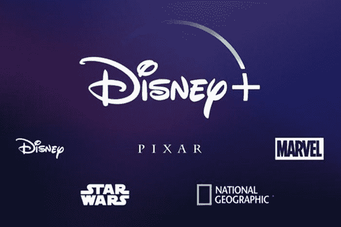
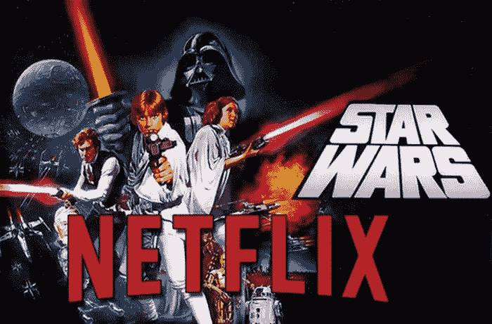

# 为什么网飞和其他人必须害怕老鼠的房子

> 原文：<https://medium.datadriveninvestor.com/why-netflix-and-others-must-fear-the-house-of-mouse-952febd4b405?source=collection_archive---------9----------------------->

## 由于他们新的流媒体订阅服务，迪士尼不会停止接管世界。

说真的，有什么事情是迪士尼*不会*做的吗？他们抓住了漫威影业有限责任公司。他们把星球大战。他们刚刚设法为 20 世纪福克斯找到了一个家。算一下:**这几乎是人类所知的每一个漫威超级英雄**。还有宇宙中每一个**绝地大师**。此外，他们现在在 Hulu 也有股份，而 20 世纪福克斯公司就在 Hulu 上。见鬼，迪士尼实际上拥有*死亡池。*认真。但是一个*流媒体服务*？

 [## 投资算法快速指南-数据驱动投资者

### 让我们想象一下 30 年前的股票市场:让我们想象一下现在:像现在的许多其他领域一样，投资市场已经…

www.datadriveninvestor.com](https://www.datadriveninvestor.com/2019/01/31/a-quick-guide-to-investment-algorithms/) 

# 小心，网飞。这可能是一个策略，只是提出一个还价，然后买下你。

迪士尼+，老鼠自己的流媒体订阅服务之家，可能会像米奇在《杰克与魔豆》中那样颠覆这个巨人。当然，预计会有一场大战，像 WarnerMedia/AT & T，Amazon Prime 等等。因此，这不仅仅是一场一对一的战斗。

然而，当你拥有魔法王国的影响力时，你就有了像基于《猎鹰》和《T21》的电视连续剧的可能性——同样的演员重新扮演他们的角色。或者洛基从你自己舒适的家里回来开始他自己的插曲式的冒险怎么样？这么说吧，如果你喜欢漫威(谁不喜欢呢？他们的电影非常畅销)，很有可能你真的想要迪士尼+。

# 但是，这距离迪士尼+还有很长的路要走

流媒体服务将于 2019 年下半年推出，因此我们还有一段路要走。有人说它比网飞便宜，这将是打败红与黑的游戏规则改变者。但是，说真的，迪士尼+能比网飞好多少呢？毕竟，这位数字媒体订阅的大师目前有很多事情要做。

然而，网飞与迪士尼的合同将于 2019 年底到期。所以你可以看到墙上的字——这意味着如果你确实想要那些电影，像《最后的绝地》(T0)、《T2》、《雷神 3：诸神的黄昏》( T3 ),你最好完全迁移到迪士尼。[我们想知道网飞是否意识到了这一点。然而，让我们都记住…**(比较陌生的东西** …。是啊。).](https://vigyaa.com/@pierre/3-reasons-why-netflix-should-worry-in-this-new-media-streaming-wa-7405a07b/)

迪士尼仍然拥有 Hulu 的一部分，你会印象深刻地知道，魔法王国的创意头脑也将在 Hulu 上发布他们的原创节目——这可能会让网飞的老对手再次回到榜首，尽管 Hulu 做得一点也不差。

# 目前可能性真的是无止境的

**曼达洛人**——仅在迪士尼+上独家播出的《星球大战》系列*，由乔恩·费儒掌舵——将给我们带来《星球大战》的元素，这只会让我们渴望一些沙拉克坑和一些赫特人。我们挖掘。但是你知道吗，他们也在玩另一个基于星球大战外传：侠盗一号角色**卡西纳和或者**的星球大战系列？*

*迪士尼有的，网飞没有的:鼠标有**属性**。虽然《网飞》是一部电影，而且是一部热门电影，但迪士尼也有几部《T21》以及自己的电影(《冰雪奇缘》、《破坏王》、皮克斯、亚达亚达)。所以这是一些重炮对抗一个全副武装的堡垒。*

*此外，你还可以启动迪士尼的整个目录。但是当然。*

# *我知道网飞现在是国王，但我个人会有点害怕*

*这只是我。请记住:我绝对不是网飞。但是也许迪斯尼知道他们并没有那么好，这对《老鼠之家》来说是一件非常好的事情。我们很快就会看到流媒体巨头碰撞时会发生什么。你有任何关于流媒体服务和技术的消息吗？ [**注册一个 VIGYAA 账号，告诉我们吧！**](https://vigyaa.com/accounts/login/)*