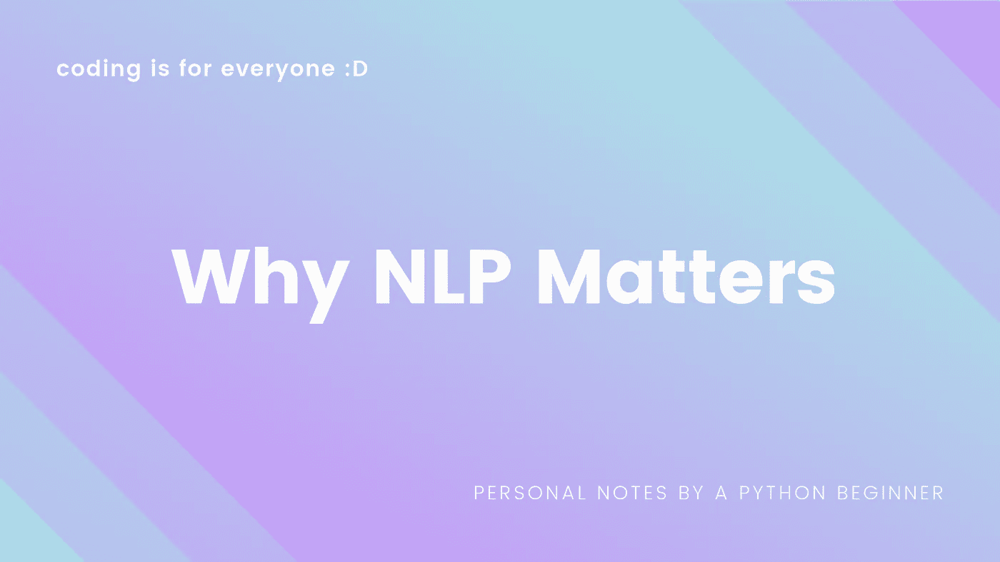
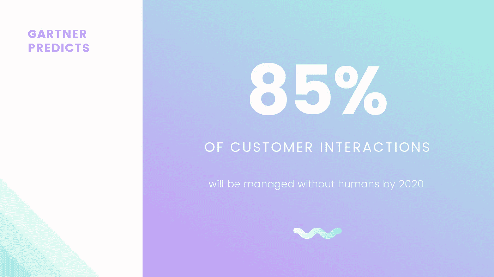
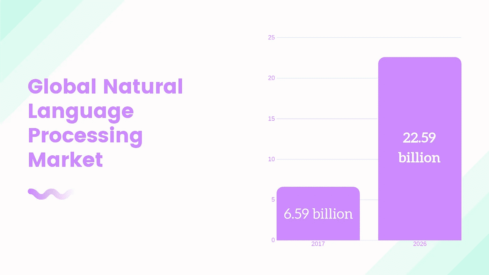

# 为什么 NLP 很重要

> 原文：<https://medium.datadriveninvestor.com/why-nlp-matters-4a539eaaad8a?source=collection_archive---------3----------------------->

> 每年，世界卫生组织(世卫组织)估计抑郁症影响超过 3 亿人，其中近 80 万人自杀。这可能意味着对临床和咨询心理学家的需求可能会增长，因为人们越来越意识到对这种需求的需求，因为个人的意识和联系不能由机器人来建立，或者心理学家可能会被人工智能取代，因为许多应用程序，如 Woebot、Calm、Simple Habit 等，仅在 2018 年第一季度就获得了 2700 万美元的全球收入。
> 
> 人工智能能取代治疗师吗?[?](https://www.aidaily.co.uk/articles/can-ai-ever-replace-therapists) '-

自然语言处理(NLP)是人工智能的一个分支，它允许计算机理解和解释人类语言。从书面的客户评论到给你的虚拟助理的语音命令， [NLP 从人类语言中提取意思，并根据这些信息做出决策](https://www.forbes.com/sites/bernardmarr/2019/06/03/5-amazing-examples-of-natural-language-processing-nlp-in-practice/#5db19c821b30)。

那么为什么 NLP 很重要呢？

 [## 2019 年最值得学习的编码语言|数据驱动的投资者

### 在我读大学的那几年，我跳过了很多次夜游去学习 Java，希望有一天它能帮助我在…

www.datadriveninvestor.com](https://www.datadriveninvestor.com/2019/02/21/best-coding-languages-to-learn-in-2019/) 

**#1 减少歧义**

2019 年 8 月 29 日，韩国第一届韩国法律 AI 大会召开。这是亚洲首次人工智能法律竞赛，结果令所有人震惊:人工智能仅用了 6 秒钟就准确发现了日常合同中的风险。结果，没有法律知识的团队能够在人工智能的协助下击败专业的法律团队。

NLP 很重要，因为[它有助于解决语言中的歧义，并为许多下游应用](https://www.sas.com/en_us/insights/analytics/what-is-natural-language-processing-nlp.html)的数据添加有用的数字结构，如语音识别或文本分析。

谷歌创建了一个名为 BERT(来自变压器的双向编码器表示)的人工智能语言模型，它在具有挑战性的问答领域也表现出了比人更高的准确性。[该模型在超过 33 亿单词语料库的 40 个时期上进行预训练](https://medium.com/syncedreview/best-nlp-model-ever-google-bert-sets-new-standards-in-11-language-tasks-4a2a189bc155)。对于一个普通人来说，阅读 33 亿个单词大约需要 49 年。难怪 NLP 一旦经过适当仔细的训练，准确率会比人类高。

**#2 人类之间更好的沟通**

NLP 不仅仅是计算机理解人类。NLP 的最终目标是使人们之间能够更好地交流。

2019 年 8 月，作为改善非英语语言机器翻译的努力，[脸书宣布了研究奖获得者](https://www.enterpriseai.news/2019/08/30/facebook-funds-nlp-research/)，他们还将研究如何改善自然语言处理及其在边缘设备上部署训练有素的 NLP 模型。

当今社会要求不同语言和文化之间进行有效而富有同情心的交流。[翻译对于信息、知识和思想的传播是必要的。](http://blogs.exeter.ac.uk/translation/blog/2018/06/19/the-importance-of-translation-studies/)

通过启动人工智能语言研究联盟，脸书将在推进优先的自然语言处理研究方面寻求密切的合作和伙伴关系，如神经机器翻译，信息提取和情感分析。**脸书表示，它将把研究成果用于各种应用，从** [**改善客户服务和有针对性的广告，到促进通过社交媒体**](https://www.enterpriseai.news/2019/08/30/facebook-funds-nlp-research/)**提供内容。有了 NLP，脸书将能够有效地翻译感动世界各地人们的内容。**

**Nvidia 还在 NLP 训练和推理方面投入巨资，以便实现客户和聊天机器人之间更复杂的实时响应交流。Gartner 预测，到 2020 年，85%的客户互动将在没有人工参与的情况下进行，NLP 将在未来广泛用于改善人类沟通。**

****

****#3 融入各个领域/行业****

**以下是 NLP 最近取得的一些进展:**

**●【零售】[IBM 的一位发明家开发了一种认知助手](https://towardsdatascience.com/your-guide-to-natural-language-processing-nlp-48ea2511f6e1)，它像一个个性化的搜索引擎一样工作，通过学习你的一切，然后在你需要的时候提醒你一个名字、一首歌或任何你不记得的东西。**

**●[医疗保健] [亚马逊理解医疗](https://aws.amazon.com/ko/comprehend/medical/)是一种自然语言处理服务，它可以轻松使用机器学习从非结构化文本中提取相关医疗信息，例如来自医生笔记、临床试验报告和患者健康记录等各种来源的医疗状况、药物、剂量、强度和频率。**

**●[银行业 Juniper Research 的一项研究发现，[到 2023 年](https://www.juniperresearch.com/press/press-releases/bank-cost-savings-via-chatbots-reach-7-3bn-2023)，全球银行业使用聊天机器人节省的运营成本将达到 73 亿美元，高于 2019 年的 2.09 亿美元。这意味着 2023 年银行节省了 8.62 亿小时的时间，相当于近 50 万个工作年。**

**●[媒体]为了帮助识别假新闻，[麻省理工学院的 NLP 小组开发了一个新系统](https://towardsdatascience.com/your-guide-to-natural-language-processing-nlp-48ea2511f6e1)来确定消息来源是否准确或有政治偏见，检测新闻来源是否可信。**

**● [Beauty] Ulta Beauty 是美国最大的专业美容零售商，QM Scientific 是一家位于硅谷的初创公司，利用人工智能 NLP 的力量在零售领域提供尖端的消费者体验。通过 Ulta Beauty 的首次收购， [QM 科学团队加入了 Ulta 的数字创新团队](https://www.builtinchicago.org/job/data/data-scientist/84956)。**

**[2017 年，全球自然语言处理市场价值为 65.9 亿美元，预计到 2026 年将达到 225.9 亿美元](https://scoopjunction.com/natural-language-processing-market-industry-size-growth-share-trend-key-vendors-and-future-forecast-report-2019-2026/110483/)。仅数字语音助手一项就有望在未来四年内从 25 亿攀升至 80 亿。**

****

**NLP 很重要，因为它是一个迫在眉睫的未来，一个即将到来的标准，一项将改变我们世界各个方面的必要技术。减少歧义，使人类之间更好的交流成为可能，以及将技术集成到每个领域，这些只是 NLP 向我们承诺的一些优势。NLP 很重要，因为语言是每种文化的气息，它将加速人们之间差异的真正连接。**