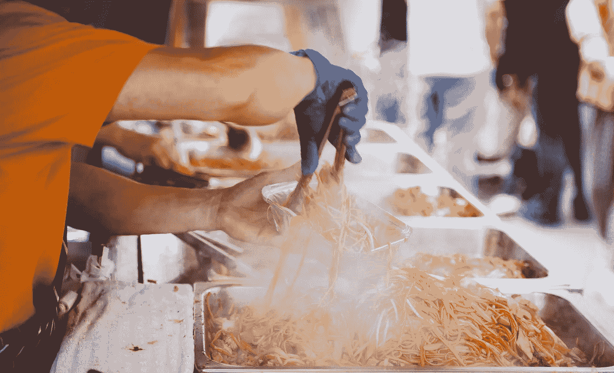
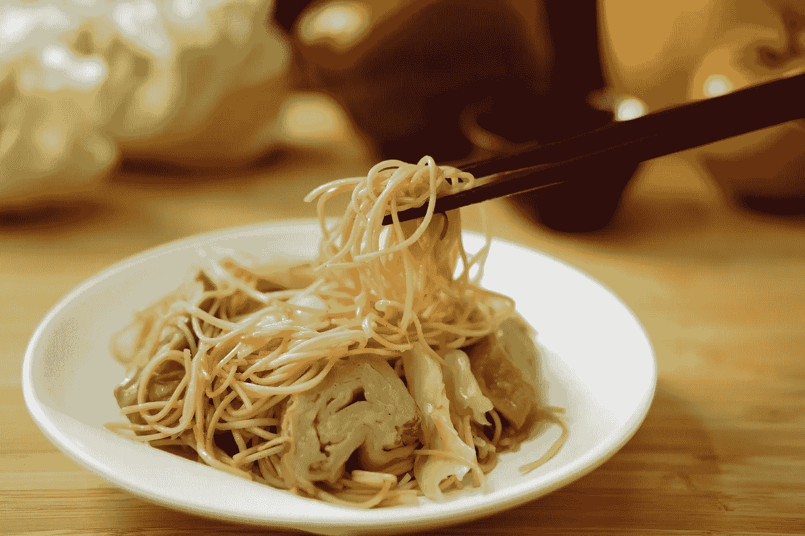

# 为什么面条在赛博朋克科幻小说中如此受欢迎。

> 原文：<https://medium.datadriveninvestor.com/why-noodles-are-so-popular-in-cyberpunk-science-fiction-99f71842726d?source=collection_archive---------2----------------------->

## 谁不喜欢一碗油腻的面条呢？

Image source: Pexels

面条在赛博朋克文化中非常普遍，贯穿于这一流派的许多作品，包括文学、电影、视频和艺术。面条，无论是来自速溶容器还是面条车或摊位，都是赛博朋克社会的主食。他们代表了全球化文化的理念，而且他们在经济学和社会阶级动态方面也很有意义，这些几乎总是出现在基于赛博朋克的世界中。还有，面条超赞。

## 从赛博朋克文化的角度看面条

在赛博朋克多元宇宙中，没有进入从一个世界到另一个世界的复杂动态，赛博朋克文化通常具有某种程度的亚洲影响。赛博朋克文化都在很大程度上受到全球化的影响，或者说是个体文化的融合形成了一个大熔炉。不管是来自旧世界的习惯还是全球化，面条甚至在我们现在的社会也很受欢迎。

如果你在上大学或者过着节俭的单身汉生活，面条，尤其是拉面，是你的两大食物之一。另一种非拉面的主要食物是廉价啤酒。拉面的预算友好性质将渗透到下面的经济和社会阶层讨论中，但重要的是要注意到，由于面条的成本效益和填充性质，它们很容易融入文化，并具有很高的粘性系数，如果你原谅这个双关语的话。

如果讨论中的赛博朋克社会是基于亚洲的，那么很容易理解为什么面条仍然会受到市民的欢迎。面条已经存在了几千年，要将它们从社会的深层文化根源中撬出来，需要做大量的工作(或者没有小麦或可以模拟面条的人造食品化合物)。

如果面粉供应不足是一个问题，希望社会足够先进，能够创造性地使用任何真菌或作物替代品来养活大多数下层民众。有了科学，即使是大众市场上的真菌也可以转化成一些半美味的面条。放入一勺合成的红烧酱和类似芝麻的东西，你就可以享用一顿美味的大餐了。

Image source: Pexels.

从现实世界的角度来看，面条是我提到的全球化的代表，但也包含在 20 世纪 80 年代的第一代赛博朋克中，专注于日本接管美国。在这一时期，日本人用他们的技术和出口产品涌入美国市场，日本企业收购并接管美国公司。如果不采取紧张的政治行动，政府就无法阻止这一点，因为消费者选择用他们的钱支持哪些企业。

华尔街感到恐惧和疯狂，因为日本人即将接管美国，赛博朋克文化融合了面条(以及其他亚洲影响和主题)来代表未来，日本人在 80 年代所做的事情将决定未来，并最终导致赛博朋克小说中形成的社会。

## 面条的经济学

面条的经济学是它变得有趣的地方。卖面谁受益？几乎在所有情况下，每个人。提供方便面或在杂货店大量购买的面条的大公司生产它们，因为他们知道它们会畅销。

从制造业的角度来看，面条制作简单，而且便宜。如果公司知道它会卖，那么他们会大量生产。当一家公司选择批量生产某种东西，并且没有超出他们的生产能力时，他们就体验到了所谓的规模经济。(抱歉)。

有了规模经济，公司生产的越多，他们在单价上节省的就越多。他们的销售抵消了与经营业务相关的固定成本和管理费用，在许多情况下，他们的单位生产可变成本也降低了，因为他们在每个订单中购买了更多的原材料(为大型原材料供应商提供了相同的规模经济效应)。简单来说，他们赚得越多，卖得越多，总成本就越低。赛博朋克文化中的食品公司应该卖面条。面条还让企业有能力大规模营销他们的产品，并获得更大的客户群，这些客户群买不起他们提供的许多更好的产品。

从公民的角度来看，特别是在下层社会，面条提供了难以超越的价值。面条营养丰富，价格基本上无可匹敌，既实惠又美味。如果你生活在下层社会，需要精打细算，那么你应该吃面条。无论它们是在当地的手推车或货摊上从零开始制作，还是从大型商店购买，你都物有所值。因为它们制作成本低廉，你当地的手推车和小摊能够自己制作比商店里买的面条好得多的面条，同时还保持着低得令人怀疑的价格。当然，你会为一碗新鲜的面条多付一点钱，但在下层赛博朋克的艰苦生活中，面条车通常是快乐的主要来源。

> 如果你正在寻找一碗很棒的面条，试试 16 街和德斯提克斯街的 Lon 面条车。

总之，面条根植于赛博朋克文化，这是由于赛博朋克社会中存在的文化和经济阶级结构。有了所有这些复杂的社会动态，就很容易理解为什么面条会在很长一段时间里在这个流派中扮演重要角色。

你觉得面条怎么样？参与对话！

