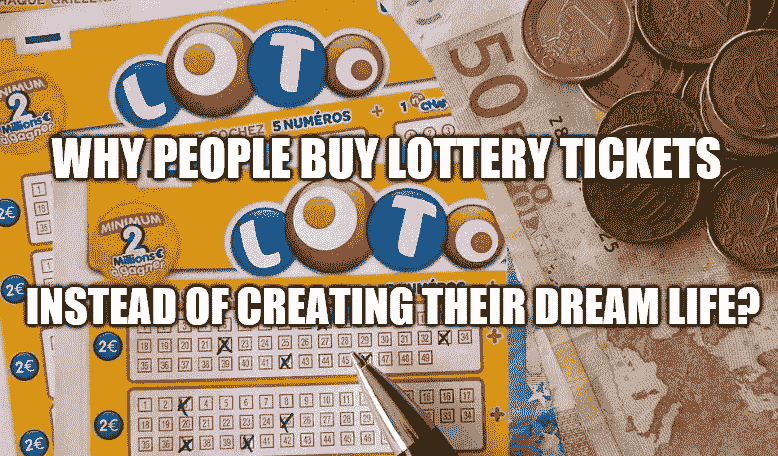
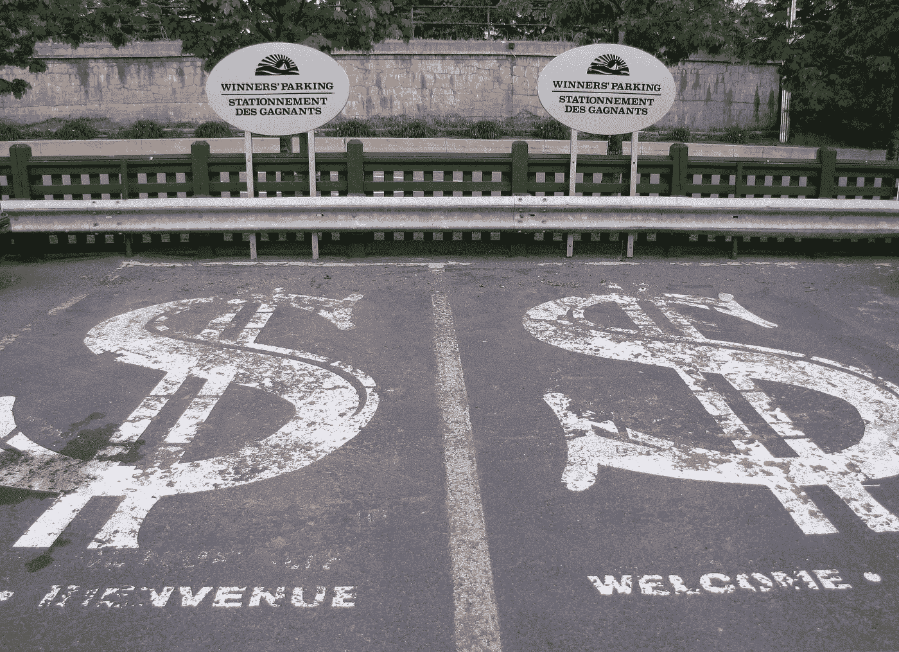
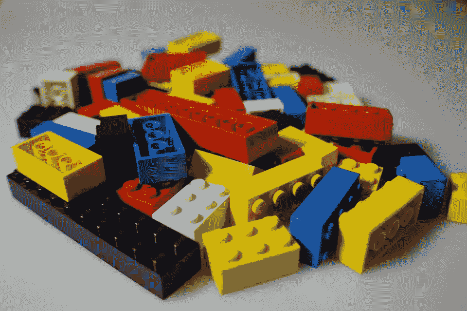
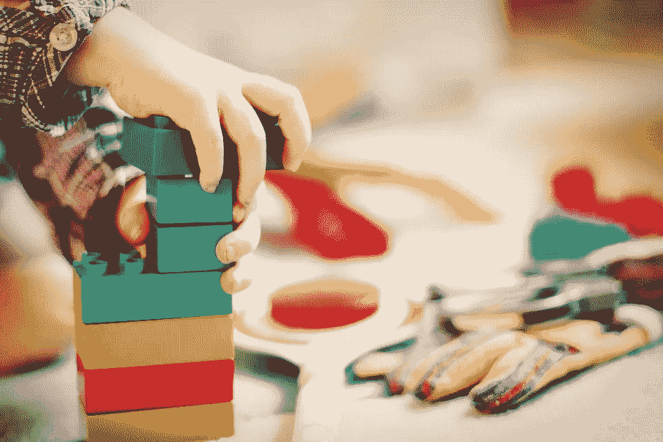

# 为什么人们购买彩票而不是创造他们梦想的生活？

> 原文：<https://medium.datadriveninvestor.com/why-people-buy-lottery-tickets-instead-of-creating-their-dream-life-60c6ce7c12ee?source=collection_archive---------2----------------------->

当中奖的机会几乎为零时，人们为什么还要买彩票呢？以前我认为答案是显而易见的:他们购买是因为他们现在想要百万富翁的生活方式！即时满足！繁荣:百万富翁生活。现在。然而，在给它额外的想法后，这似乎不是一个完全的真理。

事实上，人们购买彩票是一种仪式，因为这给了他们定期幻想过百万富翁生活的许可。这就像买了一张电影票，让你内心的电影院放映:“我，百万富翁”

 [## 更好的预算，打造更大的|数据驱动型投资者

### 即使是专家也承认它们并不完美。从 1 到 10 的范围内，安东尼·科普曼和德尔…

www.datadriveninvestor.com](https://www.datadriveninvestor.com/2018/11/08/budget-better-to-build-bigger/) 

显然，在你的“科普基诺”里玩这种幻想，对许多人类同胞来说，价值每周 2 美元。事实上，大多数人对各种各样的东西都表现出非常相似的行为，比如减肥产品、快速致富计划、产品、约会产品等等。

为什么不把钱花在一年的健身房会员上，然后*做着减肥的白日梦*，而不是真的回到健身房？

多方便啊！花上看似很少的钱，你可以立即为自己“购买”一个解决方案，来平息你内心不断要求你改变生活中某些东西的声音:比如彩票。

Just imagine parking right here! They are mostly empty though… how come?

这里的主要问题是，大多数试图通过*消费来获得幸福的人将会意识到，在购买了他们“感觉良好”的产品并想象了生活可能会变成什么样之后:不是改变生活本身，而是一切都保持不变。很快就需要下一次购买幸福了。就像上瘾的毒品。*

没有一夜暴富，没有一夜减肥，也没有简单的成功之道。

你自己呢？许多人花更多的时间阅读关于致富、成功人士或企业的书籍，而不是尝试自己创业？当然，我们都需要灵感。但是，一旦你觉得自己获得了足够的灵感，该如何开始呢？

大多数人总是抱怨“没有足够的钱或时间”。他们担心自己缺乏成功，而不是专注于他们的小胜利和建立在他们已经得到的基础上。

幸运的是:大多数成功人士、财富和企业都不是一夜之间“建立”起来的。

不知何故，这很符合逻辑，你的梦想越大，你的野心就越大，尤其是你的计划看起来越不可能，你就越害怕失败。由于基于恐惧的决定，许多人不知何故看不到超越他们自己的忧虑、担忧或问题和恐慌。

> F-E-A-R 有两个意思:
> 
> 忘记一切，跑吧
> 
> 面对一切，奋起吧
> 
> 选择权在你。
> 
> 金克拉

换句话说:如果某样东西在几天或几周后不起作用，他们就会转向别的东西。然后又是别的事情，如此循环往复。直到有一天，你猜怎么着，他们再次购买下一张彩票，并通过放弃打破尝试的链条。

如何打破这种明显不可避免的向下螺旋？

Let’s get to work!

改变的关键很简单，但不容易:慢慢减少，然后用创造取代消费。不要做致富的白日梦，开始赚更多的钱，存更多的钱，学习如何投资和让钱为你工作。不要去餐馆，开始多在家做饭。与其多读书，不如开始多写作。不要买精酿啤酒，开始自己酿造吧！需要蔬菜吗？种下它们！理发？自己学着做。让坚持学习和实践成为一种习惯。

> “尽管害怕，但还是要做。重要的是行动。你不需要等到有信心的时候。只要去做，最终信心就会随之而来。”
> 
> 凯丽·费雪

就像开始时的任何事情一样，它可能会令人感到尴尬，你可能不会立即获得成功或满足感。

然而:坚持下去！把它看作一种转变。重要的是你要迈出第一步，并坚持下去。

随着你不断地学习、实践、创造——不管是什么——你会感觉到你的技能每天都在提高。如果你每天只提高 1%，想象一下一年后，两年后，十年后你会变得多好！是复利定律！你的财富会增长，你自己做的食物会变得更好，你的发型会开始变得更好看，你的文章会变得更有吸引力，你会变得更自信，会有更多的乐趣。有一天你可能会做一些你现在甚至不敢梦想的事情。

此外:为世界创造价值比仅仅消费别人创造的东西或想法更令人满意。

最终，你会从实践中获得掌控。这需要时间和重复。你越擅长做某事，创造就会越愉快。你能为这个世界增加的价值越多，越多的想法会从内部推动你——要求你去实现。

你将把自己变成一台思想机器:一个想象工程师！

最终，你再也不能离开你的家而不带一个笔记本来记下你的新想法，并且希望，你甚至等不及要开始并继续做下去。一旦你醒来，你会想从床上跳起来继续工作，你会充满一种新的能量和深深的满足感。

信不信由你:人类生来就是富有想象力的创造者！

不是买彩票的人。在人类历史的大部分时间里，没有彩票。

在某种程度上，只有工业革命的发生才开始改变我们人类的生活方式。由于生产率的提高，企业突然发现自己淹没在过多的供应和不足的需求中。

他们必须想办法让我们相信我们需要更多；他们改进了市场营销，以便让越来越多的人相信，他们需要增加消费，以便“保持经济运行”。不幸的是，许多人接受了这种生活方式。

最令人惊讶的是，尤其是在今天，我们大多数人都充分意识到来自广告商的这种轰炸，我们仍然让他们这样做，并给予他们我们永远的关注——21 世纪的新货币。我们让他们进入我们的生活，我们的家，我们的屏幕，他们比以往任何时候都更了解我们。想想这个星球上的大数据收集者。

问题是，我们相信我们可以通过消费正确的产品和服务来填补内心的空虚。然而，我们永远无法通过简单地消费更多来获得最终的满足感。其实恰恰相反。我们消费得越多，就越容易感受到压力和焦虑。我们消费得越多，占有得越多，我们的财产就越能占有我们——精神上，身体上和情感上。

All my things, what a mess, what to do?

我们需要时间来认识到这个问题的解决方案在等式的另一边:我们太过沉迷于这种消费者心态，以至于忘记了我们内在的创造欲望。至少对我来说，解决办法是少消费多创造。如果我们花更多的时间去创造，我们自然会花更少的时间。这可以省钱，积累技能和经验，并带来更快乐的生活。

> “生活费快死了。”

找到一件能给你的生活、家庭和世界增加价值的事情——让我们开始创造它吧！循序渐进。这样做比买彩票和在现实生活中随着时间流逝而梦想另一种更好的生活给你带来更多的满足感。

对我自己来说，获得新技能，应用它们，创造新技能已经并将永远是我生活中必不可少的一部分。尽管我有能力理发，但我买了一台电动剪发机，我喜欢自己做饭，学会了如何酿造啤酒，粉刷了家里的墙壁，建立了一个室内香草园等等。你的生活不是偶然变得更好，而是通过改变变得更好。所以，停止希望，开始行动。

The only limitation is your fantasy…

你希望能够创造什么？

我很乐意在评论中读到更多这方面的内容！

快乐创作！

马特(男子名ˌ等于 Matthew)

请访问:[财经幻想家](http://www.financial-imagineer.com)并关注:[脸书](https://www.facebook.com/financialimagineer/)，或在[推特](https://twitter.com/FI_imagineer)

声明:我必须承认我自己买过彩票——并且以后还会再买。幻想是一件有趣的事情，嘿，我选择被称为金融幻想工程师。虽然我很享受这种幻想，但我不会把我的“财富积累战略”完全建立在彩票上，也不会因为没有中奖而太失望。如果你已经中了彩票，不知道现在该做什么，请在这里继续阅读。有太多的恐怖故事和可怕的统计数据表明，彩票中奖者迅速致富，然后再次失去一切。