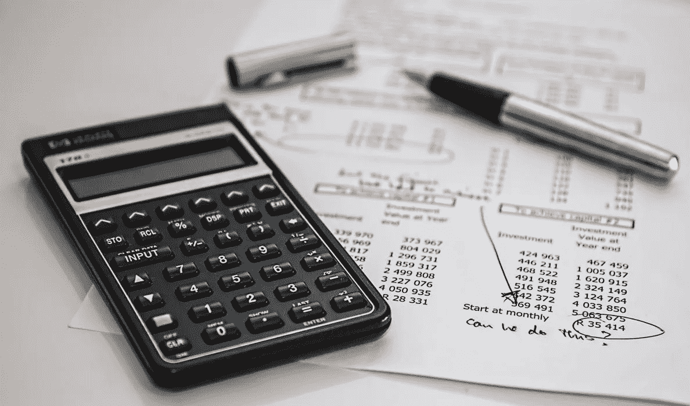

# 为什么个人理财是一个社会禁忌

> 原文：<https://medium.datadriveninvestor.com/why-personal-finance-is-a-social-taboo-350cd4abcfb6?source=collection_archive---------16----------------------->

你是否发现很难与你的朋友或亲戚分享你的个人财务状况？为什么你认为很难与人分享个人财务状况？

我们和朋友谈论政治、性和许多其他事情，但不谈论个人理财。

可能是因为我们不想把我们的薪水透露给其他人，他们会希望我们下次借钱给他们。

不管什么原因，不分享个人财务或不谈钱和分享经验，我们正在阻碍自己获得更多关于有多少作品的知识。与他人讨论让我们知道如何改善我们的个人财务状况。

# 为什么个人理财是一个禁忌话题？

我们知道，由于许多原因，许多人很难与他人分享他们的年收入。

**嫉妒的感觉:**

别人会觉得很难消化你每年赚的钱。有些人只是想看到你在财务生活中陷入困境，因为人们不喜欢分享个人财务。

**他们开始比较:**

当别人决定你的月收入或年收入时，你对他们来说就变得不那么重要了。他们开始比较你和他们的收入，根据他们的比较，要么感觉糟糕，要么感觉很好。

# 你能做什么？

你需要认识人。你需要把人们分为财务状况好的和财务状况差的两类。

财务状况良好的人是那些你可以与之分享个人财务状况和谈论金钱的人。你们可以谈论增加收入的方法，以及如何合作实现双赢。

财务状况不好的人是那些想尽快确定你的收入以便比较的人。如果他们问你的第一件事是“你是做什么的？”这意味着他们最终想知道你的工作和收入。他们想知道你的收入来源和你的年收入是多少。他们想把你的数字和他们的进行比较。一旦他们确定了这一点，你对他们来说就不那么重要了，他们也就不在乎了解你了。

避开财务不好的人。如果他们在个人理财话题上问你一些让你感到不舒服的问题，这意味着他们是你应该回避的人。

# 教你的孩子

教你的孩子个人理财。不要指望他们在学校里学习。

> ***“学校教我们如何有资格去找工作和为别人工作。不是关于我们基本的个人财务。”***

不要觉得害羞或认为孩子太小，不知道个人理财。让他们知道储蓄和投资是如何运作的，复利的含义是什么。

让他们在生活的每个方面练习复合效应，无论是个人理财还是为考试和清除分数而学习知识。

教他们成为财务上负责任的人，以及如何为自己做财务决策。让他们觉得个人理财不应该成为社会禁忌。

# [这是我所有个人理财和生产力文章的清单](https://medium.com/@abhilashgupta8149/personal-finance-articles-index-30e48fcc6075)

**如果您对个人理财和资金管理有任何疑问，我很乐意听取您的意见。**

**感谢阅读。如果你喜欢这篇文章，请随意点击那个按钮👏帮助其他人找到它。**

# 然后..

 [## 每周个人理财报价#3

### 个人理财报价

Quotesmedium.com 个人理财第三名](https://medium.com/@abhilashgupta8149/weekly-personal-finance-quotes-3-23610c0444a7) 

*最初发表于* [*FinCalC 博客*](https://fincalc-blog.blogspot.com/2018/11/why-personal-finance-is-a-social-taboo-fincalc.html)