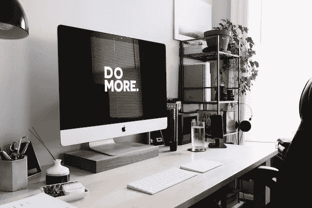

# 为什么个人诚信在工作场所很重要

> 原文：<https://medium.datadriveninvestor.com/why-personal-integrity-matters-in-the-workplace-4ffda91ef22f?source=collection_archive---------9----------------------->

你曾经和一个似乎愿意出卖灵魂以获得晋升或老板关注的人共事过吗？你知道我在说谁。一个人的道德指南针就像一个小东西一样不停地旋转，在一个圈子里转来转去，从来没有真正停在任何地方？

如果你很幸运不知道我在说什么，看看新闻就知道了。我向你保证会有一个关于某个组织的宝藏一直在贪污钱或者一个人被指控性骚扰(通常是多重指控)的故事。

不管这些人是否为公司做出了巨大的工作和贡献，他们的名声是人们记住他们的方式。人们将根据他们的个人和职业操守来评判他们。

## 你的名声定义了你

当我还是一名大学讲师时，我经常和我的公共关系和市场营销学生谈论为什么个人诚信在工作场所很重要。在营销领导力课程中，每次我们研究领导力特质或对一位领导者进行案例研究时，我都会讨论这位领导者的诚信，以及诚信在他们的职业生涯中是如何表现出来的。

我的目标是让我的学生真正思考诚信如何定义一个人和他们的职业遗产。对我来说，我总是听从我头脑中的那个声音，跟随我的道德指南针。这意味着站起来说我不同意一个决定，即使这意味着冒风险。

你猜怎么着？人们注意到了。我从未被视为一个唯唯诺诺的人。我不怕表达我的反对意见，并参与关于道德或一个决定如何影响人们的讨论。有时这意味着与客户断绝关系或离职。

## 你的简历只能到此为止

当你面试一份新工作或升职时，雇主最想要的是什么？参考文献。虽然这些推荐人会被问到关于你的专业能力的问题，但你的个人诚信和声誉也会被考虑进去。不管是正式的还是非正式的。

当我被考虑担任一个高级沟通职位时，我一点也不知道我的同事打来的电话不是我的推荐人。这些都是非正式的私人电话(六年后我从一个被打电话的人那里得知)。

很多对话(不公开)都是关于我作为一个人是怎样的。作为一名团队成员，我表现如何？与他人互动？还有，你猜对了，我的个人操守。

任何读到这篇文章的人力资源专业人士都可能会大吃一惊。等等，你不能这么做。你只能根据列出的参考资料做出决定。但是我们都知道情况并不总是这样。当涉及到与陌生人互动时，我们每天都这样做。我们四处打听，试图找出那个人到底是什么样的人。

对我来说，我的专业简历很强。但我真的相信，作为一名顾问，我所接受的大部分工作以及就业机会，在很大程度上都是基于我在工作场所的个人诚信和声誉。毕竟，有许多其他公共关系专业人士有 20 多年的经验。但是我个人的方法和声誉使我的工作具有影响力。

## 你的名声如何？

我鼓励你评估一下你的个人声誉，以及你的个人诚信是如何在你的专业工作中体现出来的。如果 10 个和你一起工作过的人被问到你的名声和诚信，他们会怎么说？人们会如何记住你？

如果你喜欢你读过的内容，请通过注册来保持联系，从我这里获得更多免费的建议。

这篇文章也作为一篇博客文章出现在[如何沟通](https://howtocommunications.com/why-personal-integrity-matters-in-the-workplace/)。