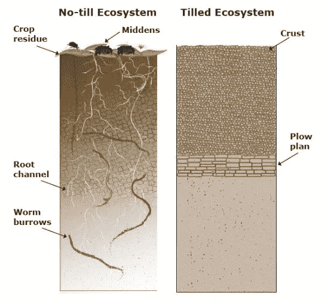
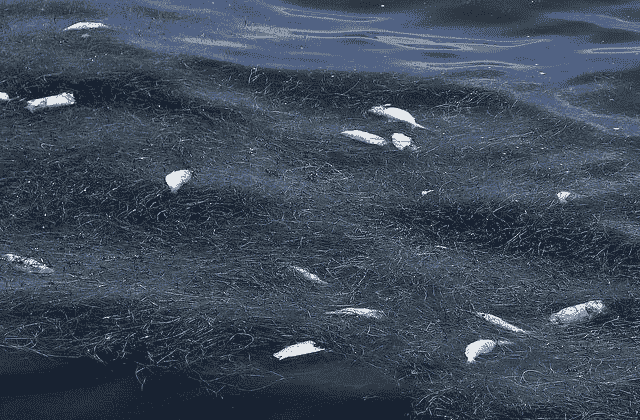
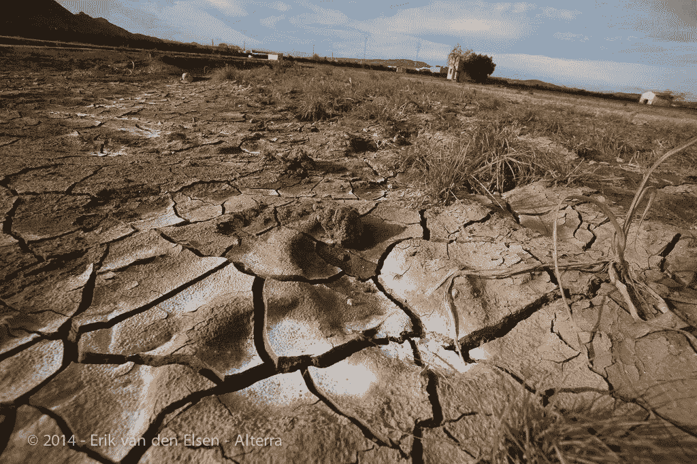

# 为什么耕地是个坏主意

> 原文：<https://medium.datadriveninvestor.com/why-ploughing-is-such-a-bad-idea-62956c17967c?source=collection_archive---------0----------------------->

Tractor ploughing the fields. From [That’sFarming.](https://www.thatsfarming.com/news/ploughing-championships-2017-directions)

*系列“寻求缩编”的一部分。*对于任何在农业地区走过的人来说，你会意识到，正如我们所知，耕地是农业不可或缺的一部分，在许多国家都很普遍。然而，你可能不知道的是，它对生物多样性和全球变暖有非常大的负面影响。

现代传统农业涉及许多不同的过程。翻耕(有多种形式)是一个翻耕表层土壤的过程，就像翻动煎饼一样。翻耕是另一个过程，类似于翻耕，土壤被切割并碎成小块；就像用梳子梳土一样。这两个过程的共同点是，它们都会破坏和扰乱土壤，导致许多破坏和问题——让我来解释一下…

首先，当翻耕和翻耕田地时，田地顶层的植物腐烂分解，在这个过程中产生并释放二氧化碳和甲烷[2]。此外，未耕作的田地(所谓的“零耕作”田地)包含地下真菌和植物，其根系延伸至深处，允许碳隔离(从大气中吸收 CO2)[3]。因此，通过不耕地或翻耕，碳螯合(从大气中吸收二氧化碳)的潜力被释放出来。在欧盟内部，根据目前的传统耕作方法，5%的温室气体(GHG)排放来自农业土壤[4](只有土壤，没有动物！).这比航空业和航运业加起来还多。

Difference between tilled and no-till ecosystems. From United States Department of Agriculture, [USDA](https://www.nrcs.usda.gov/wps/portal/nrcs/detailfull/pa/soils/health/?cid=nrcseprd1221422).

其次，通过扰动土壤表层，土壤结构中负责吸收水分的小孔隙被破坏。事实上，耕地或翻耕土地通常会导致土壤压实[7]；这降低了总的土壤孔隙度。这导致土壤中所有生物的持水能力降低和整体环境恶化[7]。结果，农民不得不浇更多的水，暴雨期间洪水泛滥的风险也增加了。

因此，第三，土壤的天然微生物群受到耕作或耕作引起的破坏和随后的压实的损害。土壤就像我们的内脏一样，它的“健康”依赖于自然存在的生物多样性，包括细菌、真菌、蠕虫和昆虫。所有这些不同的生物都有助于土壤结构的稳定性和多孔性，以及以植物和动物物质分解的有机物形式丰富土壤。这些生物也使矿物材料对作为作物生长的植物更具生物可利用性[10]，[11]。此外，这些生物构成了田鼠和鸟类等大型动物食物链的底层[12]；这反过来又形成了一个生物多样性的金字塔，延伸到田野之外，延伸到树木和树篱之中。所有对土壤的重大破坏都意味着对所有这些至关重要的有机体的家园的重大破坏。

The soil food web nourishes the crops that grow in fields. From [USDA.](https://www.nrcs.usda.gov/wps/portal/nrcs/detailfull/soils/health/biology/?cid=nrcs142p2_053868)

第四，任何土壤都含有埋藏在土壤中的大量种子，就像一个巨大的种子库。当被埋葬时，它们保持休眠状态[14]。然而，当耕作或犁这些种子被带到表面，并允许发芽，[15]，[16]。结果，出现了更多的杂草，农民不得不使用额外的除草剂。

第五，破坏土壤会使其更容易受到风雨侵蚀。在一场暴雨中，2000 吨表土流入了英格兰的怀伊河[18]。一旦失去，这种土壤就无法恢复。此外，雨水侵蚀会导致化肥、杀虫剂和除草剂等农业添加剂流失。这些随着土壤被带走，进入水道、溪流、河流，最终进入海洋，最终导致死亡地带(水生栖息地被改变，变得不适于大多数生命形式的地方)[19]，[20]。目前世界上有 500 个死区，而 1950 年只有 50 个[20]。

Oceanic deadzone. From [AquaViews.](https://www.leisurepro.com/blog/ocean-news/marine-dead-zone/)

最后但同样重要的是，拖着一个 1 . 5 吨重的钢铁设备[21]穿过土壤实际上是一项相当大的努力，需要大量的能量。这些能量以柴油的形式出现，燃烧后为拖拉机提供动力——因此增加了常规农业的 GHG 排放量。

纵观全球，大约 30%的全球土地面积已经严重退化，超过 32 亿人已经受到影响[22]。每年我们都会额外失去相当于希腊面积的肥沃土壤。对于我们当中的经济学家来说，这相当于每年损失全球 GDP 的 10%(这比防止它的成本还要高)[23]。这种人为的自然资源损失为饥饿和冲突铺平了道路[22]。犁还是不犁，在这种螺旋式下降中起着至关重要的作用。

Degraded land. From Eric van den Elsen 2014, [Ecologic](https://www.ecologic.eu/10518).

为什么会这样？

现在你可能会问，为什么会这样？为什么农民会使用有这么多缺点的技术？一个原因是，在传统观念中，农民必须应对两个主要问题:天气和杂草。为了除掉杂草，有三种常见的选择:翻耕(使杂草分解)、除草剂和遮光杀死杂草[18]。在一些农民放弃耕种的情况下，如在美国，除草剂(如草甘膦)的使用量增加了[18](尽管这是不必要的)。在其他情况下，需要进行初始投资，例如购买“十字槽条播机”[25]，这是一种无需翻耕或翻耕即可将种子播种到地里的机器。

此外，当转向无犁/无耕耕作时，在最初几年，作物产量可能会下降，导致一些农民回到旧的做法[26]。然而，在最初几年后，在许多情况下，产量实际上高于传统农业[26]、[25]、[27]。

除此之外，免耕/无犁耕作的话题相对来说并不复杂[25]，[2]。另一个重要因素是，许多农民有相当多的债务，[28]，[29]，并在这种高债务和对低消费价格的更高需求之间徘徊[30]。这意味着农民不愿意尝试任何可能无法从第一天就绝对保证他们已经习惯的利润的新东西。

有哪些选择？

有许多涉及免耕的替代方法，其中许多已被证明比传统方法更有利可图[31]，[32]。这些包括改良的免耕有机农业、直接土壤钻探、恢复性农业[33]、农林复合[34]、永久性农业、使用多年生作物[35]等。有如此大量的可能性，我不会在本文中涉及它们，但是，我会在将来谈到它们。必须注意的是，所有这些方法都取决于和适应所选择的作物类型、土壤类型和当地气候。

至于剩下的，我们需要重新思考我们从事农业的方式，并在我们当前的生态危机面前给予农民应有的关注和帮助。最终，它影响了我们所有人；我们早餐、午餐和晚餐吃的食物。

**参考文献:**

[1]“农业:耕地和犁地有什么区别？——Quora。”【在线】。可用:[https://www . quora . com/Agriculture-What ' s difference-to-tilling-and-plowing。](https://www.quora.com/Agriculture-What-is-the-difference-between-tilling-and-plowing.)

[2] S. Mangalassery、S. Sjö gersten、D. L. Sparkes、C. J. Sturrock、J. Craigon 和 S. J. Mooney，“免耕能在多大程度上减少温带土壤的温室气体排放？，" *Sci。第四卷第 4586 页，2014 年 4 月。*

[3]“土壤有机质的重要性。”【在线】。可用:【http://www.fao.org/docrep/009/a0100e/a0100e0a.htm#bm10\. 

[4]“档案:农业——温室气体排放统计——统计解释。”【在线】。可用:[https://EC . Europa . eu/Eurostat/statistics-explained/index . PHP/Archive:Agriculture _-_ green house _ gas _ emission _ statistics。](https://ec.europa.eu/eurostat/statistics-explained/index.php/Archive:Agriculture_-_greenhouse_gas_emission_statistics.)

[5]“事实&数字航空。”【在线】。可用:[https://www.atag.org/facts-figures.html.](https://www.atag.org/facts-figures.html.)

[6]“减少航运业的排放|气候行动。”【在线】。可用:[https://ec.europa.eu/clima/policies/transport/shipping_en.](https://ec.europa.eu/clima/policies/transport/shipping_en.)

[7]“土壤压实| UMN 延伸。”【在线】。可用:[https://extension . umn . edu/soil-management-and-health/soil-compaction。](https://extension.umn.edu/soil-management-and-health/soil-compaction.)

[8]“频繁耕作及其对土壤质量的影响|综合作物管理。”【在线】。可用:[https://crops . extension . ia state . edu/frequency-turning-and-its-impact-soil-quality。](https://crops.extension.iastate.edu/frequent-tillage-and-its-impact-soil-quality.)

[9]“用覆盖作物提高保水性|平原免耕|模拟自然的农业生产系统。”【在线】。可用:[http://www . not ill . org/improving-water-retention-with-cover-crops。](http://www.notill.org/improving-water-retention-with-cover-crops.)

[10]“地球的自然互联网。”，[http://www . BBC . com/earth/story/2014 11 11-plants-have-a-hidden-internet](http://www.bbc.com/earth/story/20141111-plants-have-a-hidden-internet)

[11]“健康的土壤微生物，健康的人——大西洋。”【在线】。可用:[https://www . theatlantic . com/health/archive/2013/06/healthy-soil-microbes-healthy-people/276710/。](https://www.theatlantic.com/health/archive/2013/06/healthy-soil-microbes-healthy-people/276710/.)

[12]“土壤食物网| NRCS 土壤”【在线】。可用:[https://www . nrcs . USDA . gov/wps/portal/nrcs/detail full/soils/health/biology/？cid=nrcs142p2_053868。](https://www.nrcs.usda.gov/wps/portal/nrcs/detailfull/soils/health/biology/?cid=nrcs142p2_053868.)

[13]“作物栽培与野生动物。”【在线】。可用:[https://reducing-desering . org/crop-culture-and-wild-animals/# No-till _ farming。](https://reducing-suffering.org/crop-cultivation-and-wild-animals/#No-till_farming.)

[14]“维基百科土壤种子银行。”【在线】。可用:【https://en.wikipedia.org/wiki/Soil_seed_bank.】T4

[15]“耕作是你可以跳过的一项家务——精细园艺。”【在线】。可用:[https://www . fine gardening . com/article/tilling-is-one-Jerry-you-may-able-to-skip。](https://www.finegardening.com/article/tilling-is-one-chore-you-might-be-able-to-skip.)

[16]“耕种与耕作的区别&为什么要耕种。”【在线】。可用:[https://mantis . com/culting-the-soil-why-its-important-and-how-that-different-to-tilling/。](https://mantis.com/cultivating-the-soil-why-its-important-and-how-it-differs-from-tilling/.)

[17]“暴雨、土壤侵蚀和养分流失|综合作物管理。”【在线】。可用:[https://crops . extension . ia state . edu/crop news/2008/06/大雨-土壤侵蚀-养分流失。](https://crops.extension.iastate.edu/cropnews/2008/06/heavy-rain-soil-erosion-and-nutrient-losses.)

[18]“杀死犁，拯救我们的土壤。”【在线】。可用:[https://www . Newsweek . com/2014/06/06/kill-plough-save-our-soils-252623 . html](https://www.newsweek.com/2014/06/06/kill-plough-save-our-soils-252623.html.)

[19]“管理径流以减少死区| GEOG 3:粮食的未来。”【在线】。可用:[https://www.e-education.psu.edu/geog3/node/1114.](https://www.e-education.psu.edu/geog3/node/1114.)

[20]“科学家警告说，自 1950 年以来，随着巨大的死亡区翻了两番，海洋正在窒息。”【在线】。可用:[https://www . the guardian . com/environment/2018/Jan/04/oceans-thrusting-dead-zones-oxygen-starvoid。](https://www.theguardian.com/environment/2018/jan/04/oceans-suffocating-dead-zones-oxygen-starved.)

[21]“悬挂式可逆犁质量。”【在线】。可用:[https://en.mass.bg/134/mounted-reversible-plough.](https://en.mass.bg/134/mounted-reversible-plough.)

[22]“土地退化威胁人类福祉，主要报告警告|环境|卫报。”【在线】。可用:[https://www . the guardian . com/environment/2018/mar/26/land-degradation-is-underbasing-human-well being-un-report-warns。](https://www.theguardian.com/environment/2018/mar/26/land-degradation-is-undermining-human-wellbeing-un-report-warns.)

[23]“媒体发布:日益恶化的全球土地退化现在‘危急’，损害 32 亿人的福祉|政府间科学政策平台。”【在线】。可用:https://www . ipb es . net/news/media-release-恶化-世界范围-土地退化-现在-'危急'-破坏-福祉-32。

[24]“由于农业|环境|卫报，地球三分之一的土壤严重退化。”【在线】。可用:[https://www . the guardian . com/environment/2017/sep/12/third-of-earths-soil-acute-degraded-due-due-due-to-agriculture-study。](https://www.theguardian.com/environment/2017/sep/12/third-of-earths-soil-acutely-degraded-due-to-agriculture-study.)

[25]“农民正在放弃传统耕作方式——BBC 新闻。”【在线】。可用:[https://www.bbc.co.uk/news/uk-england-38332276.](https://www.bbc.co.uk/news/uk-england-38332276.)

[26]“通过不再翻耕玉米地提高土壤质量和产量——WUR。”【在线】。可用:[https://www . wur . nl/en/show/Better-soil-quality-and-yield-by-no-long-ploughing-maize-soil . htm .](https://www.wur.nl/en/show/Better-soil-quality-and-yield-by-no-longer-ploughing-maize-soil.htm.)

[27]“耕田真的会损害土壤和庄稼吗？——BBC 新闻。”【在线】。可用:[https://www.bbc.co.uk/news/uk-england-40166313.](https://www.bbc.co.uk/news/uk-england-40166313.)

[28]“‘坏账’在农业和农业部门上升——新闻——农民卫报。”【在线】。可用:[https://www . fg insight . com/news/news/bad-debt-on-the-rise-in-farming-and-agriculture-sector-65810。](https://www.fginsight.com/news/news/bad-debt-on-the-rise-in-farming-and-agriculture-sector-65810.)

[29]“每个新农民都应该知道的农场债务——新贵大学。”【在线】。可用:[https://university . upstart farmers . com/blog/new-farmer-farm-debt。](https://university.upstartfarmers.com/blog/new-farmer-farm-debt.)

[30]“德国的布尔人:骑着战马的德国人，生产的是德国的布尔人。”【在线】。可用:[https://www . volkskrant . nl/economie/de-Boer-moet-uit-de-spagaat-schulden-en-steeds-goed koper-producer en-zet-de-boeren-klem-~ b 90315 FD/。](https://www.volkskrant.nl/economie/de-boer-moet-uit-de-spagaat-schulden-en-steeds-goedkoper-produceren-zet-de-boeren-klem-~b90315fd/.)

[31]“时光倒流机。”【在线】。可用:[https://web . archive . org/web/20110727131205/http://www . not ill . org/knowledge base/03 _ economics _ der psch . pdf .](https://web.archive.org/web/20110727131205/http://www.notill.org/KnowledgeBase/03_economics_derpsch.pdf.)

[32] D. L .贝克、J. L .米勒和 M. P .哈格尼，“中部和北部平原的成功免耕”

[33]“维基百科再生农业。”，【https://en.wikipedia.org/wiki/Regenerative_agriculture】T4

[34]“有机农业和同热带农业之间的差异——议程·戈奇。”【在线】。可用:[https://www . agendagotsch . com/2018/04/24/differences-between-organic-and-syntropic-farming/。](https://www.agendagotsch.com/2018/04/24/differences-between-organic-and-syntropic-farming/.)

[35]“多年生作物|水位下降。”【在线】。可用:[https://www . draw down . org/solutions/coming-景点/常年作物。](https://www.drawdown.org/solutions/coming-attractions/perennial-crops.)