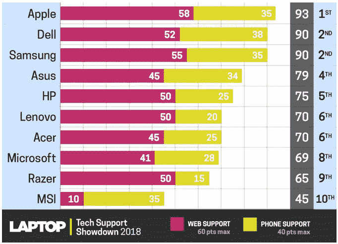
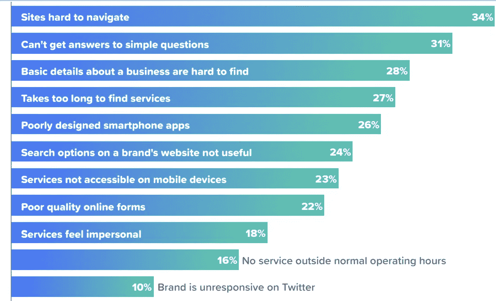
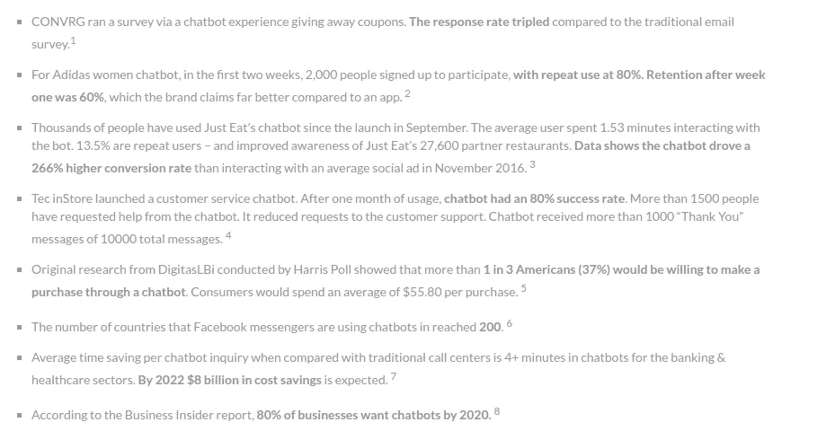
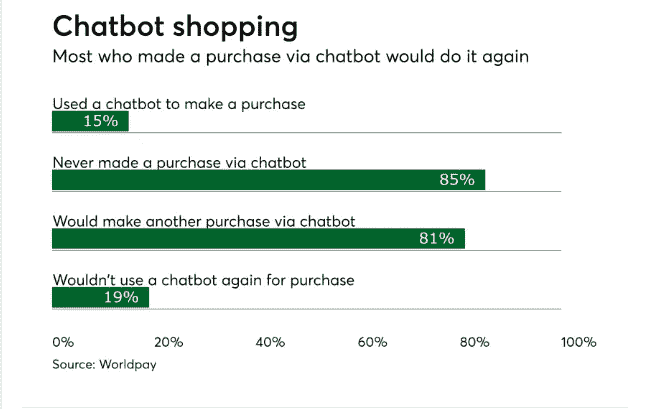
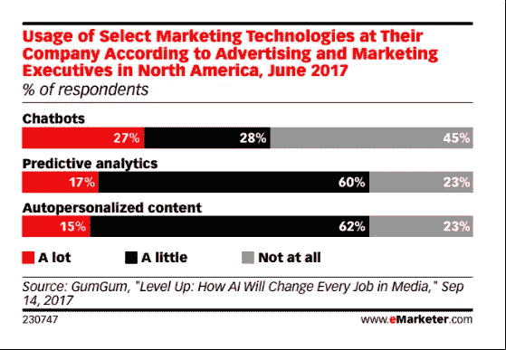

# 为什么聊天机器人的问题根本不是问题？

> 原文：<https://medium.datadriveninvestor.com/why-problems-with-chatbots-are-not-a-problem-at-all-a115be74df31?source=collection_archive---------4----------------------->

在当前自动化和竞争市场的情况下，总是有“更好的解决方案”这几个词的定性分析。如果不能保证公司在市场空间中从所有现有的替代方案中获得优势，公司就不会去寻找一个更好的解决方案。随着聊天机器人逐渐走向主流市场，提供聊天机器人解决方案的人面临着非常特殊的问题。

多年来，聊天机器人由于其 NLP 和机器学习技术的改进而产生了巨大的影响。随着聊天机器人变得越来越聪明，它们也在拖着一些本质上的问题。这些机器人的空间覆盖有时无法模仿人类的大脑，有时根本无法打动最终用户。让我们深入探讨这些问题:

## 人类互动的美好往昔

仍然存在相当多的顾客喜欢与人类互动来获得顾客服务。他们觉得他们需要一张信任的脸，只有人类才能理解他们的情绪，而不是一个屏幕。Destination CRM 的一份报告发现，在美国接受调查的 24，489 人中，超过 83%的人宁愿选择人工而不是数字屏幕来解决客户服务问题。也许，出于这个原因，苹果在 2018 年的技术支持评级中得分最高，因为我们知道他们如何通过各种其他渠道提供内部支持以及客户服务高管。

> 即使你创造了易于使用的产品，人们想要使用技术的各种各样的东西经常会造成复杂性

## 能力覆盖

这是聊天机器人行业发展的主要障碍。聊天机器人是脚本化和手工制作的，这一事实有时会让他们觉得自己是有大脑的 IVR。尽管人工智能是聊天机器人的大脑，但它们解决查询的范围仍然有限。如果一个人走了一条很宽的曲线到达一个点，机器人会回复一条错误消息。

Problems with Traditional Online Experience

一个问题可以有 100 种不同的提问方式，假设一个特定的客服聊天机器人有 10，000 组问题。所以我们正在寻找 10 万个 QnA 的存储库。尽管如此，还是会有用户以第 101 种方式提问的情况。聊天机器人有这样的限制，用户必须在机器人的知识范围内操作他/她的查询。所有这些庞大的知识数据库和后端技术似乎都无法维持这样的变化。即使像 Google DialogFlow 和 Amazon Lex 这样拥有最大的数据库和一系列技术的聊天机器人也有缺陷。

## 承诺与交付

一个产品在初始阶段总是很难找到它的客户群。人们对它可能带来的承诺变化持怀疑态度。聊天机器人仍处于创造影响力的初级阶段，这种影响力将把它自己拉进主要市场。企业正在慢慢向自己灌输人工智能聊天机器人统治客户服务和其他领域的想法。将聊天机器人作为产品销售的公司在某种程度上正在经历类似的过渡阶段。获得这些解决方案的公司必须深入研究该过程中失败的可能原因。让聊天机器人成为屏幕后说话的神奇人类总会有一些缺点。销售产品的公司通过展示他们的解决方案将解决的其他问题来隐藏问题。尽管如此，这仍是一种聪明的做生意方式。但是，承诺不兑现的可能性总是存在的，而且由于实施聊天机器人的概念有不同的结果，所以并不是每个聊天机器人销售会议都是成功的。

> 企业提供的在线体验不再符合人们喜欢的购物方式。

# 如何处理这些问题？

这些问题只是回避了大局。这个宇宙中没有一个系统是理想的或完美的。这也是聊天机器人所固有的。聊天机器人的上述问题对其增长几乎没有任何负面影响。

日益增长的可靠性、快速通信和即时解决问题的能力使得聊天机器人成为大众的最爱。

有许多研究和报告表明，人们实际上是如何坚持使用聊天机器人与公司互动并解决他们的问题的。根据 Worldpay 的一项调查，80%的美国人表示他们会再次尝试通过聊天机器人购物。值得注意的是，这些机器人在任务管理和解决问题的过程中可以超越人类:

1.  人工代理在解决客户问题时相对较慢
2.  由于语言障碍和清晰度问题，向这些代理解释客户问题很麻烦
3.  人工代理一次只能满足一个客户的需求

因此，更喜欢人类代理的群体最终会见证向聊天机器人支持的过渡，这只是一个时间问题。

**它的**真正的聊天机器人仍然不能像人类客户代理那样处理查询变化。两个人总是很容易无缝地传达他们的想法。

但是，值得一提的是聊天机器人智能在过去几年中的发展。由于教机器人以多种方式阅读一个问题是一个迭代过程，所以完全提供算法需要时间。这与人类儿童在成长过程中如何学习理解问题是一样的。

现在持续存在的聊天机器人的这种有限能力，很快就会通过逐步的开发和教学而被消除。很快聊天机器人将拥有:

1.  所有领域知识
2.  没有成本过高的阻力
3.  多样化的对话脚本
4.  全自主人工智能大脑
5.  自动创建知识库

聊天机器人制造商正在争夺一个体面的市场。他们现在面临的唯一挑战是时间。

如同任何迭代过程一样，误差随着每一步而衰减。考虑到数字化和市场偏心的影响，这种利基技术解决方案正在见证一些即兴的聚光灯:

1.  潜在客户、客户满意度和优质服务的多维度增长
2.  弥合 B2B 和 B2C 市场属性之间的差距
3.  商业利益、技术解决方案和利润上限的惊人增长

阻碍聊天机器人产业的问题现在就像一场冷火，等待着很快死亡。它提供的服务超出了人们的预期，很快，围绕这些机器人效率的两难问题将迎刃而解。