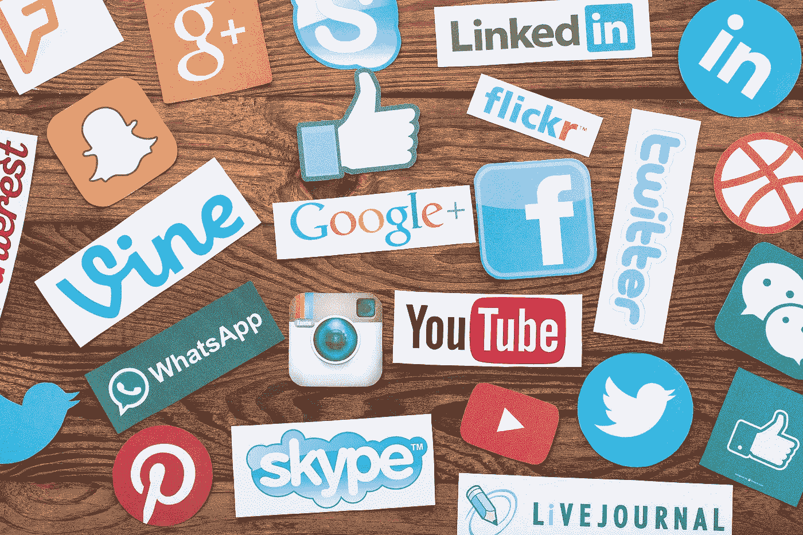

# 为什么 Reddit 比 Twitter 快乐

> 原文：<https://medium.datadriveninvestor.com/why-reddit-is-happier-than-twitter-933988502a11?source=collection_archive---------4----------------------->

## 机制设计的社会影响

作为一个在我加入 Twitter 之前已经使用 Reddit 多年的人，我最初惊讶地发现，对推文的回复并不像我过去在 Reddit 的评论区看到的那样轻松愉快。虽然 Reddit 上的热门评论往往要么是有用的信息，要么是诙谐的笑话，但 Twitter 上的热门回复往往是激进的党派声明或个人侮辱。最近，这引起了我的思考:鉴于两个平台用户的人性是不变的，是什么导致一个倾向于推广信息和幽默，而另一个倾向于愤怒的党派偏见？

这是一个大问题，因为 Reddit 和 Twitter 的设置有很多不同。但是让我们只考虑每个网站基本设计的一个方面——用户与评论交互的选项:

*   Reddit 有向上投票和向下投票按钮——用户可以给出反馈，表达同意或不同意。
*   Twitter 有赞——用户只能给出表示同意的反馈。没有办法表达不同意。

我不知道每个网站用于确定评论排名的确切公式，但让我们假设以下规则，这些规则似乎在两个网站上都大致成立:

*   分数较高的评论被置于分数较低的评论之上
*   新的评论以零分*开始，并且最初被放置在现有的高分评论之下

*(*技术上讲，Reddit 给新评论赋的初始值是 1；然而，为了便于说明我的观点，我们将假设默认值为 0。)*

这两个网站的排名公式有更多的细微差别，但上述规则似乎是主要的影响因素，应该足以进行广泛的讨论。

现在让我们看看具有某些特征的评论如何在每个网站上得到不同的排名。

在 Reddit 上，

*   一个充满仇恨的评论会受到大多数用户的反对，导致一个净负分，并被放置在评论区的底部。
*   一个广受欢迎的评论会得到大多数用户的支持，净正面得分会把它放在首位。
*   一个两极分化的评论会得到同意的用户的支持，以及不同意的用户的反对。如果分配是平衡的，向上的投票和向下的投票会取消，使最终结果分数接近零。
*   新评论以零分开始，最初将它放置在具有负分的旧评论之上，并且在具有正分的旧评论之下。因此，提交新评论有助于通过增加负分数之上的评论数量来降低负分数评论的可见性。
*   评论收到的第一张赞成票并不能永久保证一个积极的分数。如果一个充满仇恨的评论最初获得了一些赞成票，那么随后的反对票将会降低其净得分，并随着时间的推移而向底部移动。
*   如果一个评论有大量的反对票，那么它得到的赞成票的数量是无关紧要的。决定名次的是净得分。

结论:最明显的评论包含用户普遍认为有价值的陈述。如果许多用户觉得这些言论令人反感，那么代表少数声音的评论就不太可能获得高水平的可见性。一个评论对社区的价值比它迅速获得更多投票的能力更能影响它的排名。

在推特上，

*   一个评论的分数是有多少用户同意的计数。分数不考虑不同意的用户数量。
*   一个两极分化的评论可以从同意的用户那里获得大量的喜欢，从而产生高水平的可见性，不管有多少用户不同意。
*   评论收到的第一个赞会极大地影响它的永久排名。如果一条引起争议的评论获得了一个赞，那么它将永远比那些尚未获得任何赞的评论更加显眼。
*   一个充满仇恨的评论，如果得到一些喜欢，就可以有一个正分。即使大多数用户觉得它令人反感，少数喜欢也会将其永久置于得分较低的评论之上。
*   一个新的评论被放置在已经获得任意数量的赞的现有评论的下面，即使现有的评论是两极分化或仇恨的。因此，已获得一些喜欢的现有分裂性评论阻止新评论被看到，即使新评论具有更有价值的内容。
*   如果一个代表党派观点的评论在其他评论之前获得了大量的赞，那么这个评论可以迅速上升到榜首。由于不同意的用户不能降低它的分数，它将保持在顶部，除非另一个评论获得更高的分数。

结论:最明显的评论不一定包含大多数用户同意的陈述。代表少数声音的评论可以获得相当高的可见性。一个评论快速获得喜欢的能力对其排名的影响要大于其对社区的价值。

## 为什么这很重要？

随着社交媒体的发明，我们一直在创建并继续创建在线社区。根据定义，这些网站必须为人们提供一个相互交流的结构和系统。正如我通过一个小例子所展示的，这个结构是如何设计的，会影响人性的哪些方面被放大。随着我们继续建设和参与在线社区，我们必须意识到我们使用的设计如何影响人类行为的哪些特征被强调和给予影响。