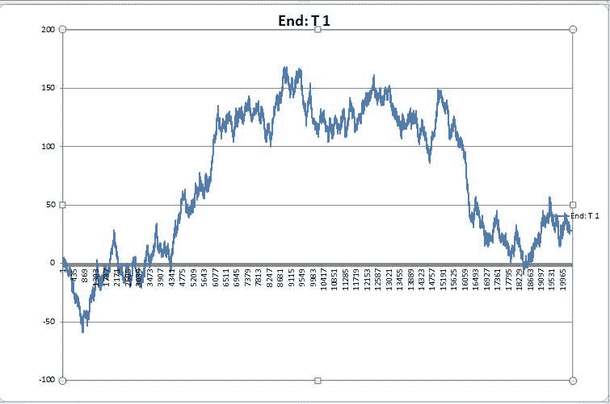
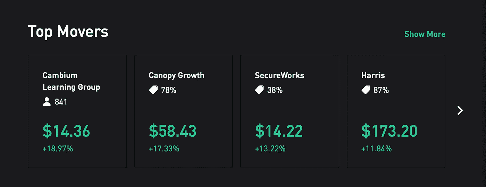
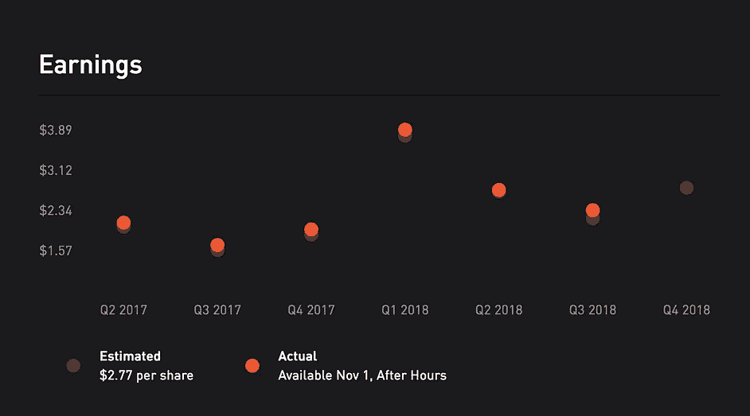
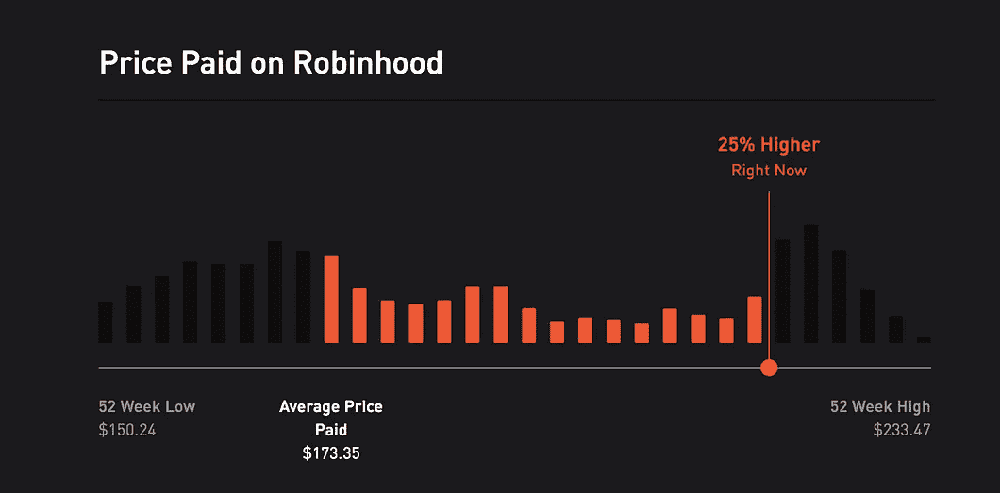
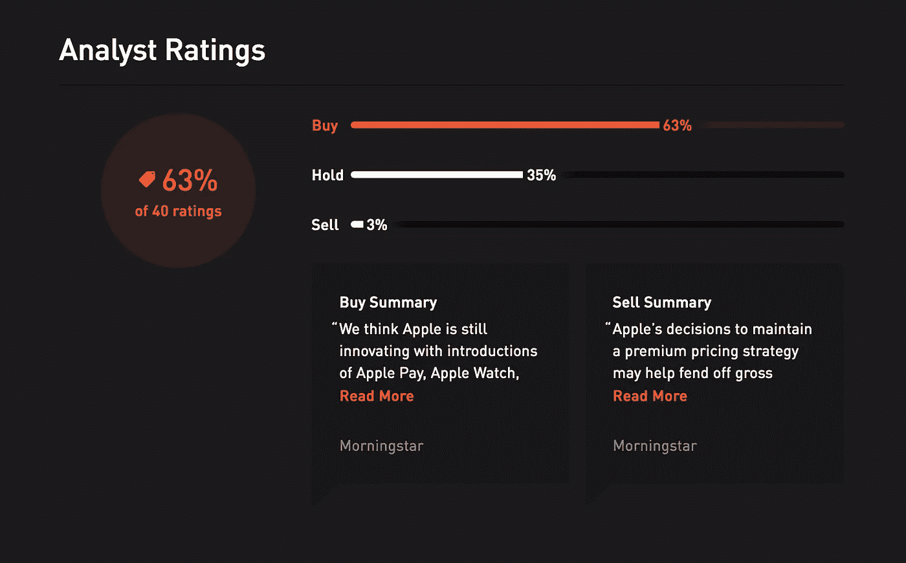
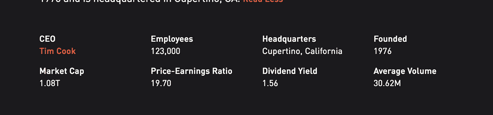

# 为什么 Robinhood 不想让你赚钱

> 原文：<https://medium.datadriveninvestor.com/why-robinhood-doesnt-want-you-to-make-money-dbab18cf5e91?source=collection_archive---------11----------------------->

## 什么是罗宾汉？

> Robinhood 让你直接从手机或台式机上免费投资股市。

Robinhood 通过将你未使用的存款投资于自己的企业来赚钱。

让用户获得资本收益符合罗宾汉的既得利益。如果用户赚了更多的钱，他们会向他们的朋友吹嘘，然后他们的朋友会想参与进来，给 Robinhood 更多的用户，和更多可投资的钱。

显而易见，罗宾汉希望你成功，但为什么他们强调一种与其他方法相比被证明无效的投资策略呢？

那么这个方法是什么呢？这叫做技术分析，它包括查看股票图表来衡量你的决定。更深入地说，它包括试图预测大众*(游戏中的其他投资者)*会做什么，并利用它。

Random coin toss results. “Buy the dip”.

## *这有什么问题？*

在投资中，折线图有助于识别模式和观察“趋势”的更新。这个问题在于，它引发了一种情绪反应，或者是一种“趋势”的“逻辑”分解。

这些技术分析师可以“看到”的情绪反应和近乎随机的趋势，没有什么依据，而且经常崩溃，导致资金损失。

我们在过去看到过这种不基于现实的耸人听闻的购买，如郁金香球茎热潮和最近的加密货币泡沫。

当人们认为:*“它一直在上涨，更多的人会买入，所以我肯定可以卖给下一个傻瓜，并获得 400%的回报”时，就会出现这种情况。*

已经多次证明，通过分析图表进行的投资，表现不如通过基本面分析进行的投资，或者更好的是，通过多样化的 ETF 跟踪整个市场。

## 罗宾汉是如何强调这一点的？

从这些截屏可以看出，您可以在图表中看到最近的价格变动。当你更深入地观察任何股票时，你可以开始看到一个趋势，价格的线图占据了大部分的零售空间。此外，颜色是用来唤起直接反应的，绿色感觉自动良好，红色感觉不好。

Here we see an emphasis on movement, not value.

These emphasize what the value was in the past, which has little to no indication of the future.

This shows that you should buy or sell based on “Wall Street analysts”. Their analyses are already worked into the stock price. What can these analysts predict, and they aren’t capitalizing on? It is a common joke that if you will trade off of these you will most certainly lose money.

Here is all we have for the numbers to do a math based analysis.

此外，用于进行适当基本面分析的数据不太明显，也不完整。

# *那么罗宾汉为什么不强调什么会让人赚钱呢？*

人们不想看到这些数字。
人不在乎。

他们想变得大胆，大胆下注，感受股市的过山车。为什么不呢？这很有趣，令人兴奋，也很性感。

当你精心配置的三重杠杆保证金期权获得 800%的回报时，没有什么比这感觉更好的了，尽管从统计数据来看，这是完全不可持续的，从长远来看也不太可能。

罗宾汉提供了一个满足这种感觉的平台。

此外，罗宾汉专注于图表，因为可以用来评估一家公司成功与否的硬数字会让投资界的新来者望而生畏，而投资界是罗宾汉客户的一大部分。

因此，Robinhood 像其他主要的在线经纪公司一样，展示图表来安抚人们。

这是罗宾汉的错，还是他们只是在做最终用户真正想要的？这是投资文化的问题，还是经纪公司设计的问题？