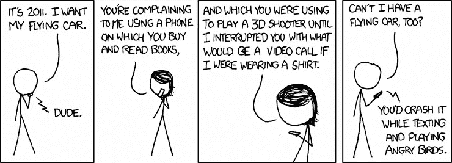
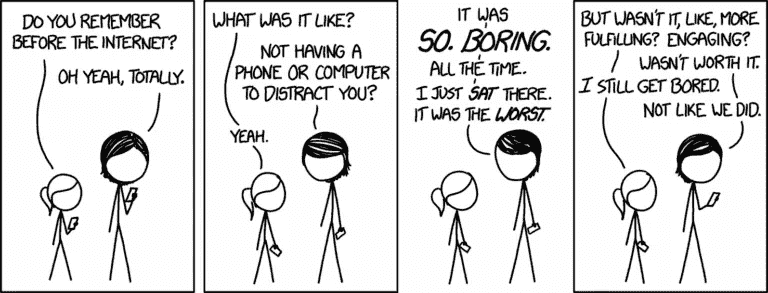
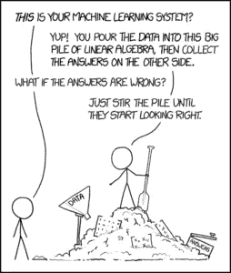
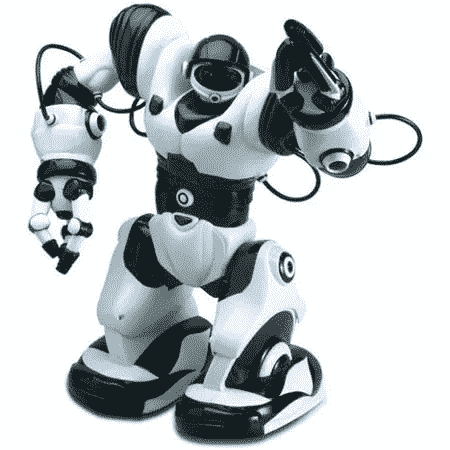
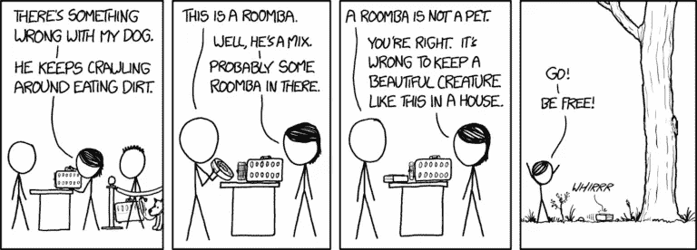

# 为什么是机器人？

> 原文：<https://medium.datadriveninvestor.com/why-robots-11c7d7892e13?source=collection_archive---------18----------------------->

自从我小时候父母给我买了第一个机器人玩具，我就对机器人很感兴趣。这些年来，我很幸运有很多机会和机器人一起工作。我玩过玩具，花了多年时间为比赛制作乐高和重金属机器人，最近还做了机器人研究。所以，当我认真考虑我的余生想做什么的时候，“与机器人一起工作”是第一个也是最自然的选择。

不久前，一个朋友问了我一个简单的问题:“为什么是机器人？”。我很惊讶这是一个问题:有*所以* *许多*明显的答案。更相关的问题应该是‘为什么*不是*机器人？’。当我的朋友指出这不是一个充分的答案时，我意识到我还没有真正考虑过我想和机器人一起工作的所有理由。当涉及到重大的生活决策时，我非常相信从基本原则出发进行谨慎而有意识的推理，所以对于“为什么是机器人？”这个简单的问题，我没有一个令人满意的答案，这非常令人担忧。。

我花了很长时间思考这个基本问题的答案，幸运的是，我找到了一个令我非常满意的答案。这篇文章试图捕捉并记录这个答案。

你问为什么是机器人？

# 有史以来最伟大的工具

几千年前，智人的生活确实非常艰难。最主要的问题是食物:大多数智人每天至少会挨饿一次，唯一的解决办法就是寻找和消耗食物。不幸的是，食物不只是出现在一个集中的位置，它通常需要被猎杀。让我们的祖先非常烦恼的是，智人需要追逐和杀死那些不希望被杀死和吃掉的动物。为了使存在更令人讨厌，一些动物想追逐和杀死智人。这提出了一个困难的生存困境:智人需要获得食物，但自己不能成为食物。这确实是一个相当大的问题，因为许多动物比智人更大、更强壮、更致命。

然而，智人有了一个重要的发现。他们意识到这些我们称之为岩石的无处不在的东西非常坚硬。这是一个有用的属性，因为岩石可以用来造成伤害。然而，用石头完全杀死一只动物是很困难的。在某个时候，几个智人意识到他们可以磨尖岩石。他们制作了第一把粗糙的斧头和长矛。突然间，狩猎和保护自己变得容易多了。突然，它们移动到了食物链的顶端。

我们祖先对岩石的发现和利用可能看起来微不足道或无关紧要，但它无疑是人类历史上最重大的事件之一。那些石头是我们最早的工具。工具的发现和使用被认为是智力的独特标志。事实上，正是这种创造工具的能力成就了现代生活。从粗糙的矛和斧，我们前进到火，然后是衣服，然后是建筑用砖，然后是金属加工，然后是轮子，最后是印刷机，然后是蒸汽机，然后是电动机和发电机，然后是电话和电灯泡，然后是为计算机铺平道路的晶体管，最近是互联网。整个技术领域，我们的物种从几个分散的部落扩展到拥有 80 亿个体的每一个大陆的原因，本质上是理解自然世界的规律并使用这些规律来建立帮助我们利用它的工具的一种练习。

It’s an amazing time to be alive! [2]

智能机器人可能是我们发明的最伟大的工具。

像以前改变世界的工具一样，机器人拥有前所未有的潜力来*实现*。人体有很大的局限性:我们无法在辐射或极端温度下生存，并且很容易受伤。有了机器人，我们可以在第一批人类到来定居之前花费数年时间建造外星栖息地，我们可以以前所未有的安全水平运营核电站，我们可以让身体残疾者做几乎任何正常人可以做的事情。人类容易犯可避免的错误。机器人在以前见过的环境中更不容易失败，它们可以使我们在医疗诊断和常规手术中挽救生命。人类无法在长期缺乏食物、水或睡眠的情况下茁壮成长，也不喜欢做重复的苦工。机器人可以用最少的能量昼夜不停地做苦工，从而使我们能够生产和分配足够的资源，供地球上的每个人生存和发展。

智能机器人似乎有无穷无尽的应用。然而，最具变革性的应用可能是那些今天无法理解的应用。当像查尔斯·巴贝奇、艾伦·图灵和约翰·冯·诺依曼这样的先驱最初构想出计算机时，他们做的似乎是一种令人难以置信的利基用途。他们最感兴趣的是使用计算机快速求解多项式方程或计算难以处理的积分。他们可能意识到他们的发现会有其他用途，但他们可能都没有想到数字文件存储、视频投影、电子邮件或计算机已经实现的无数其他事情。类似地，广泛分布的智能机器人可能会产生无数其他令人兴奋的下游工具，这在今天是不可能预见的。

机器人可能会成为下一个改变世界的工具；我们的后代会回过头来想知道没有它人类是如何生活的。这种前景让我兴奋不已。

# 比特和原子的结合

计算机目前可以说是有史以来发明的最伟大的工具。想想计算机在发明后的短短 50 年里对我们的生活产生了多大的影响，真是令人敬畏。的确，很难想象没有计算机的人类生活。

It’s also difficult to imagine life before the Internet…[2]

虽然看起来计算机可以解决几乎所有的问题，但是他们确实有一个重要的限制，有人已经向我指出了这一点。计算机在一个比特的世界中运行，但现实世界是在原子上运行的[1]。从本质上说，计算机是信息处理机器。尽管信息非常有价值，但它本身毫无用处。当信息被用来操纵物理世界的原子时，信息的力量——以及计算机的力量——就显现出来了。尽管计算机拥有强大的处理能力，但它不能直接操纵原子，人类必须不断地解释和使用计算机的信息来影响世界。

机器人似乎是两个世界之间的第一座重要桥梁，是比特和原子之间的第一次联姻。

这可能看起来像是一个纯粹抽象的，也许无关紧要的观点，但我认为它进一步说明了机器人对我们的影响有多大。机器人将能够处理信息，并根据这些信息重组物理世界中的原子，就像我们自己一样。他们将能够感知世界的方方面面，从而收集和处理前所未有的大量数据，这可能会让我们对尚未解决的问题有更多的了解。他们可以完成除了人类之外任何人都不可能完成的基本任务。

如果计算机在如此短的时间内对世界产生了如此大的影响，而它们只局限于比特世界，那么当它们开始操纵原子时，就不知道会产生多大的影响了。

# 通向智慧的窗口

“什么是智慧，”——这可以说是人类历史上最大的未解之谜之一。我们还不能给智力下一个精确的定义，我们也不知道它是如何工作的。尝试这样做是上个世纪最大的科学努力之一。

我们想回答智力问题不仅是出于好奇，也是出于实用。智力可能是人类最大的财富。理解它并能够复制智能行为对我们非常有用。人工智能(AI)的整个领域都致力于试图回答这个问题，并通过计算复制一种智能。虽然到目前为止我们已经取得了巨大的成功，但似乎还看不到解决方案。

This comic is perhaps more realistic than we’d like it to be…[2]

我认为这其中的一个重要原因是我们一直试图在脱离实体的计算机上实现智能。就我个人而言，我相信具身认知——即我们的认知和智力在很大程度上是由我们的身体塑造的。如果我们只是瓮中之鳖，没有任何感知和应对环境的方法，我相当肯定我们不会像现在这样聪明。当然，这种具身认知的观点受到了批评和强烈的反驳，但我认为大多数人都会同意，试图在机器人上研究和实现智能算法只能帮助我们。

我个人对智力问题非常感兴趣，因为我认为一个答案将有助于我们从根本上理解我们作为人类是谁。我认为一个答案可能会对从宗教到生命起源的一系列问题产生根本性的影响。编程或赋予智能的能力将是一种前所未有的力量，可以从根本上改变我们的生活。我发现为这一前景做出贡献非常有意义。此外，我认为回答智力问题将揭示一个更深刻、更基本的问题:“意识是什么？”。

# 机器人真的很酷

我 5 岁左右的时候，父母给我买了人人都想要的圣诞玩具。它被称为 RoboSapien，是一个小型的人形机器人，带有一个遥控器，允许你执行预编程的动作(如跳舞)或精细控制特定的关节(如将手移动到特定的姿势以捡起东西)。我最早的记忆之一是我对这个人形玩具的原始迷恋。这是一个看起来像我的人类:它有一张脸，一双眼睛，还有我所有的四肢和关节。然而，它不能像我一样自己移动或做任何事情。我开始命令它做一些事情，比如捡起一个小球，试着爬到我们的沙发上。我感到惊讶的是，当我尝试这些时，我必须坐下来，认真思考动作的顺序。我不得不考虑我有多想移动 RoboSapien 的手臂，或者他需要弯下腰多远——然而，如果我自己尝试这些任务中的任何一项，这些事情都是如此直观，我不会考虑它们。我开始想知道怎样才能让机器人尽可能轻松地完成任务。我太着迷了，以至于花了几天时间试图思考并让 RoboSapien 执行任务。

每当我能让 RoboSapien 做一些新的事情，比如拿起一支铅笔，我都会感到一种纯粹的兴奋。这是一台机器——人类制造的东西——它可以像人类一样捡起东西或爬过东西。我刚刚教会了一台机器一些新的东西，这种感觉非常重要。我梦想着教 RoboSapien 做更多的事情，比如给我做一个披萨或者拿起一支铅笔做我的作业，但是可惜这些仍然遥不可及。尽管如此，每当我玩我的 RoboSapien 时，我都感到一种兴奋和敬畏的独特混合，这个小机器是如此地酷。

The RoboSapien

埃隆·马斯克(Elon Musk)此前曾表示，他创办 SpaceX 的原因之一是因为太空探索真的很酷(不是他的原话)。他觉得太空有一种独特的能力，可以点燃人类的思想，让来自不同背景的数百万人对未来无比兴奋。我认为机器人学有着相似的酷和令人兴奋的潜力。我认为未来多种形式的智能机器成为我们日常生活的一部分的愿景是非常令人兴奋的。我会引用科幻作品的受欢迎程度作为证据，比如《钢铁侠》或《机器人 I》。

然而，不管绝大多数人是否认为机器人很酷，我仍然非常这么认为。直到今天，每当我和机器人一起工作时，我仍然觉得自己像一个 5 岁的孩子在玩他的机器人。我真的找不到另一个领域能让我如此兴奋和敬畏，无论我在这个领域做什么。尽管目前的机器人极其复杂、笨重、难以编程，而且经常以难以置信的神秘方式出现故障，但与机器人*一起工作的前景仍然让我每天早上起床。*

我承认我对机器人有偏见。机器人技术很有可能会走进死胡同。机器人可能*永远不会*意识到我刚才谈到的潜力。它们可能永远也不会是半智能的，或者在大型工业环境之外使用。更糟糕的是，它们可能成为人类的一个积极威胁(就像《终结者》)。只有一种方法可以知道这个领域会变成什么样子:去尝试。我希望尽我所能，确保我们开发的机器人将成为人类的伟大推动者，永远不会成为威胁。我承认，我所有的努力都可能是徒劳的:无论我做什么工作都不会有结果，整个领域可能会出现死胡同。虽然我不希望这种情况发生，即使发生了，至少我可以和一些非常酷的机器人玩一会儿。

The Roomba is one of the first ever home robots and I’m a huge fan! I don’t advocate releasing it into the wild though…[2]

# 一个思维实验:想象我的葬礼

我是思想实验的忠实粉丝。我认为一个真正强大而令人谦卑的思想实验是想象一个人自己的葬礼，并思考一个人想为他们的悼词说些什么。我个人花了比我愿意承认参与这个实验更多的时间。我浏览了数百篇不同的悼词，努力思考我希望人们记住我和我的生活。我也经历了我可以做些什么的多种情况，这样人们会说这些事情并深情地记得我…

一个晴朗的日子，我做了一个关于我葬礼的梦。有趣的是，这个梦与我的悼词无关，而是与我的葬礼看起来像什么有关。我看到了一个绿草如茵的场景，里面有一堆白色的椅子和许多穿着黑色衣服的人。然而，几乎立即引人注目的是许多非人类四处游荡。我看到几个机器人走来走去，提供食物和点心，用近乎完美的自然语言问候人类。另外几个机器人正在帮助一些老人站起来，并随意走动。也有几个小孩跑来跑去，和一个小的机器人玩捉人游戏。

在我考虑过的所有葬礼场景中，这是我最喜欢的场景。

[1]我希望我能想出“比特和原子”的比喻，但这一切都归功于了不起的黛比·米尔斯-斯科菲尔德。

[2]所有插图的功劳归于 xkcd。更多信息请访问:【https://xkcd.com/ 