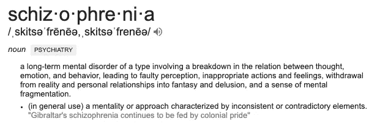
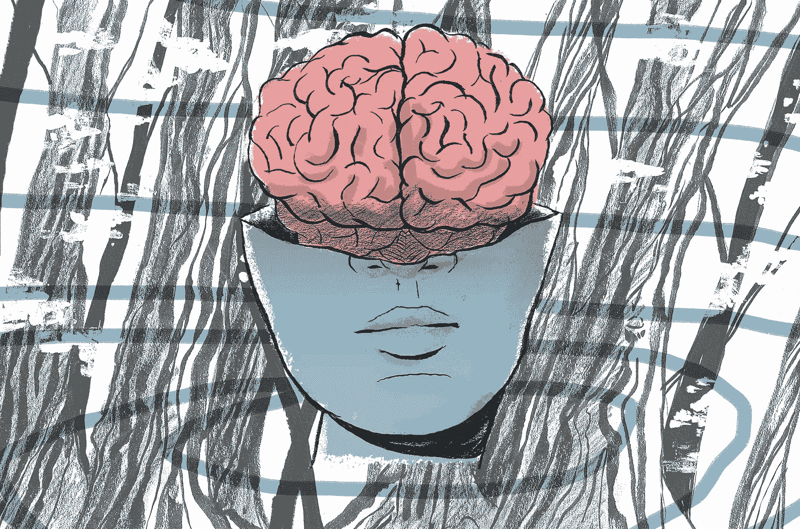

# 为什么精神分裂症是一个如此大的问题-以及人工智能如何能有所帮助

> 原文：<https://medium.datadriveninvestor.com/why-schizophrenia-is-such-a-big-problem-and-how-ai-can-help-472029614e2b?source=collection_archive---------3----------------------->

## 使用 NLP 增强视听幻觉的化身疗法

如果我问你，你认为哪种疾病占住院病人护理总住院天数的第二位，你会:a)问我为什么问这样一个具体而随意的问题，b)可能猜癌症或心脏病。

你最不可能猜到的是**正确答案是精神分裂症，在任何精神和身体疾病中，一年有 250 万个卧床日。**

这是一个很大的词，听起来像是医院真人秀中用医学术语说的。**对于我们这些不熟悉这个术语的人来说，精神分裂症是一种“慢性和严重的精神障碍，影响一个人的思维、感觉和行为”。**

如果 250 万似乎还不够大，让我再量化一下。大约 30 亿英镑花在了病人和研究上(这只是在英国)，随着病人的增加，这个数字还会上升。这需要大量有限的医疗资源和关注。

好的，所以这是一种常见的疾病，需要大量的医疗护理，但问题是通过治疗解决的，对吗？没那么简单。

## 听觉语言幻觉

**这些患者中有 60–70%经历过幻听(AVH ),其声音会在一个人的大脑中产生“噪音”**,导致许多精神分裂症患者注意力分散、愤怒或烦躁。也有不少精神分裂症患者因为这些声音而企图自杀的案例。

 [## 人工智能与创造力:作为创意引擎的比根——数据驱动的投资者

### 的确，2018 年可以被视为人工智能创造的创造力全盛时期的开始。当然可以…

www.datadriveninvestor.com](https://www.datadriveninvestor.com/2019/02/13/ai-creativity-biggan-as-a-creative-engine/) 

平均而言，精神分裂症患者每年约有 37 次与医疗专业人员的接触。这意味着每月要进行 3-4 次冗长耗时的治疗过程。即便如此，如果成功的话，这也只是摆脱负担的小小代价。对这些症状的治疗“充其量是平淡无奇”，许多患者声称，即使服用处方药，他们的幻听仍然存在。

# 化身疗法

有效的治疗策略仍然非常具有挑战性，并且可用的选择有限。但是最近，出现了一线希望。

An example of a specialized medical professional facilitating AVATAR therapy

**化身疗法(AT)是一种创新的体验方法，使患者能够创造一个迫害者的化身(他们幻听中的声音)，并使他们能够在直面恐惧的同时控制自己的症状。与这些化身交谈也将控制权从化身转移到患者。**

随机盲法研究的作者表示，化身疗法**在 12 周(正常治疗时间的一半)**后显著减少了幻觉，并且对缓解精神分裂症的其他症状具有更大的影响。在某些情况下，它甚至可以完全停止癫痫发作。

> “我们的研究提供了早期证据，表明与一种咨询相比，化身疗法能迅速改善精神分裂症患者的幻听，降低其频率和痛苦程度”

那个。是。巨大的。

# 它是如何工作的。

该疗法分为 24 周。有 3 个主要阶段/部分，逐步帮助患者控制他们的症状和幻觉:
1。*对声音*(特别是与全能和恶意相关的)信念的改变和对声音关系的评价(特别是相对力量和自信)可能是作用机制。

2.第二阶段的具体目标是*自我概念的改善和更积极身份的发展*，这项工作与最近强调自尊和自我同情在处理痛苦声音中的重要性的方法相一致

3.最后，鉴于焦虑过程被视为维持*痛苦声音的核心，而化身疗法涉及暴露于痛苦刺激*(声音内容和图像)，焦虑的减少也可能是一个重要的作用机制。
你可以在这里查看整篇论文[。](https://trialsjournal.biomedcentral.com/articles/10.1186/s13063-015-0888-6)

# 问题是

如果这篇文章就此打住就好了，我说，“感谢阅读，一切都很好”。*但遗憾的是，化身疗法只是几项研究，而没有在全世界推广，这是有原因的。*

> “然而，研究人员确实注意到，化身疗法作为精神分裂症患者的大规模治疗(到目前为止)是不可行的，因为它需要训练有素的心理健康专业人员来进行这些治疗。目前的数据显示，精神卫生工作者还无法应对这种情况。

基本上，在这些研究中，**治疗是由非常有经验/专业的医生**(他们扮演着两个角色——调解人/支持者和化身)来实施的，这是无法衡量的，因为很难为大量患者提供专业护理。此外，这些每周治疗是一般化的模拟，而不是基于患者病史的优化治疗，这也是不理想的。

但是，不要害怕，这就是我最喜欢的超级英雄出现的地方。

它是一只鸟吗？它是一架飞机吗？不，它的人工智能(及其对话式人工智能和深度视频合成的子领域)

# 利用人工智能在这个领域进行创新

大多数主要的可扩展性和有效性问题都可以使用自然语言处理来解决，这是人工智能的一个类别，负责理解和处理人类语言。作为一个奖励，**深度视频合成(或深度假货)可以用来增强化身过程本身，并进一步将这些迫害者带入生活的想法。**

**这个想法是使用一个聊天机器人一样的结构，使用自然语言处理来启动对话，并为化身和调解人生成响应**。使用情感分析等功能，并利用以前会议的数据，整个过程将更加有效，任何非专业人员都可以部署。

**要查看这将如何工作的深入解释，请在此处查看我关于该项目的技术方面的文章******。****

**从理论上讲，如果部署这种设备，全世界精神分裂症患者使用的治疗时间和直接相关的设施空间将显著减少(几乎减少一半)；住院病人护理天数将会减少，这样精神分裂症就不会排在前三位。使用这些技术，医疗资源的高使用率和所需的数十亿资金将会降低，而治疗的可及性将会提高。**

***感谢您的阅读！如果你喜欢这篇文章，请留下一些掌声，关注我的媒体和 LinkedIn，或者查看我的个人网站，了解我在人工智能方面的进展。***