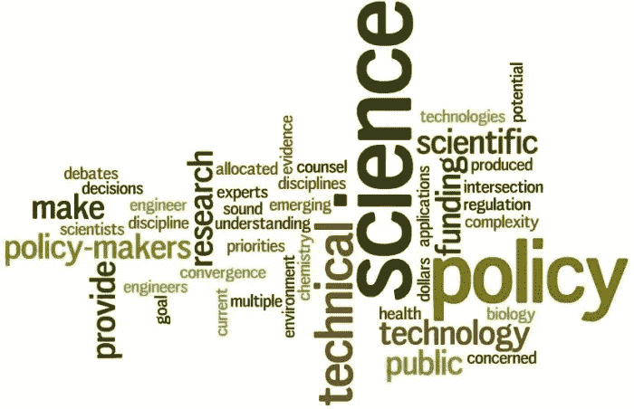

# 科学可能很快会在公共政策中发挥更大的作用

> 原文：<https://medium.datadriveninvestor.com/why-science-may-soon-play-a-much-bigger-role-in-public-policy-83dbe71021e?source=collection_archive---------6----------------------->

[本文](https://www.civilserviceworld.com/articles/opinion/why-science-may-soon-play-much-bigger-role-public-policy)原载于[公务员世界【2019 年 8 月 9 日。](https://www.civilserviceworld.com)

几年前，在反思[从白厅到威斯敏斯特](https://www.civilserviceworld.com/articles/opinion/what-i-learned-when-i-made-leap-whitehall-westminster)的转变时，我写道“我在白厅时从未看过一份智库报告，但在威斯敏斯特，我的桌子上堆满了它们”。有一件事我没有说，但我应该说了，那就是在这两个领域中，我很少遇到学术界在政策制定过程中主动分享他们的专业知识。这总是让我觉得很奇怪——正如已故的杰里米·海伍德爵士(Sir Jeremy Heywood)曾经写道:“我们显然有一个巨大的学术人才库，尽管有许多优秀的合作例子，但我们常常觉得我们可以做得更多。”

因此，在政策中没有更多地使用科学建议是一个谜。可以加上社会科学和人文科学。原因有很多——对于那些感兴趣的人，我推荐政府研究所的 [*政府如何与学术界合作的*](https://www.instituteforgovernment.org.uk/sites/default/files/publications/IfG_government_academia_June_2018_vb.pdf) 报告。如果可以这么说的话，错误在于双方。学术界和公务员都不太擅长与对方接触。公平地说，这不是任何一方的优先考虑。然而，我不想写一篇为什么会这样的哀叹，因为更重要的是，有充分的理由认为它即将改变。

**产生影响**

公务员们可能已经注意到，近来学者们对与政府分享他们的工作越来越感兴趣。许多主要大学正在为此目的设立公共政策“单位”或“研究所”。在过去的几个月里，我一直在和伦敦帝国理工学院合作建立他们的论坛。一些大学甚至聘请前高级公务员或智库老板来领导这些项目。

 [## 成为数据科学家所需的 8 项技能|数据驱动型投资者

### 数字吓不倒你？没有什么比一张漂亮的 excel 表更令人满意的了？你会说几种语言…

www.datadriveninvestor.com](https://www.datadriveninvestor.com/2019/02/07/8-skills-you-need-to-become-a-data-scientist/) 

这种突然兴趣的主要驱动力是评估研究的方式的改变。2014 年,"研究评估活动"被新的"卓越研究框架"取代。这听起来像是高等教育的行话——但 REF 所做的重要事情之一是引入了“影响”评估。重要的是，这包括“对……公共政策的影响、改变或益处”。很长一段时间以来，学术界的许多人都认为他们有尚未开发的洞察力，可以加强政策分析，但现在有了这样做的明确信号和激励。我们开始看到这种变化的结果。

对研究的公共政策影响的兴趣甚至导致了大型大学与政府分享见解的伞式机构的建立。大学政策参与网络(UPEN)有 37 个成员，旨在“利用集体研究力量”来“增加公共政策的影响”，并“为决策者提供协调、高效和更好的建议”。诺丁汉大学刚刚从南安普顿大学接管了 UPEN 的秘书处，它的新主席是前教育部主任 Stephen Meek。

因此，很难怀疑学术界在支持公共政策发展方面发挥更大作用的愿望。但这就产生了一个问题:政府和公务员准备好利用这一机会了吗？

**在政策中嵌入科学**

作为一个从事政策工作并了解挑战的人，我谨慎地认为，答案是“是的”。我们有首席科学顾问网络和政府科学办公室已经有一段时间了。他们在为政府提供科学建议和作为学术界的中间人方面发挥着积极的作用。但是在护士审查研究委员会之后，我们也看到了部门“研究兴趣领域”的引入，这第一次详细说明了部门的研究问题。虽然 ARIs 需要一些工作才能完全有效，但它们有望成为学术政策参与的一个非常有用的工具。

然而，更重要的是文化变革的可能性，在新政府首席科学顾问帕特里克·瓦兰斯爵士身上，它可能找到了一个捍卫者。上个月在帝国理工学院的一次问答中，他描述了与一位前内阁秘书的对话，这位秘书告诉他:“政府各部门的科学建议有点零散。有时候很棒。有时，在紧急情况下，它确实很重要……但它并不总是伟大的……它并不像例如经济学家那样，绝对是系统的一部分”。Vallance 说，未透露姓名的 cab sec 曾问:“你为什么不像经济学家那样努力让科学变得工具化和深入人心？”在得出结论之前，这应该是我们的目标。

我知道许多老手会对这种雄心勃勃的谈话持怀疑态度。但是，如果你将公务员认真对待科学建议的意愿与学术界寻求创造公共政策影响的步伐变化结合起来，就有充分的理由相信，科学可能很快会在公共政策中发挥更大的作用。

**关于作者**

史蒂夫·奥尼尔于 2009 年至 2013 年在教育部工作。他最近领导了伦敦帝国学院的论坛项目，并且是英国学院公共政策的负责人。

