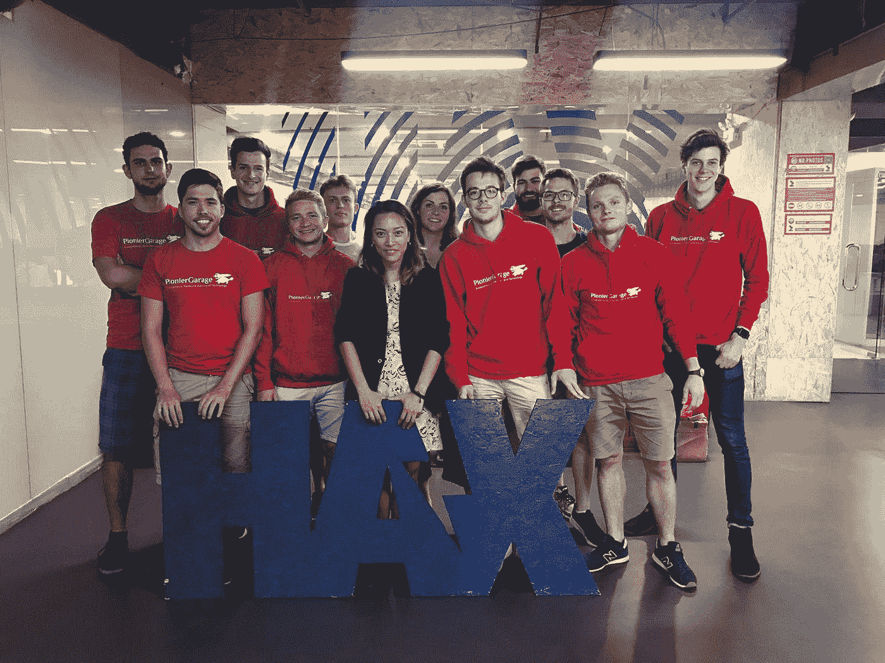

# 为什么深圳是创业天堂——与创业者交谈的三点体会

> 原文：<https://medium.datadriveninvestor.com/why-shenzhen-is-a-startup-heaven-three-learnings-from-talks-with-founders-ce9adbfae13e?source=collection_archive---------2----------------------->

如果你仍然认为中国只是制造廉价产品和扩大生产规模，那你就大错特错了。近年来，一些创新的中国科技公司凭借数字产品和精心打造的用户体验发展到了相当大的规模。我们都知道阿里巴巴、腾讯或百度这样的巨头，但 PionierGarage 决定肩负使命，会见中国年轻的企业家，探索创业环境，寻找下一个独角兽。

[pioneer garage](https://pioniergarage.de)是卡尔斯鲁厄理工学院的创业俱乐部。我们鼓励和支持学生踏上成为创始人的旅程。作为项目的一部分，PionierGarage 每年都会组织一次创业之旅，了解世界各地的创业社区。[在这里](http://tour.pioniergarage.de)你可以了解更多关于我们过去的旅行。

今年，我们决定探索香港和深圳。这是我对深圳创业场景的第一次观察。

Shenzhen from a bird-eye view, Credits to [Jakob Fischer](https://www.instagram.com/jakobfischer/)

## 🚀**火箭创新步伐**

深圳市曾经是中国广东南部地区的一个非常小的渔村。就在 30 年前，这里居住着不到 100 万人。今天的人口大约是 1200 万。作为经济特区，深圳得到了当地政府的大力支持。

快速增长的心态、容易进入工厂以及政府的资金支持，给深圳的硬件公司带来了巨大的优势。一个创客可以在不到一天的时间里收到一个刚打印出来的 PCB 原型，在华强北的电子市场买到你能想到的任何一个零件。现有的生产设施是深圳独有的。正如世界上第一个也是最大的硬件加速器公司 HAX T7 的 Jo-An 所说:“在深圳进行一周的研发，在世界其他地方需要一个月。”

PionierGarage at HAX

在西方开发实验室中，人们通常在不涉及实际生产设施的情况下构建原型。产品的 v1 是在没有考虑生产线的情况下建立的，因为基础设施和研究不在同一个地方。这在生产时会带来麻烦，正如 AR 显示器领先技术 [Lochn Optics](http://www.lochn.com/en/) 的联合创始人解释的那样:“为了让一个产品变得有生命力，你要投入 30%的精力在研究上，70%的精力在生产上。”在深圳，一家公司可以在从概念到发货的任何环节让供应商参与进来，甚至可以在工厂里制造原型。因此，当一个产品投入生产时，会有更少的惊喜和摩擦。

作为一名成功的企业家，你需要首先验证你的想法中有风险的未知部分。随着验证而来的是为正确的问题构建正确的解决方案的信心。尽管如此，你还是会犯错误，但正如 insta360 的创始人所说:“你会很快犯错误，并很快从中吸取教训，不会再犯同样的错误。”而深圳是速度快的地方。

## **努力起飞**

今天生活在深圳的 90%以上的人都不是本地人。他们从中国的其他地方迁移到这个经济特区，因为这里有更多的工作机会、公司和政府的资金。他们寻求更好的生活，并准备努力实现它。

在腾讯等巨头积累经验后，大量非常合格的产品经理、工程师、营销人员和销售人员加入了梦想靠自己成长下一个独角兽的创业公司。

## **中国设计**

过去，大量来自中国的产品与西方原装产品非常相似,“中国制造”的标签并不总是被正面看待。这是不可否认的，中国企业非常擅长以较低的成本将产品投入大规模生产线。

但后来他们也开始在西方产品的基础上进行建设。例如，你可以轻松升级 iPhone 的存储空间。

现在，新一波产品遵循“中国设计”的新原则。深圳是中国的创新中心，这里最好的指标是他们在 R&D 不断增加的投资(每年+8 %)，2017 年支出超过 73 亿美元。你已经可以看到投资回报——来自中国的新产品不仅仅是功能性的，而且可以认识到设计越来越重要。为了在西半球取得成功，产品的外观和感觉也需要符合预期。中国公司知道这一点。

综上所述，深圳是一个创业的好地方。提高设计的重要性、勤奋的人才和发展的速度为创始人创造了最佳条件。尤其是硬件创业公司，深圳是必去之地。

你马上要去深圳或香港了吗？给我发邮件，我会给你一些很酷的技术推荐。另外[关注我](https://twitter.com/fdreschner)了解更多关于科技、创业和[用户体验](https://www.meetup.com/UX-Quick-and-Dirty/)。请继续关注中国和香港科技领域的更多内容。