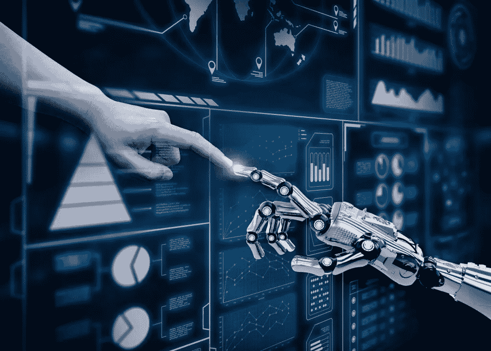
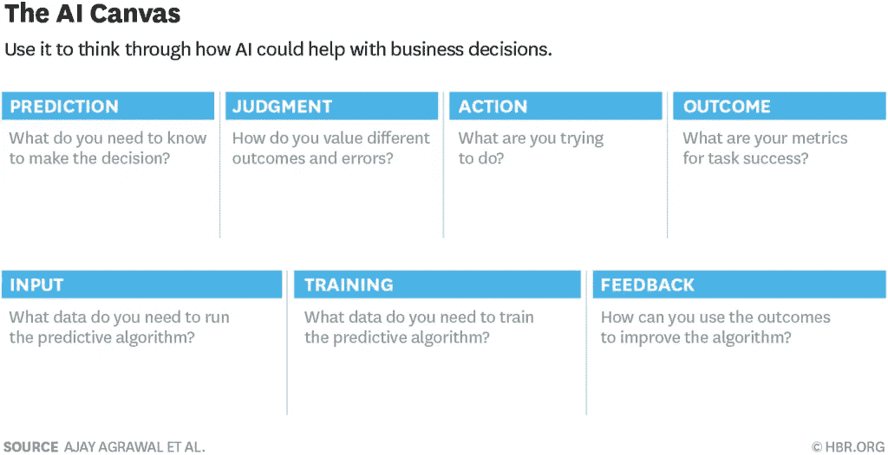

# 为什么人工智能对你很重要？

> 原文：<https://medium.datadriveninvestor.com/why-should-ai-matter-to-you-6bf231d585be?source=collection_archive---------5----------------------->

人工智能——科幻小说的素材！**还是不**。我们听到、看到和读到太多关于人工智能将如何窃取工作、窃取我们的意义，并可能接管大多数功能。这是虚构的，不是今天的现实。AI 在很多学科都有很大的潜力。*你的生意怎么样？*

为什么人工智能对你很重要？

根据 HBR 最近在[的一项研究](https://hbr.org/2018/04/a-simple-tool-to-start-making-decisions-with-the-help-of-ai)，“人工智能的最新发展是关于降低预测的成本——让预测更好、更快、更便宜。你可以更容易地预测未来(下周天气会怎么样？)，但是也可以预测现在(这个西班牙语网站的英文翻译是什么？)."

“预测就是利用你所拥有的信息来产生你所没有的信息。只要你有大量的信息(数据),并想过滤、压缩或整理成有助于决策的见解，预测将有助于实现这一点。**现在机器可以做到了**。

《预测机器 的合著者阿维·戈德法布(Avi Goldfarb)上周带着我们的规模扩大峰会与会者浏览了他的人工智能画布——一页纸的工具，用于思考如何在你的业务中实际使用机器学习。

这篇 [**HBR 文章**](https://hbr.org/2018/04/a-simple-tool-to-start-making-decisions-with-the-help-of-ai) 用一个真实世界的例子带你浏览人工智能画布。请花两分钟时间阅读，然后留出 90 分钟时间与您的团队一起思考您的下一个人工智能应用程序(下一个规划会议？).

万事如意
大卫

2018 大卫保罗卡特。*保留所有权利。*

*原载于* [*大卫·保罗·卡特*](http://growthcubed.com/2018/06/12/ai-matter/) *。*