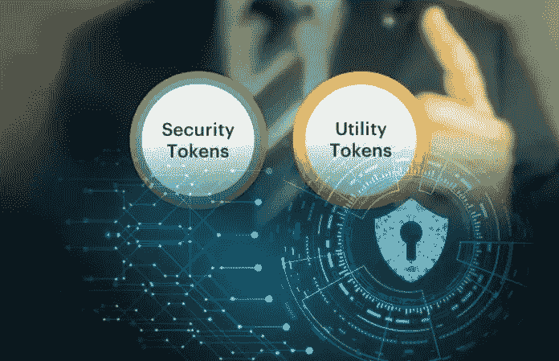
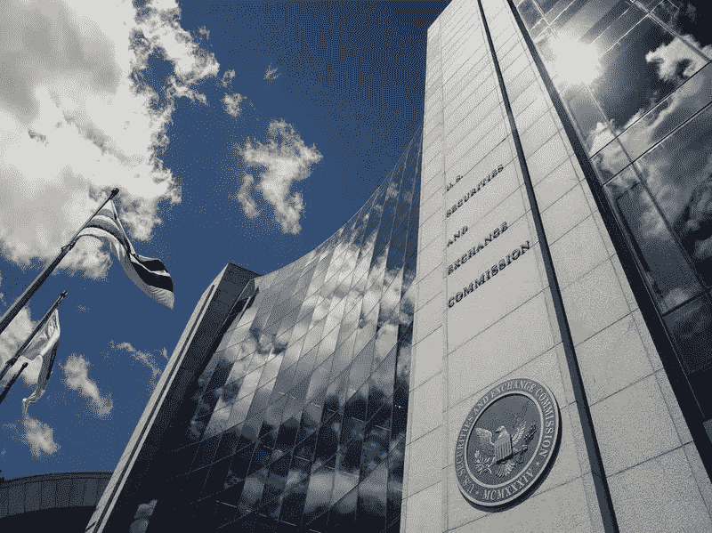
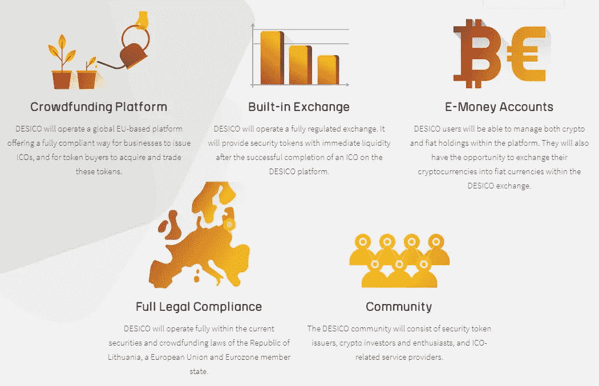
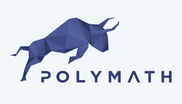

# 为什么应该投资安全令牌？

> 原文：<https://medium.datadriveninvestor.com/why-should-you-invest-in-security-tokens-cd8c8984eb5d?source=collection_archive---------2----------------------->

安全令牌是镇上的话题。如果你对加密货币感兴趣，如果你在过去的几个月里没有听到关于它们的谈论，你一定是生活在岩石下。

但是它们是什么？为什么你会对它们感兴趣？

我将尝试以简单明了的方式解释传统加密货币令牌和安全令牌之间的区别，以及我认为安全令牌会给市场带来什么。

## 传统代币:

直到最近，出现了比特币、莱特币、比特币现金等 ***支付代币*** 以及 ***公用代币*** 。生产实用令牌的唯一目的是提供对创建它们所针对的平台或服务的访问。他们的价值来源于平台/服务本身或他们在交易所的价值。使用公用令牌时，令牌持有者在公司中不扮演任何积极的角色。你没有权利或答辩权。你只是拥有一个会随时间增值或贬值的代币。事实上，代币持有者在质疑项目表现时被禁止进入电报集团和其他社交媒体平台是常见的做法。在某些情况下，你可以把它看作是从一个没有保修和最差的客户服务的商店购买产品。虽然绝大多数使用实用程序令牌运行的项目都是合法的、光明正大的，但也有许多项目玷污了其他项目的形象。

## 安全令牌:

令牌化证券将区块链的技术优势与传统金融的支持和安全性结合在一起。它们可以被视为一种投资合同。这种组合大大满足了监管要求，使零售和机构投资者都能进入加密市场。

股票、债券、风险资本、私募股权、养老金、房地产等金融工具可以通过使用安全令牌经由区块链获得。人们普遍认为，弥合金融和加密市场之间的差距，对于这两个市场以及总体投资的未来而言，将是一个里程碑式的时刻。

在证券代币出现之前，当 ico(首次发行硬币)是进入底层的唯一选择时，“一些”ico 缺乏投资者所需的透明度和问责制，许多投资者报告了诈骗、财务损失和其他不愉快的经历。

## SEC 和法规:

美国 SEC(证券交易委员会)规定，除非 ico 获得批准/认可，否则投资 ico 是非法的。他们的观点是，大多数公用事业代币是不符合任何监管规定的证券。遵守并获得 SEC 认证的过程既复杂又昂贵，因此大多数 ico 都懒得去做。最终结果是，如此大的一个市场领域已经并将继续被排除在新项目投资之外。

事实上，这还不止于此。自 2018 年 3 月以来，美国证券交易委员会一直在寻求将证券法应用于所有加密领域，从加密货币交易所到数字资产存储公司。通过使用 [Howey 测试](https://www.investopedia.com/terms/h/howey-test.asp)作为加密货币分类的基准，SEC 能够质疑并随后判断一些因素，包括:

*   交易是否代表投资合同？
*   加密货币的价值取决于他人的工作吗？
*   买方投资的是投机企业吗？
*   代币持有者有哪些投票权？
*   如果代币被偷了会怎么样？

如果豪威测试中的这些或其他问题向 SEC 证实了该令牌是一种证券，那么它应该符合 SEC 的监管标准和规定。事实上，在美国证券交易委员会看来，他们并不认为大多数代币是非法的。

美国并不是唯一有此类法律的国家。许多其他国家也实施了限制。然而，考虑到区块链是分散的，当局在一定程度上是看不见的，因此很难实施这些措施。然而，这些限制确实阻碍了市场增长和潜在投资，许多投资者被吓跑了。

******************************************************************

## 该决议

加密空间越能展示其成熟性和可问责性，它将获得越多的投资。从散户到机构投资者，可能性是无穷无尽的。在一些国家，安全令牌在一定程度上实现了所需的法规遵从性，预计最终甚至可以满足美国 SEC 的严格要求。

安全令牌将鼓励主流采用，并消除一些 ico 在过去创造的不光彩形象。安全令牌还将允许可能没有考虑区块链的公司将其业务令牌化，并带来额外的投资。

虽然不能保证所有项目都是真实的和成功的，但必须遵守一套严格的法规这一事实有望消除大部分风险。

随着最近安全令牌发行公司的出现，我们现在有了专业和可信的平台，它们都提供类似的好处。他们的目标是使从开发者到投资者的所有相关方的安全令牌投资变得容易和合法。DESICO 和 [Polymath](https://polymath.network) 就是两个这样的平台，它们有着不同的议程，都提供帮助采用安全令牌的服务。

DESICO 正在构建一个完整的平台——安全令牌的一站式商店。它们设在立陶宛，受立陶宛法律管辖，将在欧洲联盟的法律框架内运作，也将受欧洲中央银行控制下的立陶宛银行的管理和监督。与 Polymath 将创建一个发行代币的“协议”不同，DESICO 正在他们的平台内创建一个证券交易和支付系统。他们正在建立一个完整的平台，而博学者正在创建一个协议。

博学者正集中精力将养老金、风险资本和房地产等大型基金令牌化，而 DESICO 的目标是帮助初创公司成为令牌化证券和可交易证券。

德西科为市场投资者带来以下好处:

## *整体效益*

*   *完全合法合规*
*   *启动 ICO 的基础设施*
*   *欧洲电子货币许可证*
*   *内置交换机*
*   *活跃社区*

## 项目的好处

*   *无任何法律或声誉风险的筹款*
*   *一体化包装:节省时间和成本*
*   *高质量智能合同开发和审计*
*   *直接接触广泛的投资者群体*
*   *受监管交易所的即时流动性*

## 福利代币购买者

*   *基于现有证券法的投资者保护*
*   *早期投资者奖金*
*   *针对诈骗和非法设置的 ICO 过滤*
*   *ICO 众包尽职调查和评级*
*   *单一的用户友好界面(DESICO 演示可参见*[*【http://mvp.desico.io/*](http://mvp.desico.io/)*)*
*   *没有延迟和流动性的二级市场*

总之，安全令牌显示了很大的前景，最终应该有助于区块链的自我监管和大规模采用。弥合金融和区块链之间的差距提供了巨大的潜力。风险和相关骗局的减少将会给那些一直犹豫不决的人带来新的信心。证券发行公司将允许可能没有考虑区块链的现有公司对其部分业务进行令牌化，从而为加密货币带来新的选择，内置交易所和活跃社区的易用平台将受到所有人的欢迎。

## 证券发行平台网站:

DESICO—[https://DESICO . io](https://desico.io)

博学者—[https://polymath . network](https://polymath.network)

## 白皮书链接如下:

德西科—【https://www.desico.io/docs/Whitepaper_280818_v2.pdf 

polymath—[https://polymath . network/white paper . html](https://polymath.network/whitepaper.html)

## 免责声明:

这篇文章纯粹基于我的观点。我不认可我所写的任何公司或品牌。我使用它们只是为了演示，说明一个观点或作为一个例子。这不是财务或任何其他形式的建议。