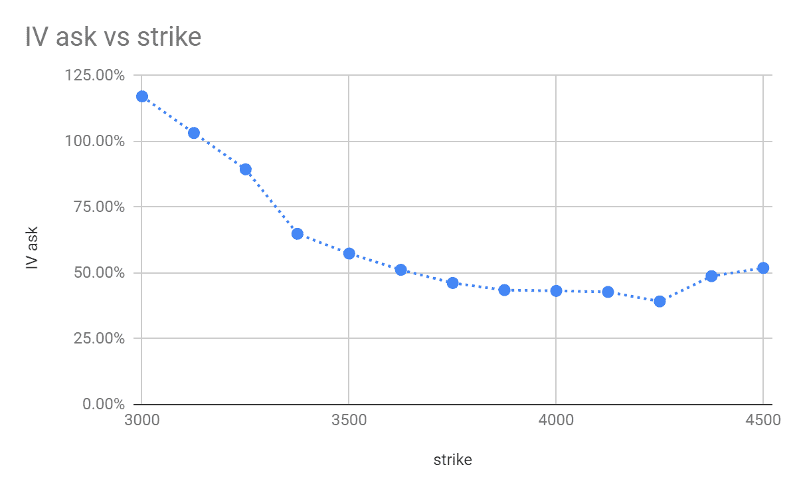
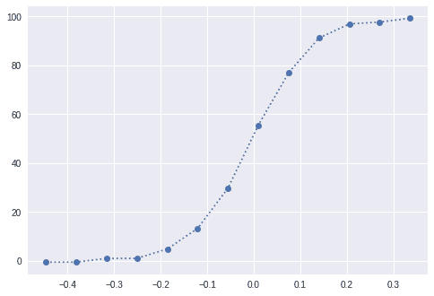
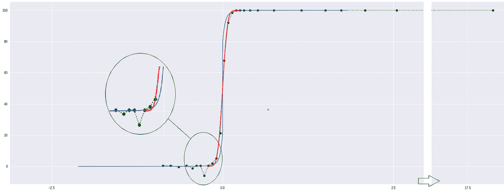

# 为什么这么严肃？微笑加密选项！

> 原文：<https://medium.datadriveninvestor.com/why-so-serious-smile-crypto-options-7b412096ec71?source=collection_archive---------7----------------------->

*本文是 Jarvis 项目的* [*Quanto*](http://www.quanto.company/) *和*[*Kumar sup piah*](https://www.linkedin.com/in/kumar-suppiah/)*共同撰写的系列文章中的第二篇。Jarvis 项目是一家由 Quanto 支持的预注册隐形模式数字资产交易初创公司。*

Gerardo 做了大量的工作，而 Kumar 试图用一点幽默将它分解成通俗的术语。我们共同撰写的文章由每个作者发表，您可以在此处 *找到转载的* [*。*](https://medium.com/@kumar.v.suppiah/why-so-serious-smile-with-crypto-options-18e38d1643d7?sk=f8c0b9a50240d506c70b18151943626b)

 [## 股票市场投资的机器学习——数据驱动的投资者

### 当你的一个朋友在脸书上传你的新海滩照，平台建议给你的脸加上标签，这是…

www.datadriveninvestor.com](https://www.datadriveninvestor.com/2019/01/30/machine-learning-for-stock-market-investing/) 

一个普遍公认的事实是，任何有价值的严肃文章最终都应该包含一个猫迷因([猫如何接管互联网](https://www.nytimes.com/2015/08/07/arts/design/how-cats-took-over-the-internet-at-the-museum-of-the-moving-image.html))，为了证明即使是量化金融或加密资产也不能幸免于这一规则，只需看看柴郡猫和黑天鹅之间的以下联系:

如果你是一个金融迷，你会认出左边的图片是“波动的微笑”。

(2019 年 3 月 29 日到期的 3 月 17 日数据)。我们特意在到期后公布我们的分析，这样我们的文章在任何情况下都不会被理解为投资建议。对于围绕加密资产的大肆宣传，我们再怎么小心也不为过。

在之前的博客中([黑色加密天鹅](https://medium.com/datadriveninvestor/black-crypto-swans-9df6edfbd200))我们清楚地发现，在一个加密资产的最近历史中有如此多的黑天鹅，以至于任何认为它们可以被建模为对数正态随机游动的幻想都应该被彻底粉碎了:肥尾是普遍存在的。

我们在历史数据中发现的厚尾解释了“微笑”:尾部期权(想想保险)的价格比中间期权的价格高得多，以弥补价格的下降(投资者似乎非常担心价格会进一步下跌)。换句话说，全世界，至少是加密期权交易者，都担心价格在到期时更有可能大幅下跌，而不是围绕当前价格波动。

期权的美妙之处在于，我们可以用它们来估计([风险中性](https://en.wikipedia.org/wiki/Risk_neutral_preferences))隐含概率，这可以告诉我们秘密投资者的贪婪和恐惧。

这里有一个小提示:风险中性是对“T2”保险成本“T3”和“发生概率”的数学表述。你可以这样想:你房子的火险价格有一个总损失的隐含概率(假设是 0.1%)，这个概率与实际发生的概率有所不同。它被称为“风险中性”,因为获取价格的理论假设有一个对冲策略来复制期权(因此，没有“风险”)。

**注意:**有一种方法可以确定“发生的概率”，但它需要数学和许多期权价格，远远超出了本博客的能力(和市场上的价格)——你可以在这里阅读更多:[罗斯恢复定理](https://ocw.mit.edu/courses/mathematics/18-s096-topics-in-mathematics-with-applications-in-finance-fall-2013/lecture-notes/MIT18_S096F13_lecnote25.pdf)。

考虑到这一点，我们可以[计算隐含区间概率](https://www.globalcapital.com/article/k6543wh6f19l/option-prices-imply-a-probability-distribution)(大致是收益在区间内的概率)——这看起来很像我们在黑天鹅博客中获得的直方图。请注意“厚尾”和巨大负回报的隐含概率。(上面的链接是“信封背后的从业者”公式——对于精确的数学版本，请阅读[本文](https://www.fdic.gov/bank/analytical/cfr/2007/apr/mizrach.pdf)，第 4.0.1 节)

(注意:像往常一样，您可以找到代码来复制下面的工作，但值得一提的是，我们在 2019 年 3 月 29 日期权到期时运行了这个特定结果，当时到期时间为 12 天)

在黑天鹅博客中，我们提到了累积分布函数可以帮助我们确定低于某一回报率的概率。我们也可以从期权定价页面获得它们:

你还记得在过去的博客中我们说过'*过去的业绩* ***不是*** *未来业绩*的指标吗？嗯，

*   风险中性隐含概率**不是**未来结果的指标**而是……**
*   …期权可用于**对冲**意外事件。你担心超过 20%的加密下跌吗？买保险，晚上睡觉。(另一方面，卖给你保险的人可能需要一些睡眠帮助。)

就像火灾保险一样，保险的价格意味着一种概率，这种概率并不能真正预测事件发生的“真实生活”概率。

**时间缩放破解**

期权日期间隔往往在“现在”之后几天或几周；如果我们关心的是接下来的 5 分钟，他们怎么能帮助我们呢？

布朗运动的一个[已知属性](https://www.statisticshowto.datasciencecentral.com/volatility/)是波动性与时间的平方根成比例，这允许我们通过将已知时间段的波动性乘以(或除以)平方根来扩大风险。

上面我们有一个最大损失 45%的“肥尾”事件，可能在 12 天内发生。为了得到下一分钟的最大损失，我们可以用它除以 12 天内交易分钟总数的平方根:

45% / sqrt( 12 天 x 24 小时 x 60 分钟)= 0.34%

在我们的[黑天鹅博客](https://medium.com/datadriveninvestor/black-crypto-swans-9df6edfbd200)中，我们发现有一天最大损失远远超过 0.34%:接近 2.5%

***平方根 hack 低估风险:*** 我称之为 [hack](https://www.merriam-webster.com/dictionary/hack) 在‘粗切的工具’意义上。有很多原因可以解释为什么——阅读"[关于风险的时间尺度](https://eprints.lse.ac.uk/24827/1/dp439.pdf)

[和时间的平方根规则](https://eprints.lse.ac.uk/24827/1/dp439.pdf)“从学术角度来看，但请记住，我们已经发现黑天鹅否定了布朗运动模型。对于厚尾过程或时变波动性，没有现成的标准模型。

那怎么办呢？永远要寻找黑天鹅，质疑已有的公式，如果没有其他选择，就“有保留地”使用它们。

随着我们越来越接近到期日，平方根近似值的效果越来越好。看一下这个例子，它是在 29 到期前两天拍摄的。蓝线代表过去一个月每分钟回报的已实现厚尾累积概率分布(历史已实现波动率)，红线相当于“正常”结果(严重低估了尾部)…

…但绿点代表使用所有可用数据的值(期权隐含概率)—只剩下两天了，亏损(负回报)分布的概率得到了很好的代表，但乐观的收益概率令人难以置信:有些人认为一分钟内超过 17.5%的收益是可能的！

(需要做额外的工作，以确保绿点遵循 cdf 的[属性——单调增加，并且总是在 0 和 1 之间——违反该规则的点是来自买卖价差的伪像)](https://en.wikipedia.org/wiki/Cumulative_distribution_function)

**使用隐含的风险概率…但要有所保留**

我们 Jarvis 项目在 Quanto 的朋友的帮助下，使用这种定量工具来设计我们的风险管理框架，但我们也认识到，这些工具不是神奇的银弹，也不能替代精心设计的资金管理原则。[记住，记住 11 月的崩盘](https://www.cnbc.com/2018/11/30/bitcoin-fell-37-percent-in-november-erasing-70-billion-from-industry.html)(看看我们用双关语做了什么……)

如果你是一个有抱负的量化加密资产交易者，请研究从传统资产类别移植过来的任何技术的局限性，并小心你的风险。否则，你可能会更好地坚持你的日常工作，随着加密资产管理行业的成熟，将加密资产的管理留给专业人士。

要点: