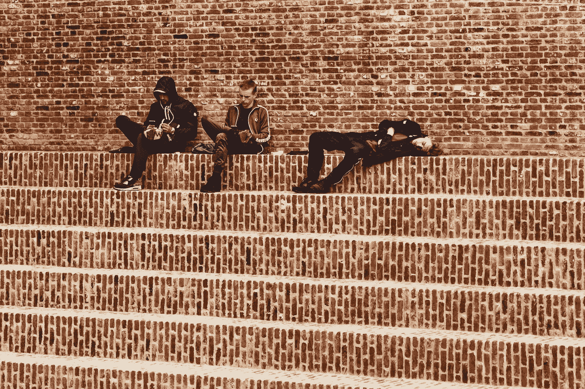

# 为什么社交媒体成瘾和其他成瘾一样危险

> 原文：<https://medium.datadriveninvestor.com/why-social-media-addiction-is-as-dangerous-as-any-other-addiction-62968a436c41?source=collection_archive---------14----------------------->

Photo by [Maria Teneva](https://unsplash.com/photos/ag-iDbS3Oog) on Unsplash

现在是早上 6 点，你的闹钟响了，你醒来想关掉它。你做的第一件事是什么？你查看手机的通知，看是否有人在你睡觉的时候给你发信息。然后你打开你的脸书、推特和 Instagram 应用来浏览你的信息。当你真正起床刷牙吃早餐时，已经是早上 7 点了。

在办公室里，你会在工作间隙短暂休息，因为你似乎无法集中精力在笔记本电脑上工作。你的手机就在身边，你不断地查看它，再次滚动浏览你的社交媒体。不知不觉中，差不多是回家的时候了，但是你还没有做多少工作。

 [## 社交媒体收听让您随时了解|数据驱动型投资者

### 虽然社交媒体倾听是一种顶级趋势，但它应该是每个现代营销策略的一部分。保持和谐…

www.datadriveninvestor.com](https://www.datadriveninvestor.com/2019/02/26/social-media-listening-keeps-you-plugged-in/) 

在家里，当你吃饭的时候，甚至在看你最喜欢的网飞节目的时候，你都带着你的手机。尽管看了你的节目，你还在用手机浏览你的社交媒体。接下来，你知道，这是晚上 9 点半，你在床上，关灯，准备睡觉。但在这之前，你要最后一次检查你的手机，看看你在 Instagram 上关注的人是否上传了新照片，或者你在脸书上的朋友是否发生了什么有趣的事情。当你放下手机准备睡觉时，已经是晚上 11 点了。在没有意识到这一点的情况下，你可能一天中花了 6-7 个小时看手机屏幕，尤其是你的社交媒体。同样的事情一遍又一遍，日复一日。过了一段时间，你注意到了这个循环，但你似乎无法打破它。你在否认，但事实是，你沉迷于你的手机，你沉迷于社交媒体。不管你喜不喜欢，上瘾就是上瘾。这就像有些人对毒品、性或任何其他类型的上瘾一样。此外，正如各种上瘾一样，如果处理不当，它可能会很危险。

你怎么知道自己对什么东西上瘾了？

> 成瘾是一种物质或活动的重复参与，尽管它现在造成了实质性的伤害，因为这种参与是(并且可能继续是)令人愉快的和/或有价值的

你试过一天不带手机吗？或者不使用任何社交媒体应用程序？我以前写过关于做社交媒体排毒以及为什么它很重要。就我个人而言，我开始这样做是因为我知道一个事实，我沉迷于社交媒体。你想想，你用手机主要是为了社交。如果你把所有的社交应用都拿走，你就不会经常使用手机了。所以你手机的大部分使用是用于社交媒体的消费。但是就像任何上瘾一样，这对你的长期健康没有好处。我以前从未对毒品上瘾，但在与一些前吸毒者交谈后，症状几乎是相似的。没有的时候你会觉得不安。在你尝过它之前，你似乎不能正常工作。开始有这种感觉了。

当我第一次开始社交媒体戒毒时，我很挣扎，挣扎得很厉害。我的手指一直渴望拿起我的手机，点击我的 Instagram 应用程序，滚动浏览所有图片或观看我关注的人发布的所有 Instagram 故事。我的思想会每隔几分钟就从我正在做的任何活动中游走，以防止自己查看手机。

但是我坚持下来了，过了一段时间，事情开始变得容易了。但是当我找到更多的方法来分散自己的注意力时，事情才开始变得容易起来。我开始读更多的书，开始写更多的东西，开始更多的锻炼，开始更多的出去享受大自然。随着我做的越来越多，我开始减少社交媒体滚动。

Photo by [Cristina Gottardi](https://unsplash.com/photos/iEGXkSXRXN4) on Unsplash

就像毒品一样，当用户沉迷于社交媒体时，社交媒体平台就会蓬勃发展。你用得越多，他们赚的钱就越多。你有没有注意到你的社交媒体上的广告越来越多？奇怪的是，广告总是与你喜欢或感兴趣的东西相关。它研究你的行为，研究你喜欢并经常访问的页面。它以你的毒瘾为食。就像毒品一样。正如几周前发生在新加坡的*事件所展示的那样，就像毒品如何让你做出疯狂的事情一样，沉迷于手机/社交媒体也会如此。*

*如果你像我在这篇文章的前三段描述的那样，我真的建议你退一步，评估你的手机和社交媒体使用情况，并进行戒毒。越快越好！如果你需要更多的理由来解释为什么你应该开始，我在这里给出了 7 个理由。*

*当你意识到(或者对我们中的一些人来说，记得)数字世界之外还有如此多的生活，你的生活质量就会提高很多。尽快治疗你的社交媒体瘾，你以后会感谢你自己的。*