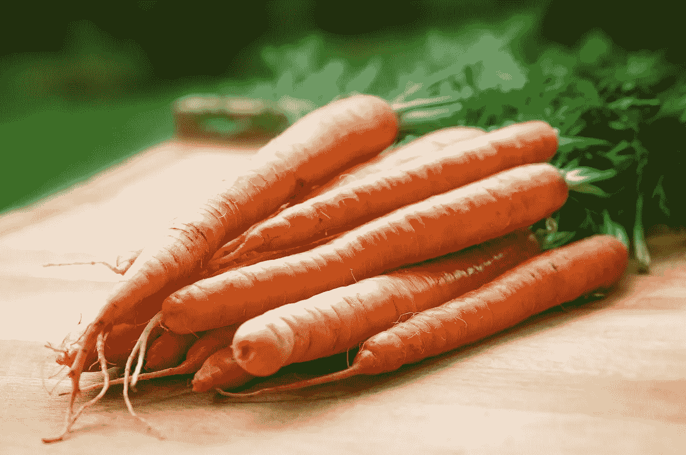
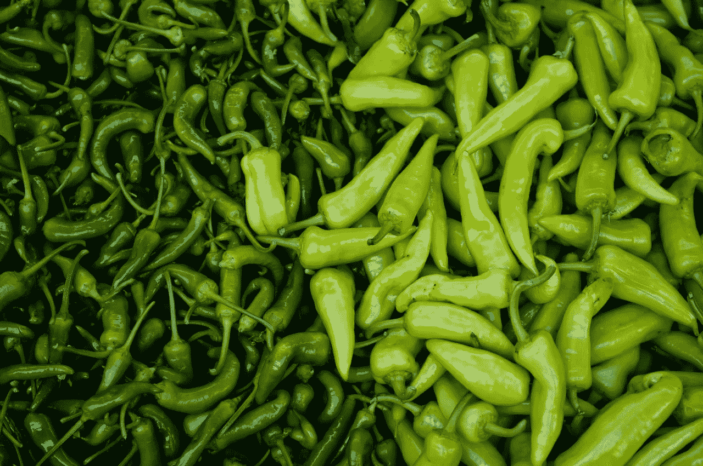
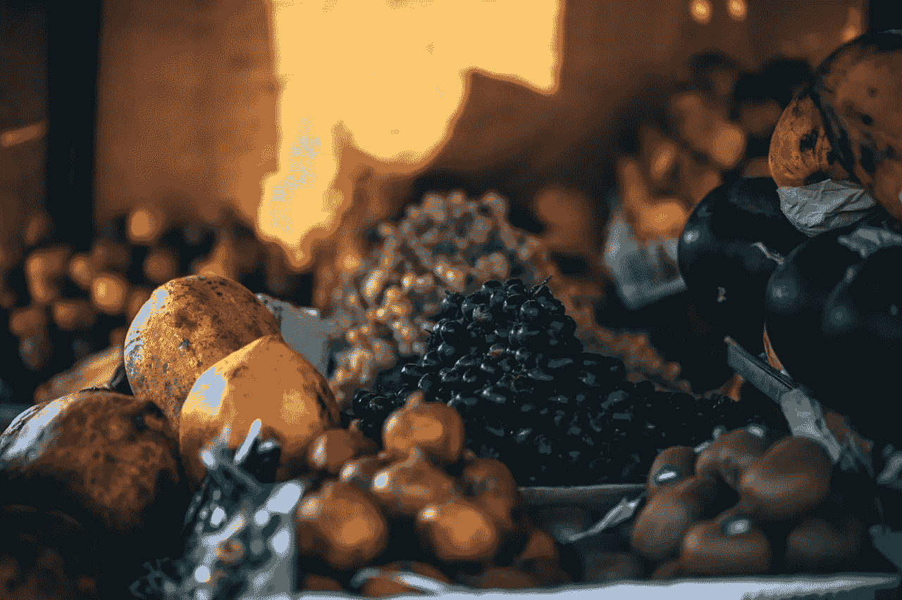
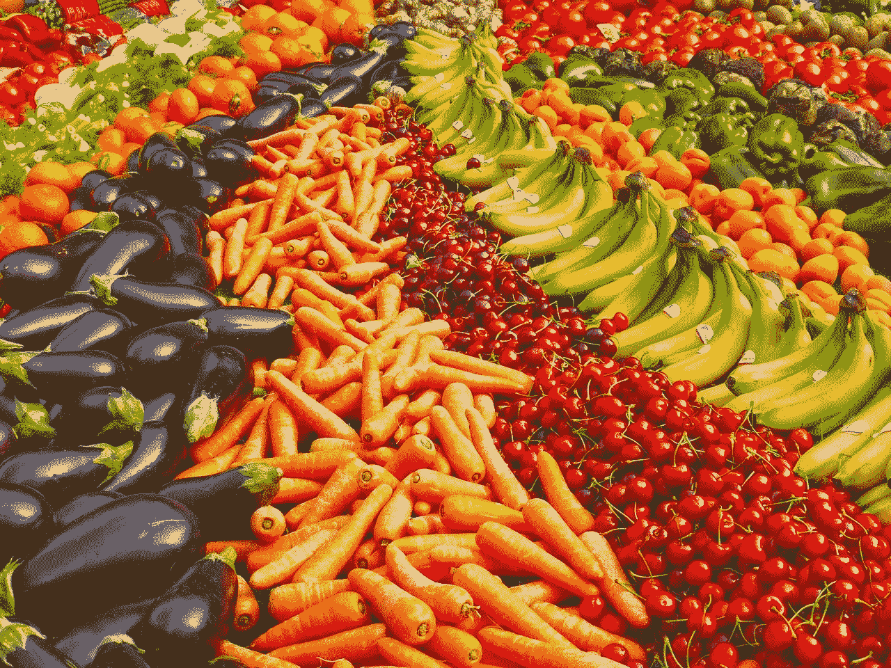

# 为什么豆芽(SFM)不能存活

> 原文：<https://medium.datadriveninvestor.com/why-sprouts-sfm-cannot-survive-84df5a9de3f4?source=collection_archive---------14----------------------->

豆芽(SFM)无法作为一个独立的超市运营商生存。豆芽农贸市场(纳斯达克股票代码:SFM) 缺乏现金，无法在当今的食品市场上保持竞争力。

例如，2018 年 9 月 30 日，Sprouts 记录了 1718 万美元的现金和等价物。此外，豆芽记录了 1986 万美元的自由现金流和 6436 万美元的经营现金流。

与此同时，**亚马逊(NASDAQ:AMZN)**；豆芽最明显的直接竞争对手全食超市的所有者，在 2018 年 9 月 30 日拥有 204.25 亿美元的现金和等价物。此外，亚马逊报告称，它可以利用 93.4 亿美元的短期投资。

**亚马逊如何威胁豆芽(SFM)**

因此，豆芽是直接和间接与一家公司竞争，几乎无限量的钱烧不完。例如，亚马逊可以提供有机食品；豆芽的主要产品，如果杰夫·贝索斯想要的话，作为亏损的领导者。

更糟糕的是，亚马逊 2018 年第三季度的自由现金流为 60.61 亿美元，运营现金流为 85.88 亿美元。值得注意的是，亚马逊在 2018 年第三季度实现了 565.76 亿美元的收入。

与此同时，豆芽公司报告 2018 年第三季度收入为 13.29 亿美元。然而，豆芽在 2018 年第三季度的收入增长率为 10.2%。

由于亚马逊的规模和现金，Sprouts 的收入增长无关紧要。解释一下，亚马逊可以在不影响其底线的情况下向有机食品市场投入数十亿美元。

**亚马逊 Go 如何威胁新芽(SFM)和其他所有人？**

例如，亚马逊可以免费提供有机食品。此外，亚马逊 Go 无收银便利店威胁豆芽。

举个例子，去卖现成的豆芽。然而，Amazon Go 的运营成本可能会低得多，因为它没有收银员。因此，亚马逊的劳动力成本会低很多。

此外，Brick Meets Click [声称](https://www.brickmeetsclick.com/amazongo-s-retail-productivity--at-least--2700-sq-ft-selling-area---50-inventory-turns-year) Amazon Go 每平方英尺的销售额高达 2700 美元。因此，亚马逊可以从 Go 中获得大量现金，并将其投入到业务中。

值得注意的是，亚马逊计划在未来几年内开设 3000 个 Amazon Go 地点。因此，豆芽可能很快就会面临一个咄咄逼人的新竞争对手，它将利用亚马逊的技术专长和全食超市的质量。

**为什么豆芽(SFM)不能存活**

Sprouts 的困境在于，亚马逊只是其竞争对手之一。此外，亚马逊豆芽还必须与克罗格(纽约证券交易所代码:KR)、沃尔玛(纽约证券交易所代码:WMT)、阿尔迪(Aldi)和塔吉特(纽约证券交易所代码:TGT)等竞争。

例如，克罗格与 Instacart 关系密切，是美国最大的有机食品商。例如，克罗格在 2017 年销售了价值 10 亿美元的有机农产品，*进步杂货商* [估计](https://progressivegrocer.com/krogers-annual-organic-produce-sales-reach-1b)。此外，Kroger 在 2017 年出售了价值 20 亿美元的 Simple Truth organic grand，*进步杂货商* [计算](https://progressivegrocer.com/krogers-simple-truth-brand-hits-2b-sales)。

在这种情况下，我看不出新芽作为一个独立的公司如何竞争和生存。相反，豆芽的未来将是一个更大的组织的一部分，如 Aldi Nord 或 Kroger。

**谁会买豆芽(SFM)？**

解释一下，[阿尔迪诺德](https://en.wikipedia.org/wiki/Aldi)；或 Aldi North，是拥有 Trader Joe's 和 Lidl 的德国公司。Aldi Nord 的姐妹公司 [Aldi Süd](https://www.aldi.com/) 或 Aldi South 在美国拥有 Aldi 品牌的杂货店。

我的预测是，豆芽很快就会用光现金。这将迫使公司管理层出售股份，就像 Supervalu 管理层在 10 月份所做的那样。

因此，豆芽的商店和豆芽的品牌将继续存在，但豆芽的公司将消失。我认为 Sprouts 非常适合 Aldi Nord 或 Kroger 的商店系列。值得注意的是，拥有豆芽将有助于 Aldi Nord 在科罗拉多和加利福尼亚等 Lidl 没有业务的州扩张。

**豆芽(SFM)作为股票几乎没有价值**

因此，我认为豆芽作为一个食品品牌有很大的价值，但作为一个股票价值不大。

因此，我的结论是，2018 年 11 月 22 日，市场大幅高估了 SFM 豆芽的价格，为每股 26.82 美元。投资者必须远离豆芽，因为它的股票正在走向全面崩溃。

相反，如果你想在你的投资组合中增加一个杂货商，看看**克罗格(纽约证券交易所代码:KR)** 、**塔吉特(纽约证券交易所代码:TGT)** 或**沃尔玛(纽约证券交易所代码:WMT)** 。那些公司没有未来的萌芽。