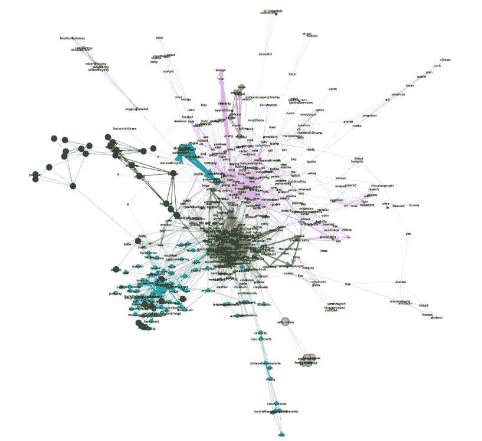
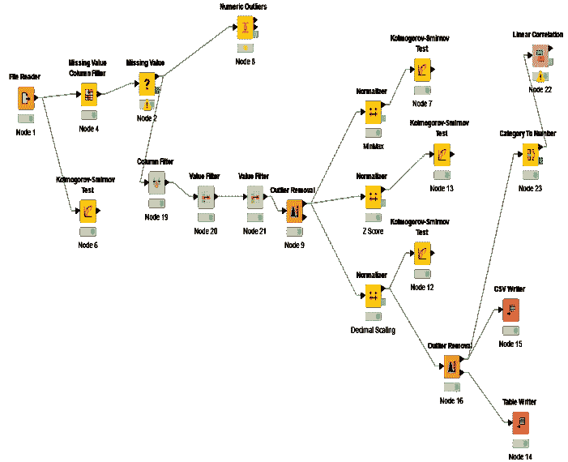

# 为什么初创企业需要专注于廉价的原型制作。系统工程师现在需要使用的两个工具。

> 原文：<https://medium.datadriveninvestor.com/why-start-up-need-to-focus-on-cheap-prototyping-two-tools-system-engineers-need-to-use-now-b19355fa72d4?source=collection_archive---------16----------------------->

如果你有一个数据科学创新，在建立一个成熟的生态系统之前，考虑使用 Knime、Rattle 和 Gephi。

Photo by [Med Badr Chemmaoui](https://unsplash.com/@medbadrc?utm_source=unsplash&utm_medium=referral&utm_content=creditCopyText) on [Unsplash](https://unsplash.com/s/photos/startup?utm_source=unsplash&utm_medium=referral&utm_content=creditCopyText)

我在新泽西州霍博肯的史蒂文斯大学教创业学。这不是一件容易学或教的事情。许多工程专业的学生对新成立的公司感兴趣；有些人甚至还在上课的时候就创造了一个。我发现最麻烦的是，他们更关注最终产品，而不是原型和客户反馈。我想在这篇文章中指出，无论你处于创业的哪个阶段，学生还是系统工程师，定量分析师还是商务人士，了解快速数据原型工具都可以让你的想法成真，而无需太多投资。在你建立市场解决方案之前，这些原型应该是你的重点。

建造它并希望他们来？

你怎么知道投资者会买你卖的东西？答案是，在大多数情况下，你没有。没人知道。用你所有的现金去制造一些东西来销售，伴随着很大的风险。我们如何降低风险，并知道我们的想法对我们的客户有价值？他们会买吗？

 [## 金融中的机器学习|数据驱动的投资者

### 在我们讲述一些机器学习金融应用之前，我们先来了解一下什么是机器学习。机器…

www.datadriveninvestor.com](https://www.datadriveninvestor.com/2019/02/08/machine-learning-in-finance/) 

让我们试一个例子。还记得 [***Juicero***](https://en.wikipedia.org/wiki/Juicero) 吗？非常好的设计和彻底的研究？彻底失败。

我举这个例子，尽管它与数据科学无关，因为售出的机器被认为是未来的成功。投资者喜欢这个主意。但最终这是一个过度设计的例子，制造成本高，对客户来说也很昂贵，最重要的是，在花钱生产产品之前没有经过客户测试。

**快速肮脏的原型可以帮助新的初创公司避免这种错误？**

这可能不是在每种情况下都有效。我认为，对于所有初创企业来说，一个很好的经验法则是，在任何真正的生产开始之前，专注于快速而肮脏的初始销售原型。

当你脑海中的原型可以向你的投资者展示影响的时候，你不需要建立一个昂贵的解决方案。使用原型向你的客户展示你的创新。

如果他们想要，他们会在你生产产品之前购买。

**您现在可以免费使用的数据科学工具！**

我马上要谈到的工具是为数据科学项目设计的。它们不仅仅是简单的应用程序，而且非常强大。将它们用于网络分析、机器学习项目和神经网络的快速原型制作。

这是一个[***ge phi***的例子。正如他们的网站上所说:“Gephi 是各种图形和网络的领先可视化和探索软件。”我在一个例子中使用了它(如下所示),这是我研究 tweets 的一个老项目。当你试图展示群体因果关系时，这是一个很好的工具。它是开源和免费的。](https://gephi.org)

这是一个 [***Knime***](https://www.knime.com/) 的例子。这是另一个开源的免费工具——但是比你想象的要健壮得多。你可以利用他们的生态系统来清理、规范和创建新的模型。你可能想建立自己的机器学习工具，但在必要时使用这个工具来原型化你的想法并展示结果。该工具使用金融、制药、社交媒体等领域的预制蓝图。，创建数据工具，生成可用于展示创新的统计数据。Knime 还有一个有趣的图形功能。下面的例子是我建立的一个研究酒精消费的模型。

还有一个工具叫做 Rattle，它是一个基于 R 的工具，类似于 Knime。如果你是一个 R 专家，谷歌一下，向下搜索。

如果你对这个话题有任何问题，请告诉我。我希望这能帮助你创造新的想法。